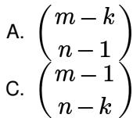
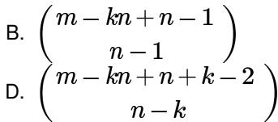

- Confusing Identical vs. Distinct: This is the most common error. Always identify if the items being distributed and the containers are distinguishable or not.  
- Empty vs. Non-empty Bins: Pay close attention to whether bins are allowed to be empty or if they must contain at least one item. This changes the formula significantly.  
• Overlapping Cases: Ensure that cases are mutually exclusive and exhaustive when breaking down a problem.

# Standard Problem-Solving Techniques or Shortcuts:

- Mapping to Stars and Bars: Many problems can be rephrased as distributing identical items into distinct bins. For example, finding the number of non-negative integer solutions to an equation.  
- Inclusion-Exclusion Principle: For problems where "at least one" condition is difficult to apply directly, use inclusion-exclusion to subtract cases where bins are empty.  
- Complementary Counting: Sometimes it's easier to count the total ways and subtract the "unwanted" ways.

# Combinatory

Definition and Core Idea: Combinatorics is the branch of discrete mathematics concerned with counting, arrangement, and selection of objects. It deals with permutations (arrangements where order matters) and combinations (selections where order does not matter), often involving constraints or repetitions.

# Important Formulas, Theorems, and Results:

# 1. Permutations (Order Matters):

- Permutations of $n$ distinct items taken $k$ at a time: $P(n, k) = \frac{n!}{(n - k)!}$ .  
- Permutations of $n$ distinct items taken $n$ at a time: $P(n, n) = n!$ .  
Permutations with Repetition (multiset permutations): For $n$ items where there are $n_1$ identical items of type 1, $n_2$ of type 2, ..., $n_k$ of type $k$ , and $n_1 + n_2 + \cdots + n_k = n$ . Total ways: $\frac{n!}{n_1!n_2!...n_k!}$ .  
- Circular Permutations: For $n$ distinct items arranged in a circle, total ways: $(n - 1)!$ . If arrangements are symmetric (e.g., beads on a necklace), divide by 2: $\frac{(n - 1)!}{2}$ .

# 2. Combinations (Order Does Not Matter):

• Combinations of n distinct items taken k at a time: $C(n,k)=\binom{n}{k}=\frac{n!}{k!(n-k)!}$ .  
- Combinations with Repetition (multiset combinations): Selecting $k$ items from $n$ types with repetition allowed. Total ways: $C(n + k - 1, k)$ . This is equivalent to the "identical balls into distinct bins" problem.

# 3. Binomial Theorem:

$$
(x + y) ^ {n} = \sum_ {k = 0} ^ {n} \binom {n} {k} x ^ {n - k} y ^ {k}
$$

# 4. Multinomial Theorem:

$$
(x _ {1} + x _ {2} + \dots + x _ {m}) ^ {n} = \sum_ {n _ {1} + \dots + n _ {m} = n} \frac {n !}{n _ {1} ! n _ {2} ! \dots n _ {m} !} x _ {1} ^ {n _ {1}} x _ {2} ^ {n _ {2}} \dots x _ {m} ^ {n _ {m}}
$$

# Key Properties and Identities:

- Symmetry Identity: $C(n, k) = C(n, n - k)$ .  
- Pascal's Identity: $C(n, k) = C(n - 1, k) + C(n - 1, k - 1)$ .  
- Sum of Binomial Coefficients: $\sum_{k=0}^{n} C(n, k) = 2^n$ .  
- Hockey-stick Identity: $\sum_{i=r}^{n} C(i,r) = C(n+1,r+1)$ .

# Common Pitfalls or Tricky Points:

- Overcounting/Undercounting: Ensure each valid arrangement/selection is counted exactly once. This often happens when dealing with symmetry or identical items.  
- "At Least" / "At Most" Conditions: These often require complementary counting or casework.  
- Distinguishing Permutations vs. Combinations: If the order of selection or arrangement matters, it's a permutation. If not, it's a combination.

# Standard Problem-Solving Techniques or Shortcuts:

- Principle of Multiplication: If a task can be broken into a sequence of $k$ independent steps, and step $i$ can be performed in $n_i$ ways, then the total number of ways is $n_1 \times n_2 \times \cdots \times n_k$ .  
- Principle of Addition: If a task can be performed in one of $k$ mutually exclusive ways, and way $i$ can be performed in $n_i$ ways, then the total number of ways is $n_1 + n_2 + \cdots + n_k$ .  
- Complementary Counting: Count the total number of ways and subtract the number of "unwanted" ways. Useful for "at least one" type problems.  
- Casework: Break down a complex problem into simpler, mutually exclusive cases and sum the results.

# Counting

Definition and Core Idea: Counting, in a broader sense, encompasses the fundamental principles used to determine the size of finite sets. It builds upon combinatory concepts and introduces powerful tools like the Principle of Inclusion-Exclusion to handle complex scenarios involving overlapping sets.

# Important Formulas, Theorems, and Results:

# 1. Principle of Inclusion-Exclusion (PIE):

- For two sets: $|A \cup B| = |A| + |B| - |A \cap B|$ .  
- For three sets: $|A \cup B \cup C| = |A| + |B| + |C| - (|A \cap B| + |A \cap C| + |B \cap C|) + |A \cap B \cap C|$ .  
- General form for n sets: $\left| \bigcup_{i=1}^n A_i \right| = \sum_{i} |A_i| - \sum_{i}$

2. Derangements: A permutation of $n$ objects such that no object remains in its original position. The number of derangements of $n$ objects, denoted $D_{n}$ or $!n$ :

$$
D _ {n} = n! \sum_ {k = 0} ^ {n} \frac {(- 1) ^ {k}}{k !} = n! \left(\frac {1}{0 !} - \frac {1}{1 !} + \frac {1}{2 !} - \dots + \frac {(- 1) ^ {n}}{n !}\right)
$$

For large $n, D_{n} \approx \frac{n!}{e}$ .

# Key Properties and Identities:

- PIE is essential for counting elements in the union of non-disjoint sets.  
- Derangements are a specific application of PIE for permutations with no fixed points.

# Common Pitfalls or Tricky Points:

- Incorrectly Identifying Sets for PIE: Clearly define the properties that form the sets $A, B, C, \ldots$ and their intersections.  
- Misapplying PIE: Ensure you are alternating signs correctly and covering all necessary intersections.  
- "At Least One" vs. "Exactly One": PIE typically helps with "at least one" conditions. For "exactly one," you might need to combine PIE with complementary counting or other techniques.

# Standard Problem-Solving Techniques or Shortcuts:

- Casework: Break down complex problems into simpler, mutually exclusive scenarios.  
- Complementary Counting: Count the total possibilities and subtract the undesirable ones. Often used in conjunction with PIE.  
- Direct Application of PIE: For problems involving properties that overlap, PIE is usually the most direct approach.

# Generating Functions

Definition and Core Idea: A generating function is a formal power series where the coefficients represent the terms of a sequence. It provides a powerful algebraic tool for solving recurrence relations, counting problems, and proving combinatorial identities by converting sequence operations into algebraic manipulations.

# Important Formulas, Theorems, and Results:

1. Definition: For a sequence $a_0, a_1, a_2, \ldots$ , its ordinary generating function (OGF) is $G(x) = \sum_{n=0}^{\infty} a_n x^n$ .  
2. Common Generating Functions:

- Constant sequence $1, 1, 1, \ldots: G(x) = \sum_{n=0}^{\infty} x^n = \frac{1}{1-x}$ .  
- Arithmetic progression $1, a, a^2, \ldots: G(x) = \sum_{n=0}^{\infty} (ax)^n = \frac{1}{1 - ax}$ .  
- Binomial coefficients $C(n, k)$ for fixed $n$ : $G(x) = \sum_{k=0}^{n} C(n, k)x^k = (1 + x)^n$ .  
• Combinations with repetition $C(n + k - 1, k)$ for fixed $n$ : $G(x) = \sum_{k=0}^{\infty} C(n + k - 1, k)x^k = \frac{1}{(1 - x)^n}$ .  
- Sequence $a_{n} = n$ : $G(x) = \sum_{n=0}^{\infty} nx^{n} = \frac{x}{(1-x)^{2}}$ .  
- Sequence $a_{n} = n^{2} \colon G(x) = \sum_{n=0}^{\infty} n^{2} x^{n} = \frac{x(1 + x)}{(1 - x)^{3}}$ .

# 3. Operations on Generating Functions:

○ Addition: If $A(x) = \sum a_n x^n$ and $B(x) = \sum b_n x^n$ , then $A(x) + B(x) = \sum (a_n + b_n)x^n$ .  
- Multiplication (Convolution): If $A(x) = \sum a_n x^n$ and $B(x) = \sum b_n x^n$ , then $A(x)B(x) = \sum c_n x^n$ , where $c_n = \sum_{k=0}^n a_k b_{n-k}$ . This is crucial for counting combinations of independent choices.  
- Differentiation: $G'(x) = \sum_{n=1}^{\infty} na_n x^{n-1}$ . So, $xG'(x) = \sum_{n=1}^{\infty} na_n x^n$ .  
- Integration: $\int G(x)dx = \sum_{n=0}^{\infty} \frac{a_n}{n+1} x^{n+1}$ .  
- Shift: $x^{k}G(x) = \sum_{n=0}^{\infty} a_{n}x^{n+k}$ (shifts coefficients to the right). $\frac{G(x) - a_0 - \cdots - a_{k-1}x^{k-1}}{x^k} = \sum_{n=k}^{\infty} a_n x^{n-k}$ (shifts coefficients to the left).

# Key Properties and Identities:

- The coefficient of $x^n$ in a generating function $G(x)$ is $a_n$ , denoted $[x^n]G(x)$ .  
- Generating functions are particularly useful for problems involving sums, combinations with repetition, and solving linear recurrence relations.

# Common Pitfalls or Tricky Points:

- Forming the Correct GF: Carefully translate the problem's constraints (e.g., minimum/maximum number of items, distinct/identical items) into the terms of the generating function.  
- Extracting Coefficients: This often requires partial fraction decomposition for rational functions or using generalized binomial theorem.  
- Confusion with Exponential Generating Functions (EGFs): EGFs are used for permutations, while OGFs are for combinations. GATE typically focuses on OGFs.

# Standard Problem-Solving Techniques or Shortcuts:

# - Solving Recurrence Relations:

1. Write the recurrence relation.  
2. Multiply by $x^n$ and sum over all valid $n$ .  
3. Manipulate the sums to relate them to the generating function $G(x)$ .  
4. Solve for $G(x)$ as a rational function.  
5. Use partial fraction decomposition and known series expansions to find the coefficient of $x^n$ .

\- Counting Combinations: Represent each type of item or choice as a factor in the generating function. The coefficient of $x^n$ in the product of these factors gives the number of ways to choose $n$ items.

# Modular Arithmetic

Definition and Core Idea: Modular arithmetic is a system of arithmetic for integers, where numbers "wrap around" when they reach a certain value—the modulus. It's fundamental in cryptography, number theory, and hashing, and is used in GATE for problems involving remainders, large powers, and divisibility.

# Important Formulas, Theorems, and Results:

1. Congruence Relation: $a \equiv b \pmod{m}$ if $m$ divides $(a - b)$ , or equivalently, $a$ and $b$ have the same remainder when divided by $m$ .

# 2. Basic Properties:

- If $a \equiv b \pmod{m}$ and $c \equiv d \pmod{m}$ , then:  
$a + c \equiv b + d \pmod{m}$  
$a - c \equiv b - d \pmod{m}$  
$\circ ac\equiv bd\pmod{m}$

$a^k \equiv b^k \pmod{m}$ for any positive integer $k$ .

3. Modular Inverse: An integer $a^{-1}$ is the modular multiplicative inverse of $a$ modulo $m$ if $aa^{-1} \equiv 1 \pmod{m}$ .

- An inverse exists if and only if $\gcd(a, m) = 1$ .  
- Can be found using the Extended Euclidean Algorithm.

4. Euler's Totient Function $\phi(n)$ : Counts the number of positive integers up to $n$ that are relatively prime to $n$ .

○ If $n = p_1^{k_1} p_2^{k_2} \ldots p_r^{k_r}$ (prime factorization), then $\phi(n) = n \left(1 - \frac{1}{p_1}\right) \left(1 - \frac{1}{p_2}\right) \ldots \left(1 - \frac{1}{p_r}\right)$ .  
- If $p$ is prime, $\phi(p) = p - 1$ .  
- If $p$ is prime, $\phi(p^k) = p^k - p^{k-1}$ .

5. Fermat's Little Theorem: If $p$ is a prime number, then for any integer $a$ not divisible by $p$ , $a^{p-1} \equiv 1 \pmod{p}$ . Also, $a^p \equiv a \pmod{p}$ for any integer $a$ .  
6. Euler's Theorem: If $n$ and $a$ are coprime positive integers, then $a^{\phi(n)} \equiv 1 \pmod{n}$ . (Fermat's Little Theorem is a special case of Euler's Theorem when $n$ is prime).  
7. Chinese Remainder Theorem (CRT): (Conceptually important, full formula rarely needed for GATE) If integers $n_{1}, n_{2}, \ldots, n_{k}$ are pairwise coprime, then for any given integers $a_{1}, a_{2}, \ldots, a_{k}$ , there exists an integer x that solves the system of congruences:

$$
x \equiv a _ {1} \pmod {n _ {1}}
$$

$$
x \equiv a _ {2} \pmod {n _ {2}}
$$

: : :

$$
x \equiv a _ {k} \pmod {n _ {k}}
$$

Moreover, all solutions x are congruent modulo $N = n_{1}n_{2} \ldots n_{k}$ .

# Key Properties and Identities:

- Modular arithmetic allows us to work with remainders, simplifying calculations involving very large numbers.  
- The concept of modular inverse is critical for division in modular arithmetic (multiplication by inverse).  
- Fermat's Little Theorem and Euler's Theorem are powerful for simplifying large exponents modulo a number.

# Common Pitfalls or Tricky Points:

- Division: Division is not directly defined. Instead, multiply by the modular inverse. If the inverse doesn't exist (i.e., $\gcd(a, m) \neq 1$ ), division is not possible.  
- Negative Results: If a calculation yields a negative number, add the modulus until it's positive. E.g., $-5 \equiv 2 \pmod{7}$ .  
- Large Exponents: Always reduce the exponent modulo $\phi(m)$ (if $\gcd(a, m) = 1$ ) or modulo $m - 1$ (if $m$ is prime and $\gcd(a, m) = 1$ ) to simplify calculations using Euler's or Fermat's theorem.

# Standard Problem-Solving Techniques or Shortcuts:

\- Repeated Squaring (Exponentiation by Squaring): Efficiently compute $a^b$ (mod $m$ ) by repeatedly squaring the base and reducing modulo $m$ .

Example: $a^b = a^{b/2} \cdot a^{b/2}$ if $b$ is even, $a^b = a \cdot a^{(b-1)/2} \cdot a^{(b-1)/2}$ if $b$ is odd.

• Finding Modular Inverse:

- Extended Euclidean Algorithm: For $ax + my = \gcd(a, m)$ . If $\gcd(a, m) = 1$ , then $ax \equiv 1 \pmod{m}$ , so $x$ is the inverse.  
- Fermat's Little Theorem: If $m$ is prime, $a^{m-2} \equiv a^{-1} \pmod{m}$ .  
- Euler's Theorem: If $\gcd(a, m) = 1$ , $a^{\phi(m)-1} \equiv a^{-1} \pmod{m}$ .

\- Properties of Congruence: Apply addition, subtraction, multiplication properties to simplify expressions before taking the final modulo.

# Pigeonhole Principle

Definition and Core Idea: The Pigeonhole Principle (PHP) is a fundamental concept stating that if n items are put into

m containers, with n > m, then at least one container must contain more than one item. It's a simple yet powerful tool for proving existence in combinatorial problems.

# Important Formulas, Theorems, and Results:

1. Basic Pigeonhole Principle: If $n$ pigeons are placed into $m$ pigeonholes, and $n > m$ , then at least one pigeonhole contains more than one pigeon.  
2. Generalized Pigeonhole Principle: If $n$ pigeons are placed into $m$ pigeonholes, then at least one pigeonhole must contain at least $\lceil n / m \rceil$ pigeons.

# Key Properties and Identities:

- PHP is an existence principle; it tells you that something must happen, but not how to find it or how many times it happens.  
- It's often used in proofs to show that a certain condition must hold true.

# Common Pitfalls or Tricky Points:

- Identifying Pigeons and Pigeonholes: The most crucial step is correctly defining what constitutes a "pigeon" and a "pigeonhole" in the context of the problem. This often requires creative thinking.  
- Applying Generalized PHP: Ensure you correctly calculate $\lceil n / m \rceil$ .  
- "At Least" vs. "Exactly": PHP guarantees "at least" a certain number; it doesn't guarantee "exactly."

# Standard Problem-Solving Techniques or Shortcuts:

\- Creative Definitions: The key is to define pigeons and pigeonholes in a way that makes the principle applicable.

\- Pigeons are often the items being distributed or selected.

\- Pigeonholes are often categories, properties, or possible outcomes.

- Proof by Contradiction: Sometimes, assuming the opposite of what you want to prove (i.e., no pigeonhole has more than $k$ pigeons) can lead to a contradiction using PHP.  
- Small Examples: Test with small numbers to understand the problem structure and how to define pigeons/pigeonholes.

# Recurrence Relation

Definition and Core Idea: A recurrence relation is an equation that defines a sequence where each term is given as a function of its preceding terms. They are fundamental in algorithm analysis (e.g., complexity of recursive algorithms), combinatorics (e.g., Fibonacci numbers), and discrete probability.

# Important Formulas, Theorems, and Results:

1. Linear Homogeneous Recurrence Relations with Constant Coefficients:

$$
a _ {n} = c _ {1} a _ {n - 1} + c _ {2} a _ {n - 2} + \dots + c _ {k} a _ {n - k}
$$

• Characteristic Equation: $r^{k} - c_{1}r^{k-1} - c_{2}r^{k-2} - \cdots - c_{k} = 0$ .  
- Distinct Roots: If $r_1, r_2, \ldots, r_k$ are distinct roots, the general solution is $a_n = A_1 r_1^n + A_2 r_2^n + \cdots + A_k r_k^n$ .  
- Repeated Roots: If a root $r$ has multiplicity $m$ , its contribution to the general solution is

$$
(A _ {1} + A _ {2} n + \dots + A _ {m} n ^ {m - 1}) r ^ {n}.
$$

\- The constants $A_{i}$ are determined by the initial conditions.

2. Linear Non-Homogeneous Recurrence Relations:

$$
a _ {n} = c _ {1} a _ {n - 1} + \dots + c _ {k} a _ {n - k} + F (n)
$$

- The general solution is $a_{n} = a_{n}^{(h)} + a_{n}^{(p)}$ , where $a_{n}^{(h)}$ is the homogeneous solution and $a_{n}^{(p)}$ is a particular solution.  
- Finding $a_{n}^{(p)}$ : Guess a form for $a_{n}^{(p)}$ based on $F(n)$ .

- If $F(n)$ is a polynomial of degree $d$ , guess $P(n) = C_d n^d + \cdots + C_0$ . If 1 is a root of the characteristic equation with multiplicity $s$ , multiply by $n^s$ .  
- If $F(n)$ is an exponential $C \cdot b^n$ , guess $A \cdot b^n$ . If $b$ is a root of the characteristic equation with multiplicity $s$ ,

multiply by $n^s$ .

3. Master Theorem (for Divide and Conquer Recurrences): For recurrences of the form $T(n) = aT(n / b) + f(n)$ where $a \geq 1$ , $b > 1$ , and $f(n)$ is asymptotically positive.

1. If $f(n) = O(n^{\log_b a - \epsilon})$ for some $\epsilon > 0$ , then $T(n) = \Theta(n^{\log_b a})$ .  
2. If $f(n) = \Theta(n^{\log_b a})$ , then $T(n) = \Theta(n^{\log_b a} \log n)$ .  
3. If $f(n) = \Omega(n^{\log_b a + \epsilon})$ for some $\epsilon > 0$ , AND $af(n / b) \leq cf(n)$ for some $c < 1$ and sufficiently large $n$ (regularity condition), then $T(n) = \Theta(f(n))$ .

# Key Properties and Identities:

- The order of a recurrence relation is the difference between the largest and smallest indices.  
- Linear recurrence relations with constant coefficients are solvable using the characteristic equation method.  
- The Master Theorem provides a quick way to find asymptotic bounds for many divide-and-conquer algorithms.

# Common Pitfalls or Tricky Points:

\- Incorrect Characteristic Equation: Ensure all terms are on one side and coefficients are correct.

\- Handling Repeated Roots: Don't forget the $n, n^2, \ldots$ factors for repeated roots.

\- Finding Particular Solutions: The guess for $a_{n}^{(p)}$ must be adjusted if it overlaps with the homogeneous solution.

\- Boundary Conditions: Always use initial conditions to find the constants $A_{i}$ in the general solution.

\- Master Theorem Conditions: Carefully check all three cases and the regularity condition for case 3.

# Standard Problem-Solving Techniques or Shortcuts:

- Characteristic Equation Method: The standard approach for linear homogeneous recurrences.  
- Substitution Method: For simpler recurrences, guess a solution and prove it by induction.  
- Generating Functions: A powerful general method for solving linear recurrences (see Generating Functions section).  
- Master Theorem: For divide-and-conquer algorithms, this is the fastest way to find the asymptotic complexity.

# Summation

Definition and Core Idea: Summation involves finding the sum of a sequence of numbers, often expressed using sigma notation. It's crucial for analyzing algorithm complexity, calculating probabilities, and working with series in various mathematical contexts.

# Important Formulas, Theorems, and Results:

1. Arithmetic Series: Sum of an arithmetic progression $a, a + d, a + 2d, \ldots, a + (n - 1)d$ .

$$
\sum_ {i = 0} ^ {n - 1} (a + i d) = \frac {n}{2} (2 a + (n - 1) d)
$$

If $a = 1, d = 1$ , sum of first $n$ integers: $\sum_{i=1}^{n} i = \frac{n(n+1)}{2}$ .

2. Geometric Series: Sum of a geometric progression $a, ar, ar^2, \ldots, ar^{n-1}$ .

$$
\sum_ {i = 0} ^ {n - 1} a r ^ {i} = a \frac {1 - r ^ {n}}{1 - r} \quad (\text {if} r \neq 1)
$$

Infinite Geometric Series: If $|r| < 1$ , then $\sum_{i=0}^{\infty} ar^i = \frac{a}{1-r}$ .

3. Sum of Squares:

$$
\sum_ {i = 1} ^ {n} i ^ {2} = \frac {n (n + 1) (2 n + 1)}{6}
$$

4. Sum of Cubes:

$$
\sum_ {i = 1} ^ {n} i ^ {3} = \left(\frac {n (n + 1)}{2}\right) ^ {2}
$$

5. Harmonic Series: $H_{n} = \sum_{i=1}^{n} \frac{1}{i}$ . $H_{n} \approx \ln n + \gamma$ , where $\gamma \approx 0.577$ (Euler-Mascheroni constant).

6. Telescoping Sums: A sum where intermediate terms cancel out.

$$
\sum_ {i = 1} ^ {n} (a _ {i} - a _ {i + 1}) = (a _ {1} - a _ {2}) + (a _ {2} - a _ {3}) + \dots + (a _ {n} - a _ {n + 1}) = a _ {1} - a _ {n + 1}
$$

# Key Properties and Identities:

- Linearity: $\sum (c\cdot a_i + d\cdot b_i) = c\sum a_i + d\sum b_i$ .  
- Changing the limits of summation requires careful adjustment of the terms.

# Common Pitfalls or Tricky Points:

\- Off-by-One Errors: Incorrectly determining the number of terms in a series (e.g., summing from $i = 0$ to $n - 1$ vs. $i = 1$ to $n$ ).

\- Incorrectly Identifying Series Type: Make sure it's truly arithmetic, geometric, or another standard type before applying formulas.

\- Convergence of Infinite Series: For infinite geometric series, ensure $|r| < 1$ .

# Standard Problem-Solving Techniques or Shortcuts:

- Direct Formula Application: For standard series (arithmetic, geometric, sums of powers), memorize and apply the formulas.  
- Telescoping: Look for terms that can be expressed as differences, leading to cancellation.  
- Splitting Sums: Break a complex sum into multiple simpler sums using linearity.  
- Changing Index: Adjust the summation index to match standard formulas (e.g., starting from 0 or 1).  
- Integral Approximation: For sums that don't have a closed form, integrals can provide good upper and lower bounds (e.g., for harmonic series).

# Quick Formula Reference

\- Permutations:

$\circ P(n,k) = \frac{n!}{(n - k)!}$  
$\circ P(n,n) = n!$  
Permutations with Repetition: $\frac{n!}{n_1!n_2!\dots n_k!}$  
○ Circular Permutations: $(n - 1)!$

\- Combinations:

$\circ C(n,k) = \binom{n}{k} = \frac{n!}{k!(n - k)!}$  
• Combinations with Repetition: $C(n + k - 1, k)$  
- Symmetry: $C(n, k) = C(n, n - k)$  
- Pascal's Identity: $C(n, k) = C(n - 1, k) + C(n - 1, k - 1)$  
- Sum: $\sum_{k=0}^{n} C(n, k) = 2^n$

\- Balls In Bins:

- Distinct Balls, Distinct Bins (any per bin): $k^n$  
- Distinct Balls, Distinct Bins (at most one per bin): $P(k, n)$  
- Identical Balls, Distinct Bins (any per bin): $C(n + k - 1, k - 1)$  
- Identical Balls, Distinct Bins (at least one per bin): $C(n - 1, k - 1)$  
- Distinct Balls, Identical Bins (at least one per bin): $S(n, k)$ (Stirling numbers of 2nd kind)

\- Principle of Inclusion-Exclusion (PIE):

$\circ |A\cup B| = |A| + |B| - |A\cap B|$  
$\circ |A\cup B\cup C| = |A| + |B| + |C| - (|A\cap B| + |A\cap C| + |B\cap C|) + |A\cap B\cap C|$

\- Derangements: $D_{n} = n! \sum_{k=0}^{n} \frac{(-1)^{k}}{k!} \approx \frac{n!}{e}$

\- Generating Functions:

$\circ \frac{1}{1 - x} = \sum_{n = 0}^{\infty}x^{n}$  
$\circ \frac{1}{1 - ax} = \sum_{n = 0}^{\infty}(ax)^{n}$  
$\circ (1 + x)^{n} = \sum_{k = 0}^{n}C(n,k)x^{k}$  
$\circ \frac{1}{(1 - x)^n} = \sum_{k = 0}^{\infty}C(n + k - 1,k)x^k$  
$\circ \frac{x}{(1 - x)^2} = \sum_{n=0}^{\infty} nx^n$

# - Modular Arithmetic:

- Fermat's Little Theorem (p prime, $\gcd(a, p) = 1$ ): $a^{p-1} \equiv 1 \pmod{p}$  
- Euler's Theorem $(\gcd(a, n) = 1): a^{\phi(n)} \equiv 1 \pmod{n}$  
- Euler's Totient Function: $\phi(n) = n \prod_{p \mid n, p \text{ prime}} (1 - \frac{1}{p})$

# - Pigeonhole Principle:

\- Basic: If $n$ pigeons in $m$ holes and $n > m$ , at least one hole has $>1$ pigeon.

\- Generalized: At least one hole has $\lceil n / m \rceil$ pigeons.

# • Recurrence Relations:

Homogeneous Linear: $a_{n}=c_{1}a_{n-1}+\cdots+c_{k}a_{n-k}$ (solve characteristic equation  
- Master Theorem: For $T(n) = aT(n / b) + f(n)$ . Compare $f(n)$ with $n^{\log_b a}$ .

$$
r ^ {k} - c _ {1} r ^ {k - 1} - \dots - c _ {k} = 0).
$$

# - Summation Formulas:

- Arithmetic Series: $\sum_{i=0}^{n-1}(a+id)=\frac{n}{2}(2a+(n-1)d)$  
- Sum of first $n$ integers: $\sum_{i=1}^{n} i = \frac{n(n+1)}{2}$  
- Geometric Series: $\sum_{i=0}^{n-1} ar^{i} = a \frac{1-r^{\overline{n}}}{1-r}$  
• Infinite Geometric Series ( $|r| < 1$ ): $\sum_{i=0}^{\infty} ar^{i} = \frac{a}{1-r}$  
- Sum of Squares: $\sum_{i=1}^{n} i^{2} = \frac{n(n+1)(2n+1)}{6}$  
- Sum of Cubes: $\sum_{i=1}^{n} i^{3} = \left(\frac{n(n+1)}{2}\right)^{2}$

# Important Tips for GATE

1. Read Carefully: Pay extreme attention to keywords like "distinct," "identical," "at least," "at most," "with replacement," "without replacement," "ordered," "unordered," "empty bins allowed," etc. These words dictate which formula or technique to use.  
2. Visualize and Simplify: For combinatorics and PHP problems, try to draw small examples or simplify the problem to a smaller scale to understand the underlying structure. This helps in correctly identifying pigeons/pigeonholes or the counting method.  
3. Master the Basics: Ensure you are fluent with fundamental permutations, combinations, and the stars and bars technique. Many complex problems are built upon these basic principles.  
4. Practice with PYQs: Solve previous year GATE questions diligently. This helps you understand the common patterns, tricky phrasing, and expected depth of knowledge. Pay attention to how different concepts are combined in a single question.  
5. Complementary Counting: For "at least" or "not allowed" type problems, consider using complementary counting (Total ways - Unwanted ways). This can often simplify the problem significantly compared to direct counting.  
6. Time Management for Recurrence Relations: For recurrence relations, if it's a divide-and-conquer type, try the Master Theorem first. If it's a linear recurrence, be quick with characteristic equations and solving for constants using initial conditions.  
7. Modular Arithmetic for Large Numbers: Always reduce intermediate results modulo $m$ in modular arithmetic. For large exponents, use Fermat's Little Theorem or Euler's Theorem to reduce the exponent modulo $\phi(m)$ (or $p - 1$ if $m$ is prime).  
8. Don't Be Afraid of Casework: If a problem seems too complex for a single formula, break it down into mutually exclusive cases. Calculate each case separately and sum the results. Ensure cases are exhaustive.

1.1

# Balls In Bins (6)

# 1.1.1 Balls In Bins: GATE CSE 1999 | Question: 1.3

The number of binary strings of $n$ zeros and $k$ ones in which no two ones are adjacent is

A. $n-1C_{k}$

B. $^{n}C_{k}$

C. $^{n}C_{k+1}$

D. None of the above

# 1.1.2 Balls In Bins: GATE CSE 2000 | Question: 5

A multiset is an unordered collection of elements where elements may repeat any number of times. The size of a multiset is the number of elements in it, counting repetitions.

a. What is the number of multisets of size 4 that can be constructed from $n$ distinct elements so that at least one element occurs exactly twice?  
b. How many multisets can be constructed from n distinct elements?

gatecse-2000 combinatory normal descriptive counting balls-in-bins

# Answer key

# 1.1.3 Balls In Bins: GATE CSE 2002 | Question: 13

a. In how many ways can a given positive integer $n \geq 2$ be expressed as the sum of 2 positive integers (which are not necessarily distinct). For example, for $n = 3$ , the number of ways is 2, i.e., $1 + 2, 2 + 1$ . Give only the answer without any explanation.  
b. In how many ways can a given positive integer $n \geq 3$ be expressed as the sum of 3 positive integers (which are not necessarily distinct). For example, for $n = 4$ , the number of ways is 3, i.e., $1 + 2 + 1, 2 + 1 + 1$ and $1 + 1 + 2$ . Give only the answer without explanation.  
c. In how many ways can a given positive integer $n \geq k$ be expressed as the sum of $k$ positive integers (which are not necessarily distinct). Give only the answer without explanation.

gatecse-2002 combinatory normal descriptive balls-in-bins

# Answer key

# 1.1.4 Balls In Bins: GATE CSE 2003 | Question: 34

m identical balls are to be placed in n distinct bags. You are given that $m \geq kn$ , where k is a natural number $\geq 1$ . In how many ways can the balls be placed in the bags if each bag must contain at least k balls?

gatecse-2003 combinatory balls-in-bins normal

text_image

B. \n\n\n\nm - kn + n - 1\n\n\nn - 1\nD. \n\n\n\nm - kn + n + k - 2\n\n\nn - k

# Answer key

# 1.1.5 Balls In Bins: GATE CSE 2022 | Question: 22

The number of arrangements of six identical balls in three identical bins is \_\_\_\_.

gatecse-2022 numerical-answers combinatory balls-in-bins one-mark

# Answer key

# 1.1.6 Balls In Bins: GATE IT 2004 | Question: 35

In how many ways can we distribute 5 distinct balls, $B_{1}, B_{2}, \ldots, B_{5}$ in 5 distinct cells, $C_{1}, C_{2}, \ldots, C_{5}$ such that Ball $B_{i}$ is not in cell $C_{i}, \forall i = 1, 2, \ldots, 5$ and each cell contains exactly one ball?

A. 44

B. 96

C. 120

D. 3125

gateit-2004 combinatory normal balls-in-bins

# Answer key

# 1.2.1 Combinatory: GATE CSE 1990 | Question: 3-ix

The number of ways in which 5 $A's$ , 5 $B's$ and 5 $C's$ can be arranged in a row is:

A. $15!/(5!)^{3}$

B. 15!

C. $\left(\frac{15}{5}\right)$

D. $15!(5!3!)$ .

gate1990 normal combinatory

Answer key

# 1.2.2 Combinatory: GATE CSE 1991 | Question: 16,a

Find the number of binary strings $w$ of length $2n$ with an equal number of $1's$ and $0's$ and the property that every prefix of $w$ has at least as many $0's$ as $1's$ .

gate1991 combinatory normal descriptive catalan-number

Answer key

# 1.2.3 Combinatory: GATE CSE 1998 | Question: 1.23

How many sub strings of different lengths (non-zero) can be formed from a character string of length n?

A. n

B. $n^2$

C. $2^{n}$

D. $\frac{n(n+1)}{2}$

gate1998 combinatory normal

Answer key

# 1.2.4 Combinatory: GATE CSE 1999 | Question: 2.2

Two girls have picked 10 roses, 15 sunflowers and 15 daffodils. What is the number of ways they can divide the flowers among themselves?

A. 1638

B. 2100

C. 2640

D. None of the above

gate1999 combinatory normal

Answer key

# 1.2.5 Combinatory: GATE CSE 2001 | Question: 2.1

How many 4-digit even numbers have all 4 digits distinct?

A. 2240

B. 2296

C. 2620

D. 4536

gatecse-2001 combinatory normal

Answer key

# 1.2.6 Combinatory: GATE CSE 2003 | Question: 4

Let $A$ be a sequence of 8 distinct integers sorted in ascending order. How many distinct pairs of sequences, $B$ and $C$ are there such that

i. each is sorted in ascending order,  
ii. $B$ has 5 and $C$ has 3 elements, and  
iii. the result of merging $B$ and $C$ gives $A$

A. 2

B. 30

C. 56

D. 256

gatecse-2003 combinatory normal

Answer key

# 1.2.7 Combinatory: GATE CSE 2003 | Question: 5

n couples are invited to a party with the condition that every husband should be accompanied by his wife. However, a wife need not be accompanied by her husband. The number of different gatherings possible at the party is

A. $2^{n}C_{n} \times 2^{n}$

B. $3^{n}$

C. $\frac{(2n)!}{2^{n}}$

D. $^{2n}C_{n}$

gatecse-2003 combinatory normal

# Answer key

# 1.2.8 Combinatory: GATE CSE 2004 | Question: 75

Mala has the colouring book in which each English letter is drawn two times. She wants to paint each of these 52 prints with one of k colours, such that the colour pairs used to colour any two letters are different.

Both prints of a letter can also be coloured with the same colour. What is the minimum value of $k$ that satisfies this requirement?

A. 9

B. 8

C. 7

D. 6

gatecse-2004 combinatory

# Answer key

# 1.2.9 Combinatory: GATE CSE 2007 | Question: 84

Suppose that a robot is placed on the Cartesian plane. At each step it is allowed to move either one unit up or one unit right, i.e., if it is at $(i,j)$ then it can move to either $(i + 1,j)$ or $(i,j + 1)$ .

How many distinct paths are there for the robot to reach the point $(10,10)$ starting from the initial position $(0,0)$ ?

A. $^{20}C_{10}$

B. $2^{20}$

C. $2^{10}$

D. None of the above

gatecse-2007 combinatory

# Answer key

# 1.2.10 Combinatory: GATE CSE 2007 | Question: 85

Suppose that a robot is placed on the Cartesian plane. At each step it is allowed to move either one unit up or one unit right, i.e., if it is at $(i,j)$ then it can move to either $(i + 1,j)$ or $(i,j + 1)$ .

Suppose that the robot is not allowed to traverse the line segment from $(4,4)$ to $(5,4)$ . With this constraint, how many distinct paths are there for the robot to reach $(10,10)$ starting from $(0,0)$ ?

A. $2^{9}$

c. $^{8}C_{4} \times ^{11}C_{5}$

B. $2^{19}$

D. $^{20}$ C $_{10}$ - $^{8}$ C $_{4}$ × $^{11}$ C $_{5}$

gatecse-2007 combinatory normal discrete-mathematics

# Answer key

# 1.2.11 Combinatory: GATE CSE 2014 | Set 1 | Question: 49

A pennant is a sequence of numbers, each number being 1 or 2. An $n$ —pennant is a sequence of numbers with sum equal to $n$ . For example, $(1, 1, 2)$ is a 4—pennant. The set of all possible 1—pennants is (1), the set of all possible 2—pennants is (2), (1, 1) and the set of all 3—pennants is (2, 1), (1, 1, 1), (1, 2). Note that pennant (1, 2) is not the same as the pennant (2, 1). The number of 10—pennants is \_\_\_\_

gatecse-2014-set1 combinatory numerical-answers normal

# Answer key

# 1.2.12 Combinatory: GATE CSE 2015 | Set 3 | Question: 5

The number of 4 digit numbers having their digits in non-decreasing order (from left to right) constructed by using the digits belonging to the set $\{1, 2, 3\}$ is \_\_\_\_.

gatecse-2015-set3 combinatory normal numerical-answers

# Answer key

# 1.2.13 Combinatory: GATE CSE 2019 | Question: 5

Let $U = \{1, 2, \ldots, n\}$ Let $A = \{(x, X) \mid x \in X, X \subseteq U\}$ . Consider the following two statements on $|A|$ .

1. $|A| = n2^{n-1}$  
II. $|A|=\Sigma_{k=1}^{n}k\binom{n}{k}$

Which of the above statements is/are TRUE?

A. Only I

B. Only II

C. Both I and II

D. Neither I nor II

gatecse-2019 engineering-mathematics discrete-mathematics combinatory one-mark

# Answer key

# 1.2.14 Combinatory: GATE CSE 2020 | Question: 42

The number of permutations of the characters in LILAC so that no character appears in its original position, if the two L's are indistinguishable, is \_\_\_\_.

gatecse-2020 numerical-answers combinatory two-marks

# Answer key

# 1.2.15 Combinatory: GATE CSE 2025 | Set 1 | Question: 20

Let S be the set of all ternary strings defined over the alphabet $\{a, b, c\}$ . Consider all strings in S that contain at least one occurrence of two consecutive symbols, that is, "aa", "bb" or "cc". The number of such strings of length 5 that are possible is \_\_\_\_. (Answer in integer).

gatecse2025-set1 combinatory numerical-answers one-mark

# Answer key

# 1.2.16 Combinatory: GATE CSE 2026 | Set 1 | Question: 2

Consider $4 \times 4$ matrices with their elements from $\{0, 1\}$ . The number of such matrices with even number of 1 s in every row and every column is

A. 512

B. 1025

C. 1023

D. 255

gatecse-2026-set1 combinatory one-mark

# Answer key

# 1.2.17 Combinatory: GATE IT 2005 | Question: 46

A line $L$ in a circuit is said to have a stuck - at - 0 fault if the line permanently has a logic value 0. Similarly a line $L$ in a circuit is said to have a stuck - at - 1 fault if the line permanently has a logic value

1. A circuit is said to have a multiple stuck — at fault if one or more lines have stuck at faults. The total number of distinct multiple stuck — at faults possible in a circuit with N lines is

A. $3^{N}$

B. $3^{N} - 1$

C. $2^{N} - 1$

D. 2

gateit-2005 combinatory normal

# Answer key

# 1.2.18 Combinatory: GATE IT 2008 | Question: 25

In how many ways can b blue balls and r red balls be distributed in n distinct boxes?

A. $\frac{(n + b - 1)!(n + r - 1)!}{(n - 1)!b!(n - 1)!r!}$  
B. $\frac{(n + (b + r) - 1)!}{(n - 1)! (n - 1)! (b + r)!}$  
C. $\frac{n!}{b!r!}$

