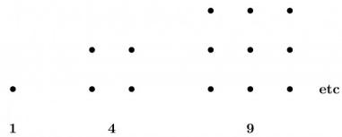

D. $\frac{(n + (b + r) - 1)!}{n!(b + r - 1)}$

gateit-2008 combinatory normal

Answer key

# 1.3

# Counting (6)

# 1.3.1 Counting: GATE CSE 1990 | Question: 3-iii

The number of rooted binary trees with n nodes is,

A. Equal to the number of ways of multiplying $(n+1)$ matrices.  
B. Equal to the number of ways of arranging n out of 2n distinct elements.  
C. Equal to $\frac{1}{(n + 1)}\binom{2n}{n}$ .  
D. Equal to n!.

gate1990 normal combinatory catalan-number multiple-selects counting

Answer key

# 1.3.2 Counting: GATE CSE 1991 | Question: 02-iv

Match the pairs in the following questions by writing the corresponding letters only.

<table><tr><td>A.</td><td>The number of distinct binary tree with n nodes.</td><td>P.</td><td> $\frac{n!}{2}$ </td></tr><tr><td>B.</td><td>The number of binary strings of the length of 2n with an equal number of 0&#x27;s and 1&#x27;s</td><td>Q.</td><td> $\binom{3n}{n}$ </td></tr><tr><td>C.</td><td>The number of even permutation of n objects.</td><td>R.</td><td> $\binom{2n}{n}$ </td></tr><tr><td>D.</td><td>The number of binary strings of length 6n which are palindromes with 2n 0&#x27;s.</td><td>S.</td><td> $\frac{1}{1+n}\binom{2n}{n}$ </td></tr></table>

gate1991 combinatory normal match-the-following counting

Answer key

# 1.3.3 Counting: GATE CSE 1994 | Question: 1.15

The number of substrings (of all lengths inclusive) that can be formed from a character string of length $n$ is

A. n

B. $n^2$

C. $\frac{n(n-1)}{2}$

D. $\frac{n(n+1)}{2}$

gate1994 combinatory counting normal

Answer key

# 1.3.4 Counting: GATE CSE 2021 | Set 1 | Question: 19

There are 6 jobs with distinct difficulty levels, and 3 computers with distinct processing speeds. Each job is assigned to a computer such that:

- The fastest computer gets the toughest job and the slowest computer gets the easiest job.  
• Every computer gets at least one job.

The number of ways in which this can be done is \_\_\_\_.

gatecse-2021-set1 combinatory counting numerical-answers one-mark

Answer key

# 1.3.5 Counting: GATE CSE 2021 | Set 2 | Question: 50

Let $S$ be a set consisting of 10 elements. The number of tuples of the form $(A, B)$ such that $A$ and $B$ are subsets of $S$ , and $A \subseteq B$ is \_\_\_\_

gatecse-2021-set2 combinatory counting numerical-answers two-marks

# Answer key

# 1.3.6 Counting: GATE CSE 2023 | Question: 38

Let $U = \{1, 2, \ldots, n\}$ , where $n$ is a large positive integer greater than 1000. Let $k$ be a positive integer less than $n$ . Let $A, B$ be subsets of $U$ with $|A| = |B| = k$ and $A \cap B = \emptyset$ . We say that a permutation of $U$ separates $A$ from $B$ if one of the following is true.

- All members of $A$ appear in the permutation before any of the members of $B$ .  
- All members of $B$ appear in the permutation before any of the members of $A$ .

How many permutations of U separate A from B?

A. n!

C. $\binom{n}{2k} (n - 2k)!(k!)^2$

gatecse-2023 combinatory counting two-marks

B. $\binom{n}{2k} (n - 2k)!$

D. $2\binom{n}{2k}(n-2k)!(k!)^{2}$

# Answer key

1.4

# Generating Functions (6)

# 1.4.1 Generating Functions: GATE CSE 1987 | Question: 10b

What is the generating function $G(z)$ for the sequence of Fibonacci numbers?

gate1987 combinatory generating-functions descriptive

# Answer key

# 1.4.2 Generating Functions: GATE CSE 2005 | Question: 50

Let $G(x) = \frac{1}{(1 - x)^2} = \sum_{i=0}^{\infty} g(i)x^i$ , where $|x| < 1$ . What is $g(i)$ ?

A. i

B. $i + 1$

C. 2i

D. $2^{i}$

gatecse-2005 normal generating-functions

# Answer key

# 1.4.3 Generating Functions: GATE CSE 2016 | Set 1 | Question: 26

The coefficient of $x^{12}$ in $(x^{3} + x^{4} + x^{5} + x^{6} + \ldots)^{3}$ is \_\_\_\_.

gatecse-2016-set1 combinatory generating-functions normal numerical-answers

# Answer key

# 1.4.4 Generating Functions: GATE CSE 2017 | Set 2 | Question: 47

If the ordinary generating function of a sequence $\{a_n\}_{n=0}^{\infty}$ is $\frac{1+z}{(1-z)^3}$ , then $a_3 - a_0$ is equal to \_\_\_\_.

gatecse-2017-set2 combinatory generating-functions numerical-answers normal

# Answer key

# 1.4.5 Generating Functions: GATE CSE 2018 | Question: 1

Which one of the following is a closed form expression for the generating function of the sequence $\{a_{n}\}$ , where $a_{n}=2n+3$ for all $n=0,1,2,\ldots$ ?

A. $\frac{3}{(1-x)^{2}}$

B. $\frac{3x}{(1-x)^{2}}$

C. $\frac{2-x}{(1-x)^{2}}$

D. $\frac{3-x}{(1-x)^{2}}$

gatecse-2018 generating-functions normal combinatory one-mark

Answer key

# 1.4.6 Generating Functions: GATE CSE 2022 | Question: 26

Which one of the following is the closed form for the generating function of the sequence $\{a_n\}_{n\geq 0}$ defined below?

$$
a _ {n} = \left\{ \begin{array}{c l} n + 1, & \text {n is odd} \\ 1, & \text {otherwise} \end{array} \right.
$$

A. $\frac{x(1 + x^2)}{(1 - x^2)^2} +\frac{1}{1 - x}$ C. $\frac{2x}{(1 - x^2)^2} +\frac{1}{1 - x}$

B. $\frac{x(3 - x^2)}{(1 - x^2)^2} +\frac{1}{1 - x}$ D. $\frac{x}{(1 - x^2)^2} +\frac{1}{1 - x}$

gatecse-2022 combinatory generating-functions two-marks

Answer key

# 1.5 Modular Arithmetic (2)

# 1.5.1 Modular Arithmetic: GATE CSE 2016 | Set 2 | Question: 29

The value of the expression $13^{99}$ (mod 17) in the range 0 to 16, is \_\_\_\_.

gatecse-2016-set2 modular-arithmetic normal numerical-answers

Answer key

# 1.5.2 Modular Arithmetic: GATE CSE 2019 | Question: 21

The value of $3^{51} \mod 5$ is \_\_\_\_

gatecse-2019 numerical-answers combinatory modular-arithmetic one-mark

Answer key

# 1.6 Pigeonhole Principle (2)

# 1.6.1 Pigeonhole Principle: GATE CSE 2000 | Question: 1.1

The minimum number of cards to be dealt from an arbitrarily shuffled deck of 52 cards to guarantee that three cards are from same suit is

A. 3

B. 8

C. 9

D. 12

gatecse-2000 easy pigeonhole-principle combinatory

Answer key

# 1.6.2 Pigeonhole Principle: GATE CSE 2005 | Question: 44

What is the minimum number of ordered pairs of non-negative numbers that should be chosen to ensure that there are two pairs $(a, b)$ and $(c, d)$ in the chosen set such that, $a \equiv c \mod 3$ and $b \equiv d \mod 5$

A. 4

B. 6

C. 16

D. 24

gatecse-2005 set-theory&algebra normal pigeonhole-principle

Answer key

# 1.7 Recurrence Relation (7)

# 1.7.1 Recurrence Relation: GATE CSE 1996 | Question: 9

The Fibonacci sequence $\{f_{1}, f_{2}, f_{3} \ldots f_{n}\}$ is defined by the following recurrence:

$$
f _ {n + 2} = f _ {n + 1} + f _ {n}, n \geq 1; f _ {2} = 1: f _ {1} = 1
$$

Prove by induction that every third element of the sequence is even.

gate1996 recurrence-relation proof descriptive

Answer key

# 1.7.2 Recurrence Relation: GATE CSE 2016 | Set 1 | Question: 2

Let $a_{n}$ be the number of $n$ -bit strings that do NOT contain two consecutive $1's$ . Which one of the following is the recurrence relation for $a_{n}$ ?

A. $a_{n} = a_{n - 1} + 2a_{n - 2}$  
C. $a_{n} = 2a_{n - 1} + a_{n - 2}$

gatecse-2016-set1 combinatory recurrence-relation easy

B. $a_{n} = a_{n - 1} + a_{n - 2}$  
D. $a_{n} = 2a_{n - 1} + 2a_{n - 2}$

Answer key

# 1.7.3 Recurrence Relation: GATE CSE 2016 | Set 1 | Question: 27

Consider the recurrence relation $a_1 = 8, a_n = 6n^2 + 2n + a_{n-1}$ . Let $a_{99} = K \times 10^4$ . The value of $K$ is \_\_\_\_.

gatecse-2016-set1 combinatory recurrence-relation normal numerical-answers

Answer key

# 1.7.4 Recurrence Relation: GATE CSE 2022 | Question: 41

Consider the following recurrence:

$$
\begin{array}{l} f (1) \quad = \quad 1; \\ f (2 n) \quad = 2 f (n) - 1, \quad \text {for} n \geq 1; \\ f (2 n + 1) = 2 f (n) + 1, \quad \text { for } n \geq 1. \\ \end{array}
$$

Then, which of the following statements is/are TRUE?

A. $f(2^{n} - 1) = 2^{n} - 1$  
C. $f(5 \cdot 2^n) = 2^{n+1} + 1$

B. $f(2^n) = 1$  
D. $f(2^n + 1) = 2^n + 1$

gatecse-2022 combinatory recurrence-relation multiple-selects two-marks

Answer key

# 1.7.5 Recurrence Relation: GATE CSE 2023 | Question: 5

The Lucas sequence $L_{n}$ is defined by the recurrence relation:

$$
L _ {n} = L _ {n - 1} + L _ {n - 2}, \quad \text { for } \quad n \geq 3,
$$

with $L_{1} = 1$ and $L_{2} = 3$ .

Which one of the options given is TRUE?

A. $L_{n} = \left(\frac{1 + \sqrt{5}}{2}\right)^{n} + \left(\frac{1 - \sqrt{5}}{2}\right)^{n}$  
C. $L_{n} = \left(\frac{1 + \sqrt{5}}{2}\right)^{n} + \left(\frac{1 - \sqrt{5}}{3}\right)^{n}$

B. $L_{n} = \left(\frac{1 + \sqrt{5}}{2}\right)^{n} - \left(\frac{1 - \sqrt{5}}{3}\right)^{n}$  
D. $L_{n} = \left(\frac{1 + \sqrt{5}}{2}\right)^{n} - \left(\frac{1 - \sqrt{5}}{2}\right)^{n}$

gatecse-2023 combinatory recurrence-relation one-mark

Answer key

# 1.7.6 Recurrence Relation: GATE IT 2004 | Question: 34

Let $H_{1}, H_{2}, H_{3}, \ldots$ be harmonic numbers. Then, for $n \in Z^{+}$ , $\sum_{j=1}^{n} H_{j}$ can be expressed as

A. $nH_{n + 1} - (n + 1)$  
C. $nH_{n}-n$

B. $(n + 1)H_{n} - n$  
D. $(n + 1)H_{n + 1} - (n + 1)$

gateit-2004 recurrence-relation combinatory normal

# Answer key

# 1.7.7 Recurrence Relation: GATE IT 2007 | Question: 76

Consider the sequence $\langle x_{n}\rangle$ , $n \geq 0$ defined by the recurrence relation $x_{n+1} = c$ . $x_{n}^{2} - 2$ , where c > 0.

Suppose there exists a non-empty, open interval $(a, b)$ such that for all $x_{0}$ satisfying $a < x_{0} < b$ , the sequence converges to a limit. The sequence converges to the value?

A. $\frac{1+\sqrt{1+8c}}{2c}$

B. $\frac{1 - \sqrt{1 + 8c}}{2c}$

C. 2

D. $\frac{2}{2c-1}$

gateit-2007 combinatory normal recurrence-relation

# Answer key

# 1.8

# Summation (4)

# 1.8.1 Summation: GATE CSE 1989 | Question: 4-i

How many substrings (of all lengths inclusive) can be formed from a character string of length n? Assume all characters to be distinct, prove your answer.

gate1989 descriptive combinatory normal proof counting summation

# Answer key

# 1.8.2 Summation: GATE CSE 1994 | Question: 15

Use the patterns given to prove that

A. $\sum_{i=0}^{n-1}(2i+1)=n^{2}$

(You are not permitted to employ induction)

text_image

1
4
9
etc

B. Use the result obtained in (A) to prove that $\sum_{i=1}^{n} i = \frac{n(n+1)}{2}$

gate1994 combinatory proof summation descriptive

# Answer key

# 1.8.3 Summation: GATE CSE 2008 | Question: 24

Let $P = \sum_{i \text{ odd}}^{1 \leq i \leq 2k} i$ and $Q = \sum_{i \text{ even}}^{1 \leq i \leq 2k} i$ , where $k$ is a positive integer. Then

A. P = Q - k

B. $P = Q + k$

C. P = Q

D. $P = Q + 2k$

gatecse-2008 combinatory easy summation

# Answer key

$$
\sum_ {x = 1} ^ {9 9} \frac {1}{x (x + 1)} = \underline {{\quad}}.
$$

gatecse-2015-set1 combinatory normal numerical-answers summation

Answer key

Answer Keys

<table><tr><td>1.1.1</td><td>D</td></tr><tr><td>1.1.6</td><td>A</td></tr><tr><td>1.2.5</td><td>B</td></tr><tr><td>1.2.10</td><td>D</td></tr><tr><td>1.2.15</td><td>195:195</td></tr><tr><td>1.3.2</td><td>N/A</td></tr><tr><td>1.4.1</td><td>N/A</td></tr><tr><td>1.4.6</td><td>A</td></tr><tr><td>1.7.1</td><td>N/A</td></tr><tr><td>1.7.6</td><td>B</td></tr><tr><td>1.8.4</td><td>0.99</td></tr></table>

<table><tr><td>1.1.2</td><td>N/A</td></tr><tr><td>1.2.1</td><td>A</td></tr><tr><td>1.2.6</td><td>C</td></tr><tr><td>1.2.11</td><td>89</td></tr><tr><td>1.2.16</td><td>A</td></tr><tr><td>1.3.3</td><td>D</td></tr><tr><td>1.4.2</td><td>B</td></tr><tr><td>1.5.1</td><td>4</td></tr><tr><td>1.7.2</td><td>B</td></tr><tr><td>1.7.7</td><td>B</td></tr></table>

<table><tr><td>1.1.3</td><td>N/A</td></tr><tr><td>1.2.2</td><td>N/A</td></tr><tr><td>1.2.7</td><td>B</td></tr><tr><td>1.2.12</td><td>15</td></tr><tr><td>1.2.17</td><td>B</td></tr><tr><td>1.3.4</td><td>65 : 65</td></tr><tr><td>1.4.3</td><td>10</td></tr><tr><td>1.5.2</td><td>2</td></tr><tr><td>1.7.3</td><td>197.9 : 198.1</td></tr><tr><td>1.8.1</td><td>N/A</td></tr></table>

<table><tr><td>1.1.4</td><td>B</td></tr><tr><td>1.2.3</td><td>D</td></tr><tr><td>1.2.8</td><td>C</td></tr><tr><td>1.2.13</td><td>C</td></tr><tr><td>1.2.18</td><td>A</td></tr><tr><td>1.3.5</td><td>59049 : 59049</td></tr><tr><td>1.4.4</td><td>15</td></tr><tr><td>1.6.1</td><td>C</td></tr><tr><td>1.7.4</td><td>A;B;C</td></tr><tr><td>1.8.2</td><td>N/A</td></tr></table>

<table><tr><td>1.1.5</td><td>7</td></tr><tr><td>1.2.4</td><td>D</td></tr><tr><td>1.2.9</td><td>A</td></tr><tr><td>1.2.14</td><td>12</td></tr><tr><td>1.3.1</td><td>A;C</td></tr><tr><td>1.3.6</td><td>D</td></tr><tr><td>1.4.5</td><td>D</td></tr><tr><td>1.6.2</td><td>C</td></tr><tr><td>1.7.5</td><td>A</td></tr><tr><td>1.8.3</td><td>A</td></tr></table>

Syllabus: Connectivity, Matching, Coloring.

Mark Distribution in Previous GATE

<table><tr><td>Year</td><td>2026 - 1</td><td>2026 - 2</td><td>2025 - 1</td><td>2025 - 2</td><td>2024 - 1</td><td>2024 - 2</td><td>2023</td><td>2022</td><td>2021 - 1</td><td>2021 - 2</td><td>Minimum</td></tr><tr><td>1 Mark Count</td><td>0</td><td>0</td><td>0</td><td>0</td><td>1</td><td>1</td><td>0</td><td>1</td><td>1</td><td>0</td><td>0</td></tr><tr><td>2 Marks Count</td><td>3</td><td>1</td><td>0</td><td>0</td><td>1</td><td>2</td><td>1</td><td>3</td><td>1</td><td>0</td><td>0</td></tr><tr><td>Total Marks</td><td>6</td><td>2</td><td>0</td><td>0</td><td>3</td><td>5</td><td>2</td><td>7</td><td>3</td><td>0</td><td>0</td></tr></table>

Welcome to the Graph Theory chapter, a cornerstone of Discrete Mathematics and a frequently tested area in the GATE Computer Science examination. Graph Theory provides a powerful framework for modeling relationships and processes across various domains, from social networks and transportation systems to computer networks and algorithm design. For GATE CS, this subject typically carries a weightage of 5-8 marks, often integrated with Data Structures and Algorithms. Questions range from direct application of definitions and formulas, analysis of graph properties, tracing graph algorithms, to problem-solving scenarios involving connectivity, coloring, and planarity. A strong grasp of graph theory fundamentals is crucial not only for scoring well but also for understanding advanced topics in computer science.

# Topic-wise Key Concepts

# Counting

Counting in graph theory involves determining the number of possible graphs, paths, cycles, or specific structures within graphs. It often relies on fundamental combinatorial principles.

- Definition and Core Idea: This topic focuses on enumerating different types of graphs or substructures within them, using principles of permutations, combinations, and other combinatorial techniques. It's about understanding how many ways a graph can be formed or how many specific patterns exist.  
- Important Formulas, Theorems, and Results:

1. Number of simple labeled graphs with n vertices:

$$
{\bf 2} ^ {\binom {n} {2}} = {\bf 2} ^ {n (n - 1) / 2}
$$

This is because for each pair of n vertices, there can either be an edge or not.

2. Number of simple directed labeled graphs with n vertices:

$$
2 ^ {n (n - 1)}
$$

For each ordered pair of distinct vertices $(u,v)$ , there can be an edge from $u$ to $v$ , or not.

3. Number of spanning trees in a complete graph $K_{n}$ (Cayley's Formula):

$$
n ^ {n - 2}
$$

This formula is critical for counting trees on a given set of labeled vertices.

4. Number of spanning trees in a general graph (Matrix Tree Theorem): This theorem uses the Laplacian matrix of a graph, but its direct application is usually beyond GATE scope; Cayley's formula is more common.  
5. Number of paths of length $k$ between two vertices in an adjacency matrix: The $(i,j)$ -th entry of $A^k$ (where $A$ is the adjacency matrix) gives the number of paths of length $k$ from vertex $i$ to vertex $j$ .

• Key Properties and Identities:

Understanding the difference between labeled and unlabeled graphs is crucial. GATE questions usually imply labeled graphs unless specified.  
- Basic combinatorial identities like $\binom{n}{k} = \frac{n!}{k!(n-k)!}$ and $P(n,k) = \frac{n!}{(n-k)!}$ are fundamental.  
- The Inclusion-Exclusion Principle can be used for more complex counting problems, especially when dealing with properties that overlap.

• Common Pitfalls or Tricky Points:

- Overcounting or Undercounting: Ensure each distinct configuration is counted exactly once.  
- Distinguishing Labeled vs. Unlabeled: Most GATE questions assume labeled vertices unless stated otherwise, which simplifies counting. Unlabeled graph counting is significantly harder.  
- Specific Graph Types: Be careful when counting paths/cycles in specific graph types like trees, complete graphs, or bipartite graphs.

\- Standard Problem-Solving Techniques or Shortcuts:

- Direct Application of Formulas: For simple graphs, complete graphs, and spanning trees, direct formula application is common.  
- Combinatorial Arguments: Break down the problem into smaller, manageable choices and multiply/add the possibilities.  
- Recurrence Relations: For counting paths or specific structures, sometimes a recurrence relation can be formulated and solved.

# Degree of Graph

The degree of a vertex is a fundamental property that quantifies its connectivity within a graph. It's essential for understanding graph structure and validating basic graph properties.

\- Definition and Core Idea: The degree of a vertex $v$ , denoted $\deg(v)$ or $d(v)$ , is the number of edges incident to it. For directed graphs, we distinguish between in-degree (edges pointing to $v$ ) and out-degree (edges pointing from $v$ ).

\- Important Formulas, Theorems, and Results:

1. Handshaking Lemma (for undirected graphs): The sum of the degrees of all vertices in any undirected graph is equal to twice the number of edges.

$$
\sum_ {v \in V} \deg (v) = 2 | E |
$$

This is a cornerstone theorem in graph theory.

2. For directed graphs: The sum of in-degrees equals the sum of out-degrees, and both are equal to the total number of edges.

$$
\sum_ {v \in V} \text {in-deg} (v) = \sum_ {v \in V} \text {out-deg} (v) = | E |
$$

3. Number of odd-degree vertices: In any undirected graph, the number of vertices with odd degree must be even. This is a direct consequence of the Handshaking Lemma.

4. Maximum degree $\Delta(G)$ and Minimum degree $\delta(G)$ : These denote the maximum and minimum degrees among all vertices in graph $G$ , respectively.

• Key Properties and Identities:

- The Handshaking Lemma is a powerful tool for checking the validity of a degree sequence or finding the number of edges.  
- A graph cannot exist if its degree sequence violates the Handshaking Lemma or has an odd number of odd-degree vertices.  
- For a simple graph with $n$ vertices, the maximum degree of any vertex is $n - 1$ .

• Common Pitfalls or Tricky Points:

- Self-loops: In some contexts, a self-loop at a vertex contributes 2 to its degree. GATE questions usually specify if self-loops are allowed or assume simple graphs (no self-loops, no multiple edges).  
- Multiple Edges: If multiple edges are allowed between two vertices, each edge contributes to the degree.  
- Directed vs. Undirected: Always be clear whether the graph is directed or undirected when calculating degrees.

\- Standard Problem-Solving Techniques or Shortcuts:

Direct Application of Handshaking Lemma: Often used to find the number of edges given a degree sequence, or to determine if a given degree sequence is possible.

\- Parity Check: Quickly identify impossible degree sequences by checking the number of odd-degree vertices.

# Graph Algorithms

Graph algorithms are systematic procedures for solving problems on graphs, such as finding paths, spanning trees, or optimal routes. They are central to computer science applications.

\- Definition and Core Idea: These are algorithms designed to traverse, search, analyze, and optimize properties of graphs. They form the backbone of many real-world applications, from network routing to social network analysis.

\- Important Algorithms, Formulas, and Complexities:

1. Breadth-First Search (BFS): Explores a graph layer by layer.

- Purpose: Find shortest path in unweighted graphs, find connected components.  
- Time Complexity: $O(V + E)$ for adjacency list, $O(V^2)$ for adjacency matrix.

2. Depth-First Search (DFS): Explores as far as possible along each branch before backtracking.

\- Purpose: Find connected components, topological sort, detect cycles, find bridges/articulation points.

\- Time Complexity: $O(V + E)$ for adjacency list, $O(V^2)$ for adjacency matrix.

3. Dijkstra's Algorithm: Finds the shortest paths from a single source vertex to all other vertices in a graph with non-negative edge weights.

- Purpose: Single-source shortest path.  
- Time Complexity: $O(E \log V)$ with a Fibonacci heap, $O(E + V \log V)$ with a binary heap, $O(V^2)$ with adjacency matrix.

4. Prim's Algorithm: Finds a Minimum Spanning Tree (MST) in a weighted, undirected graph.

- Purpose: MST.  
- Time Complexity: $O(E \log V)$ with a binary heap, $O(V^2)$ with adjacency matrix.

5. Kruskal's Algorithm: Finds a Minimum Spanning Tree (MST) in a weighted, undirected graph.

- Purpose: MST.  
- Time Complexity: $O(E \log E)$ or $O(E \log V)$ using a Disjoint Set Union (DSU) data structure.

6. Bellman-Ford Algorithm: Finds the shortest paths from a single source vertex to all other vertices, even with negative edge weights. Detects negative cycles.

- Purpose: Single-source shortest path with negative weights.  
- Time Complexity: $O(VE)$ .

7. Floyd-Warshall Algorithm: Finds all-pairs shortest paths in a weighted graph, can handle negative weights but not negative cycles.

- Purpose: All-pairs shortest path.  
- Time Complexity: $O(V^3)$ .

8. Topological Sort: Linear ordering of vertices such that for every directed edge $(u, v)$ , $u$ comes before $v$ . Applicable only to Directed Acyclic Graphs (DAGs).

- Purpose: Ordering tasks with dependencies.  
■ Time Complexity: $O(V + E)$ (using DFS or Kahn's algorithm).

9. Ford-Fulkerson Algorithm (and Edmonds-Karp): Finds the maximum flow in a flow network.

- Purpose: Maximum flow.  
- Time Complexity: Ford-Fulkerson is not polynomial in general; Edmonds-Karp is $O(VE^2)$ .

• Key Properties and Identities:

- Greedy Algorithms: Prim's, Kruskal's, Dijkstra's are greedy algorithms that make locally optimal choices.  
Dynamic Programming: Floyd-Warshall and Bellman-Ford use dynamic programming principles.  
- Connectivity: BFS/DFS can determine if a graph is connected or find its connected components.  
- Cycles: DFS can detect cycles in both directed and undirected graphs.

• Common Pitfalls or Tricky Points:

- Negative Edge Weights: Dijkstra's fails with negative edge weights; use Bellman-Ford or Floyd-Warshall.  
- Disconnected Graphs: Algorithms like Dijkstra's might not reach all vertices if the graph is disconnected from the source.  
- Choosing the Right Algorithm: Understand the constraints (weighted/unweighted, directed/undirected, negative weights, single-source/all-pairs) to select the appropriate algorithm.  
- Adjacency List vs. Matrix: Be aware of how the graph representation affects time complexity.

\- Standard Problem-Solving Techniques or Shortcuts:

Tracing: Practice tracing algorithms step-by-step on small graphs to understand their mechanics.  
- Recognizing Patterns: Identify if a problem can be mapped to a standard graph algorithm (e.g., "minimum cost to connect all cities" suggests MST).  
- Complexity Analysis: Be able to derive or recall the time and space complexity for common algorithms.

# Graph Coloring

Graph coloring assigns labels (colors) to graph elements subject to certain constraints, often used to model scheduling or resource allocation problems.

- Definition and Core Idea: Vertex coloring assigns a color to each vertex such that no two adjacent vertices have the same color. The minimum number of colors required for a graph $G$ is called its chromatic number, denoted $\chi(G)$ .  
- Important Formulas, Theorems, and Results:

1. Chromatic Number $\chi(G)$ : The smallest integer $k$ such that $G$ is $k$ -colorable.  
2. Lower Bound: For any graph $G, \chi(G) \geq \omega(G)$ , where $\omega(G)$ is the clique number (size of the largest clique).  
3. Upper Bound (Brooks' Theorem): For a connected graph $G$ that is neither a complete graph nor an odd cycle, $\chi(G) \leq \Delta(G)$ , where $\Delta(G)$ is the maximum degree. In general, $\chi(G) \leq \Delta(G) + 1$ .  
4. Bipartite Graphs: A graph is bipartite if and only if it contains no odd-length cycles. If a graph is bipartite and has at least one edge, then $\chi(G) = 2$ .

5. Planar Graphs (Four Color Theorem): Every planar graph is 4-colorable. Thus, for any planar graph $G$ , $\chi(G) \leq 4$ .

6. Chromatic Polynomial $P(G, k)$ : A polynomial whose value at integer $k$ is the number of ways to color $G$ using at most $k$ colors. For a graph with $n$ vertices, $P(G, k)$ is a polynomial in $k$ of degree $n$ .

# • Key Properties and Identities:

- A graph is 2-colorable if and only if it is bipartite.  
- If a graph contains a clique of size $k$ , then at least $k$ colors are needed.  
- The chromatic number of a complete graph $K_{n}$ is $n$ .  
- The chromatic number of a cycle graph $C_n$ is 2 if $n$ is even, and 3 if $n$ is odd.

# • Common Pitfalls or Tricky Points:

- Minimum vs. Any Coloring: The goal is to find the minimum number of colors, not just any valid coloring.  
- Identifying Cliques: Finding the largest clique $(\omega(G))$ can be hard, but it provides a lower bound for $\chi(G)$ .  
- Edge Coloring $(\chi'(G))$ : Similar concept but for edges (adjacent edges have different colors). Vizing's Theorem states $\Delta(G) \leq \chi'(G) \leq \Delta(G) + 1$ . GATE usually focuses on vertex coloring.

# - Standard Problem-Solving Techniques or Shortcuts:

- Greedy Coloring: Assign colors iteratively to vertices in some order (e.g., decreasing degree). While not always optimal, it's a common heuristic.  
- Identify Cliques and Odd Cycles: These structures directly give lower bounds for the chromatic number.  
- Trial and Error/Backtracking: For small graphs, try to color with 2, then 3, etc., until a valid coloring is found.

# Graph Connectivity

Graph connectivity measures how robust a graph is to the removal of vertices or edges. It's crucial for network reliability and fault tolerance.

\- Definition and Core Idea: Connectivity refers to the property of a graph being "connected," meaning there's a path between any two vertices. More generally, it quantifies how many vertices or edges must be removed to disconnect the graph.

# - Important Formulas, Theorems, and Results:

1. Connected Graph: A graph is connected if there is a path between every pair of distinct vertices.  
2. Connected Components: Maximal connected subgraphs.  
3. Cut Vertex (Articulation Point): A vertex whose removal increases the number of connected components.  
4. Cut Edge (Bridge): An edge whose removal increases the number of connected components.  
5. Vertex Connectivity $\kappa(G)$ : The minimum number of vertices whose removal disconnects $G$ or reduces it to a trivial graph. A graph is $k$ -connected if $\kappa(G) \geq k$ .

6. Edge Connectivity $\lambda(G)$ : The minimum number of edges whose removal disconnects $G$ . A graph is $k$ -edge-connected if $\lambda(G) \geq k$ .

7. Relationship: For any graph $G, \kappa(G) \leq \lambda(G) \leq \delta(G)$ , where $\delta(G)$ is the minimum degree of $G$ .

8. Menger's Theorem: For any two non-adjacent vertices $u$ and $v$ in a graph $G$ , the maximum number of vertex-disjoint paths between $u$ and $v$ is equal to the minimum number of vertices whose removal separates $u$ and $v$ . (Similar theorem for edge-disjoint paths and edge cuts).

# • Key Properties and Identities:

- A tree with more than one vertex has $\kappa(G) = 1$ and $\lambda(G) = 1$ .  
- A complete graph $K_{n}$ has $\kappa(K_{n}) = n - 1$ and $\lambda(K_{n}) = n - 1$ .  
- If a graph has a bridge, its edge connectivity is 1. If it has an articulation point, its vertex connectivity is 1 (unless it's $K_2$ ).

# • Common Pitfalls or Tricky Points:

- Trivial Graph: For a complete graph $K_{n}$ , removing $n - 1$ vertices disconnects it into a trivial graph (single vertex), so $\kappa(K_{n}) = n - 1$ .  
- Distinguishing Vertex vs. Edge Connectivity: Carefully read whether the question asks for vertex or edge removal.  
- Disconnected Graphs: For a disconnected graph, $\kappa(G) = 0$ and $\lambda(G) = 0$ .

# - Standard Problem-Solving Techniques or Shortcuts:

- BFS/DFS: Can be used to find connected components, bridges, and articulation points.  
- Trial and Error: For small graphs, try removing vertices/edges to find the minimum set that disconnects the graph.  
- Apply $\kappa(G) \leq \lambda(G) \leq \delta(G)$ : This inequality provides quick bounds.

# Graph Isomorphism

Graph isomorphism determines if two graphs are structurally identical, regardless of their vertex labeling or drawing style. It's a fundamental concept for comparing graphs.

\- Definition and Core Idea: Two graphs $G_{1} = (V_{1}, E_{1})$ and $G_{2} = (V_{2}, E_{2})$ are isomorphic if there exists a bijective function $f: V_{1} \to V_{2}$ such that for any pair of vertices $u, v \in V_{1}, \{u, v\} \in E_{1}$ if and only if $\{f(u), f(v)\} \in E_{2}$ . Essentially, they have the same structure.

\- Important Properties (Invariants):

1. Number of Vertices: $|V_{1}| = |V_{2}|$ .  
2. Number of Edges: $|E_{1}| = |E_{2}|$ .  
3. Degree Sequence: Both graphs must have the same degree sequence (multiset of degrees).  
4. Number of Connected Components: Must be the same.  
5. Cycle Lengths: The number of cycles of each specific length must be the same.  
6. Connectivity: Same vertex and edge connectivity.  
7. Chromatic Number: Must be the same.  
8. Presence of Subgraphs: If $G_{1}$ contains a subgraph $H$ , then $G_{2}$ must also contain $H$ .

• Key Properties and Identities:

- If any of the invariants differ, the graphs are definitely NOT isomorphic.  
- If all invariants are the same, the graphs MIGHT be isomorphic, but it's not a guarantee (e.g., regular graphs can have the same degree sequence but be non-isomorphic).  
- The Graph Isomorphism Problem (determining if two graphs are isomorphic) is in NP, but its exact complexity class is unknown (neither P nor NP-complete is proven). For GATE, problems are usually small enough to solve by inspection or invariant checking.

• Common Pitfalls or Tricky Points:

- Proving Non-Isomorphism: This is generally easier; just find one invariant that differs.  
- Proving Isomorphism: This requires finding an explicit bijective mapping $f$ , which can be challenging. Often, it involves matching vertices with identical properties (e.g., same degree, same neighborhood structure).  
- Visual Deception: Graphs drawn differently can be isomorphic, and graphs drawn similarly can be non-isomorphic.

\- Standard Problem-Solving Techniques or Shortcuts:

- Check Invariants Systematically: Start with simple invariants like number of vertices, edges, and degree sequence. If any differ, stop.  
- Match Vertices by Properties: Look for unique vertices (e.g., a vertex with degree 1, or a vertex part of a unique cycle structure) and try to map them.  
- Adjacency Matrix Comparison: If two graphs are isomorphic, their adjacency matrices can be made identical by permuting rows and columns. This is computationally intensive for humans but conceptually useful.

# Graph Matching

Graph matching is about finding a set of edges that do not share any common vertices, often used in assignment problems or resource allocation.

\- Definition and Core Idea: A matching $M$ in a graph $G$ is a set of edges such that no two edges in $M$ share a common vertex. A vertex is matched (or covered) if it is an endpoint of an edge in $M$ ; otherwise, it is unmatched.

\- Important Formulas, Theorems, and Results:

1. Maximum Matching: A matching with the largest possible number of edges.  
2. Perfect Matching: A matching that covers all vertices of the graph. A perfect matching can only exist if $|\bar{V}|$ is even.  
3. Augmenting Path: A path that starts and ends at unmatched vertices, and whose edges alternate between being in the current matching and not in the current matching. An augmenting path can be used to increase the size of a matching.  
4. Hall's Marriage Theorem (for Bipartite Graphs): A bipartite graph $G = (U \cup V, E)$ has a matching that covers all vertices in $U$ if and only if for every subset $A \subseteq U$ , $|N(A)| \geq |A|$ , where $N(A)$ is the set of neighbors of vertices in $A$ .  
5. Tutte's Theorem (for General Graphs): A graph $G$ has a perfect matching if and only if for every subset $S \subseteq V$ , the number of odd components in $G - S$ is less than or equal to $|S|$ . (This is more complex and less common in GATE than Hall's).

• Key Properties and Identities:

- The size of a maximum matching in a bipartite graph can be found using network flow algorithms (e.g., by converting to a max-flow problem).  
- Every perfect matching is a maximum matching, but not vice-versa.  
- A graph can have multiple maximum matchings.

• Common Pitfalls or Tricky Points:

- Confusing Matching with Vertex Cover or Edge Cover: These are related but distinct concepts. A vertex cover is a set of vertices that touch all edges. An edge cover is a set of edges that touch all vertices (only exists if no isolated vertices).  
- General vs. Bipartite Graphs: Finding maximum matchings in general graphs is more complex (e.g., Edmonds' blossom algorithm) than in bipartite graphs. GATE usually focuses on bipartite matching or simpler cases.  
- Existence of Perfect Matching: A perfect matching requires an even number of vertices.

\- Standard Problem-Solving Techniques or Shortcuts:

- Greedy Approach: While not always optimal for maximum matching, a greedy approach (e.g., pick an edge, remove its endpoints, repeat) can give a good starting point.  
- Augmenting Paths: For bipartite graphs, the concept of augmenting paths is key. Start with an empty matching, find an augmenting path, update the matching, and repeat until no more augmenting paths exist. This is the basis of the Hopcroft-Karp algorithm.  
- Applying Hall's Theorem: For bipartite graphs, use Hall's condition to check for the existence of a matching covering one side.

# Graph Planarity

Graph planarity deals with whether a graph can be drawn on a plane without any edges crossing. It has applications in circuit design and network visualization.

- Definition and Core Idea: A graph is planar if it can be drawn in the plane without any edges crossing each other (except at vertices). Such a drawing is called a planar embedding.  
- Important Formulas, Theorems, and Results:

1. Euler's Formula for Planar Graphs: For any connected planar graph with V vertices, E edges, and F faces (regions),

$$
V - E + F = 2
$$

This formula is fundamental for planar graphs.

2. Corollaries of Euler's Formula (for simple connected planar graphs with $V \geq 3$ ):

- If $G$ has no cycles of length 3 (i.e., no $K_{3}$ subgraph), then $E \leq 2V - 4$ .  
- In general, $E \leq 3V - 6$ .  
- There is at least one vertex with degree at most 5 ( $\delta(G) \leq 5$ ).

3. Kuratowski's Theorem: A graph is planar if and only if it does not contain a subgraph that is a subdivision of $K_{5}$ (complete graph on 5 vertices) or $K_{3,3}$ (complete bipartite graph with 3 vertices in each partition).

\- A subdivision of a graph is obtained by replacing edges with paths.

• Key Properties and Identities:

- $K_{5}$ and $K_{3,3}$ are non-planar.  
- Any graph that contains $K_{5}$ or $K_{3,3}$ as a minor (or subdivision) is non-planar.  
- The dual of a planar graph is also planar.

• Common Pitfalls or Tricky Points:

- Misapplying Euler's Formula: Remember it's for connected planar graphs. For disconnected graphs, $V - E + F = 1 + k$ , where $k$ is the number of connected components.  
• Identifying Subdivisions: Recognizing $K_{5}$ or $K_{3,3}$ subdivisions can be tricky. Look for 5 vertices all connected to each other (possibly via paths) or 6 vertices arranged in a bipartite manner.  
- Different Drawings: A graph might look non-planar in one drawing but be planar in another. The definition requires existence of a planar drawing.

\- Standard Problem-Solving Techniques or Shortcuts:

- Check Euler's Formula Corollaries: If $E > 3V - 6$ (or $E > 2V - 4$ if no triangles), the graph is definitely non-planar. This is a quick check for non-planarity.  
- Look for $K_{5}$ or $K_{3,3}$ Subdivisions: Try to simplify the graph by removing degree-2 vertices (which don't affect planarity for Kuratowski's theorem) or identifying dense subgraphs.  
- Redrawing: For small graphs, try to redraw them to eliminate crossings.

# Jaccard Coefficient

The Jaccard Coefficient is a statistical measure used to gauge the similarity between two sets, finding applications in data mining, machine learning, and graph analysis (e.g., comparing neighbor sets).

\- Definition and Core Idea: The Jaccard Coefficient (or Jaccard Index) measures the similarity between two finite