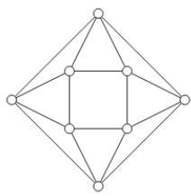
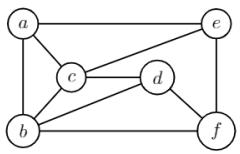
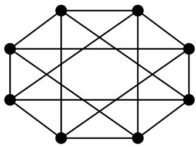
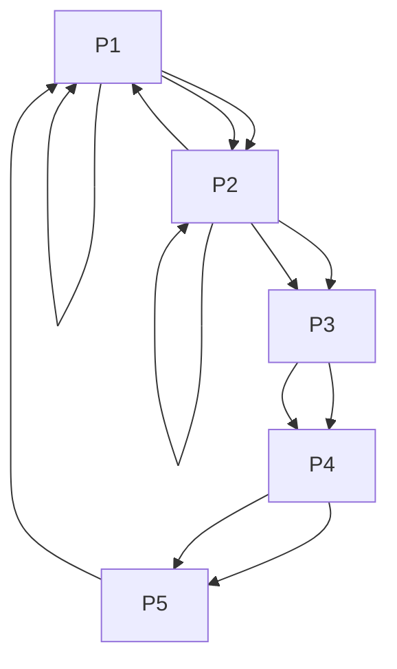
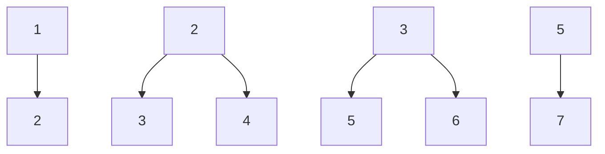

sets, $A$ and $B$ , as the size of their intersection divided by the size of their union. It quantifies the overlap between the sets.

\- Important Formulas, Theorems, and Results:

1. Jaccard Coefficient $J(A, B)$ :

$$
J (A, B) = \frac {| A \cap B |}{| A \cup B |}
$$

2. Jaccard Distance $D_{J}(A,B)$ : Measures dissimilarity.

$$
D _ {J} (A, B) = 1 - J (A, B) = \frac {| A \cup B | - | A \cap B |}{| A \cup B |}
$$

• Key Properties and Identities:

- The Jaccard Coefficient ranges from 0 to 1.  
- $J(A, B) = 1$ if $A = B$ (perfect similarity).  
- $J(A, B) = 0$ if $A \cap B = \emptyset$ (no similarity).

\- It is symmetric: $J(A, B) = J(B, A)$ .

\- It is sensitive to the size of the union; a large union with a small intersection leads to a low coefficient.

• Common Pitfalls or Tricky Points:

- Miscalculating Intersection or Union: Ensure correct set operations, especially when dealing with lists that might contain duplicates (convert to sets first).  
- Empty Sets: If both sets are empty, the Jaccard coefficient is usually defined as 1 (perfect similarity). If one is empty and the other is not, it's 0.  
- Application Context: In graph theory, it's often used to compare the neighborhood sets of two vertices to determine their "structural similarity" or to compare sets of features associated with graph nodes.

\- Standard Problem-Solving Techniques or Shortcuts:

\- Direct Calculation: Identify the elements in the intersection and union, then apply the formula.

\- Venn Diagrams: For small sets, a Venn diagram can help visualize the intersection and union.

# Quick Formula Reference

- Counting Simple Labeled Graphs ( $n$ vertices): $2^{\binom{n}{2}}$  
- Counting Simple Directed Labeled Graphs ( $n$ vertices): $2^{n(n-1)}$  
- Cayley's Formula (Spanning Trees in $K_{n}$ ): $n^{n-2}$  
- Handshaking Lemma (Undirected): $\sum_{v\in V}\deg (v) = 2|E|$  
- Handshaking Lemma (Directed): $\sum_{v\in V}$ in-deg(v) = $\sum_{v\in V}$ out-deg(v) = |E|  
- BFS/DFS Time Complexity: $O(V + E)$ (adj list), $O(V^2)$ (adj matrix)  
- Dijkstra's Time Complexity: $O(E \log V)$ (binary heap), $O(V^2)$ (adj matrix)  
- Prim's/Kruskal's Time Complexity (MST): $O(E \log V)$ or $O(E \log E)$  
- Bellman-Ford Time Complexity: $O(VE)$  
- Floyd-Warshall Time Complexity: $O(V^3)$  
- Topological Sort Time Complexity: $\dot{O}(V + E)$  
- Chromatic Number Lower Bound: $\chi(\dot{G}) \geq \omega(\dot{G})$ (clique number)  
- Bipartite Graph Chromatic Number: $\chi(G) = 2$ (if connected and has edges)  
- Planar Graph Chromatic Number (Four Color Theorem): $\chi(G) \leq 4$  
- Connectivity Relationship: $\kappa(G) \leq \lambda(G) \leq \delta(G)$  
- Euler's Formula (Connected Planar Graph): $V - E + F = 2$  
- Planarity Condition (Simple Connected Planar, $V \geq 3$ ): $E \leq 3V - 6$  
- Planarity Condition (Simple Connected Planar, no $K_{3}, V \geq 3$ ): $E \leq 2V - 4$  
- Kuratowski's Theorem: Planar iff no $K_{5}$ or $K_{3,3}$ subdivision  
- Jaccard Coefficient: $J(A, B) = \frac{|A \cap B|}{|A \cup B|}$  
- Jaccard Distance: $D_{J}(A,B) = 1 - J(A,B)$

\- Chromatic Number Upper Bound (Brooks' Theorem): $\chi(G) \leq \Delta(G)$ (for non-complete, non-odd cycle connected graphs), else $\chi(G) \leq \Delta(G) + 1$

# Important Tips for GATE

1. Master Definitions and Basic Properties: Many GATE questions test fundamental definitions (e.g., what is a bridge, what is a perfect matching) and direct consequences of theorems. Ensure you know what each term means precisely.  
2. Practice Drawing and Visualizing Graphs: For problems involving planarity, isomorphism, or connectivity, sketching the graph and trying different layouts can be immensely helpful. Don't rely solely on abstract representations.  
3. Understand Algorithm Mechanics and Complexity: Don't just memorize complexities; understand how BFS, DFS, Dijkstra's, Prim's, and Kruskal's work step-by-step. Be prepared to trace them on small examples and identify their time/space complexities for both adjacency list and matrix representations.  
4. Pay Attention to Graph Types and Constraints: Is the graph directed or undirected? Weighted or unweighted? Simple or multi-graph? Does it allow self-loops? These details significantly impact which formulas or algorithms apply. For example, Dijkstra's fails with negative edge weights.  
5. Use Invariants for Isomorphism: When checking for isomorphism, systematically compare invariants like number of vertices, edges, degree sequence, and cycle lengths. If any invariant differs, the graphs are not isomorphic. This is a powerful shortcut.  
6. Be Wary of Common Pitfalls: Remember that Euler's formula applies to connected planar graphs. Dijkstra's doesn't work with negative weights. A greedy coloring isn't always optimal. Keep these exceptions in mind.  
7. Time Management for Tracing Problems: For algorithm tracing questions, work carefully and systematically. Use scratch paper to keep track of visited nodes, distances, or parent pointers. Avoid rushing, as a single error can invalidate the entire trace.  
8. Review Special Graph Types: Be familiar with properties of common graphs like complete graphs $(K_{n})$ , complete bipartite graphs $(K_{m,n})$ , cycle graphs $(C_{n})$ , path graphs $(P_{n})$ , and trees. Their specific properties often appear in questions.

# 2.1

# Counting (3)

# 2.1.1 Counting: GATE CSE 2001 | Question: 2.15

How many undirected graphs (not necessarily connected) can be constructed out of a given set $V = \{v_{1}, v_{2}, \ldots, v_{n}\}$ of $n$ vertices?

A. $\frac{n(n-1)}{2}$

B. $2^{n}$

C. n!

D. $2^{\frac{n(n - 1)}{2}}$

gatecse-2001 graph-theory normal counting

# Answer key

# 2.1.2 Counting: GATE CSE 2004 | Question: 79

How many graphs on n labeled vertices exist which have at least $\frac{(n^{2}-3n)}{2}$ edges?

A. $\left(\frac{n^2 - n}{2}\right)C_{\left(\frac{n^2 - 3n}{2}\right)}$

$\left(\frac{n^2 - 3n}{2}\right)\sum_{k = 0}^{2}. (n^2 - n)C_k$

C. $\left(\frac{n^{2}-n}{2}\right)C_{n}$

D. $\sum_{k=0}^{n}\cdot\left(\frac{n^{2}-n}{2}\right)C_{k}$

gatecse-2004 graph-theory combinatory normal counting

# Answer key

# 2.1.3 Counting: GATE CSE 2012 | Question: 38

Let G be a complete undirected graph on 6 vertices. If vertices of G are labeled, then the number of distinct cycles of length 4 in G is equal to

A. 15

B. 30

C. 90

D. 360

gatecse-2012 graph-theory normal marks-to-all counting

# Answer key

# 2.2

# Degree of Graph (13)


# 2.2.1 Degree of Graph: GATE CSE 1987 | Question: 9c

Show that the number of odd-degree vertices in a finite graph is even.

gate1987 graph-theory degree-of-graph descriptive proof

Answer key


# 2.2.2 Degree of Graph: GATE CSE 1991 | Question: 16-b

Show that all vertices in an undirected finite graph cannot have distinct degrees, if the graph has at least two vertices.

gate1991 graph-theory degree-of-graph descriptive proof

Answer key


# 2.2.3 Degree of Graph: GATE CSE 1995 | Question: 24

Prove that in finite graph, the number of vertices of odd degree is always even.

gate1995 graph-theory degree-of-graph proof descriptive

Answer key


# 2.2.4 Degree of Graph: GATE CSE 2003 | Question: 40

A graph $G = (V, E)$ satisfies $|E| \leq 3 \mid V \mid -6$ . The min-degree of $G$ is defined as $\min_{v \in V} \{\text{degree}(v)\}$ . Therefore, min-degree of $G$ cannot be

A. 3

B. 4

C. 5

D. 6

gatecse-2003 graph-theory normal degree-of-graph

Answer key


# 2.2.5 Degree of Graph: GATE CSE 2006 | Question: 71

The $2^{n}$ vertices of a graph $G$ corresponds to all subsets of a set of size $n$ , for $n \geq 6$ . Two vertices of $G$ are adjacent if and only if the corresponding sets intersect in exactly two elements.

The number of vertices of degree zero in G is:

A. 1

B. n

C. $n + 1$

D. $2^{n}$

gatecse-2006 graph-theory normal degree-of-graph

Answer key

# 2.2.6 Degree of Graph: GATE CSE 2006 | Question: 72

The $2^{n}$ vertices of a graph $G$ corresponds to all subsets of a set of size $n$ , for $n \geq 6$ . Two vertices of $G$ are adjacent if and only if the corresponding sets intersect in exactly two elements.

The maximum degree of a vertex in $G$ is:

A. $\binom{\frac{n}{2}}{2}.2^{\frac{n}{2}}$

B. $2^{n - 2}$

C. $2^{n-3} \times 3$

D. $2^{n - 1}$

gatecse-2006 graph-theory normal degree-of-graph

Answer key

# 2.2.7 Degree of Graph: GATE CSE 2009 | Question: 3

Which one of the following is TRUE for any simple connected undirected graph with more than 2 vertices?

A. No two vertices have the same degree.  
B. At least two vertices have the same degree.  
C. At least three vertices have the same degree.  
D. All vertices have the same degree.


# 2.2.8 Degree of Graph: GATE CSE 2010 | Question: 1


Let $G = (V, E)$ be a graph. Define $\xi(G) = \sum_{d} i_d * d$ , where $i_d$ is the number of vertices of degree $d$ in $G$ . If $S$ and $T$ are two different trees with $\xi(S) = \xi(T)$ , then

A. $|S| = 2|T|$ C. $|S| = |T|$

B. $|S| = |T| - 1$ D. $|S| = |T| + 1$

gatecse-2010 graph-theory normal degree-of-graph

# Answer key

# 2.2.9 Degree of Graph: GATE CSE 2010 | Question: 28


The degree sequence of a simple graph is the sequence of the degrees of the nodes in the graph in decreasing order. Which of the following sequences can not be the degree sequence of any graph?

1. 7,6,5,4,4,3,2,1  
II. 6,6,6,6,3,3,2,2  
III. 7,6,6,4,4,3,2,2  
IV. 8,7,7,6,4,2,1,1

A. I and II

B. III and IV

C. IV only

D. II and IV

gatecse-2010 graph-theory degree-of-graph

# Answer key

# 2.2.10 Degree of Graph: GATE CSE 2013 | Question: 25


Which of the following statements is/are TRUE for undirected graphs?

P: Number of odd degree vertices is even.  
Q: Sum of degrees of all vertices is even.

A. P only  
C. Both P and Q

B. Q only  
D. Neither P nor Q

gatecse-2013 graph-theory easy degree-of-graph

# Answer key

# 2.2.11 Degree of Graph: GATE CSE 2014 | Set 1 | Question: 52


An ordered $n$ -tuple $(d_1, d_2, \ldots, d_n)$ with $d_1 \geq d_2 \geq \ldots \geq d_n$ is called graphic if there exists a simple undirected graph with $n$ vertices having degrees $d_1, d_2, \ldots, d_n$ respectively. Which one of the following 6-tuples is NOT graphic?

A. $(1,1,1,1,1,1)$  
C. $(3,3,3,1,0,0)$

B. $(2,2,2,2,2,2)$  
D. (3,2,1,1,1,0)

gatecse-2014-set1 graph-theory normal degree-of-graph

# Answer key

# 2.2.12 Degree of Graph: GATE CSE 2017 | Set 2 | Question: 23


G is an undirected graph with n vertices and 25 edges such that each vertex of G has degree at least 3. Then the maximum possible value of n is \_\_\_\_.

gatecse-2017-set2 graph-theory numerical-answers degree-of-graph

# Answer key

# 2.2.13 Degree of Graph: GATE CSE 2026 | Set 1 | Question: 37


Let $G(V, E)$ be a simple, undirected graph. A vertex cover of G is a subset $V' \subseteq V$ such that for every $(u, v) \in E, u \in V'$ or $v \in V'$ . Let the size of the smallest vertex cover in G be k. Let S be any vertex cover of size k.

For a vertex $v \in V$ , which of the following constraints will always ensure that $v \in S$ ?

A. The degree of $v$ is at least $k + 1$  
B. The vertex $v$ is on a path of length $k + 1$  
C. The vertex v is on a cycle of length $k + 1$  
D. The vertex v is a part of a clique of size k

gatecse-2026-set1 graph-theory two-marks degree-of-graph multiple-selects

Answer key

2.3

# Graph Algorithms (1)

# 2.3.1 Graph Algorithms: GATE CSE 2026 | Set 1 | Question: 45


An undirected, unweighted, simple graph $G(V, E)$ is said to be 2-colorable if there exists a function $c: V \to \{0, 1\}$ such that for every $(u, v) \in E, c(u) \neq c(v)$ .

Which of the following statements about 2-colorable graphs is/are true?

A. If G is 2-colorable, then G may contain cycles of odd length  
B. If G is 2-colorable, then G may contain cycles of even length  
C. An optimal algorithm for testing whether $G$ is 2-colorable runs in time $\Theta(|V| + |E|)$ , if $G$ is represented as an adjacency list  
D. An optimal algorithm for testing whether $G$ is 2-colorable runs in time $\Theta(|E|\log |V|)$ , if $G$ is represented as an adjacency list

gatecse-2026-set1 graph-theory graph-algorithms two-marks multiple-selects

Answer key

2.4

# Graph Coloring (11)

# 2.4.1 Graph Coloring: GATE CSE 2002 | Question: 1.4


The minimum number of colours required to colour the vertices of a cycle with $n$ nodes in such a way that no two adjacent nodes have the same colour is

A. 2

B. 3

C. 4

D. $n - 2\left\lfloor \frac{n}{2}\right\rfloor + 2$

gatecse-2002 graph-theory graph-coloring normal

Answer key

# 2.4.2 Graph Coloring: GATE CSE 2004 | Question: 77


The minimum number of colours required to colour the following graph, such that no two adjacent vertices are assigned the same color, is



<details>
<summary>natural_image</summary>

Geometric diagram of a diamond-shaped figure with internal lines connecting vertices (no text or symbols)
</details>

A. 2

B. 3

C. 4

D. 5

gatecse-2004 graph-theory graph-coloring easy

Answer key

# 2.4.3 Graph Coloring: GATE CSE 2009 | Question: 2


What is the chromatic number of an n vertex simple connected graph which does not contain any odd length cycle? Assume n > 2.

A. 2

B. 3

C. n - 1

D. n

gatecse-2009 graph-theory graph-coloring normal

Answer key

# 2.4.4 Graph Coloring: GATE CSE 2016 | Set 2 | Question: 03

The minimum number of colours that is sufficient to vertex-colour any planar graph is \_\_\_\_.

gatecse-2016-set2 graph-theory graph-coloring normal numerical-answers

Answer key

# 2.4.5 Graph Coloring: GATE CSE 2018 | Question: 18

The chromatic number of the following graph is \_\_\_\_



graph-theory graph-coloring numerical-answers gatecse-2018 one-mark

Answer key

# 2.4.6 Graph Coloring: GATE CSE 2020 | Question: 52


Graph $G$ is obtained by adding vertex $s$ to $K_{3,4}$ and making $s$ adjacent to every vertex of $K_{3,4}$ . The minimum number of colours required to edge-colour $G$ is \_\_\_\_

gatecse-2020 numerical-answers graph-theory graph-coloring two-marks

Answer key

# 2.4.7 Graph Coloring: GATE CSE 2023 | Question: 45


Let $G$ be a simple, finite, undirected graph with vertex set $\{v_1, \ldots, v_n\}$ . Let $\Delta(G)$ denote the maximum degree of $G$ and let $\mathbb{N} = \{1, 2, \ldots\}$ denote the set of all possible colors. Color the vertices of $G$ using the following greedy strategy: for $i = 1, \ldots, n$

$\mathrm{color}(v_i) \leftarrow \min \{j \in \mathbb{N} : \text{no neighbour of } v_i \text{ is colored } j\}$

Which of the following statements is/are TRUE?

A. This procedure results in a proper vertex coloring of G.  
B. The number of colors used is at most $\Delta(G) + 1$ .  
C. The number of colors used is at most $\Delta(G)$ .  
D. The number of colors used is equal to the chromatic number of G.

gatecse-2023 graph-theory graph-coloring multiple-selects two-marks

Answer key

# 2.4.8 Graph Coloring: GATE CSE 2024 | Set 1 | Question: 41


The chromatic number of a graph is the minimum number of colours used in a proper colouring of the graph. Let $G$ be any graph with $n$ vertices and chromatic number $k$ . Which of the following statements is/are always TRUE?

A. G contains a complete subgraph with k vertices


B. G contains an independent set of size at least n/k  
C. $G$ contains at least $k(k - 1) / 2$ edges  
D. G contains a vertex of degree at least k

gatecse-2024-set1 multiple-selects graph-theory graph-coloring two-marks

# Answer key

# 2.4.9 Graph Coloring: GATE CSE 2024 | Set 2 | Question: 50

The chromatic number of a graph is the minimum number of colours used in a proper colouring of the graph. The chromatic number of the following graph is \_\_\_\_.




<details>
<summary>natural_image</summary>

Geometric diagram of interconnected nodes forming a star-like pattern (no text or symbols)
</details>

gatecse-2024-set2 graph-theory numerical-answers graph-coloring two-marks

# Answer key

# 2.4.10 Graph Coloring: GATE IT 2006 | Question: 25

Consider the undirected graph $G$ defined as follows. The vertices of $G$ are bit strings of length $n$ . We have an edge between vertex $u$ and vertex $v$ if and only if $u$ and $v$ differ in exactly one bit position (in other words, $v$ can be obtained from $u$ by flipping a single bit). The ratio of the chromatic number of $G$ to the diameter of $G$ is,

A. $\frac{1}{(2^{n-1})}$

B. $\left(\frac{1}{n}\right)$

C. $\left(\frac{2}{n}\right)$

D. $\left(\frac{3}{n}\right)$

gateit-2006 graph-theory graph-coloring normal

# Answer key

# 2.4.11 Graph Coloring: GATE IT 2008 | Question: 3

What is the chromatic number of the following graph?


<details>
<summary>natural_image</summary>

Pure geometric diagram of a 3x3 grid with no text, numbers, or symbols
</details>

A. 2

B. 3

C. 4

D. 5

gateit-2008 graph-theory graph-coloring easy

# Answer key

# 2.5

# Graph Connectivity (40)

# 2.5.1 Graph Connectivity: GATE CSE 1987 | Question: 9d


Specify an adjacency-lists representation of the undirected graph given above.

gate1987 graph-theory easy graph-connectivity descriptive

Answer key

# 2.5.2 Graph Connectivity: GATE CSE 1988 | Question: 2xvi

Write the adjacency matrix representation of the graph given in below figure.


<details>
<summary>flowchart</summary>


</details>

gate1988 descriptive graph-theory graph-connectivity

Answer key

# 2.5.3 Graph Connectivity: GATE CSE 1990 | Question: 1-viii

A graph which has the same number of edges as its complement must have number of vertices congruent to \_\_\_\_ or \_\_\_\_ modulo 4.


gate1990 graph-theory graph-connectivity fill-in-the-blanks

Answer key

# 2.5.4 Graph Connectivity: GATE CSE 1991 | Question: 01,xv

The maximum number of possible edges in an undirected graph with n vertices and k components is \_\_\_\_.


gate1991 graph-theory graph-connectivity normal fill-in-the-blanks

Answer key

# 2.5.5 Graph Connectivity: GATE CSE 1992 | Question: 03,iii

How many edges can there be in a forest with p components having n vertices in all?


gate1992 graph-theory graph-connectivity descriptive

Answer key

# 2.5.6 Graph Connectivity: GATE CSE 1993 | Question: 8.1

Consider a simple connected graph $G$ with $n$ vertices and $n$ edges ( $n > 2$ ). Then, which of the following statements are true?


A. G has no cycles  
B. The graph obtained by removing any edge from $G$ is not connected  
C. G has at least one cycle  
D. The graph obtained by removing any two edges from G is not connected  
E. None of the above

gate1993 graph-theory graph-connectivity easy multiple-selects

# 2.5.7 Graph Connectivity: GATE CSE 1994 | Question: 1.6, ISRO2008-29

The number of distinct simple graphs with up to three nodes is

A. 15

B. 10

C. 7

D. 9

gate1994

graph-theory

graph-connectivity

combinatory

normal

isro2008

counting

# Answer key

# 2.5.8 Graph Connectivity: GATE CSE 1994 | Question: 2.5

The number of edges in a regular graph of degree $d$ and $n$ vertices is \_\_\_\_

gate1994

graph-theory

easy

graph-connectivity

fill-in-the-blanks

# Answer key

# 2.5.9 Graph Connectivity: GATE CSE 1994 | Question: 24

An independent set in a graph is a subset of vertices such that no two vertices in the subset are connected by an edge. An incomplete scheme for a greedy algorithm to find a maximum independent set in a tree is given below:

```txt
V: Set of all vertices in the tree;
I := φ
while V ≠ φ do
begin
  select a vertex u ∈ V such that
    ________;
    V := V - {u};
    if u is such that
      ________then I := I ∪ {u}
end;
Output(I);
```

A. Complete the algorithm by specifying the property of vertex u in each case.  
B. What is the time complexity of the algorithm?

gate1994

graph-theory

normal descriptive

graph-connectivity

# Answer key

# 2.5.10 Graph Connectivity: GATE CSE 1995 | Question: 1.25

The minimum number of edges in a connected cyclic graph on n vertices is:

A. $n - 1$

B. n

C. $n + 1$

D. None of the above

gate1995

graph-theory

graph-connectivity

easy

# Answer key

# 2.5.11 Graph Connectivity: GATE CSE 1999 | Question: 1.15

The number of articulation points of the following graph is


<details>
<summary>flowchart</summary>


</details>

A. 0

B. 1

C. 2

D. 3

gate1999

graph-theory

graph-connectivity

normal

# Answer key


# 2.5.12 Graph Connectivity: GATE CSE 1999 | Question: 5


Let G be a connected, undirected graph. A cut in G is a set of edges whose removal results in G being broken into two or more components, which are not connected with each other. The size of a cut is called its cardinality. A min-cut of G is a cut in G of minimum cardinality. Consider the following graph:


<details>
<summary>text_image</summary>

A
B
D
C
F
E
</details>

a. Which of the following sets of edges is a cut?

i. $\{(A,B),(E,F),(B,D),(A,E),(A,D)\}$ ii. $\{(B,D),(C,F),(A,B)\}$

b. What is cardinality of min-cut in this graph?

c. Prove that if a connected undirected graph $G$ with $n$ vertices has a min-cut of cardinality $k$ , then $G$ has at least $\left(\frac{n \times k}{2}\right)$ edges.

gate1999 graph-theory graph-connectivity normal descriptive proof

# Answer key

# 2.5.13 Graph Connectivity: GATE CSE 2002 | Question: 1.25, ISRO2008-30, ISRO2016-6

The maximum number of edges in a n-node undirected graph without self loops is

A. $n^2$

B. $\frac{n(n-1)}{2}$

C. n - 1

D. $\frac{(n+1)(n)}{2}$

gatecse-2002 graph-theory easy isro2008 isro2016 graph-connectivity

# Answer key

# 2.5.14 Graph Connectivity: GATE CSE 2003 | Question: 8, ISRO2009-53


Let G be an arbitrary graph with n nodes and k components. If a vertex is removed from G, the number of components in the resultant graph must necessarily lie down between

A. $k$ and $n$

B. $k - 1$ and $k + 1$

C. $k - 1$ and $n - 1$

D. $k + 1$ and $n - k$

gatecse-2003 graph-theory graph-connectivity normal isro2009

# Answer key

# 2.5.15 Graph Connectivity: GATE CSE 2004 | Question: 81


Let $G_{1} = (V, E_{1})$ and $G_{2} = (V, E_{2})$ be connected graphs on the same vertex set $V$ with more than two vertices. If $G_{1} \cap G_{2} = (V, E_{1} \cap E_{2})$ is not a connected graph, then the graph $G_{1} \cup G_{2} = (V, E_{1} \cup E_{2})$

A. cannot have a cut vertex

B. must have a cycle

C. must have a cut-edge (bridge)

D. has chromatic number strictly greater than those of $G_{1}$ and $G_{2}$

gatecse-2004 graph-theory difficult graph-connectivity

# Answer key

# 2.5.16 Graph Connectivity: GATE CSE 2005 | Question: 11


Let $G$ be a simple graph with 20 vertices and 100 edges. The size of the minimum vertex cover of $G$ is 8. Then, the size of the maximum independent set of $G$ is:

A. 12

B. 8

C. less than 8

D. more than 12

# 2.5.17 Graph Connectivity: GATE CSE 2006 | Question: 73


The $2^{n}$ vertices of a graph $G$ corresponds to all subsets of a set of size $n$ , for $n \geq 6$ . Two vertices of $G$ are adjacent if and only if the corresponding sets intersect in exactly two elements.

The number of connected components in G is:

A. n

B. $n + 2$

C. $2^{\frac{n}{2}}$

D. $\frac{2^{n}}{n}$

gatecse-2006 graph-theory normal graph-connectivity

# Answer key

# 2.5.18 Graph Connectivity: GATE CSE 2007 | Question: 23


Which of the following graphs has an Eulerian circuit?

A. Any $k$ -regular graph where $k$ is an even number.

C. The complement of a cycle on 25 vertices.

gatecse-2007 graph-theory normal graph-connectivity

B. A complete graph on 90 vertices.

D. None of the above

# Answer key

# 2.5.19 Graph Connectivity: GATE CSE 2008 | Question: 42


G is a graph on n vertices and 2n - 2 edges. The edges of G can be partitioned into two edge-disjoint spanning trees. Which of the following is NOT true for G?

A. For every subset of $k$ vertices, the induced subgraph has at most $2k - 2$ edges.  
B. The minimum cut in G has at least 2 edges.  
C. There are at least 2 edge-disjoint paths between every pair of vertices.  
D. There are at least 2 vertex-disjoint paths between every pair of vertices.

gatecse-2008 graph-connectivity normal

# Answer key

# 2.5.20 Graph Connectivity: GATE CSE 2013 | Question: 26


The line graph $L(G)$ of a simple graph $G$ is defined as follows:

- There is exactly one vertex $v(e)$ in $L(G)$ for each edge $e$ in $G$ .  
- For any two edges $e$ and $e'$ in $G$ , $L(\dot{G})$ has an edge between $v(e)$ and $v(e')$ , if and only if $e$ and $e'$ are incident with the same vertex in $G$ .

Which of the following statements is/are TRUE?

• (P) The line graph of a cycle is a cycle.  
• (Q) The line graph of a clique is a clique.  
• (R) The line graph of a planar graph is planar.  
• (S) The line graph of a tree is a tree.

A. P only

B. $P$ and $R$ only

C. $R$ only

D. $P, Q$ and $S$ only

gatecse-2013 graph-theory normal graph-connectivity

# Answer key

# 2.5.21 Graph Connectivity: GATE CSE 2014 | Set 1 | Question: 51


Consider an undirected graph $G$ where self-loops are not allowed. The vertex set of $G$ is $\{(i,j) \mid 1 \leq i \leq 12, 1 \leq j \leq 12\}$ . There is an edge between $(a, b)$ and $(c, d)$ if $|a - c| \leq 1$ and

$|b-d|\leq1$ . The number of edges in this graph is \_\_\_\_.

gatecse-2014-set1 graph-theory numerical-answers normal graph-connectivity

# Answer key

# 2.5.22 Graph Connectivity: GATE CSE 2014 | Set 2 | Question: 3

The maximum number of edges in a bipartite graph on 12 vertices is \_\_\_\_

gatecse-2014-set2 graph-theory graph-connectivity numerical-answers normal

# Answer key

# 2.5.23 Graph Connectivity: GATE CSE 2014 | Set 3 | Question: 51

If $G$ is the forest with $n$ vertices and $k$ connected components, how many edges does $G$ have?

A. $\left\lfloor\frac{n}{k}\right\rfloor$

B. $\left\lceil\frac{n}{k}\right\rceil$

C. n - k

D. $n - k + 1$

gatecse-2014-set3 graph-theory graph-connectivity normal

# Answer key

# 2.5.24 Graph Connectivity: GATE CSE 2015 | Set 2 | Question: 50

In a connected graph, a bridge is an edge whose removal disconnects the graph. Which one of the following statements is true?

A. A tree has no bridges  
B. A bridge cannot be part of a simple cycle  
C. Every edge of a clique with size $\geq 3$ is a bridge (A clique is any complete subgraph of a graph)  
D. A graph with bridges cannot have cycle

gatecse-2015-set2 graph-theory graph-connectivity easy

# Answer key

# 2.5.25 Graph Connectivity: GATE CSE 2019 | Question: 12

Let $G$ be an undirected complete graph on $n$ vertices, where $n > 2$ . Then, the number of different Hamiltonian cycles in $G$ is equal to

A. $n!$

B. $(n - 1)!$

C. 1

D. $\frac{(n-1)!}{2}$

gatecse-2019 engineering-mathematics discrete-mathematics graph-theory graph-connectivity one-mark

# Answer key

# 2.5.26 Graph Connectivity: GATE CSE 2019 | Question: 38

Let $G$ be any connected, weighted, undirected graph.

I. $G$ has a unique minimum spanning tree, if no two edges of $G$ have the same weight.  
II. $G$ has a unique minimum spanning tree, if, for every cut of $G$ , there is a unique minimum-weight edge crossing the cut.

Which of the following statements is/are TRUE?

A. I only

B. II only

C. Both I and II

D. Neither I nor II

gatecse-2019 engineering-mathematics discrete-mathematics graph-theory graph-connectivity two-marks minimum-spanning-tree algorithms graph-algorithms

# Answer key

# 2.5.27 Graph Connectivity: GATE CSE 2021 | Set 1 | Question: 36

Let $G = (V, E)$ be an undirected unweighted connected graph. The diameter of G is defined as:


