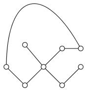
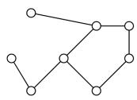
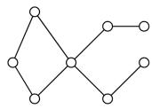
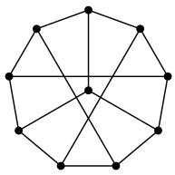
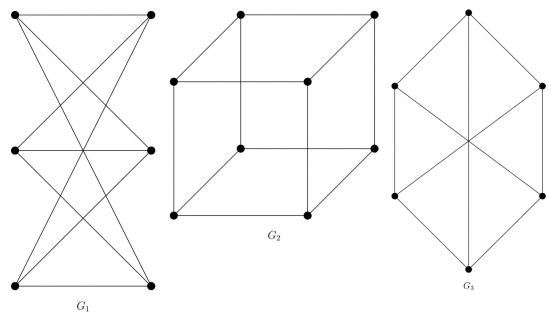
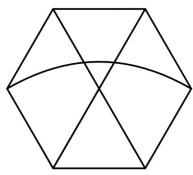
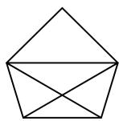
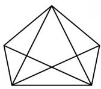
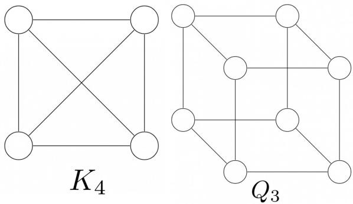

$$
\mathrm{diam} (G) = \max _ {u, v \in V} \{\text {the length of shortest path between} u \text {and} v \}
$$

Let $M$ be the adjacency matrix of $G$ .

Define graph $G_{2}$ on the same set of vertices with adjacency matrix N, where

$$
N _ {i j} = \left\{ \begin{array}{l l} 1 & \text {if} M _ {i j} > 0 \text {or} P _ {i j} > 0, \text {where} P = M ^ {2} \\ 0 & \text {otherwise} \end{array} \right.
$$

Which one of the following statements is true?

A. $\mathrm{diam}(G_2) \leq \lceil \mathrm{diam}(G)/2 \rceil$  
B. $\lceil \mathrm{diam}(G) / 2 \rceil < \mathrm{diam}(G_2) < \mathrm{diam}(G)$  
C. $\mathrm{diam}(G_2) = \mathrm{diam}(G)$  
D. $\mathrm{diam}(G) < \mathrm{diam}(G_2) \leq 2 \mathrm{diam}(G)$

gatecse-2021-set1 graph-theory graph-connectivity two-marks

Answer key

# 2.5.28 Graph Connectivity: GATE CSE 2022 | Question: 20

Consider a simple undirected graph of 10 vertices. If the graph is disconnected, then the maximum number of edges it can have is \_\_\_\_.

gatecse-2022 numerical-answers graph-theory graph-connectivity one-mark

Answer key

# 2.5.29 Graph Connectivity: GATE CSE 2022 | Question: 27

Consider a simple undirected unweighted graph with at least three vertices. If $A$ is the adjacency matrix of the graph, then the number of 3-cycles in the graph is given by the trace of

A. $A^{3}$  
C. $A^3$ divided by 3

B. $A^3$ divided by 2

D. $A^3$ divided by 6

gatecse-2022 graph-theory graph-connectivity two-marks

Answer key

# 2.5.30 Graph Connectivity: GATE CSE 2022 | Question: 42

Which of the properties hold for the adjacency matrix $A$ of a simple undirected unweighted graph having $n$ vertices?

A. The diagonal entries of $A^{2}$ are the degrees of the vertices of the graph.  
B. If the graph is connected, then none of the entries of $A^{n - 1} + I_n$ can be zero.  
C. If the sum of all the elements of $A$ is at most $2(n - 1)$ , then the graph must be acyclic.  
D. If there is at least a 1 in each of $A$ 's rows and columns, then the graph must be connected.

gatecse-2022 graph-theory graph-connectivity multiple-selects two-marks

Answer key

# 2.5.31 Graph Connectivity: GATE CSE 2024 | Set 1 | Question: 24

The number of spanning trees in a complete graph of 4 vertices labelled A, B, C, and D is \_\_\_\_.

gatecse-2024-set1 numerical-answers graph-theory graph-connectivity one-mark

Answer key

# 2.5.32 Graph Connectivity: GATE CSE 2024 | Set 2 | Question: 41

Let G be an undirected connected graph in which every edge has a positive integer weight. Suppose that

every spanning tree in G has even weight. Which of the following statements is/are TRUE for every such graph G?

A. All edges in G have even weight  
B. All edges in G have even weight OR all edges in G have odd weight  
C. In each cycle C in G, all edges in C have even weight  
D. In each cycle C in G, either all edges in C have even weight OR all edges in C have odd weight

gatecse-2024-set2 graph-theory multiple-selects graph-connectivity two-marks

# Answer key

# 2.5.33 Graph Connectivity: GATE CSE 2024 | Set 2 | Question: 7

Let A be the adjacency matrix of a simple undirected graph G. Suppose A is its own inverse. Which one of the following statements is always TRUE?

A. G is a cycle

B. G is a perfect matching

C. G is a complete graph

D. There is no such graph G

gatecse-2024-set2 graph-theory graph-connectivity one-mark

# Answer key

# 2.5.34 Graph Connectivity: GATE IT 2004 | Question: 37

What is the number of vertices in an undirected connected graph with 27 edges, 6 vertices of degree 2, 3 vertices of degree 4 and remaining of degree 3?

A. 10

B. 11

C. 18

D. 19

gateit-2004 graph-theory graph-connectivity normal

# Answer key

# 2.5.35 Graph Connectivity: GATE IT 2004 | Question: 5

What is the maximum number of edges in an acyclic undirected graph with n vertices?

A. n - 1

B. n

C. $n + 1$

D. 2n - 1

gateit-2004 graph-theory graph-connectivity normal

# Answer key

# 2.5.36 Graph Connectivity: GATE IT 2005 | Question: 56

Let G be a directed graph whose vertex set is the set of numbers from 1 to 100. There is an edge from a vertex i to a vertex j iff either $j = i + 1$ or j = 3i. The minimum number of edges in a path in G from vertex 1 to vertex 100 is

A. 4

B. 7

C. 23

D. 99

gateit-2005 graph-theory graph-connectivity normal

# Answer key

# 2.5.37 Graph Connectivity: GATE IT 2006 | Question: 11

If all the edge weights of an undirected graph are positive, then any subset of edges that connects all the vertices and has minimum total weight is a

A. Hamiltonian cycle

B. grid

C. hypercube

D. tree

gateit-2006 graph-theory graph-connectivity easy

# Answer key

# 2.5.38 Graph Connectivity: GATE IT 2007 | Question: 25

What is the largest integer m such that every simple connected graph with n vertices and n edges contains at least m different spanning trees?

A. 1

B. 2

C. 3

D. n

gateit-2007 graph-theory graph-connectivity tricky

# Answer key

# 2.5.39 Graph Connectivity: GATE IT 2008 | Question: 27

G is a simple undirected graph. Some vertices of G are of odd degree. Add a node v to G and make it adjacent to each odd degree vertex of G. The resultant graph is sure to be

A. regular

B. complete

C. Hamiltonian

D. Euler

gateit-2008 graph-theory graph-connectivity normal

# Answer key

# 2.5.40 Graph Connectivity: GATE IT 2008 | Question: 4

What is the size of the smallest MIS (Maximal Independent Set) of a chain of nine nodes?

A. 5

B. 4

C. 3

D. 2

gateit-2008 normal graph-connectivity

# Answer key

# 2.6

# Graph Isomorphism (4)

# 2.6.1 Graph Isomorphism: GATE CSE 2012 | Question: 26

Which of the following graphs is isomorphic to

A.

B.

C.

D.

gatecse-2012 graph-theory graph-isomorphism normal

# Answer key

# 2.6.2 Graph Isomorphism: GATE CSE 2014 | Set 2 | Question: 51

A cycle on $n$ vertices is isomorphic to its complement. The value of $n$ is \_\_\_\_.

gatecse-2014-set2 graph-theory numerical-answers normal graph-isomorphism

# Answer key

# 2.6.3 Graph Isomorphism: GATE CSE 2015 | Set 2 | Question: 28

A graph is self-complementary if it is isomorphic to its complement. For all self-complementary graphs on $n$ vertices, $n$ is

A. A multiple of 4  
C. Odd

B. Even  
D. Congruent to 0 mod 4, or, 1 mod 4.

gatecse-2015-set2 graph-theory graph-isomorphism

# Answer key

# 2.6.4 Graph Isomorphism: GATE CSE 2022 | Question: 40

The following simple undirected graph is referred to as the Peterson graph.

natural_image

Geometric diagram of a pentagon with internal star-like connections (no text or labels)

Which of the following statements is/are TRUE?

A. The chromatic number of the graph is 3.  
B. The graph has a Hamiltonian path.  
C. The following graph is isomorphic to the Peterson graph.

D. The size of the largest independent set of the given graph is 3. (A subset of vertices of a graph form an independent set if no two vertices of the subset are adjacent.)

gatecse-2022 graph-theory graph-isomorphism multiple-selects two-marks

# Answer key

# 2.7 Graph Matching (2)

# 2.7.1 Graph Matching: GATE CSE 2003 | Question: 36

How many perfect matching are there in a complete graph of 6 vertices?

A. 15

B. 24

C. 30

D. 60

gatecse-2003 graph-theory graph-matching normal

# Answer key

# 2.7.2 Graph Matching: GATE CSE 2026 | Set 1 | Question: 47

Let $G$ be an undirected graph, which is a path on 8 vertices. The number of matchings in $G$ is \_\_\_\_. (answer in integer)

gatecse-2026-set1 graph-theory graph-matching numerical-answers two-marks

# Answer key

# 2.8 Graph Planarity (13)

# 2.8.1 Graph Planarity: GATE CSE 1987 | Question: 2e

State whether the following statement is TRUE or FALSE:

There is a linear-time algorithm for testing the planarity of finite graphs.

# 2.8.2 Graph Planarity: GATE CSE 1989 | Question: 3-vi

Which of the following graphs is/are planar?

gate1989 normal graph-theory graph-planarity descriptive

# Answer key

# 2.8.3 Graph Planarity: GATE CSE 1990 | Question: 3-xi

A graph is planar if and only if,

A. It does not contain a subgraph homeomorphic to $k_{5}$ and $k_{3,3}$ .  
B. It does not contain a subgraph isomorphic to $k_{5}$ and $k_{3,3}$ .  
C. It does not contain a subgraph isomorphic to $k_{5}$ or $k_{3,3}$  
D. It does not contain a subgraph homeomorphic to $k_{5}$ or $k_{3,3}$ .

gate1990 normal graph-theory graph-planarity multiple-selects

# Answer key

# 2.8.4 Graph Planarity: GATE CSE 1992 | Question: 01,x

Maximum number of edges in a planar graph with $n$ vertices is \_\_\_\_

gate1992 graph-theory graph-planarity easy fill-in-the-blanks

# Answer key

# 2.8.5 Graph Planarity: GATE CSE 1992 | Question: 02,viii

A non-planar graph with minimum number of vertices has

A. 9 edges, 6 vertices  
C. 10 edges, 5 vertices  
gate1992 graph-theory normal graph-planarity

B. 6 edges, 4 vertices  
D. 9 edges, 5 vertices

# Answer key

# 2.8.6 Graph Planarity: GATE CSE 2005 | Question: 10

Let $G$ be a simple connected planar graph with 13 vertices and 19 edges. Then, the number of faces in the planar embedding of the graph is:

A. 6

B. 8

C. 9

D. 13

gatecse-2005 graph-theory graph-planarity

# Answer key

# 2.8.7 Graph Planarity: GATE CSE 2005 | Question: 47

Which one of the following graphs is NOT planar?

  
G1

  
G2

  
G3

  
G4

A. G1

B. G2

C. G3

D. G4

gatecse-2005 graph-theory graph-planarity normal

# Answer key

# 2.8.8 Graph Planarity: GATE CSE 2008 | Question: 23

Which of the following statements is true for every planar graph on $n$ vertices?

A. The graph is connected  
C. The graph has a vertex-cover of size at most $\frac{3n}{4}$

gatecse-2008 graph-theory normal graph-planarity

B. The graph is Eulerian  
D. The graph has an independent set of size at least $\frac{n}{3}$

# Answer key

# 2.8.9 Graph Planarity: GATE CSE 2011 | Question: 17

K4 and Q3 are graphs with the following structures.

Which one of the following statements is TRUE in relation to these graphs?

A. K4 is a planar while Q3 is not

C. Q3 is planar while K4 is not

gatecse-2011 graph-theory graph-planarity normal

B. Both K4 and Q3 are planar

D. Neither K4 nor Q3 is planar

# Answer key

# 2.8.10 Graph Planarity: GATE CSE 2012 | Question: 17

Let $G$ be a simple undirected planar graph on 10 vertices with 15 edges. If $G$ is a connected graph, then the number of bounded faces in any embedding of $G$ on the plane is equal to

A. 3

B. 4

C. 5

D. 6

gatecse-2012 graph-theory graph-planarity normal

# Answer key

# 2.8.11 Graph Planarity: GATE CSE 2014 | Set 3 | Question: 52

Let $\delta$ denote the minimum degree of a vertex in a graph. For all planar graphs on $n$ vertices with $\delta \geq 3$ , which one of the following is TRUE?

A. In any planar embedding, the number of faces is at least $\frac{n}{2} + 2$

B. In any planar embedding, the number of faces is less than $\frac{n}{2} + 2$  
C. There is a planar embedding in which the number of faces is less than $\frac{n}{2} + 2$  
D. There is a planar embedding in which the number of faces is at most $\frac{n^2}{\delta + 1}$

gatecse-2014-set3 graph-theory graph-planarity normal

# Answer key

# 2.8.12 Graph Planarity: GATE CSE 2015 | Set 1 | Question: 54

Let G be a connected planar graph with 10 vertices. If the number of edges on each face is three, then the number of edges in G is \_\_\_\_.

gatecse-2015-set1 graph-theory graph-connectivity normal graph-planarity numerical-answers

# Answer key

# 2.8.13 Graph Planarity: GATE CSE 2021 | Set 1 | Question: 16

In an undirected connected planar graph $G$ , there are eight vertices and five faces. The number of edges in $G$ is \_\_\_\_.

gatecse-2021-set1 graph-theory graph-planarity numerical-answers easy one-mark

# Answer key

# 2.9

# Jaccard Coefficient (1)

# 2.9.1 Jaccard Coefficient: GATE CSE 2026 | Set 2 | Question: 26

Consider a complete graph $K_{n}$ with n vertices (n > 4). Note that multiple spanning trees can be constructed over $K_{n}$ . Each of these spanning trees is represented as a set of edges. The Jaccard coefficient between any two sets is defined as the ratio of the size of the intersection of the two sets to the union of the two sets.

Which one of the following options gives the lowest possible value for the Jaccard coefficient between any two spanning trees of $K_{n}$ ?

A. $\frac{1}{n}$

B. $\frac{1}{2n-3}$

C. 0

D. $\frac{1}{n-1}$

gatecse-2026-set2 graph-theory jaccard-coefficient two-marks

# Answer key

# Answer Keys

<table><tr><td>2.1.1</td><td>D</td></tr><tr><td>2.2.3</td><td>N/A</td></tr><tr><td>2.2.8</td><td>C</td></tr><tr><td>2.2.13</td><td>A</td></tr><tr><td>2.4.4</td><td>4</td></tr><tr><td>2.4.9</td><td>2</td></tr><tr><td>2.5.3</td><td>N/A</td></tr><tr><td>2.5.8</td><td>N/A</td></tr><tr><td>2.5.13</td><td>B</td></tr><tr><td>2.5.18</td><td>C</td></tr><tr><td>2.5.23</td><td>C</td></tr><tr><td>2.5.28</td><td>36</td></tr><tr><td>2.5.33</td><td>B</td></tr></table>

<table><tr><td>2.1.2</td><td>D</td></tr><tr><td>2.2.4</td><td>D</td></tr><tr><td>2.2.9</td><td>D</td></tr><tr><td>2.3.1</td><td>B;C</td></tr><tr><td>2.4.5</td><td>3</td></tr><tr><td>2.4.10</td><td>C</td></tr><tr><td>2.5.4</td><td>N/A</td></tr><tr><td>2.5.9</td><td>N/A</td></tr><tr><td>2.5.14</td><td>C</td></tr><tr><td>2.5.19</td><td>D</td></tr><tr><td>2.5.24</td><td>B</td></tr><tr><td>2.5.29</td><td>D</td></tr><tr><td>2.5.34</td><td>D</td></tr></table>

<table><tr><td>2.1.3</td><td>X</td></tr><tr><td>2.2.5</td><td>C</td></tr><tr><td>2.2.10</td><td>C</td></tr><tr><td>2.4.1</td><td>D</td></tr><tr><td>2.4.6</td><td>7</td></tr><tr><td>2.4.11</td><td>B</td></tr><tr><td>2.5.5</td><td>N/A</td></tr><tr><td>2.5.10</td><td>B</td></tr><tr><td>2.5.15</td><td>B</td></tr><tr><td>2.5.20</td><td>A</td></tr><tr><td>2.5.25</td><td>C;D</td></tr><tr><td>2.5.30</td><td>A</td></tr><tr><td>2.5.35</td><td>A</td></tr></table>

<table><tr><td>2.2.1</td><td>N/A</td></tr><tr><td>2.2.6</td><td>C</td></tr><tr><td>2.2.11</td><td>C</td></tr><tr><td>2.4.2</td><td>C</td></tr><tr><td>2.4.7</td><td>A;B</td></tr><tr><td>2.5.1</td><td>N/A</td></tr><tr><td>2.5.6</td><td>C;D</td></tr><tr><td>2.5.11</td><td>D</td></tr><tr><td>2.5.16</td><td>A</td></tr><tr><td>2.5.21</td><td>506</td></tr><tr><td>2.5.26</td><td>C</td></tr><tr><td>2.5.31</td><td>16</td></tr><tr><td>2.5.36</td><td>B</td></tr></table>

<table><tr><td>2.2.2</td><td>N/A</td></tr><tr><td>2.2.7</td><td>B</td></tr><tr><td>2.2.12</td><td>16</td></tr><tr><td>2.4.3</td><td>A</td></tr><tr><td>2.4.8</td><td>B;C</td></tr><tr><td>2.5.2</td><td>N/A</td></tr><tr><td>2.5.7</td><td>C</td></tr><tr><td>2.5.12</td><td>N/A</td></tr><tr><td>2.5.17</td><td>B</td></tr><tr><td>2.5.22</td><td>36</td></tr><tr><td>2.5.27</td><td>A</td></tr><tr><td>2.5.32</td><td>D</td></tr><tr><td>2.5.37</td><td>D</td></tr><tr><td>2.5.38</td><td>C</td></tr><tr><td>2.6.3</td><td>D</td></tr><tr><td>2.8.2</td><td>N/A</td></tr><tr><td>2.8.7</td><td>A</td></tr><tr><td>2.8.12</td><td>24</td></tr></table>

<table><tr><td>2.5.39</td><td>D</td></tr><tr><td>2.6.4</td><td>A;B;C</td></tr><tr><td>2.8.3</td><td>D</td></tr><tr><td>2.8.8</td><td>C</td></tr><tr><td>2.8.13</td><td>11 : 11</td></tr></table>

<table><tr><td>2.5.40</td><td>C</td></tr><tr><td>2.7.1</td><td>A</td></tr><tr><td>2.8.4</td><td>N/A</td></tr><tr><td>2.8.9</td><td>B</td></tr><tr><td>2.9.1</td><td>C</td></tr></table>

<table><tr><td>2.6.1</td><td>B</td></tr><tr><td>2.7.2</td><td>34 : 34</td></tr><tr><td>2.8.5</td><td>C</td></tr><tr><td>2.8.10</td><td>D</td></tr></table>

<table><tr><td>2.6.2</td><td>5</td></tr><tr><td>2.8.1</td><td>TBA</td></tr><tr><td>2.8.6</td><td>B</td></tr><tr><td>2.8.11</td><td>A</td></tr></table>

Syllabus: Propositional and first order logic.

Mark Distribution in Previous GATE

<table><tr><td>Year</td><td>2026 - 1</td><td>2026 - 2</td><td>2025 - 1</td><td>2025 - 2</td><td>2024 - 1</td><td>2024 - 2</td><td>2023</td><td>2022</td><td>2021 - 1</td><td>2021 - 2</td><td>Minimum</td></tr><tr><td>1 Mark Count</td><td>0</td><td>1</td><td>0</td><td>1</td><td>0</td><td>1</td><td>1</td><td>0</td><td>1</td><td>1</td><td>0</td></tr><tr><td>2 Marks Count</td><td>0</td><td>0</td><td>1</td><td>0</td><td>0</td><td>0</td><td>0</td><td>0</td><td>0</td><td>0</td><td>0</td></tr><tr><td>Total Marks</td><td>0</td><td>1</td><td>2</td><td>1</td><td>0</td><td>1</td><td>1</td><td>0</td><td>1</td><td>1</td><td>0</td></tr></table>

Welcome to the "Discrete Mathematics: Mathematical Logic" chapter of your GATE Computer Science exam preparation. This section is designed to provide a comprehensive, exam-focused overview of the fundamental concepts, formulas, and problem-solving techniques you'll need to master. Mathematical Logic is the bedrock of computer science, providing the formal tools to reason about computation, verify program correctness, design circuits, and understand artificial intelligence. For the GATE CS exam, this subject typically carries a weightage of 5-8 marks. Questions often involve determining the validity of arguments, checking logical equivalence, translating natural language statements into logical expressions, and identifying tautologies or contradictions. A strong grasp of these concepts is indispensable not just for direct questions but also for understanding the logical underpinnings of other topics like set theory, relations, and algorithms.

# Topic-wise Key Concepts

# Propositional Logic

Propositional Logic, also known as propositional calculus, is the study of propositions (declarative sentences that are either true or false, but not both) and their combinations using logical connectives. It forms the most basic level of logical reasoning, focusing on the truth values of simple statements and how they combine to determine the truth values of complex statements.

- Definition and Core Idea: A proposition is a statement that is unequivocally true or false. Propositional logic uses symbols to represent propositions and logical connectives to form compound propositions, allowing us to analyze their truth values systematically.  
- Important Formulas, Theorems, and Results:

1. Logical Connectives:

- Negation (NOT): $\neg p$ (read as "not p")  
- Conjunction (AND): $p \land q$ (read as "p and q")  
- Disjunction (OR): $p \lor q$ (read as "p or q")  
- Implication (IF...THEN): $p \rightarrow q$ (read as "if p then q" or "p implies q")  
- Biconditional (IF AND ONLY IF): $p \leftrightarrow q$ (read as "p if and only if q")  
- Exclusive OR (XOR): $p \oplus q$ (read as "p xor q")  
- NAND: $p \uparrow q \equiv \neg(p \land q)$  
- NOR: $p \downarrow q \equiv \neg (p \lor q)$

2. Truth Tables: Essential for defining connectives and evaluating compound propositions.

- $\neg p$ : T if p is F, F if p is T.  
- $p \land q$ : T if both p and q are T, else F.  
- $p \lor q$ : T if p is T or q is T (or both), else F.  
- $p \rightarrow q$ : F only if p is T and q is F, else T.  
- $p \leftrightarrow q$ : T if p and q have the same truth value, else F.  
- $p \oplus q$ : T if p and q have different truth values, else F.

3. Tautology, Contradiction, Contingency:

- Tautology: A compound proposition that is always true, regardless of the truth values of its atomic propositions. Example: $p \vee \neg p$ .  
- Contradiction (or Absurdity): A compound proposition that is always false. Example: $p \land \neg p$ .  
- Contingency: A compound proposition that is neither a tautology nor a contradiction (i.e., its truth value depends on the truth values of its atomic propositions).

4. Logical Equivalence (≡): Two propositions $P$ and $Q$ are logically equivalent if $P \leftrightarrow Q$ is a tautology. This means they always have the same truth value.

5. Laws of Logic (Logical Equivalences):

\- Identity Laws:

- $p \land T \equiv p$  
- $p \vee F \equiv p$

\- Domination Laws:

- $p \vee T \equiv T$  
- $p \land F \equiv F$

\- Idempotent Laws:

- $p \vee p \equiv p$  
- $p \land p \equiv p$

\- Double Negation Law: $\neg (\neg p)\equiv p$

■ Commutative Laws:

- $p \vee q \equiv q \vee p$  
- $p \land q \equiv q \land p$

■ Associative Laws:

- $(p \vee q) \vee r \equiv p \vee (q \vee r)$  
- $(p \land q) \land r \equiv p \land (q \land r)$

\- Distributive Laws:

- $p \land (q \lor r) \equiv (p \land q) \lor (p \land r)$  
- $p \vee (q \wedge r) \equiv (p \vee q) \wedge (p \vee r)$

\- De Morgan's Laws:

- $\neg(p \land q) \equiv \neg p \lor \neg q$  
- $\neg(p \lor q) \equiv \neg p \land \neg q$

\- Absorption Laws:

- $p \vee (p \wedge q) \equiv p$  
- $p \land (p \lor q) \equiv p$

\- Inverse Laws (Complement Laws):

- $p \lor \neg p \equiv T$  
- $p \land \neg p \equiv F$

\- Implication Equivalences:

- $p \to q \equiv \neg p \lor q$  
- $p \rightarrow q \equiv \neg q \rightarrow \neg p$ (Contrapositive)  
- $\neg(p \to q) \equiv p \land \neg q$

\- Biconditional Equivalences:

- $p \leftrightarrow q \equiv (p \rightarrow q) \land (q \rightarrow p)$  
- $p \leftrightarrow q \equiv (\neg p \lor q) \land (\neg q \lor p)$  
- $p \leftrightarrow q \equiv \neg p \leftrightarrow \neg q$  
- $p \leftrightarrow q \equiv (p \land q) \lor (\neg p \land \neg q)$

6. Conjunctive Normal Form (CNF) and Disjunctive Normal Form (DNF):

- Literal: A propositional variable or its negation (e.g., $p, \neg q$ ).  
- Clause: A disjunction of literals (e.g., $p \lor \neg q \lor r$ ).  
- CNF: A conjunction of clauses (e.g., $(p \lor \neg q) \land (r \lor s)$ ).  
- Minterm: A conjunction of literals where each variable appears exactly once (e.g., $p \land \neg q \land r$ ).  
- Maxterm: A disjunction of literals where each variable appears exactly once (e.g., $p \vee \neg q \vee r$ ).  
- DNF: A disjunction of minterms (e.g., $(p \land \neg q) \lor (r \land s)$ ).  
- Any propositional formula can be converted into an equivalent CNF or DNF.

- Key Properties and Identities: All the laws of logic listed above are crucial identities for simplification and proving equivalence. Understanding the truth conditions for each connective is fundamental.  
• Common Pitfalls or Tricky Points:

- Confusing implication $(p \to q)$ with causation or "if and only if". Remember $p \to q$ is false only when $p$ is true and $q$ is false.  
- Incorrectly applying De Morgan's Laws, especially with more complex expressions.  
- Misinterpreting the biconditional; it implies mutual implication.  
- Errors in constructing truth tables, particularly for propositions with many variables.  
- Assuming logical equivalence based on partial truth values.

\- Standard Problem-Solving Techniques or Shortcuts:

- Truth Tables: The most direct method for small propositions to check tautology, contradiction, or equivalence.  
- Logical Equivalences: Use the laws of logic to simplify expressions or prove equivalence without truth tables. This is often faster for complex expressions.  
- Substitution: Replace sub-expressions with their known equivalents.  
Proof by Contradiction: To show $P$ is a tautology, assume $\neg P$ is true and derive a contradiction. To show $P \equiv Q$ , assume $\neg (P \leftrightarrow Q)$ is true and derive a contradiction.  
- Conversion to CNF/DNF: Useful for standardization and for certain proof methods like resolution.

# First Order Logic (Predicate Logic)

First Order Logic (FOL), also known as Predicate Logic, extends propositional logic by allowing us to express more complex statements about objects, their properties, and relationships. It introduces predicates, variables, and quantifiers, enabling reasoning about "all" or "some" elements within a domain.

\- Definition and Core Idea: FOL allows us to break down propositions into predicates (properties or relations) and arguments (variables or constants). It introduces quantifiers ( $\forall$ for "for all" and $\exists$ for "there exists") to make statements about collections of objects, providing a richer expressive power than propositional logic.

\- Important Formulas, Theorems, and Results:

1. Components of FOL:

- Predicates: Represent properties or relations (e.g., $P(x)$ for "x is prime", $L(x,y)$ for "x loves y").  
- Variables: Placeholders for objects (e.g., $x, y, z$ ).  
- Constants: Specific objects (e.g., "Socrates", "5").  
- Functions: Map objects to other objects (e.g., $f(x)$ for "father of $x$ ").  
- Quantifiers:

- Universal Quantifier ( $\forall$ ): "For all", "for every", "for each". $\forall xP(x)$ means $P(x)$ is true for every $x$ in the domain.  
- Existential Quantifier (∃): "There exists", "for some", "for at least one". ∃xP(x) means there is at least one x in the domain for which P(x) is true.

2. Scope of Quantifiers, Free and Bound Variables:

- The scope of a quantifier is the part of the formula to which it applies.  
- A variable is bound if it is within the scope of a quantifier using that variable.  
- A variable is free if it is not bound by any quantifier.  
- A formula with no free variables is called a sentence or closed formula and has a definite truth value.

3. Quantifier Equivalences (Negation Rules):

- $\neg \forall xP(x) \equiv \exists x \neg P(x)$ (It is not true that all $x$ have property $P$ if and only if there exists an $x$ that does not have property $P$ ).  
- $\neg \exists xP(x) \equiv \forall x \neg P(x)$ (It is not true that there exists an $x$ with property $P$ if and only if all $x$ do not have property $P$ ).

4. Distributive Properties of Quantifiers:

- $\forall x(P(x) \land Q(x)) \equiv \forall xP(x) \land \forall xQ(x)$  
- $\exists x(P(x) \vee Q(x)) \equiv \exists xP(x) \vee \exists xQ(x)$  
- Important Non-Equivalences:

- $\forall x(P(x) \lor Q(x))$ is NOT equivalent to $\forall xP(x) \lor \forall xQ(x)$ . (e.g., "Every number is even or odd" is true, but "Every number is even or every number is odd" is false).  
- $\exists x(P(x) \land Q(x))$ is NOT equivalent to $\exists xP(x) \land \exists xQ(x)$ . (e.g., "There is a number that is both even and prime" (2) is true, but "There is an even number and there is a prime number" is also true, but the existence of one doesn't imply the other is the same number).

5. Interchange of Quantifiers:

- $\forall x \forall y P(x, y) \equiv \forall y \forall x P(x, y)$  
- $\exists x \exists y P(x, y) \equiv \exists y \exists x P(x, y)$

\- Order Matters for Mixed Quantifiers:

- $\forall x \exists y P(x, y)$ (For every $x$ , there exists a $y$ such that $P(x, y)$ ) is NOT equivalent to $\exists y \forall x P(x, y)$ (There exists a $y$ such that for every $x$ , $P(x, y)$ ).  
- Example: Let $P(x, y)$ be "x loves y". $\forall x \exists y L(x, y)$ means "Everyone loves someone". $\exists y \forall x L(x, y)$ means "There is someone whom everyone loves". These are clearly different.

6. Prenex Normal Form (PNF): A formula is in PNF if all quantifiers are at the beginning of the formula, followed by a quantifier-free formula (called the matrix). Any FOL formula can be converted to an equivalent PNF.

- Key Properties and Identities: The quantifier negation rules are fundamental for manipulating and simplifying FOL expressions. Understanding the implications of quantifier order is critical.  
• Common Pitfalls or Tricky Points:

\- Incorrect Translation: Translating natural language statements into FOL is a major source of errors. Pay close attention to words like "all", "some", "no", "only if", "unless".

- "All A are B": $\forall x(A(x) \to B(x))$ (NOT $\forall x(A(x) \land B(x)))$  
- "Some A are B": $\exists x(A(x) \land B(x))$ (NOT $\exists x(A(x) \to B(x)))$  
- "No A are B": $\forall x(A(x) \to \neg B(x))$ or $\neg \exists x(A(x) \land B(x))$

- Scope Errors: Misplacing parentheses or incorrectly determining the scope of a quantifier.  
- Variable Binding: Confusing free and bound variables, or using the same variable name for different purposes in nested scopes.

\- Order of Mixed Quantifiers: Assuming $\forall x \exists y P(x, y)$ is the same as $\exists y \forall x P(x, y)$ .

\- Standard Problem-Solving Techniques or Shortcuts:

- Step-by-step Translation: Break down complex natural language sentences into smaller parts, translate each, and then combine them. Identify predicates, variables, and connectives first.  
- Applying Quantifier Equivalences: Use negation rules to simplify expressions or move negations inwards.  
- Domain Awareness: Always consider the domain of discourse when evaluating truth values or translating.  
- Counterexamples: To show a statement is false or not equivalent, try to find a specific example in a small domain that makes it false.

# Logical Reasoning (Inference)

Logical Reasoning, or Inference, is the process of deriving conclusions from a set of premises using valid rules. It focuses on the structure of arguments to determine whether a conclusion necessarily follows from the premises, regardless of the actual truth of the premises.

- Definition and Core Idea: An argument is a sequence of propositions, where the first propositions are premises and the final proposition is the conclusion. An argument is valid if, whenever all its premises are true, the conclusion must also be true. The goal is to determine if an argument's structure guarantees the truth of its conclusion given true premises.  
- Important Formulas, Theorems, and Results:

1. Argument Validity: An argument with premises $P_{1}, P_{2}, \ldots, P_{n}$ and conclusion $C$ is valid if the proposition $(P_{1} \land P_{2} \land \ldots \land P_{n}) \to C$ is a tautology.

2. Rules of Inference (for Propositional Logic): These are fundamental valid argument forms.

\- Modus Ponens (Law of Detachment):

$$
\begin{array}{l} p \rightarrow q \\ \frac {p}{\therefore q} \\ \end{array}
$$

Equivalent to $((p\to q)\land p)\to q$ being a tautology.

\- Modus Tollens:

$$
\begin{array}{l} p \rightarrow q \\ \frac {\neg q}{\therefore \neg p} \\ \end{array}
$$

Equivalent to $((p \to q) \land \neg q) \to \neg p$ being a tautology.

\- Hypothetical Syllogism:

$$
\begin{array}{l} p \rightarrow q \\ \frac {q \rightarrow r}{\therefore p \rightarrow r} \\ \end{array}
$$

Equivalent to $((p \rightarrow q) \land (q \rightarrow r)) \rightarrow (p \rightarrow r)$ being a tautology.

\- Disjunctive Syllogism:

$$
\begin{array}{l} \boldsymbol {p} \lor \boldsymbol {q} \\ \frac {\neg p}{\therefore q} \\ \end{array}
$$

Equivalent to $((p \lor q) \land \neg p) \to q$ being a tautology.

\- Addition:

$$
\frac {p}{\therefore p \lor q}
$$

\- Simplification: