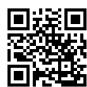
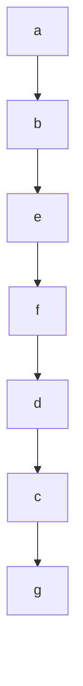
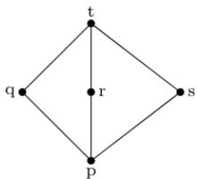
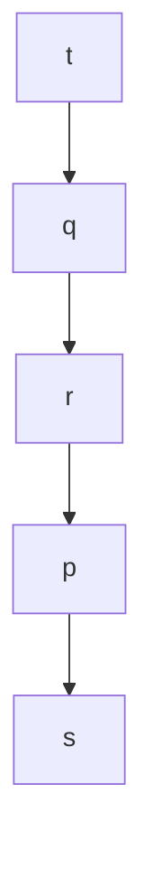

# 4.3.13 Functions: GATE CSE 2005 | Question: 43

Let $f: B \to C$ and $g: A \to B$ be two functions and let $h = fog$ . Given that $h$ is an onto function which one of the following is TRUE?

A. $f$ and $g$ should both be onto functions

B. $f$ should be onto but $g$ need not to be onto

C. $g$ should be onto but $f$ need not be onto

D. both $f$ and $g$ need not be onto

gatecse-2005 set-theory&algebra functions normal

# Answer key

# 4.3.14 Functions: GATE CSE 2006 | Question: 2

Let $X, Y, Z$ be sets of sizes $x, y$ and $z$ respectively. Let $W = X \times Y$ and $E$ be the set of all subsets of $W$ . The number of functions from $Z$ to $E$ is

A. $z^{2^{xy}}$

B. $z \times 2^{xy}$

C. $z^{2^{x+y}}$

D. $2^{xyz}$

gatecse-2006 set-theory&algebra normal functions

# Answer key

# 4.3.15 Functions: GATE CSE 2006 | Question: 25

Let $S = \{1, 2, 3, \ldots, m\}, m > 3$ . Let $X_1, \ldots, X_n$ be subsets of $S$ each of size 3. Define a function $f$ from $S$ to the set of natural numbers as, $f(i)$ is the number of sets $X_j$ that contain the element $i$ . That is $f(i) = |\{j \mid i \in X_j\}|$ then $\sum_{i=1}^{m} f(i)$ is:

A. 3m

B. $3n$

C. $2m + 1$

D. $2n + 1$

gatecse-2006 set-theory&algebra normal functions

# Answer key

# 4.3.16 Functions: GATE CSE 2007 | Question: 3

What is the maximum number of different Boolean functions involving n Boolean variables?

A. $n^2$

B. $2^{n}$

C. $2^{2^n}$

D. $2^{n^2}$

gatecse-2007 combinatory functions normal

# Answer key

# 4.3.17 Functions: GATE CSE 2012 | Question: 37

How many onto (or surjective) functions are there from an $n$ -element $(n \geq 2)$ set to a 2-element set?

A. $2^{n}$

B. $2^{n} - 1$

C. $2^{n} - 2$

D. $2(2^{n} - 2)$

gatecse-2012 set-theory&algebra functions normal

# Answer key

# 4.3.18 Functions: GATE CSE 2014 | Set 1 | Question: 50

Let $S$ denote the set of all functions $f: \{0,1\}^4 \to \{0,1\}$ . Denote by $N$ the number of functions from $S$ to the set $\{0,1\}$ . The value of $\log_2 \log_2 N$ is \_\_\_\_.

gatecse-2014-set1 set-theory&algebra functions combinatory numerical-answers

# Answer key

# 4.3.19 Functions: GATE CSE 2014 | Set 3 | Question: 2

Let $X$ and $Y$ be finite sets and $f: X \to Y$ be a function. Which one of the following statements is TRUE?

A. For any subsets $A$ and $B$ of $X$ , $|f(A \cup B)| = |f(A)| + |f(B)|$  
B. For any subsets $A$ and $B$ of $X$ , $f(A \cap B) = f(A) \cap f(B)$  
C. For any subsets $A$ and $B$ of $X$ , $|f(A \cap B)| = \min\{|f(A)|, |f(B)|\}$  
D. For any subsets $S$ and $T$ of $Y$ , $f^{-1}(S \cap T) = f^{-1}(S) \cap f^{-1}(T)$

gatecse-2014-set3 set-theory&algebra functions normal

# Answer key

# 4.3.20 Functions: GATE CSE 2014 | Set 3 | Question: 49

Consider the set of all functions $f: \{0, 1, \ldots, 2014\} \to \{0, 1, \ldots, 2014\}$ such that $f(f(i)) = i$ , for all $0 \leq i \leq 2014$ . Consider the following statements:

P. For each such function it must be the case that for every i, $f(i) = i$ .

$Q$ . For each such function it must be the case that for some $i, f(i) = i$ .

R. Each function must be onto.

Which one of the following is CORRECT?

A. $P, Q$ and $R$ are true

C. Only $P$ and $Q$ are true

gatecse-2014-set3 set-theory&algebra functions normal

B. Only $Q$ and $R$ are true

D. Only $R$ is true

# Answer key

# 4.3.21 Functions: GATE CSE 2015 | Set 1 | Question: 5

If $g(x) = 1 - x$ and $h(x) = \frac{x}{x - 1}$ , then $\frac{g(h(x))}{h(g(x))}$ is:

A. $\frac{h(x)}{g(x)}$

B. $\frac{-1}{x}$

C. $\frac{g(x)}{h(x)}$

D. $\frac{x}{(1-x)^{2}}$

gatecse-2015-set1 set-theory&algebra functions normal

# Answer key

# 4.3.22 Functions: GATE CSE 2015 | Set 2 | Question: 40

The number of onto functions (surjective functions) from set $X = \{1, 2, 3, 4\}$ to set $Y = \{a, b, c\}$ is \_\_\_\_.

gatecse-2015-set2 set-theory&algebra functions normal numerical-answers

# Answer key

# 4.3.23 Functions: GATE CSE 2015 | Set 2 | Question: 54

Let $X$ and $Y$ denote the sets containing 2 and 20 distinct objects respectively and $F$ denote the set of all possible functions defined from $X$ to $Y$ . Let $f$ be randomly chosen from $F$ . The probability of $f$ being one-to-one is \_\_\_\_.

gatecse-2015-set2 set-theory&algebra functions normal numerical-answers

# Answer key

# 4.3.24 Functions: GATE CSE 2016 | Set 1 | Question: 28

A function $f : N^{+} \to N^{+}$ , defined on the set of positive integers $N^{+}$ , satisfies the following properties:

$$
f (n) = f (n / 2) \text {if} n \text {is even}
$$

$$
f (n) = f (n + 5) \text {   if   } n \text {   is   odd }
$$

Let $R = \{i \mid \exists j : f(j) = i\}$ be the set of distinct values that $f$ takes. The maximum possible size of $R$ is

gatecse-2016-set1 set-theory&algebra functions normal numerical-answers

Answer key

# 4.3.25 Functions: GATE CSE 2021 | Set 2 | Question: 11

Consider the following sets, where $n \geq 2$ :

- $S_{1}$ : Set of all $n \times n$ matrices with entries from the set $\{a, b, c\}$  
- $S_{2}$ : Set of all functions from the set $\{0,1,2,\dots,n^{2}-1\}$ to the set $\{0,1,2\}$

Which of the following choice(s) is/are correct?

A. There does not exist a bijection from $S_{1}$ to $S_{2}$  
B. There exists a surjection from $S_{1}$ to $S_{2}$  
C. There exists a bijection from $S_{1}$ to $S_{2}$  
D. There does not exist an injection from $S_{1}$ to $S_{2}$

gatecse-2021-set2 multiple-selects set-theory&algebra functions one-mark

Answer key

# 4.3.26 Functions: GATE CSE 2023 | Question: 39

Let $f: A \to B$ be an onto (or surjective) function, where $A$ and $B$ are nonempty sets. Define an equivalence relation $\sim$ on the set $A$ as

$$
a _ {1} \sim a _ {2} \text {   if   } f (a _ {1}) = f (a _ {2}),
$$

where $a_1, a_2 \in A$ . Let $\mathcal{E} = \{[x] : x \in A\}$ be the set of all the equivalence classes under $\sim$ . Define a new mapping $F : \mathcal{E} \to B$ as

$$
F ([ x ]) = f (x), \quad \text { for   all   the   equivalence   classes   } [ x ] \text {   in   } \mathcal {E}.
$$

Which of the following statements is/are TRUE?

A. $F$ is NOT well-defined.

B. $F$ is an onto (or surjective) function.

C. $F$ is a one-to-one (or injective) function.

D. $F$ is a bijective function.

gatecse-2023 set-theory&algebra functions multiple-selects two-marks

Answer key

# 4.3.27 Functions: GATE CSE 2024 | Set 1 | Question: 22

Let $A$ and $B$ be non-empty finite sets such that there exist one-to-one and onto functions (i) from $A$ to $B$ and (ii) from $A \times A$ to $A \cup B$ . The number of possible values of $|A|$ is \_\_\_\_.

gatecse-2024-set1 numerical-answers set-theory&algebra functions one-mark

Answer key

# 4.3.28 Functions: GATE DA 2026 | Question: 23

The number of bijections $f(\cdot)$ from the set $S = \{1, 2, 3, 4\}$ to itself such that $f(f(n)) = n$ , for all $n \in S$ , is \_\_\_\_. (Answer in integer)

gateda-2026 set-theory&algebra functions numerical-answers one-mark

Answer key

# 4.3.29 Functions: GATE IT 2005 | Question: 31

Let $f$ be a function from a set $A$ to a set $B$ , $g$ a function from $B$ to $C$ , and $h$ a function from $A$ to $C$ , such that $h(a) = g(f(a))$ for all $a \in A$ . Which of the following statements is always true for all such functions $f$ and $g$ ?

A. $g$ is onto $\Longrightarrow h$ is onto  
C. h is onto $\Longrightarrow$ g is onto  
gateit-2005 set-theory&algebra functions normal

B. $h$ is onto $\Longrightarrow f$ is onto

D. $h$ is onto $\Longrightarrow f$ and $g$ are onto

# Answer key

# 4.3.30 Functions: GATE IT 2006 | Question: 6

Given a boolean function $f(x_{1}, x_{2}, \ldots, x_{n})$ , which of the following equations is NOT true?

A. $f(x_{1},x_{2},\dots ,x_{n}) = x_{1}^{\prime}f(x_{1},x_{2},\dots ,x_{n}) + x_{1}f(x_{1},x_{2},\dots ,x_{n})$  
B. $f(x_{1},x_{2},\dots ,x_{n}) = x_{2}f(x_{1},x_{2},\dots ,x_{n}) + x_{2}^{\prime}f(x_{1},x_{2},\dots ,x_{n})$  
C. $f(x_{1},x_{2},\dots ,x_{n}) = x_{n}^{\prime}f(x_{1},x_{2},\dots ,0) + x_{n}\bar{f}(x_{1},x_{2},\dots ,1)$  
D. $f(x_{1},x_{2},\ldots ,x_{n}) = f(0,x_{2},\ldots ,x_{n}) + f(1,x_{2},\ldots ,x_{n})$

gateit-2006 set-theory&algebra functions normal

# Answer key

# 4.4

# Group Theory (33)

# 4.4.1 Group Theory: GATE CSE 1988 | Question: 2xviii

Show that if $G$ is a group such that $(a * b)^2 = a^2 * b^2$ for all $a, b$ belonging to $G$ , then $G$ is an abelian.

gate1988 descriptive group-theory

# Answer key

# 4.4.2 Group Theory: GATE CSE 1990 | Question: 2-x

Match the pairs in the following questions:

<table><tr><td>(a)</td><td>Groups</td><td>(p)</td><td>Associativity</td></tr><tr><td>(b)</td><td>Semigroups</td><td>(q)</td><td>Identity</td></tr><tr><td>(c)</td><td>Monoids</td><td>(r)</td><td>Commutativity</td></tr><tr><td>(d)</td><td>Abelian groups</td><td>(s)</td><td>Left inverse</td></tr></table>

gate1990 match-the-following set-theory&algebra group-theory easy

# Answer key

# 4.4.3 Group Theory: GATE CSE 1992 | Question: 14a

If $G$ is a group of even order, then show that there exists an element $a \neq e$ , the identity in $G$ , such that $a^2 = e$ .

gate1992 set-theory&algebra group-theory normal descriptive proof

# Answer key

# 4.4.4 Group Theory: GATE CSE 1993 | Question: 28

Let $(\{p,q\},*)$ be a semigroup where $p*p=q$ . Show that:

a. $p * q = q * p$ and  
b. $q * q = q$

# Answer key

# 4.4.5 Group Theory: GATE CSE 1994 | Question: 1.10

Some group $(G, o)$ is known to be abelian. Then, which one of the following is true for $G$ ?

A. $g = g^{-1}$ for every $g\in G$

B. $g = g^{2}$ for every $g\in G$

C. $(goh)^2 = g^2oh^2$ for every $g, h \in G$

D. $G$ is of finite order

gate1994 set-theory&algebra group-theory normal

# Answer key

# 4.4.6 Group Theory: GATE CSE 1995 | Question: 2.17

Let $A$ be the set of all non-singular matrices over real number and let $*$ be the matrix multiplication operation. Then

A. A is closed under \* but $\langle A, *\rangle$ is not a semigroup.  
B. $\langle A, * \rangle$ is a semigroup but not a monoid.  
C. $\langle A, * \rangle$ is a monoid but not a group.  
D. $\langle A, *\rangle$ is a group but not an abelian group.

gate1995 set-theory&algebra group-theory

# Answer key

# 4.4.7 Group Theory: GATE CSE 1995 | Question: 21

Let $G_{1}$ and $G_{2}$ be subgroups of a group G.

A. Show that $G_{1} \cap G_{2}$ is also a subgroup of $G$ .  
B. Is $G_{1} \cup G_{2}$ always a subgroup of $G$ ?

gate1995 set-theory&algebra group-theory normal descriptive proof

# Answer key

# 4.4.8 Group Theory: GATE CSE 1996 | Question: 1.4

Which of the following statements is FALSE?

A. The set of rational numbers is an abelian group under addition  
B. The set of integers in an abelian group under addition  
C. The set of rational numbers form an abelian group under multiplication  
D. The set of real numbers excluding zero is an abelian group under multiplication

gate1996 set-theory&algebra group-theory normal

# Answer key

# 4.4.9 Group Theory: GATE CSE 1996 | Question: 2.4

Which one of the following is false?

A. The set of all bijective functions on a finite set forms a group under function composition  
B. The set $\{1,2,\dots p - 1\}$ forms a group under multiplication mod $p$ , where $p$ is a prime number  
C. The set of all strings over a finite alphabet forms a group under concatenation  
D. A subset $S \neq \emptyset$ of $G$ is a subgroup of the group $\langle G, * \rangle$ if and only if for any pair of elements $a, b \in S, a * b^{-1} \in S$

# 4.4.10 Group Theory: GATE CSE 1997 | Question: 3.1

Let $(Z,*)$ be an algebraic structure where Z is the set of integers and the operation \* is defined by $n * m = \max(n, m)$ . Which of the following statements is true for $(Z,*)$ ?

A. $(Z,*)$ is a monoid

B. $(Z,*)$ is an Abelian group

C. $(Z,*)$ is a group

D. None of the above

gate1997 set-theory&algebra group-theory normal

# Answer key

# 4.4.11 Group Theory: GATE CSE 1998 | Question: 12

Let $(A, *)$ be a semigroup, Furthermore, for every a and b in A, if $a \neq b$ , then $a * b \neq b * a$ .

a. Show that for every $a$ in $A$ , $a * a = a$  
b. Show that for every $a, b$ in $A$ , $a * b * a = a$  
c. Show that for every $a, b, c$ in $A$ , $a * b * c = a * c$

gate1998 set-theory&algebra group-theory descriptive

# Answer key

# 4.4.12 Group Theory: GATE CSE 1999 | Question: 4

Let $G$ be a finite group and $H$ be a subgroup of $G$ . For $a \in G$ , define $aH = \{ah \mid h \in H\}$ .

a. Show that $|aH| = |bH|$ .  
b. Show that for every pair of elements $a, b \in G$ , either $aH = bH$ or $aH$ and $bH$ are disjoint.  
c. Use the above to argue that the order of H must divide the order of G.

gate1999 set-theory&algebra group-theory descriptive proof

# Answer key

# 4.4.13 Group Theory: GATE CSE 2000 | Question: 4

Let $S = \{0, 1, 2, 3, 4, 5, 6, 7\}$ and $\otimes$ denote multiplication modulo 8, that is, $x \otimes y = (xy) \mod 8$

a. Prove that $(\{0,1\},\otimes)$ is not a group.  
b. Write three distinct groups $(G, \otimes)$ where $G \subset S$ and $G$ has 2 elements.

gatecse-2000 set-theory&algebra descriptive group-theory

# Answer key

# 4.4.14 Group Theory: GATE CSE 2002 | Question: 1.6

Which of the following is true?

A. The set of all rational negative numbers forms a group under multiplication.  
B. The set of all non-singular matrices forms a group under multiplication.  
C. The set of all matrices forms a group under multiplication.  
D. Both B and C are true.

gatecse-2002 set-theory&algebra group-theory normal

# Answer key

# 4.4.15 Group Theory: GATE CSE 2003 | Question: 7

Consider the set $\Sigma^{*}$ of all strings over the alphabet $\Sigma = \{0,1\}$ . $\Sigma^{*}$ with the concatenation operator for strings

A. does not form a group  
B. forms a non-commutative group  
C. does not have a right identity element  
D. forms a group if the empty string is removed from $\Sigma^{*}$

gatecse-2003 set-theory&algebra group-theory normal

# Answer key

# 4.4.16 Group Theory: GATE CSE 2004 | Question: 72

The following is the incomplete operation table of a 4-element group.

<table><tr><td>*</td><td>e</td><td>a</td><td>b</td><td>c</td></tr><tr><td>e</td><td>e</td><td>a</td><td>b</td><td>c</td></tr><tr><td>a</td><td>a</td><td>b</td><td>c</td><td>e</td></tr><tr><td>b</td><td></td><td></td><td></td><td></td></tr><tr><td>c</td><td></td><td></td><td></td><td></td></tr></table>

The last row of the table is

A. caeb  
C. c b e a

gatecse-2004 set-theory&algebra group-theory normal

B. c b a e  
D. c e a b

# Answer key

# 4.4.17 Group Theory: GATE CSE 2005 | Question: 13

The set $\{1,2,4,7,8,11,13,14\}$ is a group under multiplication modulo 15. The inverses of 4 and 7 are respectively:

A. 3 and 13

B. 2 and 11

C. 4 and 13

D. 8 and 14

gatecse-2005 set-theory&algebra normal group-theory

# Answer key

# 4.4.18 Group Theory: GATE CSE 2005 | Question: 46

Consider the set $H$ of all $3 * 3$ matrices of the type

$$
\left( \begin{array}{c c c} a & f & e \\ 0 & b & d \\ 0 & 0 & c \end{array} \right)
$$

where $a, b, c, d, e$ and $f$ are real numbers and $abc \neq 0$ . Under the matrix multiplication operation, the set $H$ is:

A. a group  
C. a semi group but not a monoid

gatecse-2005 set-theory&algebra group-theory normal

B. a monoid but not a group  
D. neither a group nor a semi group

# Answer key

# 4.4.19 Group Theory: GATE CSE 2006 | Question: 3

The set $\{1,2,3,5,7,8,9\}$ under multiplication modulo 10 is not a group. Given below are four possible reasons. Which one of them is false?

A. It is not closed  
C. 3 does not have an inverse

gatecse-2006 set-theory&algebra group-theory normal

B. 2 does not have an inverse  
D. 8 does not have an inverse

# Answer key

# 4.4.20 Group Theory: GATE CSE 2007 | Question: 21

How many different non-isomorphic Abelian groups of order 4 are there?

A. 2

B. 3

C. 4

D. 5

gatecse-2007 group-theory normal

# Answer key

# 4.4.21 Group Theory: GATE CSE 2009 | Question: 1

Which one of the following is NOT necessarily a property of a Group?

A. Commutativity

B. Associativity

C. Existence of inverse for every element

D. Existence of identity

gatecse-2009 set-theory&algebra easy group-theory

# Answer key

# 4.4.22 Group Theory: GATE CSE 2009 | Question: 22

For the composition table of a cyclic group shown below:

<table><tr><td>*</td><td>a</td><td>b</td><td>c</td><td>d</td></tr><tr><td>a</td><td>a</td><td>b</td><td>c</td><td>d</td></tr><tr><td>b</td><td>b</td><td>a</td><td>d</td><td>c</td></tr><tr><td>c</td><td>c</td><td>d</td><td>b</td><td>a</td></tr><tr><td>d</td><td>d</td><td>c</td><td>a</td><td>b</td></tr></table>

Which one of the following choices is correct?

A. $a, b$ are generators

B. $b, c$ are generators

C. $c, d$ are generators

D. $d, a$ are generators

gatecse-2009 set-theory&algebra normal group-theory

# Answer key

# 4.4.23 Group Theory: GATE CSE 2010 | Question: 4

Consider the set $S = \{1, \omega, \omega^2\}$ , where $\omega$ and $\omega^2$ are cube roots of unity. If $*$ denotes the multiplication operation, the structure $(S, *)$ forms

A. A Group

B. A Ring

C. An integral domain

D. A field

gatecse-2010 set-theory&algebra normal group-theory

# Answer key

# 4.4.24 Group Theory: GATE CSE 2014 | Set 3 | Question: 3

Let $G$ be a group with 15 elements. Let $L$ be a subgroup of $G$ . It is known that $L \neq G$ and that the size of $L$ is at least 4. The size of $L$ is \_\_\_\_.

gatecse-2014-set3 set-theory&algebra group-theory numerical-answers normal

# Answer key

# 4.4.25 Group Theory: GATE CSE 2014 | Set 3 | Question: 50

There are two elements $x, y$ in a group $(G, *)$ such that every element in the group can be written as a product of some number of $x$ 's and $y$ 's in some order. It is known that

$$
x * x = y * y = x * y * x * y = y * x * y * x = e
$$

where $e$ is the identity element. The maximum number of elements in such a group is \_\_\_\_.

gatecse-2014-set3 set-theory&algebra group-theory numerical-answers normal

# Answer key

# 4.4.26 Group Theory: GATE CSE 2018 | Question: 19

Let $G$ be a finite group on 84 elements. The size of a largest possible proper subgroup of $G$ is \_\_\_\_

gatecse-2018 group-theory numerical-answers set-theory&algebra one-mark

# Answer key

# 4.4.27 Group Theory: GATE CSE 2019 | Question: 10

Let G be an arbitrary group. Consider the following relations on G:

- $R_{1} : \forall a, b \in G$ , $aR_{1}b$ if and only if $\exists g \in G$ such that $a = g^{-1}bg$  
- $R_{2}:\forall a,b\in G$ , $aR_{2}b$ if and only if $a = b^{-1}$

Which of the above is/are equivalence relation/relations?

A. $R_{1}$ and $R_{2}$

B. $R_{1}$ only

C. $R_{2}$ only

D. Neither $R_{1}$ nor $R_{2}$

gatecse-2019 engineering-mathematics discrete-mathematics set-theory&algebra group-theory one-mark

# Answer key

# 4.4.28 Group Theory: GATE CSE 2020 | Question: 18

Let $G$ be a group of 35 elements. Then the largest possible size of a subgroup of $G$ other than $G$ itself is \_\_\_\_.

gatecse-2020 numerical-answers group-theory easy one-mark

# Answer key

# 4.4.29 Group Theory: GATE CSE 2021 | Set 1 | Question: 34

Let $G$ be a group of order 6, and $H$ be a subgroup of $G$ such that $1 < |H| < 6$ . Which one of the following options is correct?

A. Both G and H are always cyclic

B. $G$ may not be cyclic, but $H$ is always cyclic

C. $G$ is always cyclic, but $H$ may not be cyclic

D. Both $G$ and $H$ may not be cyclic

gatecse-2021-set1 set-theory&algebra group-theory two-marks

# Answer key

# 4.4.30 Group Theory: GATE CSE 2022 | Question: 17

Which of the following statements is/are TRUE for a group G?

A. If for all $x, y \in G$ , $(xy)^2 = x^2y^2$ , then $G$ is commutative.  
B. If for all $x \in G$ , $x^2 = 1$ , then $G$ is commutative. Here, 1 is the identity element of $G$ .  
C. If the order of $G$ is 2, then $G$ is commutative.  
D. If $G$ is commutative, then a subgroup of $G$ need not be commutative.

gatecse-2022 set-theory&algebra group-theory multiple-selects one-mark

# Answer key

# 4.4.31 Group Theory: GATE CSE 2023 | Question: 41

Let $X$ be a set and $2^{X}$ denote the powerset of $X$ .

Define a binary operation $\Delta$ on $2^{X}$ as follows:

$$
A \Delta B = (A - B) \cup (B - A).
$$

Let $H = (2^{X}, \Delta)$ . Which of the following statements about $H$ is/are correct?

A. $H$ is a group.  
B. Every element in $H$ has an inverse, but $H$ is NOT a group.  
C. For every $A \in 2^{X}$ , the inverse of $A$ is the complement of $A$ .  
D. For every $A \in 2^{X}$ , the inverse of $A$ is $A$ .

gatecse-2023 set-theory&algebra group-theory multiple-selects two-marks

Answer key

# 4.4.32 Group Theory: GATE CSE 2024 | Set 1 | Question: 42

Consider the operators $\diamond$ and $\square$ defined by $a \diamond b = a + 2b$ , $a \square b = ab$ , for positive integers. Which of the following statements is/are TRUE?

A. Operator ◇ obeys the associative law  
B. Operator □ obeys the associative law  
C. Operator ◇ over the operator □ obeys the distributive law  
D. Operator □ over the operator ◇ obeys the distributive law

gatecse-2024-set1 multiple-selects set-theory&algebra group-theory two-marks

Answer key

# 4.4.33 Group Theory: GATE CSE 2024 | Set 2 | Question: 53

Let $Z_{n}$ be the group of integers $\{0,1,2,\ldots,n-1\}$ with addition modulo n as the group operation. The number of elements in the group $Z_{2} \times Z_{3} \times Z_{4}$ that are their own inverses is \_\_\_\_.

gatecse-2024-set2 numerical-answers set-theory&algebra group-theory two-marks

Answer key

# 4.5

# Identify Function (1)

# 4.5.1 Identify Function: GATE CSE 2025 | Set 1 | Question: 39

$A = \{0, 1, 2, 3, \ldots\}$ is the set of non-negative integers. Let $F$ be the set of functions from $A$ to itself. For any two functions, $f_1, f_2 \in \mathbf{F}$ , we define

$$
(f _ {1} \odot f _ {2}) (n) = f _ {1} (n) + f _ {2} (n)
$$

for every number $n$ in $A$ . Which of the following is/are CORRECT about the mathematical structure $(\mathbf{F}, \odot)$ ?

A. $(\mathbf{F},\odot)$ is an Abelian group.  
B. $(\mathrm{F}, \odot)$ is an Abelian monoid.  
C. $(F, \odot)$ is a non-Abelian group.  
D. $(\mathbf{F}, \odot)$ is a non-Abelian monoid.

gatecse2025-set1 set-theory&algebra identify-function group-theory multiple-selects easy two-marks

Answer key

# 4.6

# Lattice (10)

# 4.6.1 Lattice: GATE CSE 1988 | Question: 1vii

The complement(s) of the element 'a' in the lattice shown in below figure is (are) \_\_\_\_

text_image

I
a
b
d
c
O
e

gate1988 descriptive lattice set-theory&algebra

# Answer key

# 4.6.2 Lattice: GATE CSE 1990 | Question: 17c

Show that the elements of the lattice $(N, \leq)$ , where $N$ is the set of positive intergers and $a \leq b$ if and only if $a$ divides $b$ , satisfy the distributive property.

gate1990 descriptive set-theory&algebra lattice

# Answer key

# 4.6.3 Lattice: GATE CSE 1992 | Question: 14b

Consider the set of integers $\{1, 2, 3, 4, 6, 8, 12, 24\}$ together with the two binary operations LCM (lowest common multiple) and GCD (greatest common divisor). Which of the following algebraic structures does this represent?

A. group

B. ring

C. field

D. lattice

gate1992 set-theory&algebra partial-order lattice normal

# Answer key

# 4.6.4 Lattice: GATE CSE 1994 | Question: 2.9

The Hasse diagrams of all the lattices with up to four elements are \_\_\_\_ (write all the relevant Hasse diagrams)

gate1994 set-theory&algebra lattice normal fill-in-the-blanks

# Answer key

# 4.6.5 Lattice: GATE CSE 1997 | Question: 3.3

In the lattice defined by the Hasse diagram given in following figure, how many complements does the element ‘e’ have?

flowchart

A. 2

B. 3

C. 0

D. 1

gate1997 set-theory&algebra lattice normal

# Answer key

# 4.6.6 Lattice: GATE CSE 2002 | Question: 4

$S = \{(1,2),(2,1)\}$ is binary relation on set $A = \{1,2,3\}$ . Is it irreflexive? Add the minimum number of ordered pairs to S to make it an equivalence relation. Give the modified S.

Let $S = \{a, b\}$ and let $\square(S)$ be the powerset of $S$ . Consider the binary relation $\subseteq$ (set inclusion)' on $\square(S)$ . Draw the Hasse diagram corresponding to the lattice $(\square(S), \subseteq)$

gatecse-2002 set-theory&algebra normal lattice descriptive

Answer key

# 4.6.7 Lattice: GATE CSE 2005 | Question: 9

The following is the Hasse diagram of the poset $[\{a,b,c,d,e\},\prec]$

text_image

a
b
c
d
e

The poset is :

A. not a lattice  
C. a distributive lattice but not a Boolean algebra

gatecse-2005 set-theory&algebra lattice normal

B. a lattice but not a distributive lattice  
D. a Boolean algebra

Answer key

# 4.6.8 Lattice: GATE CSE 2015 | Set 1 | Question: 34

Suppose $L = \{p, q, r, s, t\}$ is a lattice represented by the following Hasse diagram:

flowchart

For any $x, y \in L$ , not necessarily distinct, $x \vee y$ and $x \wedge y$ are join and meet of $x, y$ , respectively. Let $L^3 = \{(x, y, z) : x, y, z \in L\}$ be the set of all ordered triplets of the elements of $L$ . Let $p_r$ be the probability that an element $(x, y, z) \in L^3$ chosen equiprobably satisfies $x \vee (y \wedge z) = (x \vee y) \wedge (x \vee z)$ . Then

A. $p_{r}=0$  
C. $0 < p_{r} \leq \frac{1}{5}$

gatecse-2015-set1 set-theory&algebra normal lattice

B. $p_r = 1$  
D. $\frac{1}{5} < p_r < 1$

Answer key

# 4.6.9 Lattice: GATE CSE 2017 | Set 2 | Question: 21

Consider the set $X = \{a,b,c,d,e\}$ under partial ordering $R = \{(a,a),(a,b),(a,c),(a,d),(a,e),(b,b),(b,c),(b,e),(c,c),(c,e),(d,d),(d,e),(e,e)\}$

The Hasse diagram of the partial order $(X,R)$ is shown below.

