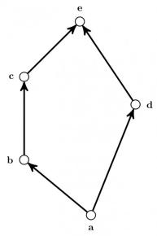
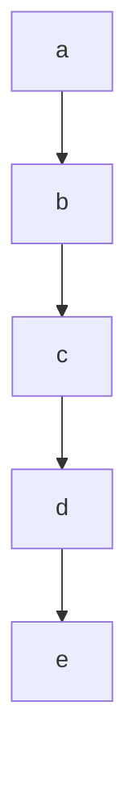
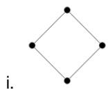
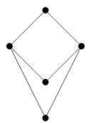
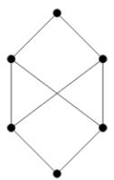
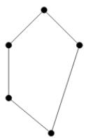
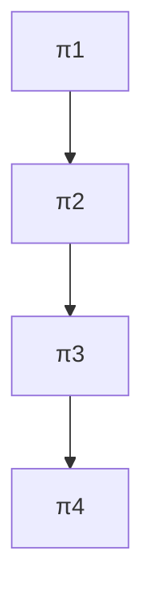
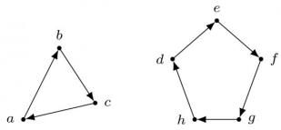
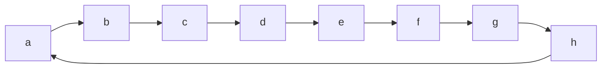

flowchart

The minimum number of ordered pairs that need to be added to R to make $(X, R)$ a lattice is \_\_\_\_

gatecse-2017-set2 set-theory&algebra lattice numerical-answers normal

# Answer key

# 4.6.10 Lattice: GATE IT 2008 | Question: 28

Consider the following Hasse diagrams.

ii.  

iii.  

iv.  

Which all of the above represent a lattice?

A. (i) and (iv) only  
C. (iii) only

gateit-2008 set-theory&algebra lattice normal

# Answer key

# 4.7

# Mathematical Induction (2)

# 4.7.1 Mathematical Induction: GATE CSE 1995 | Question: 23

Prove using mathematical induction for $n \geq 5, 2^n > n^2$

gate1995 set-theory&algebra proof mathematical-induction descriptive

# Answer key

# 4.7.2 Mathematical Induction: GATE CSE 2000 | Question: 3

Consider the following sequence:

$$
s _ {1} = s _ {2} = 1 \text {and} s _ {i} = 1 + \min \left(s _ {i - 1}, s _ {i - 2}\right) \text {for} i > 2.
$$

Prove by induction on $n$ that $s_n = \lceil \frac{n}{2} \rceil$ .

gatecse-2000 set-theory&algebra mathematical-induction descriptive

# Answer key

# 4.8

# Number Theory (7)

# 4.8.1 Number Theory: GATE CSE 1995 | Question: 7(A)

Determine the number of divisors of 600.

gate1995 set-theory&algebra number-theory numerical-answers

# Answer key

# 4.8.2 Number Theory: GATE CSE 2014 | Set 2 | Question: 49

The number of distinct positive integral factors of 2014 is \_\_\_\_

gatecse-2014-set2 set-theory&algebra easy numerical-answers number-theory

Answer key

# 4.8.3 Number Theory: GATE CSE 2015 | Set 2 | Question: 9

The number of divisors of 2100 is \_\_\_\_.

gatecse-2015-set2 set-theory&algebra number-theory easy numerical-answers

Answer key

# 4.8.4 Number Theory: GATE IT 2005 | Question: 34

Let $n = p^2 q$ , where $p$ and $q$ are distinct prime numbers. How many numbers $m$ satisfy $1 \leq m \leq n$ and $gcd(m, n) = 1$ ? Note that $gcd(m, n)$ is the greatest common divisor of $m$ and $n$ .

A. $p(q - 1)$  
C. $(p^2 - 1)(q - 1)$

gateit-2005 set-theory&algebra normal number-theory

B. pq  
D. $p(p-1)(q-1)$

Answer key

# 4.8.5 Number Theory: GATE IT 2007 | Question: 16

The minimum positive integer $p$ such that $3^p$ (mod 17) = 1 is

A. 5

B. 8

C. 12

D. 16

gateit-2007 set-theory&algebra normal number-theory

Answer key

# 4.8.6 Number Theory: GATE IT 2008 | Question: 24

The exponent of 11 in the prime factorization of 300! is

A. 27

B. 28

C. 29

D. 30

gateit-2008 set-theory&algebra normal number-theory

Answer key

# 4.8.7 Number Theory: GATE1991-15,a

Show that the product of the least common multiple and the greatest common divisor of two positive integers $a$ and $b$ is $a \times b$ .

gate1991 set-theory&algebra normal number-theory proof descriptive

Answer key

# 4.9

# Onto (1)

# 4.9.1 Onto: GATE CSE 2025 | Set 1 | Question: 7

$g(\cdot)$ is a function from $A$ to $B$ , $f(\cdot)$ is a function from $B$ to $C$ , and their composition defined as $f(g(\cdot))$ is a mapping from $A$ to $C$ .

If $f(\cdot)$ and $f(g(\cdot))$ are onto (surjective) functions, which ONE of the following is TRUE about the function $g(\cdot)$ ?

A. $g(\cdot)$ must be an onto (surjective) function.  
B. $g(\cdot)$ must be a one-to-one (injective) function.  
C. $g(\cdot)$ must be a bijective function, that is, both one-to-one and onto.  
D. $g(\cdot)$ is not required to be a one-to-one or onto function.

# 4.10

# Partial Order (10)

# 4.10.1 Partial Order: GATE CSE 1991 | Question: 01,xiv

If the longest chain in a partial order is of length $n$ , then the partial order can be written as a \_\_\_\_ of $n$ antichains.

gate1991 set-theory&algebra partial-order normal fill-in-the-blanks

# Answer key

# 4.10.2 Partial Order: GATE CSE 1993 | Question: 8.5

The less-than relation, $<$ , on real number is

A. a partial ordering since it is asymmetric and reflexive  
B. a partial ordering since it is antisymmetric and reflexive  
C. not a partial ordering because it is not asymmetric and not reflexive  
D. not a partial ordering because it is not antisymmetric and reflexive  
E. none of the above

gate1993 set-theory&algebra partial-order easy

# Answer key

# 4.10.3 Partial Order: GATE CSE 1996 | Question: 1.2

Let $X = \{2, 3, 6, 12, 24\}$ , Let $\leq$ be the partial order defined by $X \leq Y$ if $x$ divides $y$ . Number of edges in the Hasse diagram of $(X, \leq)$ is

A. 3

B. 4

C. 9

D. None of the above

gate1996 set-theory&algebra partial-order normal

# Answer key

# 4.10.4 Partial Order: GATE CSE 1997 | Question: 6.1

A partial order $\leq$ is defined on the set $S = \{x, a_1, a_2, \ldots, a_n, y\}$ as $x \leq_i a_i$ for all $i$ and $a_i \leq y$ for all $i$ , where $n \geq 1$ . The number of total orders on the set $S$ which contain the partial order $\leq$ is

A. n!

B. $n + 2$

C. n

D. 1

gate1997 set-theory&algebra partial-order normal

# Answer key

# 4.10.5 Partial Order: GATE CSE 1998 | Question: 11

Suppose $A = \{a, b, c, d\}$ and $\Pi_1$ is the following partition of $A$

$$
\Pi_ {1} = \{\{a, b, c \} \{d \} \}
$$

a. List the ordered pairs of the equivalence relations induced by $\Pi_{1}$ .  
b. Draw the graph of the above equivalence relation.  
c. Let $\Pi_2 = \{\{a\}, \{b\}, \{c\}, \{d\}\}$  
Draw a Poset diagram of the poset, $\langle\{\Pi_{1},\Pi_{2},\Pi_{3},\Pi_{4}\}$ , refines $\rangle$ .

$$
\Pi_ {3} = \{\{a, b, c, d \} \}
$$

$$
\text {and} \Pi_ {4} = \{\{a, b \}, \{c, d \} \}
$$

# Answer key

Let $(S, \leq)$ be a partial order with two minimal elements a and b, and a maximum element c. Let $P: S \to \{True, False\}$ be a predicate defined on S. Suppose that $P(a) = True$ , $P(b) = False$ and $P(x) \implies P(y)$ for all $x, y \in S$ satisfying $x \leq y$ , where $\implies$ stands for logical implication. Which of the following statements CANNOT be true?

A. $P(x) = \textbf{True} \text{ for all } x \in S \text{ such that } x \neq b$  
B. $P(x) = \textbf{False}$ for all $x \in S$ such that $x \neq a$ and $x \neq c$  
C. $P(x) = \text{False}$ for all $x \in S$ such that $b \leq x$ and $x \neq c$  
D. $P(x) = \textbf{False}$ for all $x \in S$ such that $a \leq x$ and $b \leq x$

gatecse-2003 set-theory&algebra partial-order normal propositional-logic

# Answer key

# 4.10.7 Partial Order: GATE CSE 2004 | Question: 73

The inclusion of which of the following sets into

$$
S = \{\{1, 2 \}, \{1, 2, 3 \}, \{1, 3, 5 \}, \{1, 2, 4 \}, \{1, 2, 3, 4, 5 \} \}
$$

is necessary and sufficient to make $S$ a complete lattice under the partial order defined by set containment?

A. $\{1\}$  
C. $\{1\},\{1,3\}$

B. $\{1\}, \{2,3\}$  
D. $\{1\}, \{1,3\}, \{1,2,3,4\}, \{1,2,3,5\}$

gatecse-2004 set-theory&algebra partial-order normal

# Answer key

# 4.10.8 Partial Order: GATE CSE 2007 | Question: 26

Consider the set $S = \{a, b, c, d\}$ . Consider the following 4 partitions $\pi_1, \pi_2, \pi_3, \pi_4$ on

$$
S: \pi_ {1} = \{\overline {{a b c d}} \}, \quad \pi_ {2} = \{\overline {{a b}}, \overline {{c d}} \}, \quad \pi_ {3} = \{\overline {{a b c}}, \overline {{d}} \}, \quad \pi_ {4} = \{\bar {a}, \bar {b}, \bar {c}, \bar {d} \}.
$$

Let $\prec$ be the partial order on the set of partitions $S' = \{\pi_1, \pi_2, \pi_3, \pi_4\}$ defined as follows: $\pi_i \prec \pi_j$ if and only if $\pi_i$ refines $\pi_j$ . The poset diagram for $(S', \prec)$ is:

A.

B.

flowchart

D.

C.

gatecse-2007 set-theory&algebra normal partial-order descriptive

# Answer key

# 4.10.9 Partial Order: GATE CSE 2024 | Set 2 | Question: 24

Let P be the partial order defined on the set $\{1, 2, 3, 4\}$ as follows

$$
P = \{(x, x) \mid x \in \{1, 2, 3, 4 \} \} \cup \{(1, 2), (3, 2), (3, 4) \}
$$

The number of total orders on $\{1,2,3,4\}$ that contain P is \_\_\_\_.

# Answer key

# 4.10.10 Partial Order: GATE IT 2007 | Question: 23

A partial order P is defined on the set of natural numbers as follows. Here $\frac{x}{y}$ denotes integer division.

i. $(0,0) \in P$ .  
ii. $(a,b)\in P$ if and only if $(a\% 10)\leq (b\% 10)$ and $(\frac{a}{10},\frac{b}{10})\in P.$

Consider the following ordered pairs:

i. (101, 22)  
ii. (22, 101)  
iii. (145, 265)  
iv. (0,153)

Which of these ordered pairs of natural numbers are contained in P?

A. (i) and (iii)

B. (ii) and (iv)

C. (i) and (iv)

D. (iii) and (iv)

gateit-2007 set-theory&algebra partial-order normal

# Answer key

# 4.11

# Polynomials (4)

# 4.11.1 Polynomials: GATE CSE 1997 | Question: 4.4

A polynomial $p(x)$ is such that $p(0) = 5, p(1) = 4, p(2) = 9$ and $p(3) = 20$ . The minimum degree it should have is

A. 1

B. 2

C. 3

D. 4

gate1997 set-theory&algebra normal polynomials

# Answer key

# 4.11.2 Polynomials: GATE CSE 2000 | Question: 2.4

A polynomial $p(x)$ satisfies the following:

- $p(1) = p(3) = p(5) = 1$  
- $p(2) = p(4) = -1$

The minimum degree of such a polynomial is

A. 1

B. 2

C. 3

D. 4

gatecse-2000 set-theory&algebra normal polynomials

# Answer key

# 4.11.3 Polynomials: GATE CSE 2014 | Set 2 | Question: 5

A non-zero polynomial $f(x)$ of degree 3 has roots at $x = 1$ , $x = 2$ and $x = 3$ . Which one of the following must be TRUE?

A. $f(0)f(4) < 0$  
C. $f(0) + f(4) > 0$

gatecse-2014-set2 set-theory&algebra polynomials normal

B. $f(0)f(4) > 0$  
D. $f(0) + f(4) < 0$

# Answer key

# 4.11.4 Polynomials: GATE CSE 2017 | Set 2 | Question: 24

Consider the quadratic equation $x^{2} - 13x + 36 = 0$ with coefficients in a base $b$ . The solutions of this

equation in the same base $b$ are $x = 5$ and $x = 6$ . Then $b =$ \_\_\_\_

gatecse-2017-set2 polynomials numerical-answers set-theory&algebra

Answer key

# 4.12

# Relations (38)

# 4.12.1 Relations: GATE CSE 1987 | Question: 2d

State whether the following statements are TRUE or FALSE:

The union of two equivalence relations is also an equivalence relation.

gate1987 set-theory&algebra relations true-false

Answer key

# 4.12.2 Relations: GATE CSE 1987 | Question: 9a

How many binary relations are there on a set A with n elements?

gate1987 set-theory&algebra relations descriptive

Answer key

# 4.12.3 Relations: GATE CSE 1987 | Question: 9e

How many true inclusion relations are there of the form $A \subseteq B$ , where $A$ and $B$ are subsets of a set $S$ with $n$ elements?

gate1987 set-theory&algebra relations descriptive

Answer key

# 4.12.4 Relations: GATE CSE 1989 | Question: 1-iv

The transitive closure of the relation $\{(1,2),(2,3),(3,4),(5,4)\}$ on the set $\{1,2,3,4,5\}$ is \_\_\_\_.

gate1989 set-theory&algebra relations descriptive

Answer key

# 4.12.5 Relations: GATE CSE 1992 | Question: 15.b

Let $S$ be the set of all integers and let $n > 1$ be a fixed integer. Define for $a, b \in S$ , $aRb$ iff $a - b$ is a multiple of $n$ . Show that $R$ is an equivalence relation and find its equivalence classes for $n = 5$ .

gate1992 set-theory&algebra normal relations descriptive

Answer key

# 4.12.6 Relations: GATE CSE 1994 | Question: 2.3

Amongst the properties {reflexivity, symmetry, anti-symmetry, transitivity} the relation $R = \{(x, y) \in N^2 | x \neq y\}$ satisfies \_\_\_\_

gate1994 set-theory&algebra normal relations fill-in-the-blanks

Answer key

# 4.12.7 Relations: GATE CSE 1995 | Question: 1.19

Let $R$ be a symmetric and transitive relation on a set $A$ . Then

A. $R$ is reflexive and hence an equivalence relation  
C. R is reflexive and hence not an equivalence relation

B. $R$ is reflexive and hence a partial order

D. None of the above

gate1995 set-theory&algebra relations normal

# 4.12.8 Relations: GATE CSE 1996 | Question: 2.2

Let $R$ be a non-empty relation on a collection of sets defined by $A R_{B}$ if and only if $A \cap B = \phi$ . Then, (pick the true statement)

A. A is reflexive and transitive

B. $R$ is symmetric and not transitive

C. $R$ is an equivalence relation

D. $R$ is not reflexive and not symmetric

gate1996 set-theory&algebra relations normal

# Answer key

# 4.12.9 Relations: GATE CSE 1996 | Question: 8

Let $F$ be the collection of all functions $f: \{1, 2, 3\} \to \{1, 2, 3\}$ . If $f$ and $g \in F$ , define an equivalence relation $\sim$ by $f \sim g$ if and only if $f(3) = g(3)$ .

a. Find the number of equivalence classes defined by $\sim$ .

b. Find the number of elements in each equivalence class.

gate1996 set-theory&algebra relations functions normal descriptive

# Answer key

# 4.12.10 Relations: GATE CSE 1997 | Question: 14

Let $R$ be a reflexive and transitive relation on a set $A$ . Define a new relation $E$ on $A$ as

$$
E = \{(a, b) \mid (a, b) \in R \text {   and   } (b, a) \in R \}
$$

Prove that $E$ is an equivalence relation on $A$ .

Define a relation $\leq$ on the equivalence classes of $E$ as $E_1 \leq E_2$ if $\exists a, b$ such that $a \in E_1, b \in E_2$ and $(a, b) \in R$ . Prove that $\leq$ is a partial order.

gate1997 set-theory&algebra relations normal proof descriptive

# Answer key

# 4.12.11 Relations: GATE CSE 1997 | Question: 6.3

The number of equivalence relations of the set $\{1,2,3,4\}$ is

A. 15

B. 16

C. 24

D. 4

gate1997 set-theory&algebra relations normal group-theory

# Answer key

# 4.12.12 Relations: GATE CSE 1998 | Question: 1.6

Suppose $A$ is a finite set with $n$ elements. The number of elements in the largest equivalence relation of $A$ is

A. n

B. $n^2$

C. 1

D. $n + 1$

gate1998 set-theory&algebra relations easy

# Answer key

# 4.12.13 Relations: GATE CSE 1998 | Question: 1.7

Let $R_{1}$ and $R_{2}$ be two equivalence relations on a set. Consider the following assertions:

i. $R_{1} \cup R_{2}$ is an equivalence relation  
ii. $R_{1} \cap R_{2}$ is an equivalence relation

Which of the following is correct?

A. Both assertions are true  
B. Assertions (i) is true but assertions (ii) is not true  
C. Assertions (ii) is true but assertions (i) is not true  
D. Neither (i) nor (ii) is true

gate1998 set-theory&algebra relations normal

# Answer key

# 4.12.14 Relations: GATE CSE 1998 | Question: 10a

Prove by induction that the expression for the number of diagonals in a polygon of $n$ sides is $\frac{n(n - 3)}{2}$

gate1998 set-theory&algebra descriptive relations

# Answer key

# 4.12.15 Relations: GATE CSE 1998 | Question: 10b

Let $R$ be a binary relation on $A = \{a, b, c, d, e, f, g, h\}$ represented by the following two component digraph. Find the smallest integers $m$ and $n$ such that $m < n$ and $R^m = R^n$ .

flowchart

gate1998 descriptive set-theory&algebra relations

# Answer key

# 4.12.16 Relations: GATE CSE 1998 | Question: 2.3

The binary relation $R = \{(1,1),(2,1),(2,2),(2,3),(2,4),(3,1),(3,2),(3,3),(3,4)\}$ on the set $A = \{1,2,3,4\}$ is

A. reflexive, symmetric and transitive  
C. irreflexive, symmetric and transitive

B. neither reflexive, nor irreflexive but transitive  
D. irreflexive and antisymmetric

gate1998 set-theory&algebra easy relations

# Answer key

# 4.12.17 Relations: GATE CSE 1999 | Question: 1.2

The number of binary relations on a set with n elements is:

A. $n^{2}$

B. $2^{n}$

C. $2^{n^2}$

D. None of the above

gate1999 set-theory&algebra relations combinatory easy

# Answer key

# 4.12.18 Relations: GATE CSE 1999 | Question: 2.3

Let $L$ be a set with a relation $R$ which is transitive, anti-symmetric and reflexive and for any two elements $a, b \in L$ , let the least upper bound $lub(a, b)$ and the greatest lower bound $glb(a, b)$ exist. Which of the following is/are true?

A. $L$ is a poset  
C. $L$ is a lattice

B. $L$ is a Boolean algebra  
D. None of the above

gate1999 set-theory&algebra normal relations multiple-selects

# Answer key

a. Mr. X claims the following:

If a relation R is both symmetric and transitive, then R is reflexive. For this, Mr. X offers the following proof:

"From xRy, using symmetry we get yRx. Now because R is transitive xRy and yRx together imply xRx. Therefore, R is reflexive".

b. Give an example of a relation R which is symmetric and transitive but not reflexive.

gate1999 set-theory&algebra relations normal descriptive

Answer key

# 4.12.20 Relations: GATE CSE 2000 | Question: 2.5

A relation $R$ is defined on the set of integers as $xRy$ iff $(x + y)$ is even. Which of the following statements is true?

A. $R$ is not an equivalence relation  
B. $R$ is an equivalence relation having 1 equivalence class  
C. $R$ is an equivalence relation having 2 equivalence classes  
D. $R$ is an equivalence relation having 3 equivalence classes

gatecse-2000 set-theory&algebra relations normal

Answer key

# 4.12.21 Relations: GATE CSE 2001 | Question: 1.2

Consider the following relations:

- $R_{1}(a, b)$ iff $(a + b)$ is even over the set of integers  
- $R_{2}(a, b)$ iff $(a + b)$ is odd over the set of integers  
- $R_{3}(a, b)$ iff $a, b > 0$ over the set of non-zero rational numbers  
- $R_{4}(a, b)$ iff $|a - b| \leq 2$ over the set of natural numbers

Which of the following statements is correct?

A. $R_{1}$ and $R_{2}$ are equivalence relations, $R_{3}$ and $R_{4}$ are not  
B. $R_{1}$ and $R_{3}$ are equivalence relations, $R_{2}$ and $R_{4}$ are not  
C. $R_{1}$ and $R_{4}$ are equivalence relations, $R_{2}$ and $R_{3}$ are not  
D. $R_{1}, R_{2}, R_{3}$ and $R_{4}$ all are equivalence relations

gatecse-2001 set-theory&algebra normal relations

Answer key

# 4.12.22 Relations: GATE CSE 2002 | Question: 2.17

The binary relation $S = \phi(\text{empty set})$ on a set $A = \{1, 2, 3\}$ is

A. Neither reflexive nor symmetric  
C. Transitive and reflexive

B. Symmetric and reflexive

gatecse-2002 set-theory&algebra normal relations

Answer key

# 4.12.23 Relations: GATE CSE 2002 | Question: 3

Let $A$ be a set of $n (>0)$ elements. Let $N_r$ be the number of binary relations on $A$ and let $N_f$ be the number of functions from $A$ to $A$

A. Give the expression for $N_{r}$ , in terms of n.  
B. Give the expression for $N_{f}$ , terms of $n$ .

C. Which is larger for all possible $n, N_{r}$ or $N_{f}$

gatecse-2002 set-theory&algebra normal descriptive relations

# Answer key

# 4.12.24 Relations: GATE CSE 2004 | Question: 24

Consider the binary relation:

$$
S = \{(x, y) \mid y = x + 1 \text {and} x, y \in \{0, 1, 2 \} \}
$$

The reflexive transitive closure is $S$ is

A. $\{(x,y) \mid y > x \text{ and } x, y \in \{0,1,2\}\}$  
B. $\{(x,y) \mid y \geq x \text{ and } x, y \in \{0,1,2\}\}$  
C. $\{(x,y) \mid y < x \text{ and } x, y \in \{0,1,2\}\}$  
D. $\{(x,y) \mid y \leq x \text{ and } x, y \in \{0,1,2\}\}$

gatecse-2004 set-theory&algebra easy relations

# Answer key

# 4.12.25 Relations: GATE CSE 2005 | Question: 42

Let $R$ and $S$ be any two equivalence relations on a non-empty set $A$ . Which one of the following statements is TRUE?

A. $R \cup S, R \cap S$ are both equivalence relations  
B. $R \cup S$ is an equivalence relation  
C. $R\cap S$ is an equivalence relation  
D. Neither $R \cup S$ nor $R \cap S$ are equivalence relations

gatecse-2005 set-theory&algebra normal relations

# Answer key

# 4.12.26 Relations: GATE CSE 2005 | Question: 7

The time complexity of computing the transitive closure of a binary relation on a set of $n$ elements is known to be:

A. $O(n)$

B. $O(n\log n)$

c. $O\left(n^{\frac{3}{2}}\right)$

D. $O(n^{3})$

gatecse-2005 set-theory&algebra normal relations

# Answer key

# 4.12.27 Relations: GATE CSE 2006 | Question: 4

A relation R is defined on ordered pairs of integers as follows:

$$
(x, y) R (u, v) \text {if} x <   u \text {and} y > v
$$

Then $R$ is:

A. Neither a Partial Order nor an Equivalence Relation  
B. A Partial Order but not a Total Order  
C. A total Order  
D. An Equivalence Relation

gatecse-2006 set-theory&algebra normal relations

# Answer key

# 4.12.28 Relations: GATE CSE 2007 | Question: 2

Let $S$ be a set of $n$ elements. The number of ordered pairs in the largest and the smallest equivalence relations on $S$ are:

A. $n$ and $n$

B. $n^2$ and $n$

C. $n^2$ and 0

D. $n$ and 1

gatecse-2007 set-theory&algebra normal relations

# Answer key

# 4.12.29 Relations: GATE CSE 2009 | Question: 4

Consider the binary relation $R = \{(x, y), (x, z), (z, x), (z, y)\}$ on the set $\{x, y, z\}$ . Which one of the following is TRUE?

A. $R$ is symmetric but NOT antisymmetric

C. R is both symmetric and antisymmetric

B. $R$ is NOT symmetric but antisymmetric

D. R is neither symmetric nor antisymmetric

gatecse-2009 set-theory&algebra easy relations

# Answer key

# 4.12.30 Relations: GATE CSE 2010 | Question: 3

What is the possible number of reflexive relations on a set of 5 elements?

A. $2^{10}$

B. $2^{15}$

C. $2^{20}$

D. $2^{25}$

gatecse-2010 set-theory&algebra easy relations

# Answer key

# 4.12.31 Relations: GATE CSE 2015 | Set 2 | Question: 16

Let $R$ be the relation on the set of positive integers such that $aRb$ and only if $a$ and $b$ are distinct and let have a common divisor other than 1. Which one of the following statements about $R$ is true?

A. $R$ is symmetric and reflexive but not transitive  
B. R is reflexive but not symmetric not transitive  
C. $R$ is transitive but not reflexive and not symmetric  
D. R is symmetric but not reflexive and not transitive

gatecse-2015-set2 set-theory&algebra relations normal

# Answer key

# 4.12.32 Relations: GATE CSE 2015 | Set 3 | Question: 41

Let $R$ be a relation on the set of ordered pairs of positive integers such that $((p,q),(r,s)) \in R$ if and only if $p - s = q - r$ . Which one of the following is true about $R$ ?

A. Both reflexive and symmetric

B. Reflexive but not symmetric

C. Not reflexive but symmetric

D. Neither reflexive nor symmetric

gatecse-2015-set3 set-theory&algebra relations normal

# Answer key

# 4.12.33 Relations: GATE CSE 2016 | Set 2 | Question: 26

A binary relation $R$ on $\mathbb{N} \times \mathbb{N}$ is defined as follows: $(a, b)R(c, d)$ if $a \leq c$ or $b \leq d$ . Consider the following propositions:

- $P: R$ is reflexive.  
- $Q: R$ is transitive.

Which one of the following statements is TRUE?

A. Both $P$ and $Q$ are true.  
C. $P$ is false and $Q$ is true.

B. $P$ is true and $Q$ is false.  
D. Both $P$ and $Q$ are false.

gatecse-2016-set2 set-theory&algebra relations normal

# Answer key

# 4.12.34 Relations: GATE CSE 2020 | Question: 17

Let $\mathcal{R}$ be the set of all binary relations on the set $\{1,2,3\}$ . Suppose a relation is chosen from $\mathcal{R}$ at random. The probability that the chosen relation is reflexive (round off to 3 decimal places) is \_\_\_\_.

gatecse-2020 numerical-answers probability relations one-mark

# Answer key

# 4.12.35 Relations: GATE CSE 2021 | Set 1 | Question: 43

A relation R is said to be circular if aRb and bRc together imply cRa.

Which of the following options is/are correct?

A. If a relation $S$ is reflexive and symmetric, then $S$ is an equivalence relation.  
B. If a relation $S$ is circular and symmetric, then $S$ is an equivalence relation.  
C. If a relation $S$ is reflexive and circular, then $S$ is an equivalence relation.  
D. If a relation $S$ is transitive and circular, then $S$ is an equivalence relation.

gatecse-2021-set1 multiple-selects set-theory&algebra relations two-marks

# Answer key

# 4.12.36 Relations: GATE CSE 2025 | Set 2 | Question: 32

Let $\mathcal{F}$ be the set of all functions from $\{1, \ldots, n\}$ to $\{0, 1\}$ . Define the binary relation $\leqslant$ on $\mathcal{F}$ as follows:

$\forall f, g \in \mathcal{F}, f \preccurlyeq g$ if and only if $\forall x \in \{1, \dots, n\}, f(x) \leq g(x)$ , where $0 \leq 1$ .

Which of the following statement(s) is/are TRUE?

A. $\preccurlyeq$ is a symmetric relation  
B. $(\mathcal{F},\preccurlyeq)$ is a partial order  
C. $(\mathcal{F},\preccurlyeq)$ is a lattice  
D. $\preccurlyeq$ is an equivalence relation

gatecse2025-set2 set-theory&algebra functions relations multiple-selects two-marks

# Answer key

# 4.12.37 Relations: GATE CSE 2026 | Set 2 | Question: 16

Let $R$ be a binary relation on the set $\{1, 2, \ldots, 10\}$ , where $(x, y) \in R$ if the product of $x$ and $y$ is square of an integer. Which of the following properties is/are satisfied by $R$ ?

A. Reflexive

B. Symmetric

C. Transitive

D. Antisymmetric

gatecse-2026-set2 set-theory&algebra relations multiple-selects one-mark

# Answer key

# 4.12.38 Relations: GATE IT 2004 | Question: 4

Let $R_{1}$ be a relation from $A = \{1, 3, 5, 7\}$ to $B = \{2, 4, 6, 8\}$ and $R_{2}$ be another relation from $B$ to $C = \{1, 2, 3, 4\}$ as defined below:

i. An element $x$ in $A$ is related to an element $y$ in $B$ (under $R_1$ ) if $x + y$ is divisible by 3.  
ii. An element $x$ in $B$ is related to an element $y$ in $C$ (under $R_2$ ) if $x + y$ is even but not divisible by 3.

Which is the composite relation $R_{1}R_{2}$ from A to C?

A. $R_{1}R_{2} = \{(1,2),(1,4),(3,3),(5,4),(7,3)\}$