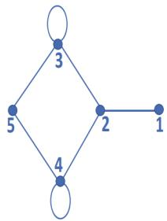
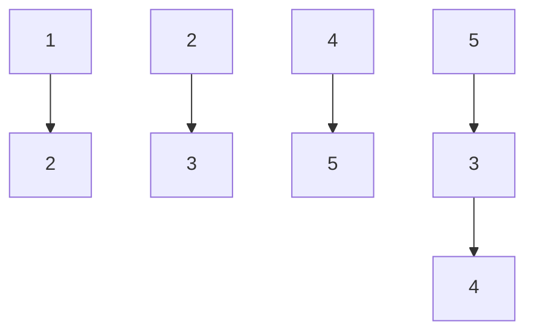

# 6.3.18 Eigen Value: GATE CSE 2017 | Set 2 | Question: 52

If the characteristic polynomial of a $3 \times 3$ matrix $M$ over $\mathbb{R}$ (the set of real numbers) is $\lambda^3 - 4\lambda^2 + a\lambda + 30$ , $a \in \mathbb{R}$ , and one eigenvalue of $M$ is 2, then the largest among the absolute values of the eigenvalues of $M$ is \_\_\_\_

gatecse-2017-set2 engineering-mathematics linear-algebra numerical-answers eigen-value

# Answer key

# 6.3.19 Eigen Value: GATE CSE 2018 | Question: 17

Consider a matrix $A = uv^{T}$ where $u = \begin{pmatrix} 1 \\ 2 \end{pmatrix}$ , $v = \begin{pmatrix} 1 \\ 1 \end{pmatrix}$ . Note that $v^{T}$ denotes the transpose of $v$ . The largest eigenvalue of $A$ is \_\_\_\_

gatecse-2018 linear-algebra eigen-value normal numerical-answers one-mark

# Answer key

# 6.3.20 Eigen Value: GATE CSE 2018 | Question: 26

Consider a matrix P whose only eigenvectors are the multiples of $\begin{bmatrix}1\\ 4\end{bmatrix}$ .

Consider the following statements.

I. P does not have an inverse  
II. P has a repeated eigenvalue  
III. P cannot be diagonalized

Which one of the following options is correct?

A. Only I and III are necessarily true

C. Only I and II are necessarily true

gatecse-2018 linear-algebra matrix eigen-value normal two-marks

B. Only II is necessarily true  
D. Only II and III are necessarily true

# Answer key

# 6.3.21 Eigen Value: GATE CSE 2019 | Question: 44

Consider the following matrix:

$$
R = \left[ \begin{array}{c c c c} 1 & 2 & 4 & 8 \\ 1 & 3 & 9 & 2 7 \\ 1 & 4 & 1 6 & 6 4 \\ 1 & 5 & 2 5 & 1 2 5 \end{array} \right]
$$

The absolute value of the product of Eigen values of R is \_\_\_\_

gatecse-2019 numerical-answers engineering-mathematics linear-algebra eigen-value two-marks

# Answer key

# 6.3.22 Eigen Value: GATE CSE 2021 | Set 1 | Question: 52

Consider the following matrix.

$$
\left( \begin{array}{c c c c} 0 & 1 & 1 & 1 \\ 1 & 0 & 1 & 1 \\ 1 & 1 & 0 & 1 \\ 1 & 1 & 1 & 0 \end{array} \right)
$$

The largest eigenvalue of the above matrix is \_\_\_\_.

gatecse-2021-set1 linear-algebra matrix eigen-value numerical-answers two-marks

# Answer key

# 6.3.23 Eigen Value: GATE CSE 2022 | Question: 43

Which of the following is/are the eigenvector(s) for the matrix given below?

$$
\left( \begin{array}{c c c c} - 9 & - 6 & - 2 & - 4 \\ - 8 & - 6 & - 3 & - 1 \\ 2 0 & 1 5 & 8 & 5 \\ 3 2 & 2 1 & 7 & 1 2 \end{array} \right)
$$

$$
\begin{array}{l} \text {A.} \left( \begin{array}{c} - 1 \\ 1 \\ 0 \\ 1 \end{array} \right) \\ \text {C.} \left( \begin{array}{c} - 1 \\ 0 \\ 2 \\ 2 \end{array} \right) \end{array}
$$

gatecse-2022 linear-algebra eigen-value multiple-selects two-marks

$$
\begin{array}{l} \text {B.} \left( \begin{array}{c} 1 \\ 0 \\ - 1 \\ 0 \\ 0 \end{array} \right) \\ \text {D.} \left( \begin{array}{c} 1 \\ - 3 \\ 0 \end{array} \right) \end{array}
$$

# Answer key

# 6.3.24 Eigen Value: GATE CSE 2023 | Question: 20

Let $A$ be the adjacency matrix of the graph with vertices $\{1, 2, 3, 4, 5\}$ .

flowchart

Let $\lambda_1, \lambda_2, \lambda_3, \lambda_4$ , and $\lambda_5$ be the five eigenvalues of $A$ . Note that these eigenvalues need not be distinct.

The value of $\lambda_{1}+\lambda_{2}+\lambda_{3}+\lambda_{4}+\lambda_{5}=$ \_\_\_\_

gatecse-2023 linear-algebra eigen-value numerical-answers one-mark

# Answer key

# 6.3.25 Eigen Value: GATE CSE 2024 | Set 1 | Question: 2

The product of all eigenvalues of the matrix $\begin{bmatrix}1 & 2 & 3 \\ 4 & 5 & 6 \\ 7 & 8 & 9\end{bmatrix}$ is

A. -1

B. 0

C. 1

D. 2

gatecse-2024-set1 linear-algebra eigen-value one-mark

# Answer key

# 6.3.26 Eigen Value: GATE CSE 2025 | Set 1 | Question: 31

Let $A$ be a $2 \times 2$ matrix as given.

$$
A = \left[ \begin{array}{c c} 1 & 1 \\ 1 & - 1 \end{array} \right]
$$

What are the eigenvalues of the matrix $A^{13}$ ?

A. 1, -1

B. $2\sqrt{2}, - 2\sqrt{2}$

C. $4\sqrt{2}, - 4\sqrt{2}$

D. $64\sqrt{2}, - 64\sqrt{2}$

gatecse2025-set1 linear-algebra matrix eigen-value easy two-marks

# Answer key

# 6.3.27 Eigen Value: GATE DA 2025 | Question: 18

Let $A = I_{n} + xx^{\top}$ , where $I_{n}$ is the $n \times n$ identity matrix and $x \in \mathbb{R}^{n}, x^{\top}x = 1$ . Which of the following options is/are correct?

A. Rank of $A$ is $n$

B. $A$ is invertible

C. 0 is an eigenvalue of $A$

D. $A^{-1}$ has a negative eigenvalue

gateda-2025 linear-algebra matrix eigen-value multiple-selects one-mark

# Answer key

# 6.3.28 Eigen Value: GATE DA 2026 | Question: 36

Let $\gamma_{1},\gamma_{2},\gamma_{3}$ be the eigenvalues of the matrix $\left[ \begin{array}{ccc}1 & 0 & 0\\ 0 & \cos t & \sin t\\ 0 & -\sin t & \cos t \end{array} \right],$ where $t\in [-\pi ,\pi ]$ is in radians.

Which one of the following options lists all the possible values of $t$ satisfying $\gamma_1 + \gamma_2 + \gamma_3 = 1 + \sqrt{2}$ ?

A. $\left\{\frac{\pi}{3}, -\frac{\pi}{4}\right\}$ C. $\left\{\frac{\pi}{4}, -\frac{\pi}{4}\right\}$

B. $\left\{\frac{\pi}{4}, -\frac{\pi}{3}\right\}$ D. $\left\{\frac{\pi}{3}, -\frac{\pi}{3}\right\}$

gateda-2026 linear-algebra matrix eigen-value two-marks

# Answer key

# 6.3.29 Eigen Value: GATE DA 2026 | Question: 55

Let $A = \left( I_n - \frac{1}{n} \mathbf{1} \mathbf{1}^T \right)$ be a matrix, where $\mathbf{1} = (1, 1, 1, \ldots, 1)^T \in \mathbb{R}^n$ and $I_n$ is the identity matrix of order $n$ .

The value of $\max_S x^T Ax$ , where $S = \{x \in \mathbb{R}^n \mid x^T x = 1\}$ , is \_\_\_\_. (Answer in integer)

gateda-2026 linear-algebra eigen-value numerical-answers two-marks

# Answer key

# 6.3.30 Eigen Value: GATE DS&AI 2024 | Question: 3

Consider the matrix $M = \begin{bmatrix} 2 & -1 \\ 3 & 1 \end{bmatrix}$ .

Which ONE of the following statements is TRUE?

A. The eigenvalues of M are non-negative and real.  
B. The eigenvalues of M are complex conjugate pairs.  
C. One eigenvalue of $M$ is positive and real, and another eigenvalue of $M$ is zero.  
D. One eigenvalue of $M$ is non-negative and real, and another eigenvalue of $M$ is negative and real.

gate-ds-ai-2024 eigen-value linear-algebra one-mark

# Answer key

# 6.3.31 Eigen Value: GATE Data Science and Artificial Intelligence 2024 | Sample Paper | Question: 17

For matrix $H = \begin{bmatrix} 9 & -2 \\ -2 & 6 \end{bmatrix}$ , one of the eigenvalues is 5. Then, the other eigenvalue is

A. 12

B. 10

C. 8

D. 6

gateda-sample-paper-2024 linear-algebra eigen-value easy

# Answer key

# 6.3.32 Eigen Value: GATE IT 2006 | Question: 26

What are the eigenvalues of the matrix P given below

$$
P = \left( \begin{array}{c c c} a & 1 & 0 \\ 1 & a & 1 \\ 0 & 1 & a \end{array} \right)
$$

A. $a, a - \sqrt{2}, a + \sqrt{2}$

B. $a, a, a$

C. $0, a, 2a$

D. $-a, 2a, 2a$

gateit-2006 linear-algebra eigen-value normal

# Answer key

# 6.3.33 Eigen Value: GATE IT 2007 | Question: 2

Let $A$ be the matrix $\begin{bmatrix} 3 & 1 \\ 1 & 2 \end{bmatrix}$ . What is the maximum value of $x^T Ax$ where the maximum is taken over all $x$ that are the unit eigenvectors of $A$ ?

A. 5

B. $\frac{(5+\sqrt{5})}{2}$

C. 3

D. $\frac{(5-\sqrt{5})}{2}$

gateit-2007 linear-algebra eigen-value normal

# Answer key

# 6.4

# Gaussian Elimination (1)

# 6.4.1 Gaussian Elimination: GATE DA 2025 | Question: 2

The number of additions and multiplications involved in performing Gaussian elimination on any $n \times n$ upper triangular matrix is of the order

A. $O(n)$

B. $O(n^{2})$

C. $O(n^{3})$

D. $O(n^{4})$

gateda-2025 linear-algebra matrix gaussian-elimination one-mark

# Answer key

# 6.5

# Lu Decomposition (3)

# 6.5.1 Lu Decomposition: GATE CSE 2015 | Set 1 | Question: 18

In the LU decomposition of the matrix $\begin{bmatrix}2&2\\ 4&9\end{bmatrix}$ , if the diagonal elements of U are both 1, then the lower diagonal entry $l_{22}$ of L is \_\_\_\_.

gatecse-2015-set1 linear-algebra lu-decomposition numerical-answers

# Answer key

Consider solving the following system of simultaneous equations using LU decomposition.

$$
x _ {1} + x _ {2} - 2 x _ {3} = 4
$$

$$
x _ {1} + 3 x _ {2} - x _ {3} = 7
$$

$$
2 x _ {1} + x _ {2} - 5 x _ {3} = 7
$$

where $L$ and $U$ are denoted as

$$
L = \left( \begin{array}{c c c} L _ {1 1} & 0 & 0 \\ L _ {2 1} & L _ {2 2} & 0 \\ L _ {3 1} & L _ {3 2} & L _ {3 3} \end{array} \right), U = \left( \begin{array}{c c c} U _ {1 1} & U _ {1 2} & U _ {1 3} \\ 0 & U _ {2 2} & U _ {2 3} \\ 0 & 0 & U _ {3 3} \end{array} \right)
$$

Which one of the following is the correct combination of values for $L_{32}$ , $U_{33}$ , and $x_{1}$ ?

A. $L_{32} = 2, U_{33} = -\frac{1}{2}, x_1 = -1$  
C. $L_{32} = -\frac{1}{2}, U_{33} = \bar{2}, x_1 = 0$

gatecse-2022 linear-algebra lu-decomposition matrix system-of-equations two-marks

B. $L_{32} = 2, U_{33} = 2, x_1 = -1$  
D. $L_{32} = -\frac{1}{2}, U_{33} = -\frac{1}{2}, x_1 = 0$

Answer key

# 6.5.3 Lu Decomposition: GATE CSE 2025 | Set 2 | Question: 34

Consider a system of linear equations $PX = Q$ where $P \in \mathbb{R}^{3 \times 3}$ and $\mathbf{Q} \in \mathbb{R}^{3 \times 1}$ . Suppose $P$ has an LU decomposition, $P = LU$ , where

$$
L = \left[ \begin{array}{c c c} 1 & 0 & 0 \\ l _ {2 1} & 1 & 0 \\ l _ {3 1} & l _ {3 2} & 1 \end{array} \right] \text {and} U = \left[ \begin{array}{c c c} u _ {1 1} & u _ {1 2} & u _ {1 3} \\ 0 & u _ {2 2} & u _ {2 3} \\ 0 & 0 & u _ {3 3} \end{array} \right].
$$

Which of the following statement(s) is/are TRUE?

A. The system $PX = Q$ can be solved by first solving $LY = Q$ and then $UX = Y$ .  
B. If $P$ is invertible, then both $L$ and $U$ are invertible.  
C. If $P$ is singular, then at least one of the diagonal elements of $U$ is zero.  
D. If P is symmetric, then both L and U are symmetric.

gatecse2025-set2 linear-algebra system-of-equations matrix lu-decomposition multiple-selects two-marks

Answer key

# 6.6

# Matrix (24)

Practice Tests: Test 1 (15Q) Test 2 (15Q) Test 3 (15Q)

# 6.6.1 Matrix: GATE CSE 1987 | Question: 1-xxiii

A square matrix is singular whenever

A. The rows are linearly independent  
C. The row are linearly dependent

gate1987 linear-algebra matrix

B. The columns are linearly independent  
D. None of the above

Answer key

# 6.6.2 Matrix: GATE CSE 1988 | Question: 16i

Assume that the matrix $A$ given below, has factorization of the form $LU = PA$ , where $L$ is lower-triangular with all diagonal elements equal to 1, $U$ is upper-triangular, and $P$ is a permutation matrix. For

$$
A = \left[ \begin{array}{c c c} 2 & 5 & 9 \\ 4 & 6 & 5 \\ 8 & 2 & 3 \end{array} \right]
$$

Compute L, U, and P using Gaussian elimination with partial pivoting.

gate1988 normal descriptive linear-algebra matrix

Answer key

# 6.6.3 Matrix: GATE CSE 1993 | Question: 02.7

If $A = \begin{pmatrix} 1 & 0 & 0 & 1 \\ 0 & -1 & 0 & -1 \\ 0 & 0 & i & i \\ 0 & 0 & 0 & -i \end{pmatrix}$ the matrix $A^4$ , calculated by the use of Cayley-Hamilton theorem or otherwise, is \_\_\_\_

gate1993 linear-algebra normal matrix fill-in-the-blanks

Answer key

# 6.6.4 Matrix: GATE CSE 1994 | Question: 1.2

Let $A$ and $B$ be real symmetric matrices of size $n \times n$ . Then which one of the following is true?

A. $AA' = I$

B. $A = A^{-1}$

C. $AB = BA$

D. $(AB)' = BA$

gate1994 linear-algebra normal matrix

Answer key

# 6.6.5 Matrix: GATE CSE 1994 | Question: 3.12

Find the inverse of the matrix $\begin{bmatrix} 1 & 0 & 1 \\ -1 & 1 & 1 \\ 0 & 1 & 0 \end{bmatrix}$

gate1994 linear-algebra matrix easy descriptive

Answer key

# 6.6.6 Matrix: GATE CSE 1996 | Question: 10

Let $A = \begin{bmatrix} a_{11} & a_{12} \\ a_{21} & a_{22} \end{bmatrix}$ and $B = \begin{bmatrix} b_{11} & b_{12} \\ b_{21} & b_{22} \end{bmatrix}$ be two matrices such that $AB = I$ . Let $C = A \begin{bmatrix} 1 & 0 \\ 1 & 1 \end{bmatrix}$ and $CD = I$ . Express the elements of $D$ in terms of the elements of $B$ .

gate1996 linear-algebra matrix normal descriptive

Answer key

# 6.6.7 Matrix: GATE CSE 1996 | Question: 2.6

The matrices $\begin{bmatrix}\cos\theta & -\sin\theta \\ \sin\theta & \cos\theta\end{bmatrix}$ and $\begin{bmatrix}a & 0 \\ 0 & b\end{bmatrix}$ commute under multiplication

A. if $a = b$ or $\theta = n\pi, n$ an integer

C. never

B. always

D. if $a\cos \theta = b\sin \theta$

gate1996 linear-algebra normal matrix

# 6.6.8 Matrix: GATE CSE 1997 | Question: 4.2

Let $A = (a_{ij})$ be an n-rowed square matrix and $I_{12}$ be the matrix obtained by interchanging the first and second rows of the n-rowed Identity matrix. Then $AI_{12}$ is such that its first

A. Row is the same as its second row

B. Row is the same as the second row of $A$

C. Column is the same as the second column of $A$

D. Row is all zero

gate1997 linear-algebra easy matrix

# Answer key

# 6.6.9 Matrix: GATE CSE 1998 | Question: 2.2

Consider the following determinant $\Delta = \left| \begin{array}{ccc}1 & a & bc\\ 1 & b & ca\\ 1 & c & ab \end{array} \right|$

Which of the following is a factor of $\Delta$ ?

A. $a + b$

B. a - b

C. $a + b + c$

D. abc

gate1998 linear-algebra matrix normal

# Answer key

# 6.6.10 Matrix: GATE CSE 2001 | Question: 1.1

Consider the following statements:

- S1: The sum of two singular $n \times n$ matrices may be non-singular  
- S2: The sum of two $n \times n$ non-singular matrices may be singular

Which one of the following statements is correct?

A. S1 and S2 both are true

B. $S1$ is true, $S2$ is false

C. $S1$ is false, $S2$ is true

D. S1 and S2 both are false

gatecse-2001 linear-algebra normal matrix

# Answer key

# 6.6.11 Matrix: GATE CSE 2004 | Question: 26

The number of different $n \times n$ symmetric matrices with each element being either 0 or 1 is: (Note: power $(2, X)$ is same as $2^{X}$ )

A. power $(2,n)$

B. power $(2, n^{2})$

C. power $\left(2, \frac{(n^2 + n)}{2}\right)$

D. power $\left(2, \frac{(n^2 - n)}{2}\right)$

gatecse-2004 linear-algebra normal matrix

# Answer key

# 6.6.12 Matrix: GATE CSE 2004 | Question: 27

Let $A, B, C, D$ be $n \times n$ matrices, each with non-zero determinant. If $ABCD = I$ , then $B^{-1}$ is

A. $D^{-1}C^{-1}A^{-1}$

B. CDA

C. ADC

D. Does not necessarily exist

gatecse-2004 linear-algebra normal matrix

# Answer key

# 6.6.13 Matrix: GATE CSE 2004 | Question: 76

In an $M \times N$ matrix all non-zero entries are covered in $a$ rows and $b$ columns. Then the maximum number of non-zero entries, such that no two are on the same row or column, is

A. $\leq a + b$

B. $\leq \max (a,b)$

C. $\leq \min (M - a, N - b)$

D. $\leq \min (a,b)$

gatecse-2004 linear-algebra normal matrix

# Answer key

# 6.6.14 Matrix: GATE CSE 2006 | Question: 23

F is an $n \times n$ real matrix. b is an $n \times 1$ real vector. Suppose there are two $n \times 1$ vectors, u and v such that, $u \neq v$ and Fu = b, Fv = b. Which one of the following statements is false?

A. Determinant of F is zero.  
B. There are an infinite number of solutions to Fx = b  
C. There is an $x \neq 0$ such that $Fx = 0$  
D. F must have two identical rows

gatecse-2006 linear-algebra normal matrix

# Answer key

# 6.6.15 Matrix: GATE CSE 2015 | Set 2 | Question: 27

Perform the following operations on the matrix $\begin{bmatrix}3 & 4 & 45 \\ 7 & 9 & 105 \\ 13 & 2 & 195\end{bmatrix}$

i. Add the third row to the second row  
ii. Subtract the third column from the first column.

The determinant of the resultant matrix is \_\_\_\_.

gatecse-2015-set2 linear-algebra matrix easy numerical-answers

# Answer key

# 6.6.16 Matrix: GATE CSE 2022 | Question: 10

Consider the following two statements with respect to the matrices $A_{m \times n}, B_{n \times m}, C_{n \times n}$ and $D_{n \times n}$ .

Statement 1: tr(AB) = tr(BA)

Statement 2: tr(CD) = tr(DC)

where $tr()$ represents the trace of a matrix. Which one of the following holds?

A. Statement 1 is correct and Statement 2 is wrong.  
B. Statement 1 is wrong and Statement 2 is correct.  
C. Both Statement 1 and Statement 2 are correct.  
D. Both Statement 1 and Statement 2 are wrong.

gatecse-2022 linear-algebra matrix one-mark

# Answer key

# 6.6.17 Matrix: GATE CSE 2025 | Set 2 | Question: 1

If $A = \begin{pmatrix} 1 & 2 \\ 2 & -1 \end{pmatrix}$ , then which ONE of the following is $A^8$ ?

A. $\begin{pmatrix}25&0\\0&25\end{pmatrix}$

B. $\begin{pmatrix}125&0\\0&125\end{pmatrix}$

C. $\begin{pmatrix}625&0\\0&625\end{pmatrix}$

gatecse2025-set2 linear-algebra matrix easy one-mark

D. $\begin{pmatrix}3125&0\\0&3125\end{pmatrix}$

Answer key

# 6.6.18 Matrix: GATE CSE 2026 | Set 1 | Question: 10

Let $n > 1$ . Consider an $n \times n$ matrix $M$ with its elements from $\mathbb{R}$ . Let the vector $(0,1,0,0,\ldots,0) \in \mathbb{R}^n$ be in the null space of $M$ .

Which of the following options is/are always correct?

A. Determinant of $M$ is 1  
B. Determinant of $M$ is 0  
C. Rank of M is 1  
D. There are at least two non-zero vectors in the null space of M

gatecse-2026-set1 linear-algebra matrix multiple-selects one-mark

Answer key

# 6.6.19 Matrix: GATE DA 2025 | Question: 27

Let $A \in R^{n \times n}$ be such that $A^3 = A$ . Which one of the following statements is ALWAYS correct?

A. $A$ is invertible  
C. The sum of the diagonal elements of $A$ is 1

B. Determinant of $A$ is 0  
D. $A$ and $A^2$ have the same rank

gateda-2025 linear-algebra matrix two-marks

Answer key

# 6.6.20 Matrix: GATE DA 2025 | Question: 42

An $n \times n$ matrix $A$ with real entries satisfies the property: $\|Ax\|^2 = \|x\|^2$ , for all $x \in \mathbb{R}^n$ , where $\|\cdot\|$ denotes the Euclidean norm. Which of the following statements is/are ALWAYS correct?

A. A must be orthogonal  
C. The eigenvalues of $A$ are either $+1$ or $-1$

B. $A = I$ , where $I$ denotes the identity matrix, is the only solution  
D. A has full rank

gateda-2025 linear-algebra matrix multiple-selects two-marks

Answer key

# 6.6.21 Matrix: GATE DA 2026 | Question: 11

Let $M = \begin{pmatrix} \cos \theta & -\sin \theta \\ \sin \theta & \cos \theta \end{pmatrix}$ be a $2 \times 2$ matrix, where $\theta = \frac{2\pi}{5}$ , and $I_2 = \begin{pmatrix} 1 & 0 \\ 0 & 1 \end{pmatrix}$ .

Which of the following options is equal to $M^{2026}$ ?

A. $M^{2}$

B. $M$

C. $M^{-1}$

D. $I_{2}$

gateda-2026 linear-algebra matrix one-mark

Answer key

# 6.6.22 Matrix: GATE DA 2026 | Question: 42

Let $M = \left( I_n - \frac{1}{n} \mathbf{1} \mathbf{1}^T \right)$ be a matrix, where $\mathbf{1} = (1, 1, 1, \ldots, 1)^T \in \mathbb{R}^n$ and $I_n$ is the identity matrix of order $n$ .

Which of the following options is/are correct?

A. $M^T = M$  
C. Trace(M) = n

B. $M^2 = I_n$  
D. $M$ is a projection matrix

# Answer key

# 6.6.23 Matrix: GATE IT 2004 | Question: 36

If matrix $X = \begin{bmatrix} a & 1 \\ -a^2 + a - 1 & 1 - a \end{bmatrix}$ and $X^2 - X + I = O$ (I is the identity matrix and O is the zero matrix), then the inverse of $X$ is

A. $\begin{bmatrix} 1 - a & -1 \\ a^2 & a \end{bmatrix}$ C. $\begin{bmatrix} -a & 1 \\ -a^2 + a - 1 & 1 - a \end{bmatrix}$

gateit-2004 linear-algebra matrix normal

B. $\begin{bmatrix}1-a&-1\\ a^{2}-a+1&a\end{bmatrix}$ D. $\begin{bmatrix}a^{2}-a+1&a\\ 1&1-a\end{bmatrix}$

# Answer key

# 6.6.24 Matrix: GATE IT 2008 | Question: 29

If $M$ is a square matrix with a zero determinant, which of the following assertion (s) is (are) correct?

S1: Each row of M can be represented as a linear combination of the other rows  
S2: Each column of M can be represented as a linear combination of the other columns  
S3: MX = 0 has a nontrivial solution  
S4: M has an inverse

A. $S3$ and $S2$

B. $S1$ and $S4$

C. $S1$ and $S3$

D. $S1, S2$ and $S3$

gateit-2008 linear-algebra normal matrix

# Answer key

# 6.7

# Multiplicity (1)

# 6.7.1 Multiplicity: GATE CSE 2026 | Set 1 | Question: 3

For $n > 1$ , the maximum multiplicity of any eigenvalue of an $n \times n$ matrix with elements from $\mathbb{R}$ is

A. n

B. n - 1

C. 1

D. $n + 1$

gatecse-2026-set1 eigen-value multiplicity linear-algebra one-mark

# Answer key

# 6.8

# Orthonormality (2)

# 6.8.1 Orthonormality: GATE DA 2025 | Question: 15

Which of the following statements is/are correct?

A. $\mathbb{R}^n$ has a unique set of orthonormal basis vectors  
B. $\mathbb{R}^n$ does not have a unique set of orthonormal basis vectors  
C. Linearly independent vectors in $\mathbb{R}^n$ are orthonormal  
D. Orthonormal vectors $\mathbb{R}^n$ are linearly independent

gateda-2025 linear-algebra vector-space orthonormality multiple-selects one-mark

# Answer key

# 6.8.2 Orthonormality: GATE DA 2025 | Question: 40

Let $x_{1}, x_{2}, x_{3}, x_{4}, x_{5}$ be a system of orthonormal vectors in $\mathbb{R}^{10}$ . Consider the matrix $A = x_{1}x_{1}^{\top} + \ldots + x_{5}x_{5}^{\top}$ . Which of the following statements is/are correct?

A. Singular values of A are also its eigenvalues

B. Singular values of $A$ are either 0 or 1

# 6.9

# Rank of Matrix (7)

Practice Tests: Test 1 (15Q) Test 2 (6Q)

# 6.9.1 Rank of Matrix: GATE CSE 1994 | Question: 1.9

The rank of matrix $\begin{bmatrix}0&0&-3\\ 9&3&5\\ 3&1&1\end{bmatrix}$ is:

A. 0

B. 1

C. 2

D. 3

gate1994 linear-algebra matrix rank-of-matrix easy

Answer key

# 6.9.2 Rank of Matrix: GATE CSE 1995 | Question: 1.24

The rank of the following $(n + 1) \times (n + 1)$ matrix, where $a$ is a real number is

$$
\left[ \begin{array}{c c c c c} 1 & a & a ^ {2} & \ldots & a ^ {n} \\ 1 & a & a ^ {2} & \ldots & a ^ {n} \\ \vdots & \vdots & \vdots & & \vdots \\ \vdots & \vdots & \vdots & & \vdots \\ 1 & a & a ^ {2} & \ldots & a ^ {n} \end{array} \right]
$$

A. 1

B. 2

C. n

D. Depends on the value of $a$

gate1995 linear-algebra matrix normal rank-of-matrix

Answer key

# 6.9.3 Rank of Matrix: GATE CSE 1998 | Question: 2.1

The rank of the matrix given below is:

$$
\left[ \begin{array}{c c c c} 1 & 4 & 8 & 7 \\ 0 & 0 & 3 & 0 \\ 4 & 2 & 3 & 1 \\ 3 & 1 2 & 2 4 & 2 1 \end{array} \right]
$$

A. 3

B. 1

C. 2

D. 4

gate1998 linear-algebra matrix normal rank-of-matrix

Answer key

# 6.9.4 Rank of Matrix: GATE CSE 2002 | Question: 1.1

The rank of the matrix $\begin{bmatrix}1 & 1 \\ 0 & 0\end{bmatrix}$ is

A. 4

B. 2

C. 1

D. 0

gatecse-2002 linear-algebra easy rank-of-matrix

Answer key

# 6.9.5 Rank of Matrix: GATE CSE 2017 | Set 2 | Question: 22

$$
\text {Let} P = \left[ \begin{array}{c c c} 1 & 1 & - 1 \\ 2 & - 3 & 4 \\ 3 & - 2 & 3 \end{array} \right] \text {and} Q = \left[ \begin{array}{c c c} - 1 & - 2 & - 1 \\ 6 & 1 2 & 6 \\ 5 & 1 0 & 5 \end{array} \right] \text {be two matrices}.
$$

Then the rank of $P + Q$ is \_\_\_\_.

gatecse-2017-set2 linear-algebra rank-of-matrix numerical-answers

Answer key

# 6.9.6 Rank of Matrix: GATE CSE 2020 | Question: 27

Let $A$ and $B$ be two $n \times n$ matrices over real numbers. Let $\text{rank}(M)$ and $\det(M)$ denote the rank and determinant of a matrix $M$ , respectively. Consider the following statements.

1. $\mathrm{rank}(AB) = \mathrm{rank}(A)\mathrm{rank}(B)$  
II. $\det (AB) = \det (A)\det (B)$  
III. $\operatorname{rank}(A + B) \leq \operatorname{rank}(A) + \operatorname{rank}(B)$  
IV. $\det(A + B) \leq \det(A) + \det(B)$

Which of the above statements are TRUE?

A. I and II only

B. I and IV only

C. II and III only

D. III and IV only

gatecse-2020

linear-algebra

matrix

two-marks

rank-of-matrix

Answer key

# 6.9.7 Rank of Matrix: GATE CSE 2021 | Set 2 | Question: 24

Suppose that $P$ is a $4 \times 5$ matrix such that every solution of the equation $\mathrm{Px} = 0$ is a scalar multiple of $[2 \quad 5 \quad 4 \quad 3 \quad 1]^T$ . The rank of $P$ is \_\_\_\_

gatecse-2021-set2 numerical-answers linear-algebra matrix rank-of-matrix one-mark

Answer key

# 6.10

# Singular Value Decomposition (1)

Practice Test: Test 1 (5Q)

# 6.10.1 Singular Value Decomposition: GATE DS&AI 2024 | Question: 51

Let $\mathbf{u} = \begin{bmatrix} 1 \\ 2 \\ 3 \\ 4 \\ 5 \end{bmatrix}$ , and let $\sigma_1, \sigma_2, \sigma_3, \sigma_4, \sigma_5$ be the singular values of the matrix $\mathbf{M} = \mathbf{u}\mathbf{u}^{\mathrm{T}}$ (where $\mathbf{u}^{\mathrm{T}}$ is the

transpose of u). The value of $\sum_{i=1}^{5}\sigma_{i}$ is \_\_\_\_

gate-ds-ai-2024 linear-algebra singular-value-decomposition numerical-answers two-marks

Answer key

# 6.11

# Statistics (2)

Practice Test: Test 1 (12Q)

# 6.11.1 Statistics: GATE 2023 Stats Exam Q. 13

Consider the following statements.

(I) Let $A$ and $B$ be two $n \times n$ real matrices. If $B$ is invertible, then $\operatorname{rank}(BA) = \operatorname{rank}(A)$ .