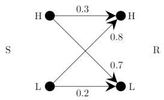
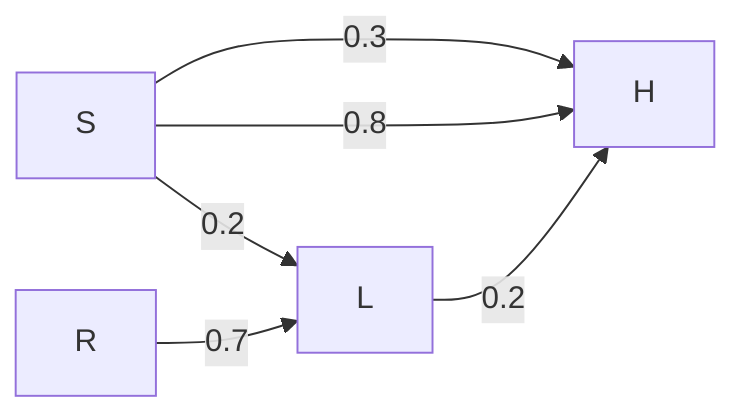
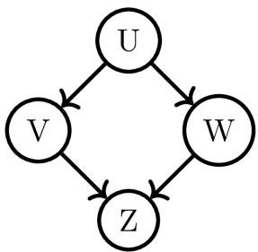
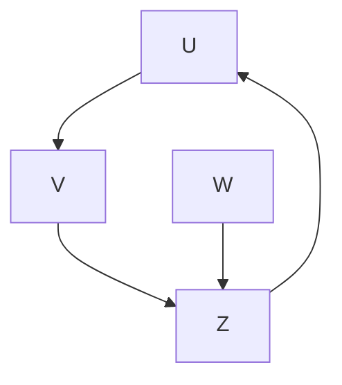

2. For Continuous Random Variable X:

$$
E [ X ] = \int_ {- \infty} ^ {\infty} x f (x) d x
$$

3. Expectation of a Function of a Random Variable $g(X)$ :

\- Discrete: $E[g(X)] = \sum_{x} g(x)P(X = x)$

\- Continuous: $E[g(X)] = \int_{-\infty}^{\infty} g(x)f(x)dx$

4. Linearity of Expectation: For any random variables X, Y and constants a, b:

$$
E [ a X + b Y ] = a E [ X ] + b E [ Y ]
$$

5. Expectation of Product (for Independent Variables): If $X$ and $Y$ are independent, then

$$
E [ X Y ] = E [ X ] E [ Y ].
$$

• Key Properties and Identities:

$\circ E[c] = c$ for a constant $c$ .  
$\circ E[\bar{X} - E[X]] = 0.$  
- Expectation is a linear operator.

• Common Pitfalls or Tricky Points:

- Confusing $E[X^2]$ with $(E[X])^2$ . They are generally not equal.  
- Applying $E[XY] = E[X]E[Y]$ when $X$ and $Y$ are not independent.  
- Incorrectly summing or integrating over the wrong range.

\- Standard Problem-Solving Techniques or Shortcuts:

- Identify whether the variable is discrete or continuous.  
- Use linearity of expectation extensively, as it holds even for dependent variables.  
- For complex functions, break them down using linearity.

# Exponential Distribution

Definition and Core Idea: The Exponential distribution is a continuous probability distribution that describes the time between events in a Poisson process, i.e., a process in which events occur continuously and independently at a constant average rate. It is memoryless, meaning the past duration does not affect future duration.

\- Important Formulas, Theorems, and Results:

1. Probability Density Function (PDF): For $X \sim \text{Exp}(\lambda)$ ,

$$
f (x; \lambda) = \lambda e ^ {- \lambda x} \quad \text { for } x \geq 0
$$

where $\lambda > 0$ is the rate parameter.

2. Cumulative Distribution Function (CDF):

$$
F (x; \lambda) = P (X \leq x) = 1 - e ^ {- \lambda x} \quad \text { for } x \geq 0
$$

3. Mean (Expectation): $E[X] = \frac{1}{\lambda}$  
4. Variance: $\operatorname{Var}(X) = \frac{1}{\lambda^2}$  
5. Memoryless Property: $P(X > s + t | X > s) = P(X > t)$ for any $s, t \geq 0$ .

• Key Properties and Identities:

- Models waiting times, lifetimes of components, etc.  
- Its rate parameter $\lambda$ is the inverse of the mean.  
- The only continuous distribution with the memoryless property.

• Common Pitfalls or Tricky Points:

- Confusing the rate parameter $\lambda$ with the mean $1 / \lambda$ .  
- Incorrectly applying the memoryless property or forgetting its implications.  
- Errors in integration for probabilities or moments if not using CDF.

\- Standard Problem-Solving Techniques or Shortcuts:

- Identify problems involving "time until" an event or "lifetime" with a constant rate.  
- Directly use CDF for $P(X \leq x)$ or $P(X > x)$ .  
- Apply the memoryless property to simplify conditional probability questions.

# Independent Events

Definition and Core Idea: Two events are independent if the occurrence of one does not affect the probability of the other occurring. Their probabilities multiply to give the probability of both occurring.

\- Important Formulas, Theorems, and Results:

1. Definition: Events A and B are independent if and only if:

$$
P (A \cap B) = P (A) P (B)
$$

2. Equivalent Conditions: If $P(B) > 0$ , then $A$ and $B$ are independent if and only if $P(A|B) = P(A)$ . Similarly, if $P(A) > 0$ , then $P(B|A) = P(B)$ .

3. Independence of Complements: If $A$ and $B$ are independent, then $A$ and $B^c$ , $A^c$ and $B$ , and $A^c$ and $B^c$ are also independent.

• Key Properties and Identities:

- Simplifies calculations involving joint probabilities.  
- Crucial assumption for many statistical models and distributions (e.g., Binomial, Poisson).

• Common Pitfalls or Tricky Points:

Confusing independent events with mutually exclusive events (disjoint events). Mutually exclusive events cannot be independent unless one has zero probability.  
- Assuming independence when it's not explicitly stated or logically implied.  
- Incorrectly applying the product rule for dependent events.

\- Standard Problem-Solving Techniques or Shortcuts:

- Always check the definition $P(A \cap B) = P(A)P(B)$ to verify independence.  
- If events are independent, use the simplified conditional probability $P(A|B) = P(A)$ .

# Normal Distribution

Definition and Core Idea: The Normal (or Gaussian) distribution is a symmetric, bell-shaped continuous probability distribution that is ubiquitous in natural and social sciences. It is characterized by its mean ( $\mu$ ) and standard deviation ( $\sigma$ ), and is central to the Central Limit Theorem.

\- Important Formulas, Theorems, and Results:

1. Probability Density Function (PDF): For $X \sim N(\mu, \sigma^{2})$ ,

$$
f (x; \mu , \sigma) = \frac {1}{\sigma \sqrt {2 \pi}} e ^ {- \frac {1}{2} \left(\frac {x - \mu}{\sigma}\right) ^ {2}} \quad \text {for} - \infty <   x <   \infty
$$

2. Mean (Expectation): $E[X] = \mu$  
3. Variance: $\operatorname{Var}(X) = \sigma^2$  
4. Standard Deviation: $\mathrm{SD}(X) = \sigma$  
5. Standard Normal Distribution: A normal distribution with $\mu = 0$ and $\sigma = 1$ , denoted $Z \sim N(0,1)$ .  
6. Standardization: If $X \sim N(\mu, \sigma^2)$ , then $Z = \frac{X - \mu}{\sigma} \sim N(0, 1)$ .  
7. Empirical Rule (68-95-99.7 Rule): Approximately 68% of data falls within $1\sigma$ of the mean, 95% within $2\sigma$ , and 99.7% within $3\sigma$ .

• Key Properties and Identities:

- Symmetric about its mean.  
- The mean, median, and mode are all equal to $\mu$ .  
- Sum of independent normal random variables is also normal.  
- Central Limit Theorem: The sum/average of a large number of independent and identically distributed random variables, regardless of their original distribution, tends towards a normal distribution.

• Common Pitfalls or Tricky Points:

- Not standardizing correctly before using Z-tables (if tables were provided, though GATE usually tests concepts).  
- Confusing variance $\sigma^2$ with standard deviation $\sigma$ .  
- Assuming normality when not justified, especially for small sample sizes.

\- Standard Problem-Solving Techniques or Shortcuts:

- Convert any normal variable to a standard normal variable using $Z = (X - \mu) / \sigma$ .  
- Use the symmetry of the normal distribution: $P(Z < -z) = P(Z > z)$ .  
- Apply the empirical rule for quick estimations.

# Poisson Distribution

Definition and Core Idea: The Poisson distribution is a discrete probability distribution that expresses the probability of a given number of events occurring in a fixed interval of time or space if these events occur with a known constant mean rate and independently of the time since the last event.

\- Important Formulas, Theorems, and Results:

1. Probability Mass Function (PMF): For $X \sim \text{Pois}(\lambda)$ ,

$$
P (X = k) = \frac {e ^ {- \lambda} \lambda^ {k}}{k !} \quad \text {for} k \in \{0, 1, 2, \dots \}
$$

where $\lambda > 0$ is the average rate of events in the interval.

2. Mean (Expectation): $E[X] = \lambda$  
3. Variance: $\operatorname{Var}(X) = \lambda$

• Key Properties and Identities:

- Models rare events.  
- The mean and variance are equal ( $\lambda$ ).  
- Can approximate the Binomial distribution when $n$ is large and $p$ is small, with $\lambda = np$ .  
- The sum of independent Poisson random variables is also a Poisson random variable (with rate parameter equal to the sum of individual rates).

• Common Pitfalls or Tricky Points:

- Incorrectly identifying $\lambda$ (the average rate for the specified interval). Ensure $\lambda$ is consistent with the time/space unit of the problem.  
- Miscalculating factorials or powers of $\lambda$ .  
- Confusing "at least," "at most," "exactly" in problem statements.

\- Standard Problem-Solving Techniques or Shortcuts:

- Identify problems involving counts of events over a fixed interval.  
- Use the complement rule for "at least" probabilities.  
- Remember that mean and variance are both $\lambda$ .

# Probability

Definition and Core Idea: Probability is a numerical measure of the likelihood of an event occurring. It is a value between 0 and 1, where 0 indicates impossibility and 1 indicates certainty. It forms the foundation for understanding randomness and uncertainty.

\- Important Formulas, Theorems, and Results:

1. Axioms of Probability:

- For any event $A, 0 \leq P(A) \leq 1$ .  
- $P(S) = 1$ where $S$ is the sample space.  
- For a sequence of mutually exclusive events $A_1, A_2, \ldots, P(\bigcup_{i=1}^{\infty} A_i) = \sum_{i=1}^{\infty} P(A_i)$ .

2. Complement Rule: $P(A^c) = 1 - P(A)$ .  
3. Addition Rule: $P(A \cup B) = P(A) + \dot{P}(B) - P(A \cap B)$ .  
4. For Mutually Exclusive Events: If $A \cap B = \emptyset$ , then $P(A \cup B) = P(A) + P(B)$ .

• Key Properties and Identities:

- Probabilities are non-negative.  
- The sum of probabilities of all possible outcomes is 1.  
- The probability of the impossible event is 0.

• Common Pitfalls or Tricky Points:

- Incorrectly identifying the sample space or events.  
- Misapplying the addition rule without accounting for overlaps.  
- Confusing "and" (∩) with "or" (∪).

\- Standard Problem-Solving Techniques or Shortcuts:

- Clearly define the sample space and events.  
- Use Venn diagrams for visualizing events and their intersections/unions.  
- For equally likely outcomes, $P(A) = \frac{\text{Number of outcomes in A}}{\text{Total number of outcomes}}$ .

# Probability Density Function (PDF)

Definition and Core Idea: The Probability Density Function (PDF), denoted $f(x)$ , is a function associated with continuous random variables. It describes the relative likelihood for the random variable to take on a given value. The area under the PDF curve over an interval gives the probability that the variable falls within that interval.

\- Important Formulas, Theorems, and Results:

1. Properties of a PDF:

- $f(x) \geq 0$ for all $x$ .  
$\int_{-\infty}^{\infty}f(x)dx = 1.$

2. Probability Calculation: $P(a \leq X \leq b) = \int_{a}^{b} f(x) dx$ .

3. Relationship with CDF: $f(x) = \frac{d}{dx} F(x)$ , where $F(x)$ is the Cumulative Distribution Function.

• Key Properties and Identities:

- The PDF itself does not give a probability; rather, its integral over an interval does.  
- For continuous variables, $P(X = x) = 0$ .

• Common Pitfalls or Tricky Points:

- Interpreting $f(x)$ as $P(X = x)$ . This is incorrect for continuous variables.  
- Forgetting to check if the PDF integrates to 1 over its entire domain.  
- Errors in integration limits or the function itself.

\- Standard Problem-Solving Techniques or Shortcuts:

- Always verify the two properties of a PDF.  
- Use integration to find probabilities over intervals.  
- If given a CDF, differentiate to find the PDF.

# Probability Distribution

Definition and Core Idea: A probability distribution is a mathematical function that describes all possible values and likelihoods that a random variable can take within a given range. It can be discrete (Probability Mass Function, PMF) or continuous (Probability Density Function, PDF).

\- Important Formulas, Theorems, and Results:

1. For Discrete Distributions (PMF $P(X = x)$ ):

- $0 \leq P(X = x) \leq 1$ for all $x$ .  
- $\sum_{x} P(X = x) = 1$ .

2. For Continuous Distributions (PDF $f(x)$ ):

- $f(x) \geq 0$ for all $x$ .  
$\int_{-\infty}^{\infty}f(x)dx = 1.$

3. Cumulative Distribution Function (CDF): $F(x) = P(X \leq x)$ .

- For discrete: $F(x) = \sum_{t \leq x} P(X = t)$ .  
- For continuous: $F(x) = \int_{-\infty}^{x} f(t) dt$ .

• Key Properties and Identities:

- Completely characterizes a random variable's behavior.  
。CDF is non-decreasing, $F(-\infty) = 0$ , $F(\infty) = 1$ .  
- Allows calculation of probabilities, expected values, and variances.

• Common Pitfalls or Tricky Points:

- Confusing PMF and PDF.  
- Incorrectly applying summation for continuous or integration for discrete.  
• Not understanding the difference between $P(X = x)$ and $P(X \leq x)$ .

\- Standard Problem-Solving Techniques or Shortcuts:

- Identify whether the random variable is discrete or continuous.  
- Use the appropriate function (PMF/PDF) and its properties to solve problems.  
- Understand the relationship between PMF/PDF and CDF.

# Random Variable

Definition and Core Idea: A random variable is a variable whose value is a numerical outcome of a random phenomenon. It is a function that maps outcomes from a sample space to real numbers. Random variables can be discrete (taking countable values) or continuous (taking values in an interval).

\- Important Formulas, Theorems, and Results:

1. Discrete Random Variable: Takes on a finite or countably infinite number of values (e.g., number of heads in coin flips).  
2. Continuous Random Variable: Takes on any value within a given interval (e.g., height, temperature).  
3. Probability Distribution: Each random variable has an associated probability distribution (PMF or PDF) that describes the probabilities of its possible values.

• Key Properties and Identities:

- Transforms qualitative outcomes into quantitative values.  
- Allows for mathematical analysis of random phenomena.  
- The sum, difference, product, or quotient of random variables is also a random variable.

# • Common Pitfalls or Tricky Points:

- Confusing the random variable itself with the values it can take.  
- Not correctly defining the sample space before defining the random variable.  
- Misidentifying whether a variable is discrete or continuous.

# - Standard Problem-Solving Techniques or Shortcuts:

- Clearly define the random variable and its possible values.  
- Determine if it's discrete or continuous to choose the correct probability distribution type.  
- Map real-world scenarios to appropriate random variable definitions.

# Square Invariant

Definition and Core Idea: While "Square Invariant" is not a standard term for a probability distribution or theorem, in the context of probability and statistics, it most likely refers to properties or transformations related to the square of a random variable, particularly in the calculation of moments or variance, or in the context of distributions like the Chi-Square distribution which involves sums of squared normal variables. It implies that certain properties hold true even after squaring the variable or that a transformation involving squaring preserves some characteristic.

# - Important Formulas, Theorems, and Results:

1. Second Moment: $E[X^2] = \sum x^2 P(X = x)$ (discrete) or $\int x^2 f(x) dx$ (continuous). This is a key "square" quantity.  
2. Variance Definition: $\operatorname{Var}(X) = E[(X - E[X])^2] = E[X^2] - (E[X])^2$ . This formula shows how $E[X^2]$ is used to calculate variance.  
3. Chi-Square Distribution: Defined as the sum of squares of independent standard normal random variables, $X = \sum_{i=1}^{k} Z_i^2 \sim \chi^2(k)$ . This is a direct application of squaring random variables.  
4. Properties of Variance: $\operatorname{Var}(aX) = a^2\operatorname{Var}(X)$ . This shows how scaling affects the variance (a square property).

# • Key Properties and Identities:

- $E[X^2]$ is always non-negative.  
- Variance measures the spread of a distribution in squared units.  
- The Chi-Square distribution is fundamental for statistical inference involving variances.

# • Common Pitfalls or Tricky Points:

- Confusing $E[X^2]$ with $(E[X])^2$ . They are distinct and generally not equal.  
- Incorrectly calculating $E[X^2]$ by not squaring the values before applying expectation.  
- Misinterpreting the degrees of freedom in Chi-Square related problems.

# - Standard Problem-Solving Techniques or Shortcuts:

- When calculating variance, always compute $E[X]$ and $E[X^2]$ separately.  
- Recognize that problems involving sums of squared normal variables point towards the Chi-Square distribution.  
- Remember that variance is always non-negative.

# Statistics

Definition and Core Idea: Statistics is the science of collecting, analyzing, interpreting, presenting, and organizing data. In the context of probability, statistics involves using data from a sample to make inferences about a larger population, often relying on probability distributions to quantify uncertainty.

# - Important Formulas, Theorems, and Results:

# 1. Measures of Central Tendency:

- Mean ( $\mu$ or $\bar{x}$ ): Average value.  
■ Median: Middle value when data is ordered.  
■ Mode: Most frequent value.

# 2. Measures of Dispersion:

- Variance ( $\sigma^2$ or $s^2$ ): Average of the squared differences from the mean.  
- Standard Deviation ( $\sigma$ or $s$ ): Square root of variance, in original units.  
- Range: Max value - Min value.

# 3. Sample vs. Population:

- Population Mean: $\mu = E[X]$  
- Sample Mean: $\bar{X} = \frac{1}{n} \sum_{i=1}^{n} X_i$

- Population Variance: $\sigma^2 = E[(X - \mu)^2]$  
- Sample Variance: $s^2 = \frac{1}{n-1} \sum_{i=1}^{n} (X_i - \bar{X})^2$ (unbiased estimator)

• Key Properties and Identities:

- Statistics provides tools to summarize and interpret data.  
- Probability distributions are models for the underlying data generation process.  
- Central Limit Theorem is a bridge between probability and statistics.

• Common Pitfalls or Tricky Points:

- Confusing population parameters $(\mu, \sigma^2)$ with sample statistics $(\bar{x}, s^2)$ .  
- Using $n$ instead of $n - 1$ in the denominator for sample variance (for unbiased estimation).  
- Misinterpreting the meaning of different measures (e.g., mean vs. median for skewed data).

\- Standard Problem-Solving Techniques or Shortcuts:

- Identify whether the problem refers to a population or a sample.  
- Know the definitions and formulas for common descriptive statistics.  
- Understand how probability distributions are used to model observed data.

# Uniform Distribution

Definition and Core Idea: The Uniform distribution is a continuous probability distribution where all values within a given interval $[a, b]$ are equally likely. It has a constant probability density over its support and zero elsewhere.

\- Important Formulas, Theorems, and Results:

1. Probability Density Function (PDF): For $X \sim U(a, b)$ ,

$$
f (x) = \left\{ \begin{array}{l l} \frac {1}{b - a} & \text {for} a \leq x \leq b \\ 0 & \text {otherwise} \end{array} \right.
$$

2. Cumulative Distribution Function (CDF):

$$
F (x) = \left\{ \begin{array}{l l} 0 & \text {for} x <   a \\ \frac {x - a}{b - a} & \text {for} a \leq x \leq b \\ 1 & \text {for} x > b \end{array} \right.
$$

3. Mean (Expectation): $E[X] = \frac{a + b}{2}$

4. Variance: $\operatorname{Var}(X) = \frac{(b - a)^2}{12}$

• Key Properties and Identities:

- All outcomes within the interval $[a, b]$ are equally probable.  
- Often used as a null hypothesis or a simple model when no other information is available.

• Common Pitfalls or Tricky Points:

- Incorrectly identifying the interval $[a, b]$ .  
- Errors in calculating probabilities for sub-intervals (e.g., $P(c \leq X \leq d) = \frac{d - c}{b - a}$ ).  
- Forgetting the constant $1/12$ in the variance formula.

\- Standard Problem-Solving Techniques or Shortcuts:

- Draw the PDF as a rectangle for visualization.  
- Probabilities are simply the ratio of the length of the sub-interval to the length of the total interval.  
- Memorize mean and variance formulas.

# Variance

Definition and Core Idea: Variance is a measure of the spread or dispersion of a set of data points around their mean. It quantifies how much the values of a random variable deviate from its expected value, on average. A higher variance indicates greater variability.

\- Important Formulas, Theorems, and Results:

1. Definition: $\operatorname{Var}(X) = E[(X - E[X])^2]$  
2. Computational Formula: $\operatorname{Var}(X) = E[X^2] - (E[X])^2$  
3. For Discrete Random Variable X:

$$
\mathrm{Var} (X) = \sum_ {x} (x - E [ X ]) ^ {2} P (X = x) = \sum_ {x} x ^ {2} P (X = x) - (E [ X ]) ^ {2}
$$

# 4. For Continuous Random Variable X:

$$
\mathrm{Var} (X) = \int_ {- \infty} ^ {\infty} (x - E [ X ]) ^ {2} f (x) d x = \int_ {- \infty} ^ {\infty} x ^ {2} f (x) d x - (E [ X ]) ^ {2}
$$

# 5. Properties of Variance:

- $\operatorname{Var}(c) = 0$ for a constant $c$ .  
- $\operatorname{Var}(aX) = a^2\operatorname{Var}(X)$ for a constant $a$ .  
- $\operatorname{Var}(X + c) = \operatorname{Var}(X)$ for a constant $c$ .  
- $\operatorname{Var}(aX + b) = a^2\operatorname{Var}(X)$ .  
- For independent random variables $X, Y: \operatorname{Var}(X + Y) = \operatorname{Var}(X) + \operatorname{Var}(Y)$ .  
- For independent random variables $X, Y$ : $\operatorname{Var}(X - Y) = \operatorname{Var}(X) + \operatorname{Var}(Y)$ .

# 6. Standard Deviation: $\mathrm{SD}(X) = \sqrt{\mathrm{Var}(X)}$ .

# • Key Properties and Identities:

- Variance is always non-negative.  
- It is expressed in squared units of the random variable.  
- It measures the average squared deviation from the mean.

# • Common Pitfalls or Tricky Points:

- Forgetting to square the deviations or the constant $a$ when applying properties.  
Assuming $\operatorname{Var}(X + Y) = \operatorname{Var}(X) + \operatorname{Var}(Y)$ when $X$ and $Y$ are not independent (this requires covariance terms).  
- Confusing variance with standard deviation.

# - Standard Problem-Solving Techniques or Shortcuts:

- Always use the computational formula $\operatorname{Var}(X) = E[X^2] - (E[X])^2$ as it's often easier.  
- Leverage the properties of variance to simplify calculations for linear transformations or sums of independent variables.  
- Calculate $E[X]$ first, then $E[X^2]$ .

# Quick Formula Reference

# - Basic Probability

- Addition Rule: $P(A \cup B) = P(A) + P(B) - P(A \cap B)$  
- Complement Rule: $P(A^c) = 1 - P(A)$

# • Conditional Probability

○ Definition: $P(A|B)=\frac{P(A\cap B)}{P(B)}$  
○ Multiplication Rule: $P(A \cap \dot{B}) = P(A|B)P(B)$  
- Law of Total Probability: $P(B) = \sum_{i=1}^{n} P(B|A_i)P(A_i)$

# - Independent Events

\- Condition: $P(A \cap B) = P(A)P(B)$ or $P(A|B) = P(A)$

# - Bayes Theorem

\- Formula: $P(A|B) = \frac{P(B|A)P(A)}{P(B)}$

# - Expectation (Mean)

- Discrete: $E[X] = \sum_{x} xP(X = x)$  
- Continuous: $E[X] = \int_{-\infty}^{\infty} x f(x) dx$  
○ Linearity: $E[aX + bY] = aE[X] + bE[Y]$

# - Variance

- Definition: $\operatorname{Var}(X) = E[(X - E[X])^2]$  
- Computational: $\operatorname{Var}(X) = E[X^2] - (E[X])^2$  
- Properties: $\operatorname{Var}(aX + b) = a^2\operatorname{Var}(X)$  
- For independent $X, Y: \operatorname{Var}(X \pm Y) = \operatorname{Var}(X) + \operatorname{Var}(Y)$  
- Standard Deviation: $\mathrm{SD}(X) = \sqrt{\mathrm{Var}(X)}$

# - Bernoulli Distribution ( $X \in \{0,1\}$ , $P(X = 1) = p$ )

$\circ$ PMF: $P(X = x) = p^{x}(1 - p)^{1 - x}$  
- Mean: $E[X] = p$  
- Variance: $\operatorname{Var}(X) = p(1 - p)$

# - Binomial Distribution ( $X \sim B(n, p)$ )

$\circ$ PMF: $P(X = k) = \binom{n}{k} p^k (1 - p)^{n - k}$  
- Mean: $E[X] = np$  
- Variance: $\operatorname{Var}(X) = np(1 - p)$

\- Poisson Distribution ( $X \sim \text{Pois}(\lambda)$ )

$\circ$ PMF: $P(X = k) = \frac{e^{-\lambda}\lambda^k}{k!}$  
○ Mean: $E[X] = \lambda$  
- Variance: $\operatorname{Var}(X) = \lambda$

\- Uniform Distribution $(X \sim U(a, b))$

$\circ$ PDF: $f(x) = \frac{1}{b - a}$ for $a \leq x \leq b$ , else 0  
$\circ$ Mean: $E[X] = \frac{a + b}{2}$  
- Variance: $\operatorname{Var}(X) = \frac{(b - a)^2}{12}$

\- Exponential Distribution ( $\bar{X} \sim \text{Exp}(\lambda)$ )

$\circ$ PDF: $f(x) = \lambda e^{-\lambda x}$ for $x \geq 0$ , else 0  
$\circ$ CDF: $F(x) = 1 - e^{-\lambda x}$ for $x\geq 0$  
$\circ$ Mean: $E[X] = \frac{1}{\lambda}$  
- Variance: $\operatorname{Var}(\hat{X}) = \frac{1}{\lambda^2}$  
○ Memoryless: $P(X > s + t | X > s) = P(X > t)$

\- Normal Distribution ( $X \sim N(\mu, \sigma^2)$ )

$\circ$ PDF: $f(x) = \frac{1}{\sigma\sqrt{2\pi}} e^{-\frac{1}{2}\left(\frac{x - \mu}{\sigma}\right)^2}$  
- Mean: $E[X] = \mu$  
- Variance: $\operatorname{Var}(X) = \sigma^2$  
- Standardization: $Z = \frac{X - \mu}{\sigma} \sim N(0,1)$

\- Chi-Square Distribution ( $X \sim \chi^2(k)$ )

- Definition: Sum of $k$ squared independent standard normal variables.  
- Mean: $E[X] = k$  
- Variance: $\operatorname{Var}(X) = 2k$

# Important Tips for GATE

1. Master the Fundamentals: Ensure a strong grasp of basic probability axioms, conditional probability, and independence. Many complex problems are built upon these foundational concepts. Don't rush through them.  
2. Understand Discrete vs. Continuous: Clearly distinguish between discrete and continuous random variables.  
Know when to use summation (PMF) versus integration (PDF), and remember that $P(X = x) = 0$ for continuous variables.  
3. Memorize Key Distribution Properties: For each distribution (Bernoulli, Binomial, Poisson, Uniform, Exponential, Normal, Chi-Square), memorize their PMF/PDF, mean, and variance. This saves crucial time in the exam.  
4. Practice Conditional Probability and Bayes' Theorem: These are frequently tested. Practice problems that require careful identification of events and application of the formulas, especially those involving multiple stages or diagnostic scenarios.  
5. Pay Attention to Keywords: Words like "at least," "at most," "exactly," "given that," "independent," and "without replacement" significantly alter problem interpretation and solution approach. Read questions carefully.  
6. Leverage Linearity of Expectation and Variance Properties: $E[aX + bY] = aE[X] + bE[Y]$ is powerful as it holds even for dependent variables. For variance, remember $\operatorname{Var}(aX + b) = a^2\operatorname{Var}(X)$ and $\operatorname{Var}(X \pm Y) = \operatorname{Var}(X) + \operatorname{Var}(Y)$ only for independent variables.  
7. Don't Confuse Mean and Variance Parameters: For Exponential distribution, $\lambda$ is the rate, mean is $1/\lambda$ . For Normal, $\mu$ is mean, $\sigma^{2}$ is variance (not $\sigma$ ). Small errors here are common pitfalls.  
8. Practice Problem Solving: The best way to prepare is to solve a wide variety of problems from previous GATE papers and standard textbooks. Focus on understanding the logic behind each step, not just getting the answer.

7.1

# Bayes Theorem (3)

# 7.1.1 Bayes Theorem: GATE CSE 2018 | Question: 44

Consider Guwahati, $(G)$ and Delhi $(D)$ whose temperatures can be classified as high $(H)$ , medium $(M)$ and low $(L)$ . Let $P(H_G)$ denote the probability that Guwahati has high temperature. Similarly, $P(M_G)$ and

$P(L_{G})$ denotes the probability of Guwahati having medium and low temperatures respectively. Similarly, we use $P(H_{D})$ , $P(M_{D})$ and $P(L_{D})$ for Delhi. The following table gives the conditional probabilities for Delhi's temperature given Guwahati's temperature.

<table><tr><td></td><td> $H_D$ </td><td> $M_D$ </td><td> $L_D$ </td></tr><tr><td> $H_G$ </td><td>0.40</td><td>0.48</td><td>0.12</td></tr><tr><td> $M_G$ </td><td>0.10</td><td>0.65</td><td>0.25</td></tr><tr><td> $L_G$ </td><td>0.01</td><td>0.50</td><td>0.49</td></tr></table>

Consider the first row in the table above. The first entry denotes that if Guwahati has high temperature $(H_{G})$ then the probability of Delhi also having a high temperature $(H_{D})$ is 0.40; i.e., $P(H_{D} \mid H_{G}) = 0.40$ . Similarly, the next two entries are $P(M_{D} \mid H_{G}) = 0.48$ and $P(L_{D} \mid H_{G}) = 0.12$ . Similarly for the other rows.

If it is known that $P(H_{G}) = 0.2$ , $P(M_{G}) = 0.5$ , and $P(L_{G}) = 0.3$ , then the probability (correct to two decimal places) that Guwahati has high temperature given that Delhi has high temperature is \_\_\_\_.

gatecse-2018 probability bayes-theorem conditional-probability numerical-answers two-marks

# Answer key

# 7.1.2 Bayes Theorem: GATE CSE 2021 | Set 1 | Question: 54

A sender (S) transmits a signal, which can be one of the two kinds: H and L with probabilities 0.1 and 0.9 respectively, to a receiver (R).

In the graph below, the weight of edge $(u,v)$ is the probability of receiving v when u is transmitted, where $u,v \in \{H,L\}$ . For example, the probability that the received signal is L given the transmitted signal was H, is 0.7.

flowchart

If the received signal is H, the probability that the transmitted signal was H (rounded to 2 decimal places) is \_\_\_\_.

gatecse-2021-set1 probability bayes-theorem conditional-probability numerical-answers two-marks

# Answer key

# 7.1.3 Bayes Theorem: GATE DA 2025 | Question: 21

There are three boxes containing white balls and black balls.

Box -1 contains 2 black and 1 white balls.

Box- 2 contains 1 black and 2 white balls.

Box -3 contains 3 black and 3 white balls.

In a random experiment, one of these boxes is selected, where the probability of choosing Box-1 is $\frac{1}{2}$ , Box-2 is $\frac{1}{6}$ , and Box-3 is $\frac{1}{3}$ . A ball is drawn at random from the selected box. Given that the ball drawn is white, the probability that it is drawn from Box-2 is \_\_\_\_ (Round off to two decimal places)

gateda-2025 probability bayes-theorem numerical-answers one-mark

# Answer key

# 7.2.1 Bayesian Network: GATE DS&AI 2024 | Question: 14

Consider five random variables $U, V, W, X$ , and $Y$ whose joint distribution satisfies:

$$
P (U, V, W, X, Y) = P (U) P (V) P (W \mid U, V) P (X \mid W) P (Y \mid W)
$$

Which ONE of the following statements is FALSE?

A. $Y$ is conditionally independent of $V$ given $W$  
B. $X$ is conditionally independent of $U$ given $W$  
C. $U$ and $V$ are conditionally independent given $W$  
D. $Y$ and $X$ are conditionally independent given $W$

gate-ds-ai-2024 probability random-variable bayesian-network one-mark

# Answer key

# 7.2.2 Bayesian Network: GATE DS&AI 2024 | Question: 54

Given the following Bayesian Network consisting of four Bernoulli random variables and the associated conditional probability tables:

flowchart

<table><tr><td></td><td> $P(\cdot)$ </td></tr><tr><td> $U = 0$ </td><td>0.5</td></tr><tr><td> $U = 1$ </td><td>0.5</td></tr></table>

<table><tr><td></td><td> $P(V=0 \mid \cdot)$ </td><td> $P(V=1 \mid \cdot)$ </td></tr><tr><td> $U=0$ </td><td>0.5</td><td>0.5</td></tr><tr><td> $U=1$ </td><td>0.5</td><td>0.5</td></tr></table>

<table><tr><td></td><td> $P(W=0 \mid \cdot)$ </td><td> $P(W=1 \mid \cdot)$ </td></tr><tr><td> $U=0$ </td><td>1</td><td>0</td></tr><tr><td> $U=1$ </td><td>0</td><td>1</td></tr></table>

<table><tr><td></td><td></td><td> $P(Z=0 \mid \cdot)$ </td><td> $P(Z=1 \mid \cdot)$ </td></tr><tr><td> $V=0$ </td><td> $W=0$ </td><td>0.5</td><td>0.5</td></tr><tr><td> $V=0$ </td><td> $W=1$ </td><td>1</td><td>0</td></tr><tr><td> $V=1$ </td><td> $W=0$ </td><td>1</td><td>0</td></tr><tr><td> $V=1$ </td><td> $W=1$ </td><td>0.5</td><td>0.5</td></tr></table>

The value of $P(U=1,V=1,W=1,Z=1)=$ \_\_\_\_ (rounded off to three decimal places).

gate-ds-ai-2024 probability bayesian-network numerical-answers two-marks

# Answer key

# 7.3

# Bernoulli Distribution (2)

# 7.3.1 Bernoulli Distribution: GATE DA 2025 | Question: 30

A random variable $X$ is said to be distributed as Bernoulli(θ), denoted by $X \sim \text{Bernoulli}(\theta)$ , if

$$
P (X = 1) = \theta , \quad P (X = 0) = 1 - \theta
$$

for $0 < \theta < 1$ . Let $Y = \sum_{i=1}^{300} X_i$ , where $X_i \sim \text{Bernoulli}(\theta)$ , $i = 1, 2, \ldots, 300$ be independent and identically distributed random variables with $\theta = 0.25$ . The value of $P(60 \leq Y \leq 90)$ , after approximation through Central Limit Theorem, is given by (Recall that $\phi(x) = \frac{1}{\sqrt{2\pi}} \int_{-\infty}^{x} e^{-\frac{t^2}{2}} dt$ )

A. $\phi(2) - \phi(-2)$

B. $\phi(1) - \phi(-1)$

C. $\phi(3)-\phi(-3)$

D. $\phi(90) - \phi(60)$

gateda-2025 probability random-variable bernoulli-distribution two-marks

# Answer key

# 7.3.2 Bernoulli Distribution: GATE DA 2026 | Question: 54

Let $A_{5 \times 5}$ be a matrix such that each of its elements follows Bernoulli(p = 0.50) distribution independently.

The probability that the row-sum of the second row and the column-sum of the third column are both equal to 3 is \_\_\_\_ (Rounded off to two decimal places)

gateda-2026 probability bernoulli-distribution numerical-answers two-marks

# Answer key

# 7.4

# Binomial Distribution (6)

# Practice Test: Test 1 (10Q)

# 7.4.1 Binomial Distribution: GATE CSE 2002 | Question: 2.16

Four fair coins are tossed simultaneously. The probability that at least one head and one tail turn up is

A. $\frac{1}{16}$

B. $\frac{1}{8}$

C. $\frac{7}{8}$

D. $\frac{15}{16}$

gatecse-2002 probability easy binomial-distribution

# Answer key

# 7.4.2 Binomial Distribution: GATE CSE 2005 | Question: 52

A random bit string of length n is constructed by tossing a fair coin n times and setting a bit to 0 or 1 depending on outcomes head and tail, respectively. The probability that two such randomly generated strings are not identical is:

A. $\frac{1}{2^{n}}$

B. $1 - \frac{1}{n}$

C. $\frac{1}{n!}$

D. $1 - \frac{1}{2^n}$

gatecse-2005 probability binomial-distribution easy

# Answer key

# 7.4.3 Binomial Distribution: GATE CSE 2006 | Question: 21

For each element in a set of size 2n, an unbiased coin is tossed. The 2n coin tosses are independent. An element is chosen if the corresponding coin toss was a head. The probability that exactly n elements are chosen is

A. $\frac{2^{n}C_{n}}{4^{n}}$

B. $\frac{2^{n}C_{n}}{2^{n}}$

C. $\frac{1}{2nC_{n}}$

D. $\frac{1}{2}$

gatecse-2006 probability binomial-distribution normal

# Answer key

# 7.4.4 Binomial Distribution: GATE IT 2005 | Question: 32

An unbiased coin is tossed repeatedly until the outcome of two successive tosses is the same. Assuming that the trials are independent, the expected number of tosses is

A. 3

B. 4

C. 5

D. 6

gateit-2005 probability binomial-distribution expectation normal

# Answer key

# 7.4.5 Binomial Distribution: GATE IT 2006 | Question: 22

When a coin is tossed, the probability of getting a Head is p, 0 < p < 1. Let N be the random variable denoting the number of tosses till the first Head appears, including the toss where the Head appears. Assuming that successive tosses are independent, the expected value of N is

A. $\frac{1}{p}$

B. $\frac{1}{(1-p)}$

C. $\frac{1}{p^{2}}$

D. $\frac{1}{(1-p^{2})}$

gateit-2006 probability binomial-distribution expectation normal

# Answer key

# 7.4.6 Binomial Distribution: GATE IT 2007 | Question: 1

Suppose there are two coins. The first coin gives heads with probability $\frac{5}{8}$ when tossed, while the second coin gives heads with probability $\frac{1}{4}$ . One of the two coins is picked up at random with equal probability and that what is the probability of obtaining heads?

A. $\left(\frac{7}{8}\right)$

B. $\left(\frac{1}{2}\right)$

C. $\left(\frac{7}{16}\right)$

D. $\left(\frac{5}{32}\right)$

gateit-2007 probability normal binomial-distribution

# Answer key

# 7.5

# Chi Square Distribution (1)

# 7.5.1 Chi Square Distribution: GATE DA 2026 | Question: 43

Let $X_{1}, X_{2}, \ldots, X_{n}$ be n independent random variables. Each of the random variables follows Normal $(\mu = 0, \sigma^{2} = 1)$ distribution. Define $X = \frac{1}{n} \sum_{i=1}^{n} X_{i}$ .

Which of the following statements is/are correct?

