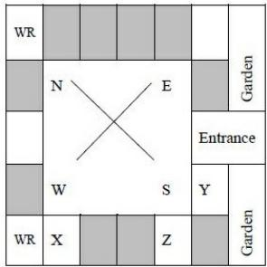

10. Degree of Intensity: e.g., WARM : HOT :: ANNOY : ENRAGE

• Key Properties and Identities:

- The relationship must be consistent and precise.  
- Consider the order of elements in the pair; it often matters.  
- Relationships can be direct or indirect, but should be the strongest possible link.

• Common Pitfalls or Tricky Points:

- Choosing an option with a weak or secondary relationship.  
- Overthinking and finding obscure connections.  
- Not considering all options before making a choice.  
- Ignoring the direction of the relationship (e.g., tool-worker vs. worker-tool).

\- Standard Problem-Solving Techniques or Shortcuts:

- Clearly identify the relationship between the first pair. Express it as a sentence (e.g., "A is a type of B," "A causes B").  
- Apply the exact same relationship to the options provided.  
- If multiple options seem plausible, look for the most specific and direct relationship.  
- Consider different categories of relationships (functional, structural, categorical, etc.).

# Code Words

Definition and Core Idea: Code word problems involve deciphering a hidden rule used to transform one set of words or letters into another. The core idea is to identify the pattern of transformation and apply it to a new word.

\- Important Formulas and Results: No mathematical formulas. "Results" are common coding patterns:

1. Letter Shifting: Each letter is shifted by a fixed number of positions in the alphabet (e.g., A becomes C, B becomes D).  
2. Letter Reversal: The order of letters in the word is reversed.  
3. Substitution: Specific letters are replaced by other specific letters or symbols.  
4. Position-based Coding: Letters are coded based on their position in the word or alphabet.  
5. Mixed Patterns: A combination of the above, e.g., shifting and reversing.

• Key Properties and Identities:

- The coding rule is consistent throughout the given examples.  
- The rule can be simple (e.g., +1 shift) or complex (e.g., vowel-consonant specific shifts).

• Common Pitfalls or Tricky Points:

- Missing subtle patterns, especially when multiple rules are combined.  
- Assuming a simple rule when a more complex one is in play.  
- Not considering the alphabet's cyclical nature (e.g., $Z + 1 = A$ ).

\- Standard Problem-Solving Techniques or Shortcuts:

Write down the alphabet and its numerical positions (A=1, B=2, ..., Z=26).  
- Compare the original word with its coded form letter by letter.  
- Look for common differences in positions, reversals, or direct substitutions.  
- Test your identified rule with any other given examples before applying it to the question.

# Coding Decoding

Definition and Core Idea: Coding-decoding problems are an extension of code words, often involving numbers, symbols, or more intricate letter manipulations. The core idea remains to identify the underlying coding rule and apply it to decode a message or encode a new one.

\- Important Formulas and Results: No specific formulas, but common methods:

1. Alphabet Position Values: Using $A = 1, B = 2, \dots, Z = 26$ and performing arithmetic operations.  
2. Opposite Letter Coding: Replacing a letter with its opposite (e.g., A with Z, B with Y).  
3. Symbol Substitution: Each letter or digit is replaced by a unique symbol.  
4. Matrix/Grid Coding: Letters are coded based on their position in a predefined grid.  
5. Mixed Operations: Combining letter shifts with numerical operations or symbol substitutions.

• Key Properties and Identities:

- The coding scheme is logical and consistent.  
- Often, the same letter/number will have the same code throughout a problem.

• Common Pitfalls or Tricky Points:

- Overlooking multiple layers of coding (e.g., shift then reverse).  
- Miscalculating numerical positions or applying incorrect arithmetic.  
- Assuming a simple pattern when a more complex one exists.

\- Standard Problem-Solving Techniques or Shortcuts:

- For letter-to-number codes, always write down the alphabet with its numerical positions.  
- Look for common letters in different coded words to deduce their codes.  
- Identify if the code is based on position, value, type (vowel/consonant), or a combination.  
- Systematically test hypotheses about the coding rule.

# Direction Sense

Definition and Core Idea: Direction sense problems involve determining the relative position and direction of a person or object after a series of movements. The core idea is to visualize or diagram the movements and apply principles of geometry.

# - Important Formulas and Results:

1. Pythagorean Theorem: For finding the shortest distance between two points when movements form a right-angled triangle. If a person moves $x$ units in one perpendicular direction and $y$ units in another, the shortest distance $d$ from the starting point is given by $d = \sqrt{x^2 + y^2}$ .  
2. Cardinal Directions: North (N), South (S), East (E), West (W).  
3. Intermediate Directions: Northeast (NE), Northwest (NW), Southeast (SE), Southwest (SW).

# • Key Properties and Identities:

- A right turn means a 90-degree clockwise rotation. A left turn means a 90-degree anti-clockwise rotation.  
- "Facing North" and "moving North" are distinct concepts.  
- Shadow problems: In the morning, shadow falls to the West. In the evening, shadow falls to the East. At noon, no shadow (or directly below).

# • Common Pitfalls or Tricky Points:

- Confusing left/right turns, especially when facing different directions.  
- Misinterpreting "from" and "to" in distance calculations.  
- Calculation errors in applying the Pythagorean theorem.  
- Not distinguishing between "distance travelled" and "shortest distance from start".

# - Standard Problem-Solving Techniques or Shortcuts:

- Draw a clear diagram. Use a cross (+) to represent cardinal directions.  
- Start from a central point and mark each movement.  
- Use coordinates (x, y) to track position, where North is +y, South is -y, East is +x, West is -x.  
- For shortest distance, identify if a right-angled triangle is formed.

# Family Relationship

Definition and Core Idea: Family relationship problems require you to deduce the relationship between two individuals based on a series of statements describing their familial connections. The core idea is to construct a mental or physical family tree.

\- Important Formulas and Results: No mathematical formulas. "Results" are standard family relations:

1. Parent: Father/Mother  
2. Sibling: Brother/Sister  
3. Spouse: Husband/Wife  
4. Child: Son/Daughter  
5. Grandparent: Father's/Mother's Father/Mother  
6. Grandchild: Son's/Daughter's Son/Daughter  
7. Uncle/Aunt: Parent's Brother/Sister  
8. Nephew/Niece: Sibling's Son/Daughter  
9. Cousin: Uncle's/Aunt's Child  
10. In-laws: Relations by marriage (e.g., Father-in-law, Sister-in-law).

# • Key Properties and Identities:

- Relationships are reciprocal (e.g., if A is B's father, B is A's child).  
- Gender is crucial; do not assume gender unless explicitly stated or implied.

# • Common Pitfalls or Tricky Points:

- Confusing genders (e.g., assuming "cousin" implies male or female).  
- Misinterpreting complex statements with multiple "of"s (e.g., "my father's only son's wife").  
- Making assumptions not explicitly stated in the problem.  
- Overlooking the possibility of multiple relationships for a single individual.

# - Standard Problem-Solving Techniques or Shortcuts:

Draw a family tree diagram. Use symbols for gender (e.g., + for male, - for female) and relationships (e.g., horizontal line for siblings, vertical line for parent-child, double horizontal line for marriage).  
- Break down complex statements into smaller, manageable parts.

- Start from a definite relationship and build outwards.  
- Work backwards from the person whose relationship is being asked.

# Inequality

Definition and Core Idea: Inequality problems involve comparing quantities using relational operators like greater than ( $>$ ), less than ( $<$ ), greater than or equal to ( $\geq$ ), less than or equal to ( $\leq$ ), and not equal to ( $\neq$ ). The core idea is to deduce valid conclusions from a set of given inequality statements.

# - Important Formulas and Results:

1. Transitivity: If $a > b$ and $b > c$ , then $a > c$ . Similarly for $<, \geq, \leq$ .  
2. Addition/Subtraction: If $a > b$ , then $a + c > b + c$ and $a - c > b - c$ .

3. Multiplication/Division by Positive: If $a > b$ and $c > 0$ , then $ac > bc$ and $\frac{a}{c} > \frac{b}{c}$ .

4. Multiplication/Division by Negative: If $a > b$ and $c < 0$ , then $ac < bc$ and $\frac{a}{c} < \frac{b}{c}$ . (Note: The inequality sign reverses).

# 5. Combining Inequalities:

- If $a > b$ and $c > d$ , then $a + c > b + d$ .  
- If $a > b$ and $c < d$ , no definite conclusion can be drawn about $a + c$ vs $b + d$ .

# • Key Properties and Identities:

- The direction of the inequality sign is crucial.  
- An equality sign (=) can be treated as both ≥ and ≤.  
- If there is a break in the chain of comparison (e.g., $A > B$ and $C < B$ ), direct comparison between $A$ and $C$ might not be possible without more information.

# • Common Pitfalls or Tricky Points:

- Incorrectly reversing the inequality sign when multiplying or dividing by a negative number.  
- Assuming a direct relationship between two variables when the chain of comparison is broken.  
- Confusing strict inequalities $(>, <)$ with non-strict ones $(\ge, \le)$ .

# - Standard Problem-Solving Techniques or Shortcuts:

- Combine the given statements into a single chain of inequalities (e.g., $A > B \geq C < D$ ).  
- Identify common elements to link different statements.  
- For conclusions, trace the path between the two variables in question. If a consistent direction of inequality exists, the conclusion is valid.  
- If the path involves opposing inequality signs (e.g., $A > B < C$ ), no definite conclusion can be drawn.

# Logical Inference

Definition and Core Idea: Logical inference involves drawing valid conclusions from a set of given premises (statements) using established rules of logic. The core idea is to determine what must be true if the premises are true, without introducing external information.

\- Important Formulas and Results: No mathematical formulas. "Results" are rules of inference:

1. Modus Ponens: If P then Q. P. Therefore, Q. ((P → Q) ∧ P) → Q  
2. Modus Tollens: If P then Q. Not Q. Therefore, Not P. ((P → Q) ∧ ¬Q) → ¬P  
3. Hypothetical Syllogism: If P then Q. If Q then R. Therefore, If P then R. ((P → Q) ∧ (Q → R)) → (P → R)  
4. Disjunctive Syllogism: P or Q. Not P. Therefore, Q. ((P ∨ Q) ∧ ¬P) → Q  
5. Conjunction: P. Q. Therefore, P and Q. $(P \land Q) \rightarrow (P \land Q)$  
6. Simplification: P and Q. Therefore, P. $(P \land Q) \rightarrow P$

# • Key Properties and Identities:

- A conclusion is logically valid if it necessarily follows from the premises, regardless of whether the premises themselves are true in reality.  
- Validity is about the structure of the argument, not the truth of its content.

# • Common Pitfalls or Tricky Points:

- Making assumptions not explicitly stated in the premises.  
- Confusing correlation with causation.  
- Committing logical fallacies (e.g., affirming the consequent, denying the antecedent).  
- Drawing conclusions that are merely possible, not necessary.

# - Standard Problem-Solving Techniques or Shortcuts:

- Represent statements symbolically (e.g., P for "It is raining," Q for "The ground is wet").  
- Use Venn diagrams for categorical propositions (All A are B, Some A are B, No A are B).  
- Test each conclusion against the premises to see if it must be true.

\- Eliminate options that introduce new information or are only possibly true.

# Logical Reasoning

Definition and Core Idea: Logical reasoning is a broad category encompassing various types of puzzles and problems that require deductive or inductive thinking to arrive at a solution. It tests your ability to analyze information, identify patterns, and draw sound conclusions. The core idea is systematic analysis and deduction.

\- Important Formulas and Results: No specific mathematical formulas. "Results" are principles of reasoning:

1. Deductive Reasoning: Moving from general principles to specific conclusions (guaranteed if premises are true).  
2. Inductive Reasoning: Moving from specific observations to general conclusions (probabilistic).  
3. Abductive Reasoning: Inferring the simplest or most likely explanation for an observation.

• Key Properties and Identities:

- Consistency: The solution must not contradict any given statement.  
- Completeness: All conditions must be satisfied.  
- Uniqueness: Often, there is only one correct solution (though some problems may have multiple).

• Common Pitfalls or Tricky Points:

- Jumping to conclusions without considering all possibilities.  
- Misinterpreting complex statements or conditions.  
- Failing to account for all constraints.  
- Getting overwhelmed by the amount of information.

\- Standard Problem-Solving Techniques or Shortcuts:

- Break down the problem into smaller, manageable parts.  
- Use tables, grids, or diagrams to organize information and track deductions.  
- Start with the most definite statements or constraints.  
- Use elimination: rule out options that contradict any condition.  
- Test hypotheses: try a possible solution and see if it fits all conditions.

# Number Relations

Definition and Core Idea: Number relation problems involve identifying the underlying pattern or relationship between numbers in a given sequence, set, or pair. The core idea is to discover the rule that governs the numbers and apply it to find missing terms or solve related questions.

\- Important Formulas and Results:

1. Arithmetic Progression (AP):

- $n$ -th term: $a_{n} = a_{1} + (n - 1)d$ , where $a_{1}$ is the first term and $d$ is the common difference.  
- Sum of $n$ terms: $S_{n} = \frac{n}{2}(2a_{1} + (n - 1)d)$ or $S_{n} = \frac{n}{2}(a_{1} + a_{n})$ .

2. Geometric Progression (GP):

\- $n$ -th term: $a_{n} = a_{1}r^{n - 1}$ , where $a_{1}$ is the first term and $r$ is the common ratio.

\- Sum of $n$ terms: $S_{n} = \frac{a_{1}(r^{n} - 1)}{r - 1}$ (for $r \neq 1$ ).

3. Harmonic Progression (HP): A sequence is an HP if the reciprocals of its terms form an AP.

4. Special Number Series:

- Squares: $1, 4, 9, 16, \ldots, n^2$  
- Cubes: 1, 8, 27, 64, ..., $n^3$  
■ Prime Numbers: 2, 3, 5, 7, 11, ...  
- Fibonacci Sequence: $F_{n} = F_{n-1} + F_{n-2}$ (e.g., 0, 1, 1, 2, 3, 5, ...)

• Key Properties and Identities:

- Patterns can involve addition, subtraction, multiplication, division, squares, cubes, prime numbers, or combinations.  
- Sometimes patterns involve alternating operations or multiple interleaved series.  
- Digit sums or specific properties of digits can also form patterns.

• Common Pitfalls or Tricky Points:

- Assuming a simple AP or GP when the pattern is more complex (e.g., double difference series).  
- Missing alternating patterns or interleaved series.  
- Calculation errors, especially with larger numbers or multiple operations.  
- Not considering all types of number properties (primes, squares, cubes).

\- Standard Problem-Solving Techniques or Shortcuts:

Calculate differences between consecutive terms. If not constant, calculate differences of differences (second-order differences).  
- Calculate ratios between consecutive terms.

- Check for squares, cubes, or prime numbers.  
- Look for alternating patterns or two interleaved series.  
- Consider operations on digits (sum of digits, product of digits).  
- Test your identified pattern with all given terms before predicting the next.

# Odd One

Definition and Core Idea: "Odd One Out" problems require you to identify the item (word, number, letter, or figure) that does not belong to a group, based on a shared characteristic among the others. The core idea is classification and identifying the exception.

\- Important Formulas and Results: No mathematical formulas. "Results" are common classification criteria:

1. Category: All items belong to a specific category except one (e.g., fruits, vegetables, animals).  
2. Property: All items share a common property except one (e.g., all are prime numbers, all are even).  
3. Function: All items serve a similar function except one (e.g., tools for cutting, modes of transport).  
4. Structure/Pattern: All items follow a specific structural or sequential pattern except one (e.g., letter series, number series).  
5. Relationship: All items have a specific relationship with each other except one.

• Key Properties and Identities:

- The shared characteristic must be consistent and evident for the majority of the items.  
- The "odd one" will lack this specific characteristic.

• Common Pitfalls or Tricky Points:

- Finding a superficial or weak connection for the "odd one" instead of a strong common property for the rest.  
- Not considering all possible patterns or categories.  
- Overlooking a more obvious pattern in favor of a complex one.  
- Subjectivity: sometimes multiple patterns might exist, but usually one is intended.

\- Standard Problem-Solving Techniques or Shortcuts:

- Analyze each item individually to identify its properties.  
- Look for a common theme, category, or pattern that applies to at least three (or more, if applicable) of the items.  
- The item that does not fit this common theme is the odd one out.  
- Consider different types of relationships: semantic, numerical, alphabetical, functional.

# Passage Reading

Definition and Core Idea: Passage reading (or reading comprehension) problems involve reading a given text and answering questions based solely on the information provided in that passage. The core idea is to understand the main idea, identify supporting details, and draw logical inferences from the text.

\- Important Formulas and Results: No mathematical formulas. "Results" are reading comprehension strategies:

1. Main Idea: The central theme or argument of the passage.  
2. Supporting Details: Facts, examples, or explanations that elaborate on the main idea.  
3. Inference: A conclusion logically derived from the text, but not explicitly stated.  
4. Author's Tone: The author's attitude towards the subject matter (e.g., critical, objective, enthusiastic).

• Key Properties and Identities:

- All answers must be directly supported by the passage.  
- Avoid bringing in outside knowledge or personal opinions.  
- Distinguish between what is explicitly stated and what can be logically inferred.

• Common Pitfalls or Tricky Points:

- Misinterpreting details or the main idea.  
- Making assumptions not supported by the text.  
- Falling for distractors that are partially true or true in general but not in the context of the passage.  
- Time pressure leading to superficial reading.

\- Standard Problem-Solving Techniques or Shortcuts:

- Read the questions first: This helps you know what to look for while reading the passage.  
- Skim the passage for the main idea: Read the first and last sentences of each paragraph.  
- Read the passage carefully: Pay attention to keywords, transition words, and specific details.  
- Locate answers: For specific detail questions, find the relevant sentence(s) in the passage.  
- Infer carefully: For inference questions, ensure your conclusion is a necessary consequence of the text.  
- Eliminate options: Rule out options that are clearly incorrect, not mentioned, or contradict the passage.

# Round Table Arrangement

Definition and Core Idea: Round table arrangement problems involve arranging people or objects around a circular table or in a circular formation based on given conditions. The core idea is to understand relative positioning in a circle and apply principles of circular permutations.

# - Important Formulas and Results:

1. Circular Permutations (Distinct items): For n distinct items arranged in a circle, the number of arrangements is $(n - 1)!$ . This is because in a circle, the starting point is arbitrary, so we fix one person's position and arrange the remaining $(n - 1)$ people linearly.

2. Circular Permutations (Symmetric items): If clockwise and anti-clockwise arrangements are considered the same (e.g., arranging beads in a necklace), the number of arrangements is $\frac{(n-1)!}{2}$ .

# • Key Properties and Identities:

- In a circular arrangement, "left" and "right" are relative to the person's facing direction.  
- "Opposite" means directly across the table.  
- Fixing one person's position eliminates rotational symmetry and converts the problem into a linear arrangement for the remaining people.

# • Common Pitfalls or Tricky Points:

- Confusing left/right turns in a circular setup.  
- Misinterpreting "between" (e.g., "A is between B and C" means B-A-C or C-A-B).  
- Not fixing a reference point, leading to overcounting arrangements.  
- Assuming a specific number of seats when not explicitly stated.

# - Standard Problem-Solving Techniques or Shortcuts:

- Draw a circle and mark the number of seats.  
- Always start by fixing one person's position (e.g., at the "top" of the circle) to establish a reference.  
- Place individuals with definite positions or relationships first (e.g., "A is opposite B").  
- Use symbols or abbreviations for people.  
- Deduce relative positions step-by-step, eliminating possibilities.  
- For "left" and "right", imagine yourself sitting in that person's position.

# Seating Arrangement

Definition and Core Idea: Seating arrangement problems involve arranging people or objects in a linear row, multiple rows, or other geometric shapes (excluding circles, which are covered separately) based on given conditions. The core idea is to deduce the exact positions by satisfying all constraints.

# - Important Formulas and Results:

1. Linear Permutations: For $n$ distinct items arranged in a line, the number of arrangements is $n!$ .  
2. Adjacent Items: If certain items must sit together, treat them as a single block and arrange the block and other items, then arrange items within the block.

# • Key Properties and Identities:

In a linear arrangement, "left" and "right" are absolute (from the perspective of an observer facing the arrangement).  
- If people are facing each other in two rows, their left/right directions will be opposite.

# • Common Pitfalls or Tricky Points:

- Misinterpreting "immediate left/right" versus "left/right" (which can mean anywhere to the left/right).  
- Confusing "between" (e.g., "A is between B and C" means B-A-C, not necessarily immediately).  
- Incorrectly handling "facing each other" in multi-row arrangements.  
- Not considering all possible scenarios before finalizing an arrangement.

# - Standard Problem-Solving Techniques or Shortcuts:

Draw a diagram representing the seating arrangement (e.g., a line for a single row, two parallel lines for two rows).  
- Start with definite information (e.g., "A is at one end").  
- Place individuals with clear relationships first (e.g., "B is immediately to the left of C").  
- Use symbols or abbreviations.  
- For complex conditions, create multiple possible scenarios and eliminate those that contradict other statements.  
- Pay close attention to words like "only," "not," "exactly," which impose strict constraints.

# Sequence Series

Definition and Core Idea: Sequence and series problems involve identifying the pattern in a given set of numbers or letters arranged in a specific order and then finding the missing term, the next term, or a specific term in the sequence. The core idea is to discover the rule that generates the sequence.

# - Important Formulas and Results:

# 1. Arithmetic Progression (AP):

- $n$ -th term: $a_{n} = a_{1} + (n - 1)d$  
- Sum of $n$ terms: $S_{n} = \frac{n}{2}(2a_{1} + (n - 1)d)$ or $S_{n} = \frac{n}{2}(a_{1} + a_{n})$

# 2. Geometric Progression (GP):

- $n$ -th term: $a_{n} = a_{1}r^{n-1}$  
- Sum of $n$ terms: $S_{n} = \frac{a_{1}(r^{n} - 1)}{r - 1}$ (for $r \neq 1$ )

3. Harmonic Progression (HP): A sequence whose reciprocals form an AP.

4. Fibonacci Sequence: $F_{n} = F_{n - 1} + F_{n - 2}$ (starting with $F_{0} = 0, F_{1} = 1$ ).

# 5. Other Common Patterns:

- Squares: 1, 4, 9, 16, ...  
- Cubes: 1, 8, 27, 64, ...  
■ Prime numbers: 2, 3, 5, 7, 11, ...  
- Double difference series (differences between terms form an AP/GP).  
■ Alternating series (two patterns interleaved).  
- Series based on operations on digits (sum of digits, product of digits).

# • Key Properties and Identities:

- Patterns can involve arithmetic operations, powers, roots, prime numbers, or combinations.  
Letter series often use alphabetical positions (A=1, B=2, etc.) and apply numerical patterns.  
- Sometimes the pattern is a combination of two or more simple patterns.

# • Common Pitfalls or Tricky Points:

- Assuming a simple pattern (AP/GP) when a more complex one (e.g., double difference, alternating) is present.  
- Calculation errors, especially with larger numbers or multiple steps.  
- Not considering all possible types of numerical relationships (powers, primes, etc.).  
- In letter series, forgetting the cyclical nature of the alphabet (Z to A).

# - Standard Problem-Solving Techniques or Shortcuts:

Calculate the differences between consecutive terms. If not constant, calculate the differences of these differences.  
- Calculate the ratios between consecutive terms.  
- Check if terms are squares, cubes, or related to prime numbers.  
- Look for alternating patterns or two interleaved series.  
- For letter series, convert letters to their numerical positions and look for numerical patterns.  
- Test your identified pattern with all given terms to ensure consistency.

# Statements Follow

Definition and Core Idea: "Statements Follow" problems (often syllogisms) present a set of statements (premises) and ask you to determine which of the given conclusions logically and necessarily follow from these statements. The core idea is to deduce conclusions strictly based on the provided information, without using external knowledge.

\- Important Formulas and Results: No mathematical formulas. "Results" are principles of syllogistic reasoning:

# 1. Categorical Propositions:

■ All A are B (Universal Affirmative)  
■ No A are B (Universal Negative)  
■ Some A are B (Particular Affirmative)  
■ Some A are not B (Particular Negative)

2. Rules for Validity: A conclusion is valid if it necessarily follows from the premises.

3. Venn Diagrams: A visual tool to represent categorical propositions and test the validity of conclusions.

# • Key Properties and Identities:

- The truth of the premises is assumed for the purpose of testing validity.  
- A conclusion is valid if it is impossible for the premises to be true and the conclusion false.  
- "Some" implies "at least one" and does not exclude "all."

# • Common Pitfalls or Tricky Points:

- Making assumptions based on real-world knowledge that are not stated in the premises.  
- Confusing "some" with "all" or "most."  
- Drawing conclusions that are merely possible, not necessary.  
- Misinterpreting the negation of a statement (e.g., the negation of "All A are B" is "Some A are not B," not "No A are B").

# - Standard Problem-Solving Techniques or Shortcuts:

Use Venn Diagrams: Draw overlapping circles for each category mentioned in the statements. Shade or mark regions to represent the information.

- Combine Statements: Look for a common term between two statements to link them.  
- Test Each Conclusion: Check if the conclusion is necessarily true based on your diagram or combined statements. If there's any possibility for the conclusion to be false while premises are true, it's invalid.  
- Avoid External Knowledge: Stick strictly to the information given in the statements.  
- Focus on Necessity: The conclusion must necessarily follow, not just possibly.

# Quick Formula Reference

# - Age Relation:

- Age $n$ years ago: $x - n$  
- Age $n$ years hence: $x + n$  
- Age difference is constant.

# - Direction Sense:

- Shortest distance (Pythagorean): $d = \sqrt{x^2 + y^2}$  
- Right turn = 90° clockwise; Left turn = 90° anti-clockwise.

# - Inequality:

- Transitivity: $a > b, b > c \implies a > c$  
- Multiply/Divide by negative: Reverse inequality sign ( $a > b, c < 0 \implies ac < bc$ )

# - Logical Inference:

- Modus Ponens: $((P \to Q) \land P) \to Q$  
- Modus Tollens: $((P \to Q) \land \neg Q) \to \neg P$  
○ Hypothetical Syllogism: $((P\to Q)\land (Q\to R))\to (P\to R)$

# • Number Relations & Sequence Series:

$\circ \mathbf{AP}:a_{n} = a_{1} + (n - 1)d,S_{n} = \frac{n}{2} (2a_{1} + (n - 1)d)$  
$\circ \mathbf{GP}:a_{n} = a_{1}r^{n - 1},S_{n} = \frac{a_{1}(r^{n} - 1)}{r - 1}$  
- HP: Reciprocals form an AP.  
- Fibonacci: $F_{n} = F_{n - 1} + F_{n - 2}$

# - Round Table Arrangement:

- $n$ distinct items: $(n - 1)!$ arrangements  
- Symmetric items (e.g., necklace): $\frac{(n-1)!}{2}$ arrangements

# - Seating Arrangement:

- $n$ distinct items in a line: $n!$ arrangements  
- Treat adjacent items as a block for permutation calculations.

# - General (Analogy, Coding, Odd One, Family, Passage, Statements Follow):

- Focus on pattern recognition, logical deduction, and strict adherence to given information.  
- Use diagrams (family tree, Venn diagrams, direction maps) to visualize and organize information.  
- Avoid external assumptions.

# Important Tips for GATE

1. Read Carefully and Comprehensively: Many errors in Analytical Aptitude stem from misreading the question or statements. Pay close attention to keywords like "only," "all," "some," "not," "immediate," "opposite," and "between."  
2. Visualize and Diagram: For topics like Direction Sense, Family Relationship, Seating Arrangement, Round Table Arrangement, and Statements Follow, drawing clear diagrams (maps, family trees, tables, Venn diagrams) is invaluable. It helps organize information and prevents errors.  
3. Break Down Complex Problems: Don't get overwhelmed by lengthy problem descriptions. Break them into smaller, manageable statements. Address definite information first, then deduce relative positions or conditions.  
4. Avoid External Assumptions: In logical reasoning and inference problems, stick strictly to the information provided in the statements. Do not bring in real-world knowledge or personal opinions unless explicitly required (e.g., general knowledge analogies).  
5. Practice Pattern Recognition: For Number Relations, Sequence Series, Coding-Decoding, and Analogy, consistent practice helps you quickly identify common patterns (AP, GP, squares, cubes, prime numbers, letter shifts, types of relationships).  
6. Time Management: Analytical Aptitude questions can be time-consuming. If a problem seems overly complex or you're stuck, mark it and move on. Return to it if time permits. Sometimes, eliminating options can be faster than finding the direct answer.  
7. Check Your Work: Before finalizing an answer, quickly cross-verify your solution against all given conditions. This is especially crucial for arrangement problems where a single misplaced person can invalidate the entire setup.  
8. Understand Negations: Be clear about what constitutes a negation of a statement. For instance, the negation of "All A are B" is "Some A are not B," not "No A are B." This is vital for logical inference and statements follow

# 8.1

# Age Relation (2)

# 8.1.1 Age Relation: GATE CSE 2010 | Question: 62

Hari(H), Gita(G), Irfan(I) and Saira(S) are siblings (i.e., brothers and sisters). All were born on 1 $^{st}$ January. The age difference between any two successive siblings (that is born one after another) is less than three years. Given the following facts:

i. Hari's age + Gita's age > Irfan's age + Saira's age  
ii. The age difference between Gita and Saira is one year. However Gita is not the oldest and Saira is not the youngest.  
iii. There are no twins.

In what order they were born (oldest first)?

A. HSIG

B. SGHI

C. IGSH

D. IHSG

gatecse-2010

analytical-aptitude

logical-reasoning

normal

age-relation

# Answer key

# 8.1.2 Age Relation: GATE2013 CE: GA-10

Abhishek is elder to Savar. Savar is younger to Anshul. Which of the given conclusions is logically valid and is inferred from the above statements?

A. Abhishek is elder to Anshul  
C. Abhishek and Anshul are of the same age

B. Anshul is elder to Abhishek

D. No conclusion follows

gate2013-ce logical-reasoning age-relation easy

# Answer key

# 8.2

# Analogy (1)

# 8.2.1 Analogy: GATE CSE 2026 | Set 2 | GA | Question: 6

Water : P : Food : Q

Choose the P and Q combination from the options below to form a meaningful analogy.

A. P = Thirst; Q = Hunger  
C. $\mathbf{P} =$ Thirst; $\mathbf{Q} =$ Satiated

gatecse-2026-set2 analytical-aptitude analogy two-marks

# Answer key

# 8.3

# Code Words (2)

Practice Test: Test 1 (5Q)

# 8.3.1 Code Words: GATE CSE 2015 | Set 3 | GA | Question: 1

If ROAD is written as URDG, then SWAN should be written as:

A. VXDQ

B. VZDQ

C. VZDP

D. UXDQ

gatecse-2015-set3

analytical-aptitude

easy

logical-reasoning

code-words

code-language

# Answer key

# 8.3.2 Code Words: GATE CSE 2016 | Set 1 | GA | Question: 04

If 'relftaga' means carefree, 'otaga' means careful and 'fertaga' means careless, which of the following could mean 'aftercare'?

A. zentaga

B. tagafer.

C. tagazen.

D. relffer.

# 8.4

# Coding Decoding (1)

# 8.4.1 Coding Decoding: GATE CSE 2025 | Set 2 | GA | Question: 7

If IMAGE and FIELD are coded as FHBNJ and EMFJG respectively then, which one among the given options is the most appropriate code for BEACH?

A. CEADP

B. IDBFC

C. JGIBC

D. IBCEC

gatecse2025-set2 analytical-aptitude coding-decoding two-marks

# Answer key

# 8.5

# Direction Sense (5)

Practice Test: Test 1 (14Q)

# 8.5.1 Direction Sense: GATE CSE 2015 | Set 2 | GA | Question: 7

Four branches of a company are located at M, N, O and P. M is north of N at a distance of 4 km; P is south of O at a distance of 2 km; N is southeast of O by 1 km. What is the distance between M and P in km?

A. 5.34

B. 6.74

C. 28.5

D. 45.49

gatecse-2015-set2 analytical-aptitude normal direction-sense

# Answer key

# 8.5.2 Direction Sense: GATE CSE 2017 | Set 2 | GA | Question: 3

There are five buildings called V, W, X, Y and Z in a row (not necessarily in that order). V is to the West of W. Z is to the East of X and the West of V. W is to the West of Y. Which is the building in the middle?

A. V

B. W

C. X

D. Y

gatecse-2017-set2 analytical-aptitude direction-sense normal

# Answer key

# 8.5.3 Direction Sense: GATE CSE 2019 | GA | Question: 10

Three of the five students are allocated to a hostel put in special requests to the warden, Given the floor plan of the vacant rooms, select the allocation plan that will accommodate all their requests.

Request by X: Due to pollen allergy, I want to avoid a wing next to the garden.

Request by Y: I want to live as far from the washrooms as possible, since I am very much sensitive to smell.

Request by Z: I believe in Vaastu and so I want to stay in South-West wing.

The shaded rooms are already occupied. WR is washroom

text_image

WR
N
E
Z
W
S
Entrance
WR
X
Y
Garden
Garden

A.

text_image

WR
N
E
X
Garden
Z
Entrance
W
S
Y
Garden
WR

B.

C.  

text_image

WR
N
E
Z
Garden
Entrance
W
S
Y
Garden
WR
X

gatecse-2019 general-aptitude analytical-aptitude easy direction-sense two-marks

D.  

text_image

WR
N
E
Garden
Entrance
W
S
Y
Garden
WR
X
Z

# Answer key

# 8.5.4 Direction Sense: GATE CSE 2025 | Set 1 | GA | Question: 5

According to the map shown in the figure, which one of the following statements is correct?

Note: The figure shown is representative.

text_image

Library
Physics Lab
1st Main Road
Canteen
Hospital
5th Cross Road
Hostels
Classrooms
Chemistry Lab
N
W ← → E
S

A. The library is located to the northwest of the canteen.  
B. The hospital is located to the east of the chemistry lab.  
C. The chemistry lab is to the southeast of physics lab.  
D. The classrooms and canteen are next to each other.

gatecse2025-set1 analytical-aptitude direction-sense easy one-mark

# Answer key

# 8.5.5 Direction Sense: GATE2014 AG: GA-9

X is 1 km northeast of Y. Y is 1 km southeast of Z. W is 1 km west of Z. P is 1 km south of W. Q is 1 km east of P. What is the distance between X and Q in km?

A. 1

B. $\sqrt{2}$

C. $\sqrt{3}$

D. 2

gate2014-ag analytical-aptitude direction-sense normal

# Answer key

# 8.6

# Family Relationship (1)

Practice Test: Test 1 (9Q)

# 8.6.1 Family Relationship: GATE CSE 2025 | Set 1 | GA | Question: 4

Consider the relationships among P, Q, R, S, and T:

- P is the brother of Q.  
- S is the daughter of Q.  
- T is the sister of S.  
- R is the mother of Q.

The following statements are made based on the relationships given above.

1. R is the grandmother of S.  
2. P is the uncle of S and T.  
3. R has only one son.  
4. Q has only one daughter.

Which one of the following options is correct?

A. Both (1) and (2) are true.  
C. Only (3) is true.

B. Both (1) and (3) are true.  
D. Only (4) is true.

gatecse2025-set1 analytical-aptitude logical-reasoning family-relationship one-mark

# Answer key

# 8.7

# Logical Inference (1)

# 8.7.1 Logical Inference: GATE CSE 2025 | Set 2 | GA | Question: 6

Based only on the conversation below, identify the logically correct inference:

"Even if I had known that you were in the hospital, I would not have gone there to see you", Ramya told Josephine.

A. Ramya knew that Josephine was in the hospital.  
B. Ramya did not know that Josephine was in the hospital.  
C. Ramya and Josephine were once close friends; but now, they are not.  
D. Josephine was in the hospital due to an injury to her leg.

gatecse2025-set2 analytical-aptitude logical-inference two-marks

# Answer key

# 8.8

# Logical Reasoning (18)

Practice Tests: Test 1 (15Q) Test 2 (15Q) Test 3 (15Q) Test 4 (15Q) Test 5 (3Q)

# 8.8.1 Logical Reasoning: GATE CSE 2010 | Question: 61

$$
\text {If} 1 3 7 + 2 7 6 = 4 3 5 \text {how much is} 7 3 1 + 6 7 2?
$$

A. 534

B. 1403

C. 1623

D. 1513

gatecse-2010 analytical-aptitude normal logical-reasoning

# Answer key

# 8.8.2 Logical Reasoning: GATE CSE 2015 | Set 3 | GA | Question: 7

The head of newly formed government desires to appoint five of the six selected members P, Q, R, S, T and U to portfolios of Home, Power, Defense, Telecom, and Finance. U does not want any portfolio if S gets one of the five. R wants either Home or Finance or no portfolio. Q says that if S gets Power or Telecom, then she must get the other one. T insists on a portfolio if P gets one.

Which is the valid distribution of portfolios?

A. P-Home, Q-Power, R-Defense, S-Telecom, T-Finance  
B. R-Home, S-Power, P-Defense, Q-Telecom, T-Finance

