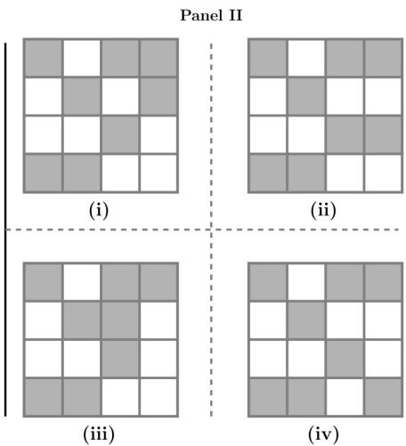

C. P-Home, Q-Power, T-Defense, S-Telecom, U-Finance  
D. Q-Home, $\bar{U}$ -Power, T-Defense, R-Telecom, P-Finance

gatecse-2015-set3 analytical-aptitude normal logical-reasoning

# Answer key

# 8.8.3 Logical Reasoning: GATE CSE 2017 | Set 2 | GA | Question: 7

There are three boxes. One contains apples, another contains oranges and the last one contains both apples and oranges. All three are known to be incorrectly labeled. If you are permitted to open just one box and then pull out and inspect only one fruit, which box would you open to determine the contents of all three boxes?

A. The box labeled 'Apples'

B. The box labeled ‘Apples and Oranges’

C. The box labeled 'Oranges'

D. Cannot be determined

gatecse-2017-set2 analytical-aptitude normal tricky logical-reasoning

# Answer key

# 8.8.4 Logical Reasoning: GATE CSE 2021 | Set 2 | GA | Question: 10

Six students P, Q, R, S, T and U, with distinct heights, compare their heights and make the following observations.

• Observation I: S is taller than R.  
- Observation II: Q is the shortest of all.  
- Observation III: U is taller than only one student.  
• Observation IV: T is taller than S but is not the tallest

The number of students that are taller than R is the same as the number of students shorter than \_\_\_\_.

A. T

B. R

C. S

D. P

gatecse-2021-set2

analytical-aptitude

logical-reasoning

two-marks

# Answer key

# 8.8.5 Logical Reasoning: GATE CSE 2023 | GA | Question: 4

A survey for a certain year found that 90% of pregnant women received medical care at least once before giving birth. Of these women, 60% received medical care from doctors, while 40% received medical care from other healthcare providers.

Given this information, which one of the following statements can be inferred with certainty?

A. More than half of the pregnant women received medical care at least once from a doctor.  
B. Less than half of the pregnant women received medical care at least once from a doctor.  
C. More than half of the pregnant women received medical care at most once from a doctor.  
D. Less than half of the pregnant women received medical care at most once from a doctor.

gatecse-2023 analytical-aptitude logical-reasoning one-mark

# Answer key

# 8.8.6 Logical Reasoning: GATE CSE 2026 | Set 1 | GA | Question: 5

'When the teacher is in the room, all students stand silently.'

If the above statement is true, which one of the following statements is not necessarily true?

A. If any student is not standing silently, then the teacher is not in the room.  
B. When the teacher is in the room, all students are silent.  
C. If all students are standing, then the teacher is in the room.  
D. When the teacher is in the room, all students are standing.

# 8.8.7 Logical Reasoning: GATE CSE 2026 | Set 1 | GA | Question: 6

Combinatorics deals with problems involving counting. For example, "How many distinct arrangements of N distinct objects in M spaces on a circle are possible?" is a typical problem in combinatorics. This kind of counting is sometimes used in the modeling of several physical phenomena. Often, in such models, the different combinatorial possibilities are assigned probability values. Assigning probabilities enables the computation of the average values of physical quantities.

Consider the following statements:

P : Combinatorics is always invoked in the modeling of physical phenomena.

Q : Modeling some physical phenomena involves assigning probabilities to combinatorial possibilities in order to compute average values of physical quantities.

Based on the passage above, what can be inferred about statements P and Q?

A. P is False and Q is False

B. P is False and Q is True

C. P is True and Q is False

D. P is True and Q is True

gatecse-2026-set1 analytical-aptitude logical-reasoning combinatory two-marks

# Answer key

# 8.8.8 Logical Reasoning: GATE CSE 2026 | Set 1 | GA | Question: 9

In the 2020 summer Olympics' Javelin throw finals, Neeraj Chopra exhibited a spectacular performance to win the gold medal. The silver medal was won by Jakub Vadlejch and the bronze medal was won by Vitezlav Vesely. There were six rounds of throws with each athlete having one throw per round. The best of all the throws of each athlete is considered for the medal. Following were the observations about the throws:

i. The first and second rounds were dominated by Neeraj Chopra with a gold medal performance in his second throw, while the other two athletes did not have any medal winning throws in these rounds.  
ii. The throws in the last round by both Jakub Vadlejch and Vitezlav Vesely were fouls and were not considered for scoring.  
iii. After four rounds, Vitezlav Vesely was in the second position and could not improve upon his best throw in the succeeding rounds.  
iv. In the fourth round, the throw by Jakub Vadlejch was the best in that round.

In which round did Vitezlav Vesely have his best throw?

A. Third

B. Fourth

C. Fifth

D. Sixth

gatecse-2026-set1 analytical-aptitude logical-reasoning two-marks

# Answer key

# 8.8.9 Logical Reasoning: GATE CSE 2026 | Set 2 | GA | Question: 5

'When it is raining, peacocks dance.'

Based only on this sentence, which one of the following options is necessarily true?

A. Peacocks dance only when it is raining.  
B. When peacocks dance, it is raining.  
C. When peacocks are not dancing, it is not raining.  
D. When it is not raining, peacocks do not dance.

gatecse-2026-set2 analytical-aptitude logical-reasoning one-mark

# Answer key

# 8.8.10 Logical Reasoning: GATE CSE 2026 | Set 2 | GA | Question: 7

Two tiles are missing in Panel I. Which one of the options in Panel II is the appropriate choice for the missing tiles?

text_image

Panel I
?

text_image

Panel II
(i)
(ii)
(iii)
(iv)

A. (i)

B. (ii)

C. (iii)

D. (iv)

gatecse-2026-set2

analytical-aptitude

two-marks

logical-reasoning

Answer key

# 8.8.11 Logical Reasoning: GATE CSE 2026 | Set 2 | GA | Question: 9

The figure in Panel I below is a grid of cells with four rows and four columns. The numbers on the top and on the left represent the number of cells that are to be shaded in that column and row, respectively. Which one of the options shown in Panel II below represents the grid shaded correctly?

text_image

Panel I
3 2 2 2
1
2
2

text_image

Panel II
(i)
(ii)
(iii)
(iv)

A. (i)

B. (ii)

C. (iii)

D. (iv)

gatecse-2026-set2

analytical-aptitude

two-marks

logical-reasoning

Answer key

# 8.8.12 Logical Reasoning: GATE DA 2026 | GA | Question: 5

'If his latest movie had been a commercial success, the actor would have made enough money to sponsor his next movie.'

Based only on the above sentence, which one of the following statements is true?

A. The actor will certainly sponsor his next movie.  
B. His latest movie was a commercial success.  
C. The actor made enough money from his latest movie.  
D. His latest movie was not commercially successful.

# 8.8.13 Logical Reasoning: GATE DA 2026 | GA | Question: 8

Rishi and Swathi are students of Class 5. Pavan and Tanvi are students of Class 4. Rishi and Pavan are boys. Swathi and Tanvi are girls. The four students played a total of three games of chess. The games were played one after another. A player who lost a game did not participate in any more games. It was observed that:

I. the first game was the only game where two students of the same class played against each other,  
II. the students of Class 5 won more games than the students of Class 4, and  
III. the boys won two games and the girls won one game.

The student who did not lose any game is \_\_\_\_.

A. Pavan

B. Rishi

C. Swathi

D. Tanvi

gateda-2026 analytical-aptitude logical-reasoning two-marks

# Answer key

# 8.8.14 Logical Reasoning: GATE2011 GG: GA-8

Three sisters $(R, S, \text{and} T)$ received a total of 24 toys during Christmas. The toys were initially divided among them in a certain proportion. Subsequently, $R$ gave some toys to $S$ which doubled the share of $S$ .

Then $S$ in turn gave some of her toys to $T$ , which doubled $T'$ 's share. Next, some of $T'$ 's toys were given to $R$ , which doubled the number of toys that $R$ currently had. As a result of all such exchanges, the three sisters were left with equal number of toys. How many toys did $R$ have originally?

A. 8

B. 9

C. 11

D. 12

gate2011-gg logical-reasoning analytical-aptitude

# Answer key

# 8.8.15 Logical Reasoning: GATE2011 MN: GA-63

L, M and N are waiting in a queue meant for children to enter the zoo. There are 5 children between L and M, and 8 children between M and N. If there are 3 children ahead of N and 21 children behind L, then what is the minimum number of children in the queue?

A. 28

B. 27

C. 41

D. 40

analytical-aptitude gate2011-mn logical-reasoning

# Answer key

# 8.8.16 Logical Reasoning: GATE2012 AR: GA-8

Ravi is taller than Arun but shorter than Iqbal. Sam is shorter than Ravi. Mohan is shorter than Arun. Balu is taller than Mohan and Sam. The tallest person can be

A. Mohan

B. Ravi

C. Balu

D. Arun

gate2012-ar logical-reasoning

# Answer key

# 8.8.17 Logical Reasoning: GATE2012 CY: GA-9

There are eight bags of rice looking alike, seven of which have equal weight and one is slightly heavier. The weighing balance is of unlimited capacity. Using this balance, the minimum number of weighings required to identify the heavier bag is

A. 2

B. 3

C. 4

D. 8

gate2012-cy analytical-aptitude logical-reasoning

# Answer key

# 8.8.18 Logical Reasoning: GATE2014 AE: GA-7

Anuj, Bhola, Chandan, Dilip, Eswar and Faisal live on different floors in a six-storeyed building (the ground floor is numbered 1, the floor above it 2, and so on) Anuj lives on an even-numbered floor, Bhola does not live on an odd numbered floor. Chandan does not live on any of the floors below Faisal's floor. Dilip does not live on floor number 2. Eswar does not live on a floor immediately above or immediately below Bhola. Faisal lives three floors above Dilip. Which of the following floor-person combinations is correct?

<table><tr><td></td><td>Anuj</td><td>Bhola</td><td>Chandan</td><td>Dilip</td><td>Eswar</td><td>Faisal</td></tr><tr><td>(A)</td><td>6</td><td>2</td><td>5</td><td>1</td><td>3</td><td>4</td></tr><tr><td>(B)</td><td>2</td><td>6</td><td>5</td><td>1</td><td>3</td><td>4</td></tr><tr><td>(C)</td><td>4</td><td>2</td><td>6</td><td>3</td><td>1</td><td>5</td></tr><tr><td>(D)</td><td>2</td><td>4</td><td>6</td><td>1</td><td>3</td><td>5</td></tr></table>

gate2014-ae logical-reasoning analytical-aptitude descriptive

Answer key

# 8.9

# Number Relations (1)

# 8.9.1 Number Relations: GATE CSE 2024 | Set 2 | GA | Question: 10

In the $4 \times 4$ array shown below, each cell of the first three rows has either a cross $(X)$ or a number.

<table><tr><td>1</td><td>X</td><td>4</td><td>3</td></tr><tr><td>X</td><td>5</td><td>5</td><td>4</td></tr><tr><td>3</td><td>X</td><td>6</td><td>X</td></tr><tr><td></td><td></td><td></td><td></td></tr></table>

The number in a cell represents the count of the immediate neighboring cells (left, right, top, bottom, diagonals) NOT having a cross $(X)$ . Given that the last row has no crosses $(X)$ , the sum of the four numbers to be filled in the last row is

A. 11

B. 10

C. 12

D. 9

gatecse-2024-set2 analytical-aptitude number-relations two-marks

Answer key

# 8.10

# Odd One (2)

Practice Test: Test 1 (6Q)

# 8.10.1 Odd One: GATE CSE 2016 | Set 2 | GA | Question: 04

Pick the odd one from the following options.

A. CADBE

B. JHKIL

C. XVYWZ

D. ONPMQ

gatecse-2016-set2 analytical-aptitude odd-one normal

Answer key

# 8.10.2 Odd One: GATE2014 AE: GA-6

Find the odd one in the following group: ALRVX, EPVZB, ITZDF, OYEIK

A. ALRVX

B. EPVZB

C. ITZDF

D. OYEIK

# 8.11

# Passage Reading (2)

Practice Tests: Test 1 (6Q) Test 2 (15Q) Test 3 (15Q) Test 4 (15Q) Test 5 (5Q)

# 8.11.1 Passage Reading: GATE CSE 2022 | GA | Question: 7

In a recently conducted national entrance test, boys constituted 65% of those who appeared for the test. Girls constituted the remaining candidates and they accounted for 60% of the qualified candidates.

Which one of the following is the correct logical inference based on the information provided in the above passage?

A. Equal number of boys and girls qualified  
B. Equal number of boys and girls appeared for the test  
C. The number of boys who appeared for the test is less than the number of girls who appeared  
D. The number of boys who qualified the test is less than the number of girls who qualified

gatecse-2022 analytical-aptitude logical-reasoning passage-reading two-marks

Answer key

# 8.11.2 Passage Reading: GATE CSE 2023 | GA | Question: 6

The country of Zombieland is in distress since more than 75% of its working population is suffering from serious health issues. Studies conducted by competent health experts concluded that a complete lack of physical exercise among its working population was one of the leading causes of their health issues. As one of the measures to address the problem, the Government of Zombieland has decided to provide monetary incentives to those who ride bicycles to work.

Based only on the information provided above, which one of the following statements can be logically inferred with certainty?

A. All the working population of Zombieland will henceforth ride bicycles to work.  
B. Riding bicycles will ensure that all of the working population of Zombieland is free of health issues.  
C. The health experts suggested to the Government of Zombieland to declare riding bicycles as mandatory.  
D. The Government of Zombieland believes that riding bicycles is a form of physical exercise.

gatecse-2023 analytical-aptitude logical-reasoning passage-reading two-marks

Answer key

# 8.12

# Round Table Arrangement (1)

Practice Test: Test 1 (9Q)

# 8.12.1 Round Table Arrangement: GATE CSE 2017 | Set 1 | GA | Question: 7

Six people are seated around a circular table. There are at least two men and two women. There are at least three right-handed persons. Every woman has a left-handed person to her immediate right. None of the women are right-handed. The number of women at the table is

A. 2

C. 4

B. 3

D. Cannot be determined

gatecse-2017-set1 analytical-aptitude round-table-arrangement

Answer key

# 8.13

# Seating Arrangement (1)

# 8.13.1 Seating Arrangement: GATE CSE 2017 | Set 1 | GA | Question: 3

Rahul, Murali, Srinivas and Arul are seated around a square table. Rahul is sitting to the left of Murali. Srinivas is sitting to the right of Arul. Which of the following pairs are seated opposite each other?

A. Rahul and Murali

B. Srinivas and Arul

C. Srinvas and Murali

D. Srinivas and Rahul

gatecse-2017-set1 analytical-aptitude logical-reasoning seating-arrangement

# Answer key

# 8.14

# Sequence Series (3)

Practice Tests: Test 1 (15Q) Test 2 (1Q)

# 8.14.1 Sequence Series: GATE CSE 2020 | GA | Question: 7

If $P = 3, R = 27, T = 243$ , then $Q + S =$ \_\_\_\_

A. 40

B. 80

C. 90

D. 110

gatecse-2020 analytical-aptitude logical-reasoning sequence-series two-marks

# Answer key

# 8.14.2 Sequence Series: GATE CSE 2024 | Set 2 | GA | Question: 5

In the sequence 6, 9, 14, x, 30, 41, a possible value of x is

A. 25

B. 21

C. 18

D. 20

gatecse-2024-set2 analytical-aptitude sequence-series one-mark

# Answer key

# 8.14.3 Sequence Series: GATE2010 MN: GA-7

Given the sequence $A, B, B, C, C, C, D, D, D, D, \ldots$ etc., that is one $A$ , two $B's$ , three $C's$ , four $D's$ , five $E's$ and so on, the $240^{th}$ letter in the sequence will be:

A. V

B. U

C. T

D. W

general-aptitude logical-reasoning gate2010-mn sequence-series

# Answer key

# 8.15

# Statements Follow (7)

Practice Tests: Test 1 (15Q) Test 2 (15Q) Test 3 (7Q)

# 8.15.1 Statements Follow: GATE CSE 2016 | Set 1 | GA | Question: 08

Consider the following statements relating to the level of poker play of four players P, Q, R and S.

I. $P$ always beats $Q$  
II. $R$ always beats $S$  
III. $S$ loses to $P$ only sometimes.  
IV. $R$ always loses to $Q$

Which of the following can be logically inferred from the above statements?

i. P is likely to beat all the three other players  
ii. $S$ is the absolute worst player in the set

A. (i). only

B. (ii) only  
D. neither (i) nor (ii)

C. (i) and (ii) only'

gatecse-2016-set1 analytical-aptitude normal statements-follow

# Answer key

# 8.15.2 Statements Follow: GATE CSE 2016 | Set 2 | GA | Question: 08

All hill-stations have a lake. Ooty has two lakes.

Which of the statement(s) below is/are logically valid and can be inferred from the above sentences?

i. Ooty is not a hill-station.  
ii. No hill-station can have more than one lake.

A. (i) only.  
C. Both (i) and (ii)

gatecse-2016-set2 analytical-aptitude easy statements-follow

B. (ii) only.  
D. Neither (i) nor (ii)

# Answer key

# 8.15.3 Statements Follow: GATE CSE 2021 | Set 1 | GA | Question: 9

Given below are two statements 1 and 2, and two conclusions I and II

- Statement 1: All bacteria are microorganisms.  
- Statement 2: All pathogens are microorganisms.  
- Conclusion I: Some pathogens are bacteria.  
- Conclusion II: All pathogens are not bacteria.

Based on the above statements and conclusions, which one of the following options is logically CORRECT?

A. Only conclusion I is correct  
C. Either conclusion I or II is correct

B. Only conclusion $\Pi$ is correct  
D. Neither conclusion I nor II is correct

gatecse-2021-set1 analytical-aptitude logical-reasoning statements-follow two-marks

# Answer key

# 8.15.4 Statements Follow: GATE CSE 2022 | GA | Question: 4

Given below are four statements.

- Statement 1: All students are inquisitive.  
- Statement 2: Some students are inquisitive.  
- Statement 3: No student is inquisitive.  
- Statement 4: Some students are not inquisitive.

From the given four statements, find the two statements that CANNOT BE TRUE simultaneously, assuming that there is at least one student in the class.

A. Statement 1 and Statement 3  
C. Statement 2 and Statement 4

B. Statement 1 and Statement 2  
D. Statement 3 and Statement 4

gatecse-2022 analytical-aptitude logical-reasoning statements-follow one-mark

# Answer key

# 8.15.5 Statements Follow: GATE DS&AI 2024 | GA | Question: 6

Thousands of years ago, some people began dairy farming. This coincided with a number of mutations in a particular gene that resulted in these people developing the ability to digest dairy milk.

Based on the given passage, which of the following can be inferred?

A. All human beings can digest dairy milk.  
B. No human being can digest dairy milk.  
C. Digestion of dairy milk is essential for human beings.  
D. In human beings, digestion of dairy milk resulted from a mutated gene.

gate-ds-ai-2024 analytical-aptitude logical-reasoning statements-follow two-marks

# Answer key

# 8.15.6 Statements Follow: GATE2013 AE: GA-9

\- All professors are researchers

• Some scientists are professors

Which of the given conclusions is logically valid and is inferred from the above arguments?

A. All scientists are researchers  
C. Some researchers are scientists

B. All professors are scientists

D. No conclusion follows

gate2013-ae analytical-aptitude logical-reasoning statements-follow

# Answer key

# 8.15.7 Statements Follow: GATE2014 AG: GA-6

In a group of four children, Som is younger to Riaz. Shiv is elder to Ansu. Ansu is youngest in the group. Which of the following statements is/are required to find the eldest child in the group?

# Statements

1. Shiv is younger to Riaz.  
2. Shiv is elder to Som.

A. Statement 1 by itself determines the eldest child.  
B. Statement 2 by itself determines the eldest child.  
C. Statements 1 and 2 are both required to determine the eldest child.  
D. Statements 1 and 2 are not sufficient to determine the eldest child.

gate2014-ag analytical-aptitude normal statements-follow

# Answer key

Answer Keys

<table><tr><td>8.1.1</td><td>B</td></tr><tr><td>8.4.1</td><td>B</td></tr><tr><td>8.5.5</td><td>C</td></tr><tr><td>8.8.3</td><td>B</td></tr><tr><td>8.8.8</td><td>A</td></tr><tr><td>8.8.13</td><td>D</td></tr><tr><td>8.8.18</td><td>B</td></tr><tr><td>8.11.2</td><td>D</td></tr><tr><td>8.14.3</td><td>A</td></tr><tr><td>8.15.5</td><td>D</td></tr></table>

<table><tr><td>8.1.2</td><td>D</td></tr><tr><td>8.5.1</td><td>A</td></tr><tr><td>8.6.1</td><td>A</td></tr><tr><td>8.8.4</td><td>C</td></tr><tr><td>8.8.9</td><td>C</td></tr><tr><td>8.8.14</td><td>C</td></tr><tr><td>8.9.1</td><td>A</td></tr><tr><td>8.12.1</td><td>A</td></tr><tr><td>8.15.1</td><td>D</td></tr><tr><td>8.15.6</td><td>C</td></tr></table>

<table><tr><td>8.2.1</td><td>A</td></tr><tr><td>8.5.2</td><td>A</td></tr><tr><td>8.7.1</td><td>B</td></tr><tr><td>8.8.5</td><td>A</td></tr><tr><td>8.8.10</td><td>A</td></tr><tr><td>8.8.15</td><td>A</td></tr><tr><td>8.10.1</td><td>D</td></tr><tr><td>8.13.1</td><td>C</td></tr><tr><td>8.15.2</td><td>D</td></tr><tr><td>8.15.7</td><td>A</td></tr></table>

<table><tr><td>8.3.1</td><td>B</td></tr><tr><td>8.5.3</td><td>D</td></tr><tr><td>8.8.1</td><td>C</td></tr><tr><td>8.8.6</td><td>C</td></tr><tr><td>8.8.11</td><td>B</td></tr><tr><td>8.8.16</td><td>C</td></tr><tr><td>8.10.2</td><td>D</td></tr><tr><td>8.14.1</td><td>C</td></tr><tr><td>8.15.3</td><td>C;D</td></tr></table>

<table><tr><td>8.3.2</td><td>C</td></tr><tr><td>8.5.4</td><td>C</td></tr><tr><td>8.8.2</td><td>B</td></tr><tr><td>8.8.7</td><td>B</td></tr><tr><td>8.8.12</td><td>D</td></tr><tr><td>8.8.17</td><td>A</td></tr><tr><td>8.11.1</td><td>D</td></tr><tr><td>8.14.2</td><td>B</td></tr><tr><td>8.15.4</td><td>A</td></tr></table>

Syllabus: Numerical computation, Numerical estimation, Numerical reasoning and data interpretation

Mark Distribution in Previous GATE

<table><tr><td>Year</td><td>2026 - 1</td><td>2026 - 2</td><td>2025 - 1</td><td>2025 - 2</td><td>2024 - 1</td><td>2024 - 2</td><td>2023</td><td>2022</td><td>2021 - 1</td><td>2021 - 2</td><td>Minimum</td></tr><tr><td>1 Mark Count</td><td>2</td><td>2</td><td>1</td><td>2</td><td>4</td><td>3</td><td>1</td><td>2</td><td>1</td><td>2</td><td>1</td></tr><tr><td>2 Marks Count</td><td>2</td><td>2</td><td>3</td><td>3</td><td>2</td><td>2</td><td>2</td><td>2</td><td>3</td><td>2</td><td>2</td></tr><tr><td>Total Marks</td><td>6</td><td>6</td><td>7</td><td>8</td><td>8</td><td>7</td><td>5</td><td>6</td><td>7</td><td>6</td><td>5</td></tr></table>

Welcome to the Quantitative Aptitude section of your GATE Computer Science preparation! This chapter is designed to equip you with the essential mathematical and logical reasoning skills crucial for success in the General Aptitude section of the GATE exam. Quantitative Aptitude tests your ability to solve numerical problems, interpret data, and apply fundamental mathematical concepts efficiently and accurately. Typically, this section carries a significant weightage, often contributing 8-10 marks out of the total 15 marks for General Aptitude, with questions ranging from direct formula application to complex problem-solving and data interpretation. Mastering these topics is not just about scoring in aptitude; it also sharpens your analytical thinking, which is invaluable for the core Computer Science subjects.

# Topic-wise Key Concepts

# Absolute Value

The absolute value of a real number $x$ , denoted $|x|$ , is its non-negative value regardless of its sign. It represents the distance of $x$ from zero on the number line.

- Definition: $|x| = x$ if $x \geq 0$ , and $|x| = -x$ if $x < 0$ .  
- Properties:

1. $|x|\geq 0$  
2. $|-\overline{x}|=|x|$  
3. $|xy| = |x||y|$  
4. $|x / y| = |x| / |y|$ (for $y \neq 0$ )  
5. Triangle Inequality: $|x + y| \leq |x| + |y|$

\- Solving Equations/Inequalities:

1. $|x| = a \implies x = a$ or $x = -a$ (for $a \geq 0$ )  
2. $|x| < a \implies -a < x < a$ (for $a > 0$ )  
3. $|x| > a \implies x < -a$ or $x > a$ (for $a \geq 0$ )

- Pitfall: Forgetting to consider both positive and negative cases when removing the absolute value sign.  
- Technique: Isolate the absolute value term, then apply the appropriate definition or rule.

# Age Relation

Age relation problems involve finding the current or future/past ages of individuals based on given conditions, usually forming linear equations.

- Core Idea: Translate word problems into algebraic equations involving variables for ages.  
- Technique: Assign variables (e.g., $x$ for current age), form equations based on the relationships (e.g., "A is twice as old as B" $\Longrightarrow A = 2B$ ), and solve the system of equations.  
- Pitfall: Misinterpreting phrases like "X years ago" or "X years hence".

# Algebra

Algebra deals with symbols and rules for manipulating these symbols. It involves basic operations, factorization, and algebraic identities.

\- Identities:

1. $(a + b)^2 = a^2 + 2ab + b^2$  
2. $(a - b)^2 = a^2 - 2ab + b^2$  
3. $a^2 - b^2 = (a - b)(a + b)$  
4. $(a + b)^{3} = a^{3} + b^{3} + 3ab(a + b)$

5. $(a - b)^{3} = a^{3} - b^{3} - 3ab(a - b)$  
6. $a^3 + b^3 = (a + b)(a^2 - ab + b^2)$  
7. $a^3 - b^3 = (a - b)(a^2 + ab + b^2)$  
8. $a^3 + b^3 + c^3 - 3abc = (a + b + c)(a^2 + b^2 + c^2 - ab - bc - ca)$  
9. If $a + b + c = 0$ , then $a^3 + b^3 + c^3 = 3abc$

\- Pitfall: Sign errors, incorrect order of operations (PEMDAS/BODMAS).

\- Technique: Simplify expressions using identities, factorize, and solve equations systematically.

# Alligation Mixture

Alligation is a rule that helps determine the ratio in which two or more ingredients of different prices must be mixed to produce a mixture of a desired price.

\- Formula:

$$
\frac {\text {Quantity of Cheaper}}{\text {Quantity of Dearer}} = \frac {\text {Price of Dearer} - \text {Mean Price}}{\text {Mean Price} - \text {Price of Cheaper}}
$$

\- Technique: Use the "alligation cross" diagram to visualize and solve problems quickly.

\- Pitfall: Incorrectly identifying the cheaper, dearer, or mean price.

# Area

Area is the measure of the extent of a two-dimensional surface or shape.

\- Formulas:

1. Square: $s^{2}$ (where s is side)  
2. Rectangle: $l \times w$ (where $l$ is length, $w$ is width)  
3. Circle: $\pi r^2$ (where $r$ is radius)  
4. Triangle: $\frac{1}{2} \times \text{base} \times \text{height}$ (or Heron's formula: $\sqrt{s(s - a)(s - b)(s - c)}$ where $s = (a + b + c)/2$ )  
5. Parallelogram: base × height  
6. Trapezoid: $\frac{1}{2} \times$ (sum of parallel sides) $\times$ height  
7. Rhombus: $\frac{1}{2} \times d_1 \times d_2$ (where $d_1, d_2$ are diagonals)  
- Pitfall: Using perimeter formulas instead of area, or incorrect units.  
- Technique: Identify the shape, recall the correct formula, and ensure consistent units.

# Arithmetic Series

An arithmetic series is the sum of terms in an arithmetic progression, where the difference between consecutive terms is constant (common difference $d$ ).

\- Formulas:

1. $n$ -th term: $a_{n} = a_{1} + (n - 1)d$  
2. Sum of $n$ terms: $S_{n} = \frac{n}{2}(a_{1} + a_{n})$ or $S_{n} = \frac{n}{2}(2a_{1} + (n - 1)d)$  
- Pitfall: Off-by-one errors when calculating $n$ , especially when given ranges.  
- Technique: Clearly identify $a_1$ , $d$ , and $n$ .

# Average

The average (arithmetic mean) is the sum of a set of values divided by the number of values.

- Formula: Average = $\frac{\text{Sum of quantities}}{\text{Number of quantities}}$  
- Weighted Average: Weighted Average = $\frac{\sum(w_i x_i)}{\sum w_i}$  
- Technique: Use the formula directly. For weighted averages, ensure correct weights are applied.  
- Pitfall: Confusing average with median or mode.

# Bar Graph

A bar graph uses rectangular bars to represent data, with the length or height of the bars proportional to the values they

represent.

- Core Idea: Visual representation of discrete data for comparison.  
- Technique: Carefully read labels, scales, and legends. Compare bar heights/lengths to answer questions about quantities, differences, or ratios.  
- Pitfall: Misinterpreting scales or units on the axes.

# Bayes Theorem

Bayes' Theorem describes the probability of an event, based on prior knowledge of conditions that might be related to the event.

- Formula: $P(A|B) = \frac{P(B|A)P(A)}{P(B)}$  
- Key Terms: $P(A|B)$ is posterior probability, $P(B|A)$ is likelihood, $P(A)$ is prior probability, $P(B)$ is evidence.  
- Pitfall: Confusing conditional probabilities $P(A|B)$ and $P(B|A)$ .  
- Technique: Break down the problem into individual probabilities and substitute into the formula.

# Calendar

Calendar problems involve determining the day of the week for a given date or finding specific dates based on calendar logic.

- Core Idea: Based on the concept of "odd days" (remainder when days are divided by 7).  
- Key Concepts:

1. Ordinary year = 365 days = 52 weeks + 1 odd day  
2. Leap year = 366 days = 52 weeks + 2 odd days  
3. Leap year rules: Divisible by 4, unless it's a century year not divisible by 400.  
4. Odd days for centuries: 100 years = 5 odd days, 200 years = 3, 300 years = 1, 400 years = 0.

\- Technique: Calculate total odd days from a reference date (e.g., Jan 1, 0001) to the target date.

\- Pitfall: Incorrectly identifying leap years or counting odd days.

# Cartesian Coordinates

Cartesian coordinates define the position of a point in a plane using two perpendicular axes (x and y).

\- Key Formulas:

1. Distance between $(x_{1},y_{1})$ and $(x_{2},y_{2})$ : $D = \sqrt{(x_2 - x_1)^2 + (y_2 - y_1)^2}$  
2. Midpoint of a segment: $M = \left(\frac{x_{1} + x_{2}}{2}, \frac{y_{1} + y_{2}}{2}\right)$  
3. Section Formula (dividing in ratio $m:n$ ): $\left(\frac{mx_2 + nx_1}{m + n},\frac{my_2 + ny_1}{m + n}\right)$  
4. Area of triangle with vertices $(x_{1},y_{1}),(x_{2},y_{2}),(x_{3},y_{3})$ : $\frac{1}{2}|x_1(y_2 - y_3) + x_2(y_3 - y_1) + x_3(y_1 - y_2)|$  
- Pitfall: Sign errors in distance or section formula.  
- Technique: Plot points if helpful, apply formulas carefully.

# Circle

A circle is the set of all points in a plane that are equidistant from a central point.

\- Formulas:

1. Circumference: $C = 2\pi r = \pi d$  
2. Area: $A = \pi r^{2}$  
3. Equation of a circle (center $(h,k)$ , radius $r$ ): $(x - h)^2 + (y - k)^2 = r^2$  
4. Area of sector: $\frac{\theta}{360^{\circ}} \times \pi r^{2}$ (where $\theta$ is central angle in degrees)  
5. Length of arc: $\frac{\theta}{360^{\circ}} \times 2\pi r$  
- Pitfall: Confusing radius with diameter, or circumference with area.  
- Technique: Identify given parameters and apply the correct formula.

# Clock Time