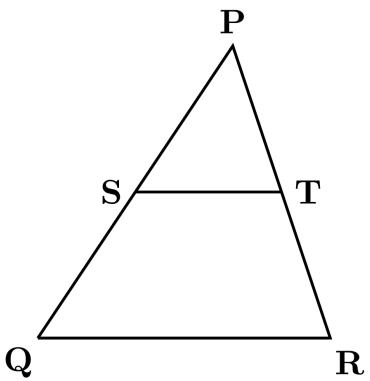
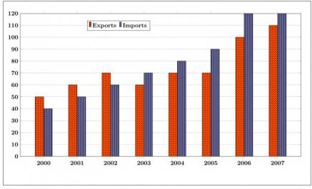
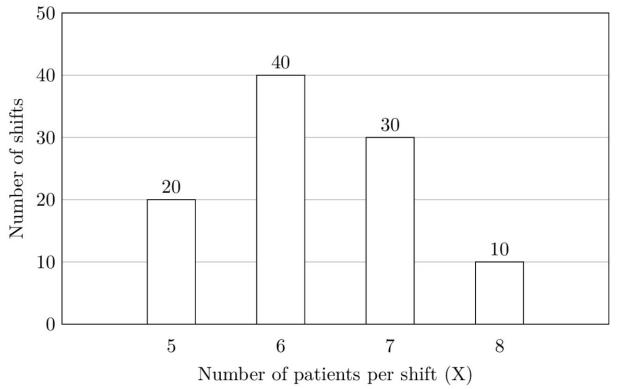
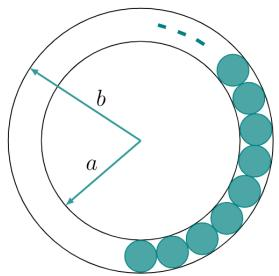
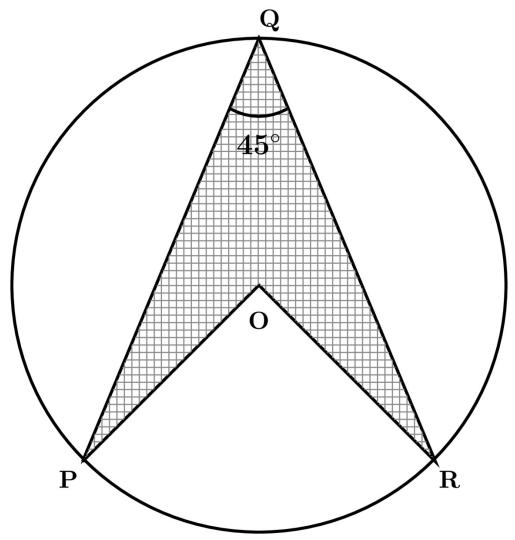
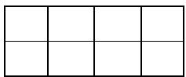
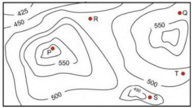

# Important Tips for GATE

1. Master Fundamentals: Ensure a strong grasp of basic arithmetic, algebra, geometry, and data interpretation. Many complex problems are built upon these foundational concepts.  
2. Memorize Formulas: Quantitative Aptitude is heavily formula-driven. Create flashcards or a dedicated notebook for all key formulas and identities. Regular revision is crucial.  
3. Practice Data Interpretation: DI questions are common and can be time-consuming. Practice reading various charts (bar, pie, line, scatter, radar) and tables accurately and quickly. Pay attention to scales and units.  
4. Time Management: Aptitude questions often have quick solutions if the right approach is identified. Don't get stuck on one question; if it's taking too long, mark it for review and move on.  
5. Unit Consistency: Always check and convert units to be consistent within a problem (e.g., km/hr to m/s, cm to meters) to avoid common calculation errors.  
6. Approximation Skills: For questions with close options or complex calculations, develop the ability to estimate and approximate to quickly narrow down choices.  
7. Identify Question Type: Quickly categorize the problem (e.g., P&C, Profit/Loss, Speed-Time) to recall the relevant formulas and problem-solving strategies.  
8. Review Common Pitfalls: Be aware of typical mistakes like sign errors in algebra, confusing permutations with combinations, or misinterpreting relative speed. Consciously check for these during practice.

# 9.1

# No Classified Topic (1)

# 9.1.1 GATE CSE 2026 | Set 2 | GA | Question: 4

The values of Stock A and Stock B on a particular day are Rs. 50 and Rs. 80, respectively. An investor invests Rs. 100 in Stock A and Rs. 80 in Stock B. He sells all the stocks the next day when the value of Stock A is Rs. 55 and Stock B is Rs. 70. The profit made by the investor is Rs. \_\_\_\_

A. 0

B. 5

C. 10

D. 20

gatecse-2026-set2 quantitative-aptitude one-mark

Answer key

# 9.2

# Absolute Value (5)

Practice Test: Test 1 (10Q)

# 9.2.1 Absolute Value: GATE CSE 2014 | Set 2 | GA | Question: 8

If $x$ is real and $|x^2 - 2x + 3| = 11$ , then possible values of $|-x^3 + x^2 - x|$ include

A. 2,4

B. 2,14

C. 4,52

D. 14,52

gatecse-2014-set2 quantitative-aptitude normal absolute-value

Answer key

# 9.2.2 Absolute Value: GATE CSE 2017 | Set 1 | GA | Question: 8

The expression $\frac{(x+y)-|x-y|}{2}$ is equal to :

A. The maximum of $x$ and $y$

B. The minimum of $x$ and $y$

C. 1

D. None of the above

gatecse-2017-set1 general-aptitude quantitative-aptitude maxima-minima absolute-value easy

Answer key

# 9.2.3 Absolute Value: GATE2011 AG: GA-7

Given that $f(y) = \frac{|y|}{y}$ , and $q$ is non-zero real number, the value of $|f(q) - f(-q)|$ is

A. 0

B. -1

C. 1

D. 2

general-aptitude quantitative-aptitude gate2011-ag absolute-value

Answer key

# 9.2.4 Absolute Value: GATE2013 AE: GA-8

If $|-2X + 9| = 3$ then the possible value of $|-X| - X^2$ would be:

A. 30

B. -30

C. -42

D. 42

gate2013-ae quantitative-aptitude absolute-value

# Answer key

# 9.2.5 Absolute Value: GATE2013 CE: GA-7

If $|4X - 7| = 5$ then the values of $2 \mid X \mid - \mid -X \mid$ is:

A. $2, \left(\frac{1}{3}\right)$

B. $\left(\frac{1}{2}\right)$ ,3

C. $\left(\frac{3}{2}\right)$ ,9

D. $\left(\frac{2}{3}\right)$ ,9

gate2013-ce quantitative-aptitude absolute-value

# Answer key

# 9.3

# Algebra (1)

Practice Tests: Test 1 (15Q) Test 2 (12Q)

# 9.3.1 Algebra: GATE2011 MN: GA-61

If $\frac{(2y + 1)}{(y + 2)} < 1$ , then which of the following alternatives gives the CORRECT range of $y$ ?

A. $-2 < y < 2$

B. $-2 < y < 1$

C. $-3 < y < 1$

D. $-4 < y < 1$

quantitative-aptitude gate2011-mn algebra

# Answer key

# 9.4

# Alligation Mixture (2)

Practice Test: Test 1 (8Q)

# 9.4.1 Alligation Mixture: GATE CSE 2011 | Question: 65

A container originally contains 10 litres of pure spirit. From this container, 1 litre of spirit replaced with 1 litre of water. Subsequently, 1 litre of the mixture is again replaced with 1 litre of water and this process is repeated one more time. How much spirit is now left in the container?

A. 7.58 litres

B. 7.84 litres

C. 7 litres

D. 7.29 litres

gatecse-2011 quantitative-aptitude normal alligation-mixture

# Answer key

# 9.4.2 Alligation Mixture: GATE2010 TF: GA-9

A tank has 100 liters of water. At the end of every hour, the following two operations are performed in sequence: i) water equal to $m\%$ of the current contents of the tank is added to the tank, ii) water equal to $n\%$ of the current contents of the tank is removed from the tank. At the end of 5 hours, the tank contains exactly 100 liters of water. The relation between $m$ and $n$ is :

A. m = n

B. $m > n$

C. m < n

D. None of the previous

general-aptitude quantitative-aptitude gate2010-tf alligation-mixture

# Answer key

# 9.5

# Area (1)

# 9.5.1 Area: GATE CSE 2025 | Set 1 | GA | Question: 7

In the diagram, the lines QR and ST are parallel to each other. The shortest distance between these two lines is half the shortest distance between the point P and line QR. What is the ratio of the area of the triangle PST to the area of the trapezium SQRT?

Note: The figure shown is representative.

text_image

P
S
T
Q
R

A. $\frac{1}{3}$

B. $\frac{1}{4}$

C. $\frac{2}{5}$

D. $\frac{1}{2}$

gatecse2025-set1 quantitative-aptitude geometry area two-marks

Answer key

# 9.6

# Arithmetic Series (3)

Practice Test: Test 1 (10Q)

# 9.6.1 Arithmetic Series: GATE CSE 2013 | Question: 58

What will be the maximum sum of 44, 42, 40, ...?

A. 502

B. 504

C. 506

D. 500

gatecse-2013 quantitative-aptitude easy arithmetic-series

Answer key

# 9.6.2 Arithmetic Series: GATE CSE 2015 | Set 2 | GA | Question: 6

If the list of letters P, R, S, T, U is an arithmetic sequence, which of the following are also in arithmetic sequence?

1. $2P, 2R, 2S, 2T, 2U$  
II. $P - 3,R - 3,S - 3,T - 3,U - 3$  
III. $P^2, R^2, S^2, T^2, U^2$

A. I only

B. I and II

C. II and III

D. I and III

gatecse-2015-set2 quantitative-aptitude normal arithmetic-series

Answer key

# 9.6.3 Arithmetic Series: GATE2011 AG: GA-6

The sum of $n$ terms of the series $4 + 44 + 444 + \ldots \ldots$ is

A. $\frac{4}{81}\left[10^{n + 1} - 9n - 1\right]$  
B. $\frac{4}{81} [10^{n - 1} - 9n - 1]$

C. $\frac{4}{81} [10^{n + 1} - 9n - 10]$  
D. $\frac{4}{81} [10^n - 9n - 10]$

general-aptitude quantitative-aptitude gate2011-ag arithmetic-series

Answer key

# 9.7

# Average (1)

Practice Test: Test 1 (13Q)

# 9.7.1 Average: GATE CSE 2025 | Set 1 | GA | Question: 3

The average marks obtained by a class in an examination were calculated as 30.8. However, while checking the marks entered, the teacher found that the marks of one student were entered incorrectly as 24 instead of 42. After correcting the marks, the average becomes 31.4. How many students does the class have?

A. 25

B. 28

C. 30

D. 32

gatecse2025-set1 quantitative-aptitude average one-mark

Answer key

# 9.8

# Bar Graph (4)

Practice Tests: Test 1 (15Q) Test 2 (4Q)

# 9.8.1 Bar Graph: GATE CSE 2015 | Set 3 | GA | Question: 10

The exports and imports (in crores of Rs.) of a country from the year 2000 to 2007 are given in the following bar chart. In which year is the combined percentage increase in imports and exports the highest?

bar

| Year | Exports | Imports |
| --- | --- | --- |
| 2000 | 50 | 40 |
| 2001 | 60 | 50 |
| 2002 | 70 | 60 |
| 2003 | 60 | 70 |
| 2004 | 70 | 80 |
| 2005 | 70 | 90 |
| 2006 | 100 | 120 |
| 2007 | 110 | 120 |

gatecse-2015-set3 quantitative-aptitude data-interpretation normal numerical-answers bar-graph

Answer key

# 9.8.2 Bar Graph: GATE CSE 2020 | GA | Question: 10

The total revenue of a company during 2014 – 2018 is shown in the bar graph. If the total expenditure of the company in each year is 500 million rupees, then the aggregate profit or loss (in percentage) on the total expenditure of the company during 2014 – 2018 is \_\_\_\_.

bar

| Year | Revenue (In million rupees) |
| --- | --- |
| 2014 | ~500 |
| 2015 | ~700 |
| 2016 | ~800 |
| 2017 | ~600 |
| 2018 | ~400 |

A. 16.67% profit  
C. 20% profit

B. 16.67% loss  
D. 20% loss

# 9.8.3 Bar Graph: GATE CSE 2021 | Set 2 | GA | Question: 9

bar

| Category | Series 1 (Dotted) | Series 2 (Solid) |
| --- | --- | --- |
| Year 1 | 100 | 240 |
| Year 2 | 200 | 296 |
| Year 3 | 300 | 210 |

Number of units Net Profit (₹)

The number of units of a product sold in three different years and the respective net profits are presented in the figure above. The cost/unit in Year 3 was ₹ 1, which was half the cost/unit in Year 2. The cost/unit in Year 3 was one-third of the cost/unit in Year 1. Taxes were paid on the selling price at 10%, 13%, and 15% respectively for the three years. Net profit is calculated as the difference between the selling price and the sum of cost and taxes paid in that year.

The ratio of the selling price in Year 2 to the selling price in Year 3 is \_\_\_\_.

A. 4:3

B. 1:1

C. 3:4

D. 1:2

gatecse-2021-set2 quantitative-aptitude data-interpretation bar-graph two-marks

# Answer key

# 9.8.4 Bar Graph: GATE DA 2025 | GA | Question: 10

The number of patients per shift (X) consulting Dr. Gita in her past 100 shifts is shown in the figure. If the amount she earns is ₹ 1000(X - 0.2), what is the average amount (in ₹) she has earned per shift in the past 100 shifts?

Note: The figure shown is representative.

bar

| Number of patients per shift (X) | Number of shifts |
| --- | --- |
| 5 | 20 |
| 6 | 40 |
| 7 | 30 |
| 8 | 10 |

A. 6,100

B. 6,300

C. 6,000

D. 6,500

gateda-2025 quantitative-aptitude bar-graph data-interpretation two-marks

# Answer key

# 9.9

# Bayes Theorem (1)

# 9.9.1 Bayes Theorem: GATE CSE 2012 | Question: 63

An automobile plant contracted to buy shock absorbers from two suppliers $X$ and $Y$ . $X$ supplies $60\%$ and $Y$ supplies $40\%$ of the shock absorbers. All shock absorbers are subjected to a quality test. The ones that pass the quality test are considered reliable. Of $X's$ shock absorbers, $96\%$ are reliable. Of $Y's$ shock absorbers, $72\%$ are reliable.

The probability that a randomly chosen shock absorber, which is found to be reliable, is made by Y is

A. 0.288

B. 0.334

C. 0.667

D. 0.720

gatecse-2012 quantitative-aptitude bayes-theorem probability normal conditional-probability

# Answer key

# 9.10

# Cartesian Coordinates (4)

# Practice Test: Test 1 (10Q)

# 9.10.1 Cartesian Coordinates: GATE CSE 2020 | GA | Question: 9

Two straight lines are drawn perpendicular to each other in $X - Y$ plane. If $\alpha$ and $\beta$ are the acute angles the straight lines make with the X-axis, then $\alpha + \beta$ is \_\_\_\_.

A. $60^{\circ}$

B. $90^{\circ}$

C. $120^{\circ}$

D. $180^{\circ}$

gatecse-2020 quantitative-aptitude geometry cartesian-coordinates two-marks

# Answer key

# 9.10.2 Cartesian Coordinates: GATE CSE 2022 | GA | Question: 2

A function $y(x)$ is defined in the interval $[0,1]$ on the x-axis as

$$
y (x) = \left\{ \begin{array}{l l} 2 & \text {if} \quad 0 \leq x <   \frac {1}{3} \\ 3 & \text {if} \quad \frac {1}{3} \leq x <   \frac {3}{4} \\ 1 & \text {if} \quad \frac {3}{4} \leq x \leq 1 \end{array} \right.
$$

Which one of the following is the area under the curve for the interval $[0,1]$ on the $x$ -axis?

A. $\frac{5}{6}$

B. $\frac{6}{5}$

C. $\frac{13}{6}$

D. $\frac{6}{13}$

gatecse-2022 quantitative-aptitude cartesian-coordinates area one-mark

# Answer key

# 9.10.3 Cartesian Coordinates: GATE2012 AE: GA-9

Two points $(4, p)$ and $(0, q)$ lie on a straight line having a slope of $3/4$ . The value of $(p - q)$ is

A. -3

B. 0

C. 3

D. 4

gate2012-ae quantitative-aptitude cartesian-coordinates geometry

# Answer key

# 9.10.4 Cartesian Coordinates: GATE2014 AE: GA-4

If $y = 5x^{2} + 3$ , then the tangent at $x = 0$ , $y = 3$

A. passes through $x = 0, y = 0$

B. has a slope of +1

C. is parallel to the $x$ -axis

D. has a slope of -1

gate2014-ae quantitative-aptitude geometry cartesian-coordinates

# Answer key

# 9.11

# Circle (3)

# Practice Test: Test 1 (10Q)

# 9.11.1 Circle: GATE CSE 2018 | GA | Question: 3

The area of a square is $d$ . What is the area of the circle which has the diagonal of the square as its diameter?

A. $\pi d$

B. $\pi d^{2}$

c. $\frac{1}{4}\pi d^{2}$

D. $\frac{1}{2}\pi d$

# Answer key

# 9.11.2 Circle: GATE CSE 2020 | GA | Question: 8

The figure below shows an annular ring with outer and inner as $b$ and $a$ , respectively. The annular space has been painted in the form of blue colour circles touching the outer and inner periphery of annular space. If maximum $n$ number of circles can be painted, then the unpainted area available in annular space is \_\_\_\_.

text_image

b
a

A. $\pi [(b^2 - a^2) - \frac{n}{4} (b - a)^2 ]$  
C. $\pi [(b^2 -a^2) + \frac{\dot{n}}{4} (b - a)^2 ]$

gatecse-2020 quantitative-aptitude geometry circle area two-marks

B. $\pi [(b^2 - a^2) - n(b - a)^2]$  
D. $\pi [(b^2 -a^2) + n(b - a)^2 ]$

# Answer key

# 9.11.3 Circle: GATE DA 2026 | GA | Question: 10

In the given figure, $P, Q$ , and $R$ are three points on a circle of radius $10 \, \text{cm}$ with $O$ as its center, $\overline{PQ} = \overline{RQ}$ , and $\angle PQR = 45^\circ$ . The figure is representative. The area of the shaded region $PQRO$ is \_\_\_\_ $\text{cm}^2$ .

text_image

Q
45°
O
P
R

A. 50

B. $25\sqrt{2}$

C. $50\sqrt{2}$

D. 100

gateda-2026 quantitative-aptitude geometry circle area two-marks

# Answer key

# 9.12

# Clock Time (1)

# Practice Test: Test 1 (11Q)

# 9.12.1 Clock Time: GATE CSE 2014 | Set 2 | GA | Question: 10

At what time between 6 a. m. and 7 a. m. will the minute hand and hour hand of a clock make an angle

closest to 60°?

A. 6:22 a.m.

B. 6:27 a.m.

C. 6:38 a.m.

D. 6:45 a.m.

gatecse-2014-set2 quantitative-aptitude normal clock-time

Answer key

# 9.13

# Combinatory (5)

Practice Test: Test 1 (13Q)

# 9.13.1 Combinatory: GATE CSE 2010 | Question: 65

Given digits 2, 2, 3, 3, 3, 4, 4, 4, 4 how many distinct 4 digit numbers greater than 3000 can be formed?

A. 50

B. 51

C. 52

D. 54

gatecse-2010 quantitative-aptitude combinatory normal

Answer key

# 9.13.2 Combinatory: GATE CSE 2016 | Set 2 | GA | Question: 09

In a $2 \times 4$ rectangle grid shown below, each cell is rectangle. How many rectangles can be observed in the grid?

A. 21

B. 27

C. 30

D. 36

gatecse-2016-set2 quantitative-aptitude normal combinatory

Answer key

# 9.13.3 Combinatory: GATE CSE 2017 | Set 1 | GA | Question: 9

Arun, Gulab, Neel and Shweta must choose one shirt each from a pile of four shirts coloured red, pink, blue and white respectively. Arun dislikes the colour red and Shweta dislikes the colour white. Gulab and Neel like all the colours. In how many different ways can they choose the shirts so that no one has a shirt with a colour he or she dislikes?

A. 21

B. 18

C. 16

D. 14

gatecse-2017-set1 combinatory quantitative-aptitude

Answer key

# 9.13.4 Combinatory: GATE2011 MN: GA-59

In how many ways 3 scholarships can be awarded to 4 applicants, when each applicant can receive any number of scholarships?

A. 4

B. 12

C. 64

D. 81

quantitative-aptitude gate2011-mn combinatory

Answer key

# 9.13.5 Combinatory: GATE2012 AR: GA-5

Ten teams participate in a tournament. Every team plays each of the other teams twice. The total number of matches to be played is

A. 20

B. 45

C. 60

D. 90

gate2012-ar quantitative-aptitude combinatory

Answer key

# 9.14.1 Compound Interest: GATE DS&AI 2024 | GA | Question: 8

Person 1 and Person 2 invest in three mutual funds A, B, and C. The amounts they invest in each of these mutual funds are given in the table.

<table><tr><td></td><td>Mutual fund A</td><td>Mutual fund B</td><td>Mutual fund C</td></tr><tr><td>Person1</td><td>10,000</td><td>20,000</td><td>20,000</td></tr><tr><td>Person2</td><td>20,000</td><td>15,000</td><td>15,000</td></tr></table>

At the end of one year, the total amount that Person 1 gets is ₹500 more than Person 2. The annual rate of return for the mutual funds B and C is 15% each. What is the annual rate of return for the mutual fund A?

A. 7.5%

B. 10%

C. 15%

D. 20%

gate-ds-ai-2024 quantitative-aptitude compound-interest two-marks

# Answer key

# 9.14.2 Compound Interest: GATE2010 MN: GA-5

A person invest Rs.1000 at 10% annual compound interest for 2 years. At the end of two years, the whole amount is invested at an annual simple interest of 12% for 5 years. The total value of the investment finally is :

A. 1776

B. 1760

C. 1920

D. 1936

general-aptitude quantitative-aptitude gate2010-mn compound-interest

# Answer key

# 9.14.3 Compound Interest: GATE2014 AG: GA-5

The population of a new city is 5 million and is growing at 20% annually. How many years would it take to double at this growth rate?

A. 3 - 4 years

B. 4 - 5 years

C. 5 - 6 years

D. 6 - 7 years

gate2014-ag quantitative-aptitude compound-interest normal

# Answer key

# 9.15

# Conditional Probability (2)

# Practice Test: Test 1 (6Q)

# 9.15.1 Conditional Probability: GATE2013 AE: GA-10

In a factory, two machines M1 and M2 manufacture 60% and 40% of the autocomponents respectively. Out of the total production, 2% of M1 and 3% of M2 are found to be defective. If a randomly drawn autocomponent from the combined lot is found defective, what is the probability that it was manufactured by M2?

A. 0.35

B. 0.45

C. 0.5

D. 0.4

gate2013-ae quantitative-aptitude conditional-probability

# Answer key

# 9.15.2 Conditional Probability: GATE2014 AG: GA-10

10% of the population in a town is $HIV^{+}$ . A new diagnostic kit for HIV detection is available; this kit correctly identifies $HIV^{+}$ individuals 95% of the time, and $HIV^{-}$ individuals 89% of the time. A particular patient is tested using this kit and is found to be positive. The probability that the individual is actually positive is

# 9.16

# Contour Plots (2)

# 9.16.1 Contour Plots: GATE CSE 2017 | Set 1 | GA | Question: 10

A contour line joins locations having the same height above the mean sea level. The following is a contour plot of a geographical region. Contour lines are shown at $25\mathrm{m}$ intervals in this plot. If in a flood, the water level rises to $525\mathrm{m}$ , which of the villages $P, Q, R, S, T$ get submerged?

text_image

425
450
R
Q
550
P
500
T
500
450
S

A. $P, Q$

B. $P, Q, T$

C. R, S, T

D. $Q, R, S$

gatecse-2017-set1 general-aptitude quantitative-aptitude data-interpretation normal contour-plots

# Answer key

# 9.16.2 Contour Plots: GATE CSE 2017 | Set 2 | GA | Question: 10

An air pressure contour line joins locations in a region having the same atmospheric pressure. The following is an air pressure contour plot of a geographical region. Contour lines are shown at 0.05 bar intervals in this plot.

If the possibility of a thunderstorm is given by how fast air pressure rises or drops over a region, which of the following regions is most likely to have a thunderstorm?

contour

| Zone | Value |
| --- | --- |
| R | 0.65 |
| P | 0.9 |
| Q | 0.8 |
| S | 0.95 |

A. P

B. Q

C. R

D. S

gatecse-2017-set2 quantitative-aptitude data-interpretation normal contour-plots

# Answer key

# 9.17

# Cost Market Price (4)

# Practice Test: Test 1 (7Q)

# 9.17.1 Cost Market Price: GATE CSE 2011 | Question: 63

The variable cost $(V)$ of manufacturing a product varies according to the equation V = 4q, where q is the quantity produced. The fixed cost $(F)$ of production of same product reduces with q according to the equation $F = \frac{100}{q}$ . How many units should be produced to minimize the total cost $(V + F)$ ?

A. 5

B. 4

C. 7

D. 6

gatecse-2011 quantitative-aptitude cost-market-price normal

# Answer key

# 9.17.2 Cost Market Price: GATE CSE 2012 | Question: 56

The cost function for a product in a firm is given by $5q^{2}$ , where q is the amount of production. The firm can sell the product at a market price of ₹50 per unit. The number of units to be produced by the firm such that the profit is maximized is

A. 5

B. 10

C. 15

D. 25

gatecse-2012 quantitative-aptitude cost-market-price normal

# Answer key

# 9.17.3 Cost Market Price: GATE CSE 2019 | GA | Question: 4

Ten friends planned to share equally the cost of buying a gift for their teacher. When two of them decided not to contribute, each of the other friends had to pay Rs. 150 more. The cost of the gift was Rs. \_\_\_\_

A. 666

B. 3000

C. 6000

D. 12000

gatecse-2019 general-aptitude quantitative-aptitude cost-market-price one-mark

# Answer key

# 9.17.4 Cost Market Price: GATE2014 AE: GA-5

A foundry has a fixed daily cost of Rs 50,000 whenever it operates and a variable cost of RS 800Q, where Q is the daily production in tonnes. What is the cost of production in Rs per tonne for a daily production of 100 tonnes.

gate2014-ae quantitative-aptitude cost-market-price numerical-answers

# Answer key

# 9.18

# Cubes (2)

# 9.18.1 Cubes: GATE CSE 2016 | Set 1 | GA | Question: 05

A cube is built using 64 cubic blocks of side one unit. After it is built, one cubic block is removed from every corner of the cube. The resulting surface area of the body (in square units) after the removal is \_\_\_\_.

a. 56

b. 64

c. 72

d. 96

gatecse-2016-set1 quantitative-aptitude geometry normal cubes

# Answer key

# 9.18.2 Cubes: GATE CSE 2021 | Set 2 | GA | Question: 3

If $\theta$ is the angle, in degrees, between the longest diagonal of the cube and any one of the edges of the cube, then, $\cos\theta=$

A. $\frac{1}{2}$

B. $\frac{1}{\sqrt{3}}$

C. $\frac{1}{\sqrt{2}}$

D. $\frac{\sqrt{3}}{2}$

gatecse-2021-set2 quantitative-aptitude mensuration cubes one-mark

# Answer key

# 9.19

# Currency Notes (1)

# 9.19.1 Currency Notes: GATE2012 CY: GA-10

Raju has 14 currency notes in his pocket consisting of only Rs. 20 notes and Rs. 10 notes. The total money value of the notes is Rs. 230. The number of Rs. 10 notes that Raju has is

A. 5

B. 6

C. 9

D. 10

gate2012-cy quantitative-aptitude numerical-computation currency-notes

# Answer key

# 9.20

# Data Interpretation (3)

# 9.20.1 Data Interpretation: GATE CSE 2011 | Question: 62

P, Q, R and S are four types of dangerous microbes recently found in a human habitat. The area of each circle with its diameter printed in brackets represents the growth of a single microbe surviving human immunity system within 24 hours of entering the body. The danger to human beings varies proportionately with the toxicity, potency and growth attributed to a microbe shown in the figure below:

bubble

| Category | Potency | Toxicity (milligrams of microbe required to destroy half of the body mass in kilograms) |
| --- | --- | --- |
| P (50 mm) | ~0.4 | ~800 |
| Q (40 mm) | ~0.5 | ~600 |
| R (30 mm) | ~0.4 | ~300 |
| S (20 mm) | ~0.8 | ~200 |

A pharmaceutical company is contemplating the development of a vaccine against the most dangerous microbe. Which microbe should the company target in its first attempt?

A. P

B. Q

C. R

D. S

gatecse-2011 quantitative-aptitude data-interpretation normal

# Answer key

# 9.20.2 Data Interpretation: GATE CSE 2026 | Set 2 | GA | Question: 8

Figures (i) and (ii) represent intercity highway systems. The black dots represent cities and the line segments between them represent intercity highways.

A salesperson needs to make a trip. She needs to start from a city, visit each of the remaining cities exactly once, and finally return to the same city from which she started.

Which one of the following options is then true?

