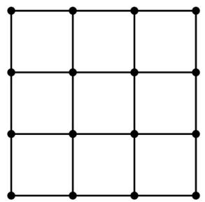
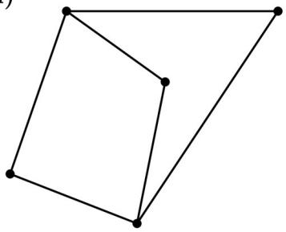
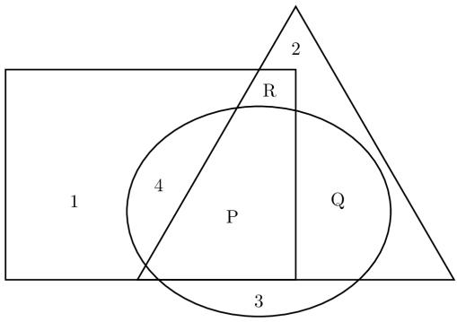
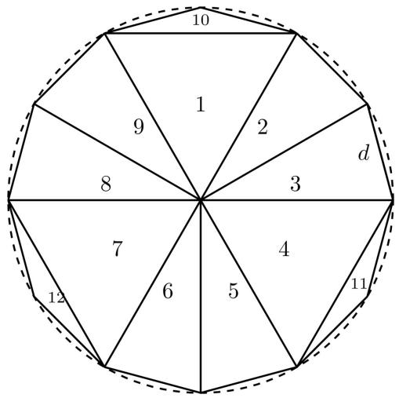
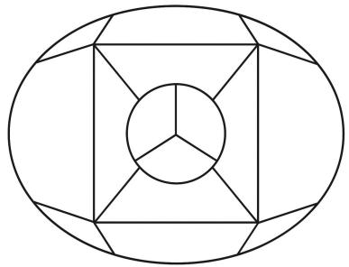
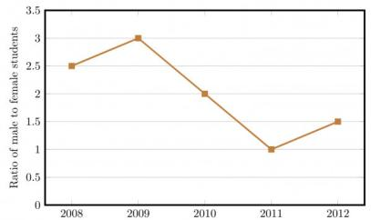
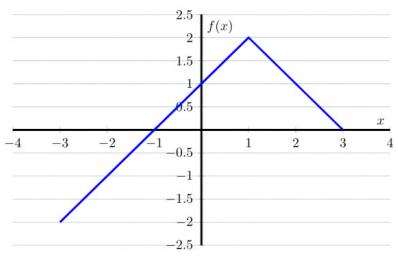
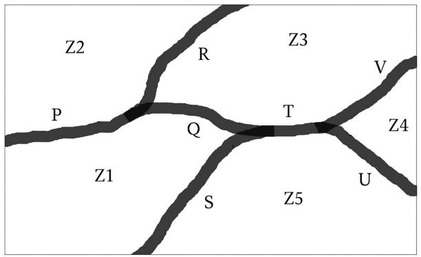

(i)  

natural_image

Pure grid pattern with 13 numbered points (no text or symbols)

(ii)  

natural_image

Two overlapping polygons with black dots at vertices (no text or symbols)

A. Such a trip is possible for (i), but not for (ii).  
B. Such a trip is possible for (ii), but not for (i).  
C. Such a trip is possible for both (i) and (ii).  
D. Such a trip is possible neither for (i) nor for (ii).

gatecse-2026-set2 quantitative-aptitude data-interpretation two-marks

# Answer key

# 9.20.3 Data Interpretation: GATE DA 2025 | GA | Question: 7

Weight of a person can be expressed as a function of their age. The function usually varies from person to person. Suppose this function is identical for two brothers, and it monotonically increases till the age of 50 years and then it monotonically decreases. Let $a_1$ and $a_2$ (in years) denote the ages of the brothers and $a_1 < a_2$ .

Which one of the following statements is correct about their age on the day when they attain the same weight?

A. $a_{1} < a_{2} < 50$  
C. $50 < a_{1} < a_{2}$

gateda-2025 quantitative-aptitude data-interpretation two-marks

B. $a_1 < 50 < a_2$  
D. Either $a_1 = 50$ or $a_2 = 50$

# Answer key

# 9.21

# Digital Image Processing (1)

# 9.21.1 Digital Image Processing: GATE DA 2025 | GA | Question: 3

A $4 \times 4$ digital image has pixel intensities $(U)$ as shown in the figure. The number of pixels with $U \leq 4$ is:

<table><tr><td>0</td><td>1</td><td>0</td><td>2</td></tr><tr><td>4</td><td>7</td><td>3</td><td>3</td></tr><tr><td>5</td><td>5</td><td>4</td><td>4</td></tr><tr><td>6</td><td>7</td><td>3</td><td>2</td></tr></table>

A. 3

B. 8

C. 11

D. 9

gateda-2025 quantitative-aptitude digital-image-processing easy one-mark

# Answer key

# 9.22

# Factors (3)

Practice Test: Test 1 (5Q)

# 9.22.1 Factors: GATE CSE 2013 | Question: 62

Out of all the 2-digit integers between 1 and 100, a 2-digit number has to be selected at random. What is the probability that the selected number is not divisible by 7?

A. $\left(\frac{13}{90}\right)$

B. $\left(\frac{12}{90}\right)$

C. $\left(\frac{78}{90}\right)$

D. $\left(\frac{77}{90}\right)$

gatecse-2013 quantitative-aptitude easy probability factors

# Answer key

# 9.22.2 Factors: GATE CSE 2018 | GA | Question: 4

What would be the smallest natural number which when divided either by 20 or by 42 or by 76 leaves a remainder of 7 in each case?

A. 3047

B. 6047

C. 7987

D. 63847

gatecse-2018 quantitative-aptitude factors one-mark

# Answer key

# 9.22.3 Factors: GATE2010 MN: GA-8

Consider the set of integers $\{1,2,3,\ldots,5000\}$ . The number of integers that is divisible by neither 3 nor 4 is :

A. 1668

B. 2084

C. 2500

D. 2916

general-aptitude quantitative-aptitude gate2010-mn factors

# Answer key

# 9.23

# Fractions (1)

# 9.23.1 Fractions: GATE CSE 2018 | GA | Question: 6

In appreciation of the social improvements completed in a town, a wealthy philanthropist decided to gift Rs 750 to each male senior citizen in the town and Rs 1000 to each female senior citizen. Altogether, there

were 300 senior citizens eligible for this gift. However, only $\frac{8^{th}}{9}$ of the eligible men and $\frac{2^{rd}}{3}$ of the eligible women claimed the gift. How much money (in Rupees) did the philanthropist give away in total?

A. 1,50,000

B. 2,00,000

C. 1,75,000

D. 1,51,000

gatecse-2018 quantitative-aptitude fractions normal two-marks

# Answer key

# 9.24

# Functions (7)

Practice Tests: Test 1 (15Q) Test 2 (7Q)

# 9.24.1 Functions: GATE CSE 2015 | Set 2 | GA | Question: 9

If $p, q, r, s$ are distinct integers such that:

$$
f (p, q, r, s) = \max (p, q, r, s)
$$

$$
g (p, q, r, s) = \min (p, q, r, s)
$$

$$
h (p, q, r, s) = \text {remainder of} \frac {(p \times q)}{(r \times s)} \text {if} (p \times q) > (r \times s)
$$

or remainder of $\frac{(r \times s)}{(p \times q)}$ if $(r \times s) > (p \times q)$

Also a function $fgh(p, q, r, s) = f(p, q, r, s) \times g(p, q, r, s) \times h(p, q, r, s)$

Also the same operations are valid with two variable functions of the form $f(p, q)$

What is the value of $fg(h(2,5,7,3),4,6,8)$ ?

gatecse-2015-set2 functions normal numerical-answers

# Answer key

# 9.24.2 Functions: GATE CSE 2015 | Set 3 | GA | Question: 5

A function $f(x)$ is linear and has a value of 29 at $x = -2$ and 39 at $x = 3$ . Find its value at $x = 5$ .

A. 59

B. 45

C. 43

D. 35

gatecse-2015-set3 quantitative-aptitude normal functions

Answer key

# 9.24.3 Functions: GATE CSE 2015 | Set 3 | GA | Question: 8

Choose the most appropriate equation for the function drawn as thick line, in the plot below.

text_image

y
(2, 0)
x
(0, -1)

A. $x = y - |y|$

B. $x = -(y - |y|)$

C. $x = y + |y|$

D. $x = -(y + |y|)$

gatecse-2015-set3 quantitative-aptitude normal functions

Answer key

# 9.24.4 Functions: GATE CSE 2023 | GA | Question: 7

Consider two functions of time (t),

$$
f (t) = 0. 0 1 t ^ {2}
$$

$$
g (t) = 4 t
$$

where $0 < t < \infty$ .

Now consider the following two statements:

i. For some $t > 0, g(t) > f(t)$ .  
ii. There exists a $T$ , such that $f(t) > g(t)$ for all $t > T$ .

Which one of the following options is TRUE?

A. only (i) is correct  
B. only (ii) is correct  
C. both (i) and (ii) are correct  
D. neither (i) nor (ii) is correct

gatecse-2023 quantitative-aptitude functions two-marks

Answer key

# 9.24.5 Functions: GATE CSE 2023 | GA | Question: 9

$f(x)$ and $g(y)$ are functions of x and y, respectively, and $f(x) = g(y)$ for all values of x and y. Which one of the following options is necessarily TRUE for a x and y?

A. $f(x) = 0$ and $g(y) = 0$

B. $f(x) = g(y) =$ constant

C. $f(x) \neq \text{constant} \quad \text{constant} \quad \text{and } g(y) \neq$ constant

D. $f(x) + g(y) = f(x) - g(y)$

gatecse-2023 quantitative-aptitude functions two-marks

Answer key

# 9.24.6 Functions: GATE2010 MN: GA-10

Given the following four functions $f_{1}(n) = n^{100}$ , $f_{2}(n) = (1.2)^{n}$ , $f_{3}(n) = 2^{n/2}$ , $f_{4}(n) = 3^{n/3}$ which function will have the largest value for sufficiently large values of $n$ ( $i.e. n \to \infty$ )?

A. $f_{4}$

B. $f_{3}$

C. $f_{2}$

D. $f_{1}$

general-aptitude quantitative-aptitude gate2010-mn functions

# Answer key

# 9.24.7 Functions: GATE2012 AR: GA-7

Let $f(x) = x - [x]$ , where $x \geq 0$ and $[x]$ is the greatest integer not larger than $x$ . Then $f(x)$ is a

A. monotonically increasing function  
B. monotonically decreasing function  
C. linearly increasing function between two integers  
D. linearly decreasing function between two integers

gate2012-ar quantitative-aptitude functions normal

# Answer key

# 9.25

# Geometry (5)

Practice Tests: Test 1 (15Q) Test 2 (15Q) Test 3 (4Q)

# 9.25.1 Geometry: GATE CSE 2014 | Set 1 | GA | Question: 10

When a point inside of a tetrahedron (a solid with four triangular surfaces) is connected by straight lines to its corners, how many (new) internal planes are created with these lines?

gatecse-2014-set1 quantitative-aptitude geometry combinatory normal numerical-answers

# Answer key

# 9.25.2 Geometry: GATE CSE 2024 | Set 1 | GA | Question: 7

A rectangular paper sheet of dimensions $54 \, cm \times 4 \, cm$ is taken. The two longer edges of the sheet are joined together to create a cylindrical tube. A cube whose surface area is equal to the area of the sheet is also taken.

Then, the ratio of the volume of the cylindrical tube to the volume of the cube is

A. $1/\pi$

B. $2/\pi$

C. $3/\pi$

D. $4/\pi$

gatecse-2024-set1 quantitative-aptitude geometry two-marks

# Answer key

# 9.25.3 Geometry: GATE CSE 2025 | Set 2 | GA | Question: 9

In the Given figure, PQRS is a square of side 2 cm and PLMN is a rectangle. The corner L of the rectangle is on the side QR. Side MN of the rectangle passes through the corner S of the square.

What is the area (in $cm^{2}$ ) of the rectangle PLMN?

Note: The figure shown is representative.

text_image

N
P
S
Q
L
R
M

A. $2\sqrt{2}$

B. 2

C. 8

D. 4

gatecse2025-set2 quantitative-aptitude geometry two-marks

# Answer key

# 9.25.4 Geometry: GATE DA 2025 | GA | Question: 4

In the given figure, the numbers associated with the rectangle, triangle, and ellipse are 1, 2, and 3, respectively. Which one among the given options is the most appropriate combination of P, Q, and R?

text_image

1
4
P
3
R
2
Q

A. $P = 6; Q = 5; R = 3$

B. $P = 5; Q = 6; R = 3$

C. $P = 3; Q = 6; R = 6$

D. $P = 5; Q = 3; R = 6$

gateda-2025 quantitative-aptitude geometry one-mark

# Answer key

# 9.25.5 Geometry: GATE DA 2025 | GA | Question: 8

A regular dodecagon (12-sided regular polygon) is inscribed in a circle of radius r cm as shown in the figure. The side of the dodecagon is d cm. All the triangles (numbered 1 to 12) in the figure are used to form squares of side r cm and each numbered triangle is used only once to form a square.

The number of squares that can be formed and the number of triangles required to form each square, respectively, are:

Note: The figure shown is representative.

text_image

10
1
2
d
9
8
3
7
4
12
6
5
11

A. 3;4

B. 4;3

C. 3;3

D. 3;2

gateda-2025 quantitative-aptitude geometry two-marks

# Answer key

# 9.26.1 Graph Coloring: GATE DS&AI 2024 | GA | Question: 2

The 15 parts of the given figure are to be painted such that no two adjacent parts with shared boundaries (excluding corners) have the same color. The minimum number of colors required is

natural_image

Geometric diagram of a circle inscribed in a larger circle, with internal square and polygonal lines forming a square (no text or symbols)

A. 4  
B. 3  
C. 5  
D. 6

gate-ds-ai-2024 quantitative-aptitude graph-coloring one-mark easy

Answer key

# 9.27

# Line Graph (5)

Practice Test: Test 1 (12Q)

# 9.27.1 Line Graph: GATE CSE 2014 | Set 2 | GA | Question: 9

The ratio of male to female students in a college for five years is plotted in the following line graph. If the number of female students doubled in 2009, by what percent did the number of male students increase in 2009?

line

| Year | Ratio of male to female students |
| --- | --- |
| 2008 | 2.5 |
| 2009 | 3.0 |
| 2010 | 2.0 |
| 2011 | 1.0 |
| 2012 | 1.5 |

gatecse-2014-set2 quantitative-aptitude data-interpretation numerical-answers normal line-graph

Answer key

# 9.27.2 Line Graph: GATE CSE 2014 | Set 3 | GA | Question: 9

The ratio of male to female students in a college for five years is plotted in the following line graph. If the number of female students in 2011 and 2012 is equal, what is the ratio of male students in 2012 to male students in 2011?

line

| Year | Ratio of male to female students |
| --- | --- |
| 2008 | 2.5 |
| 2009 | 3.0 |
| 2010 | 2.0 |
| 2011 | 1.0 |
| 2012 | 1.5 |

A. 1:1

B. 2:1

C. 1.5:1

D. 2.5:1

gatecse-2014-set3 quantitative-aptitude data-interpretation normal line-graph

Answer key

# 9.27.3 Line Graph: GATE CSE 2016 | Set 2 | GA | Question: 10

line

| x | f(x) |
| --- | --- |
| -3 | -2 |
| -1 | 0 |
| 1 | 2 |
| 3 | 0 |

A. $f(x) = 1 - |x - 1|$  
C. $f(x)=2-|x-1|$

gatecse-2016-set2 quantitative-aptitude data-interpretation normal line-graph

B. $f(x) = 1 + |x - 1|$  
D. $f(x) = 2 + |x - 1|$

# Answer key

# 9.27.4 Line Graph: GATE2011 AG: GA-9

The fuel consumed by a motorcycle during a journey while traveling at various speeds is indicated in the graph below.

line

| Speed | Fuel consumption (Kilometres per litre) |
| --- | --- |
| 10 | 32 |
| 15 | 61 |
| 45 | 92 |
| 75 | 78 |

(Kilometres per hour)

The distances covered during four laps of the journey are listed in the table below

<table><tr><td>Lap</td><td>Distance(kilometres)</td><td>Average Speed(kilometres per hour)</td></tr><tr><td>P</td><td>15</td><td>15</td></tr><tr><td>Q</td><td>75</td><td>45</td></tr><tr><td>R</td><td>40</td><td>75</td></tr><tr><td>S</td><td>10</td><td>10</td></tr></table>

From the given data, we can conclude that the fuel consumed per kilometre was least during the lap

A. P

B. Q

C. R

D. S

general-aptitude quantitative-aptitude gate2011-ag data-interpretation line-graph

# Answer key

# 9.27.5 Line Graph: GATE2014 AE: GA-10

The monthly rainfall chart based on 50 years of rainfall in Agra is shown in the following figure.

line

| Month | Average (mm) | 5 Percentile (mm) | 95 Percentile (mm) |
| --- | --- | --- | --- |
| Jan | ~80 | ~30 | ~130 |
| Feb | ~60 | ~20 | ~100 |
| Mar | ~90 | ~50 | ~120 |
| Apr | ~110 | ~90 | ~130 |
| May | ~290 | ~260 | ~300 |
| Jun | ~590 | ~570 | ~600 |
| Jul | ~640 | ~620 | ~660 |
| Aug | ~540 | ~520 | ~570 |
| Sep | ~420 | ~380 | ~450 |
| Oct | ~180 | ~140 | ~200 |
| Nov | ~130 | ~90 | ~160 |
| Dec | ~80 | ~30 | ~140 |

Which of the following are true? (k percentile is the value such that k percent of the data fall below that value)

i. On average, it rains more in July than in December  
ii. Every year, the amount of rainfall in August is more than that in January  
iii. July rainfall can be estimated with better confidence than February rainfall  
iv. In August, there is at least 500 mm of rainfall

A. (i) and (ii)

B. (i) and (iii)

C. (ii) and (iii)

D. (iii) and (iv)

gate2014-ae quantitative-aptitude data-interpretation line-graph

Answer key

# 9.28

# Logarithms (6)

Practice Tests: Test 1 (15Q) Test 2 (4Q)

# 9.28.1 Logarithms: GATE CSE 2011 | Question: 57

If $\log (\mathrm{P}) = (1 / 2)\log (\mathrm{Q}) = (1 / 3)\log (\mathrm{R})$ , then which of the following options is TRUE?

A. $P^{2}=Q^{3}R^{2}$

B. $Q^{2}=PR$

C. $Q^{2}=R^{3}P$

D. $R = P^{2}Q^{2}$

gatecse-2011 quantitative-aptitude normal logarithms

Answer key

# 9.28.2 Logarithms: GATE CSE 2018 | GA | Question: 7

If $pqr \neq 0$ and $p^{-x} = \frac{1}{q}$ , $q^{-y} = \frac{1}{r}$ , $r^{-z} = \frac{1}{p}$ , what is the value of the product $xyz$ ?

A. -1

B. $\frac{1}{pqr}$

C. 1

D. pqr

gatecse-2018 quantitative-aptitude ratio-proportion two-marks logarithms

Answer key

# 9.28.3 Logarithms: GATE CSE 2024 | Set 1 | GA | Question: 5

For positive non-zero real variables p and q, if

$$
\log \bigl (p ^ {2} + q ^ {2} \bigr) = \log p + \log q + 2 \log 3,
$$

then, the value of $\frac{p^4 + q^4}{p^2q^2}$ is

A. 79

B. 81

C. 9

D. 83

gatecse-2024-set1 quantitative-aptitude logarithms one-mark

Answer key

# 9.28.4 Logarithms: GATE CSE 2024 | Set 2 | GA | Question: 4

For positive non-zero real variables x and y, if

$$
\ln \bigg (\frac {x + y}{2} \bigg) = \frac {1}{2} [ \ln (x) + \ln (y) ]
$$

then, the value of $\frac{x}{y} + \frac{y}{x}$ is

A. 1

B. $1 / 2$

C. 2

D. 4

gatecse-2024-set2 quantitative-aptitude logarithms one-mark

Answer key

# 9.28.5 Logarithms: GATE DA 2026 | GA | Question: 4

Consider two distinct positive real numbers $m, n$ , with $m > n$ . Let $x = n^{\log_{10}(m)}$ and $y = m^{\log_{10}(n)}$ . The relation between $x$ and $y$ is \_\_\_\_.

A. x > y

B. x < y

C. x = y

D. $x = \log_{10}(y)$

gateda-2026 quantitative-aptitude logarithms one-mark

# Answer key

# 9.28.6 Logarithms: GATE2012 AR: GA-6

A value of $x$ that satisfies the equation $\log x + \log (x - 7) = \log (x + 11) + \log 2$ is

A. 1

B. 2

C. 7

D. 11

gate2012-ar quantitative-aptitude logarithms

# Answer key

# 9.29

# Maps (1)

# 9.29.1 Maps: GATE CSE 2025 | Set 2 | GA | Question: 10

The diagram below shows a river system consisting of 7 segments, marked $P, Q, R, S, T, U$ , and $V$ . It splits the land into 5 zones, marked $Z1, Z2, Z3, Z4$ , and $Z5$ . We need to connect these zones using the least number of bridges, Out of the following options, which one is correct?

Note: The figure shown is representative.

text_image

Z2
R
Z3
P
Q
T
V
Z1
S
Z5
U
Z4

A. Bridges on $P, Q$ and $T$

C. Bridges on $Q, R, T$ and $V$

gatecse2025-set2 quantitative-aptitude maps two-marks

B. Bridges on $P, Q, S$ and $T$

D. Bridges on $P, Q, S, U$ and $V$

# Answer key

# 9.30

# Maxima Minima (4)

# Practice Test: Test 1 (5Q)

# 9.30.1 Maxima Minima: GATE CSE 2012 | Question: 62

A political party orders an arch for the entrance to the ground in which the annual convention is being held. The profile of the arch follows the equation $y = 2x - 0.1x^{2}$ where $y$ is the height of the arch in meters. The maximum possible height of the arch is

A. 8 meters

B. 10 meters

C. 12 meters

D. 14 meters

gatecse-2012 quantitative-aptitude normal maxima-minima

# Answer key

# 9.30.2 Maxima Minima: GATE CSE 2017 | Set 2 | GA | Question: 9

The number of roots of $e^x + 0.5x^2 - 2 = 0$ in the range $[-5, 5]$ is

A. 0

B. 1

C. 2

D. 3

gatecse-2017-set2 quantitative-aptitude normal maxima-minima calculus

# Answer key

# 9.30.3 Maxima Minima: GATE2010 TF: GA-5

Consider the function $f(x) = \max (7 - x, x + 3)$ . In which range does $f$ take its minimum value?

A. $-6 \leq x < -2$

B. $-2 \leq x < 2$

C. $2 \leq x < 6$

D. $6 \leq x < 10$

general-aptitude quantitative-aptitude gate2010-tf maxima-minima functions

# Answer key

# 9.30.4 Maxima Minima: GATE2013 CE: GA-6

$X$ and $Y$ are two positive real numbers such that $2X + Y \leq 6$ and $X + 2Y \leq 8$ . For which of the following values of

$(X,Y)$ the function $f(X,Y) = 3X + 6Y$ will give maximum value?

A. $\left(\frac{4}{3},\frac{10}{3}\right)$

B. $\left(\frac{8}{3},\frac{20}{3}\right)$

C. $\left(\frac{8}{3}, \frac{10}{3}\right)$

D. $\left(\frac{4}{3},\frac{20}{3}\right)$

gate2013-ce quantitative-aptitude maxima-minima

# Answer key

# 9.31

# Mensuration (1)

# 9.31.1 Mensuration: GATE DA 2025 | GA | Question: 5

A rectangle has a length L and a width W, where L > W. If the width, W, is increased by 10%, which one of the following statements is correct for all values of L and W?

A. Perimeter increases by 10%.

B. Length of the diagonals increases by 10%.

C. Area increases by 10%.

D. The rectangle becomes a square.

gateda-2025 quantitative-aptitude mensuration one-mark

# Answer key

# 9.32

# Modular Arithmetic (1)

# 9.32.1 Modular Arithmetic: GATE2012 CY: GA-1

If $(1.001)^{1259} = 3.52$ and $(1.001)^{2062} = 7.85$ , then $(1.001)^{3321} =$

A. 2.23

B. 4.33

C. 11.37

D. 27.64

gate2012-cy quantitative-aptitude modular-arithmetic

# Answer key

# 9.33

# Number Representation (1)

# 9.33.1 Number Representation: GATE DA 2026 | GA | Question: 2

The product of the digits of a three-digit number is 70. The sum of the digits of this three-digit number is

A. 12

B. 14

C. 16

D. 18

# 9.34

# Number Series (5)

Practice Test: Test 1 (10Q)

# 9.34.1 Number Series: GATE CSE 2013 | Question: 61

Find the sum of the expression

$$
\frac {1}{\sqrt {1} + \sqrt {2}} + \frac {1}{\sqrt {2} + \sqrt {3}} + \frac {1}{\sqrt {3} + \sqrt {4}} + \dots + \frac {1}{\sqrt {8 0} + \sqrt {8 1}}
$$

A. 7

B. 8

C. 9

D. 10

gatecse-2013 quantitative-aptitude normal number-series

# Answer key

# 9.34.2 Number Series: GATE CSE 2014 | Set 2 | GA | Question: 5

The value of $\sqrt{12 + \sqrt{12 + \sqrt{12 + \ldots}}}$ is

A. 3.464

B. 3.932

C. 4.000

D. 4.444

gatecse-2014-set2 quantitative-aptitude easy number-series

# Answer key

# 9.34.3 Number Series: GATE CSE 2014 | Set 3 | GA | Question: 4

Which number does not belong in the series below?

2,5,10,17,26,37,50,64

A. 17

B. 37

C. 64

D. 26

gatecse-2014-set3 quantitative-aptitude number-series easy

# Answer key

# 9.34.4 Number Series: GATE2010 TF: GA-7

Consider the series $\frac{1}{2} + \frac{1}{3} - \frac{1}{4} + \frac{1}{8} + \frac{1}{9} - \frac{1}{16} + \frac{1}{32} + \frac{1}{27} - \frac{1}{64} + \ldots$ . The sum of the infinite series above is:

A. $\infty$

B. $\frac{5}{6}$

C. $\frac{1}{2}$

D. 0

general-aptitude quantitative-aptitude gate2010-tf number-series

# Answer key

# 9.34.5 Number Series: GATE2013 EE: GA-10

Find the sum to 'n' terms of the series $10 + 84 + 734 + \ldots$

A. $\frac{9(9^n + 1)}{10} + 1$

B. $\frac{9(9^n - 1)}{8} + 1$

C. $\frac{9(9^n - 1)}{8} + n$

D. $\frac{9(9^n - 1)}{8} + n^2$

gate2013-ee quantitative-aptitude number-series

# Answer key

# 9.35

# Number System (4)

Practice Tests: Test 1 (15Q) Test 2 (15Q) Test 3 (2Q)

# 9.35.1 Number System: GATE CSE 2014 | Set 3 | GA | Question: 10

Consider the equation: $(7526)_8 - (Y)_8 = (4364)_8$ , where $(X)_N$ stands for $X$ to the base $N$ . Find $Y$ .

A. 1634

B. 1737

C. 3142

D. 3162

gatecse-2014-set3 quantitative-aptitude number-system normal digital-logic

# Answer key

# 9.35.2 Number System: GATE CSE 2017 | Set 2 | GA | Question: 8

$X$ is a 30 digit number starting with the digit 4 followed by the digit 7. Then the number $X^3$ will have

A. 90 digits

B. 91 digits

C. 92 digits

D. 93 digits

gatecse-2017-set2 quantitative-aptitude number-system

# Answer key

# 9.35.3 Number System: GATE DA 2026 | GA | Question: 9

P, Q, R, S, X, and Y are distinct single-digit whole numbers taking values from 0 to 9.

$PQ$ is a two-digit number with $Q$ being in the units place and $P$ in the tens place. Similarly, $RS$ is a two-digit number.

It is known that $PQ$ and $RS$ are consecutive numbers and $(PQ)^2 + (RS)^2 = XYP$ , with $XYP$ being a three-digit number.

The value of $Y$ is \_\_\_\_

A. 4

B. 5

C. 6

D. 7

gateda-2026 quantitative-aptitude two-marks number-system

# Answer key

# 9.35.4 Number System: GATE2010 MN: GA-9

A positive integer m in base 10 when represented in base 2 has the representation p and in base 3 has the representation q. We get p - q = 990 where the subtraction is done in base 10. Which of the following is necessarily true?

A. $m \geq 14$

B. $9 \leq m \leq 13$

C. $6 \leq m \leq 8$

D. m < 6

general-aptitude quantitative-aptitude gate2010-mn number-system

# Answer key

# 9.36

# Number Theory (2)

# Practice Test: Test 1 (7Q)

# 9.36.1 Number Theory: GATE CSE 2025 | Set 2 | GA | Question: 3

If $P e^{x} = Q e^{-x}$ for all real values of $x$ , which one of the following statements is true?

A. P = Q = 0

B. P = Q = 1

C. $P = 1; Q = -1$

D. $\frac{P}{Q}=0$

gatecse2025-set2 quantitative-aptitude mathematical-logic one-mark number-theory

# Answer key

# 9.36.2 Number Theory: GATE2012 AE: GA-8

If a prime number on division by 4 gives a remainder of 1, then that number can be expressed as

A. sum of squares of two natural numbers  
B. sum of cubes of two natural numbers  
C. sum of square roots of two natural numbers  
D. sum of cube roots of two natural numbers

