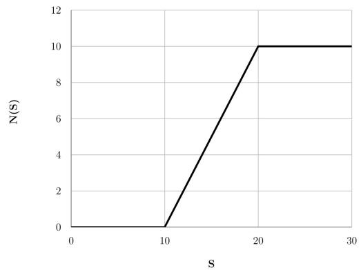
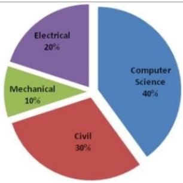
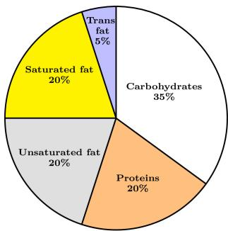
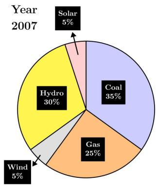
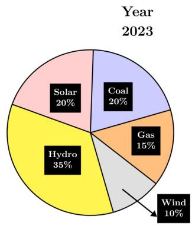
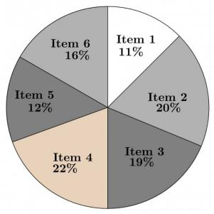

# 9.37

# Numerical Computation (9)

Practice Tests: Test 1 (15Q) Test 2 (3Q)

# 9.37.1 Numerical Computation: GATE CSE 2014 | Set 1 | GA | Question: 4

$$
\text {If} \left(z + \frac {1}{z}\right) ^ {2} = 9 8, \text {compute} \left(z ^ {2} + \frac {1}{z ^ {2}}\right).
$$

gatecse-2014-set1 quantitative-aptitude easy numerical-answers numerical-computation

Answer key

# 9.37.2 Numerical Computation: GATE CSE 2014 | Set 2 | GA | Question: 4

What is the average of all multiples of 10 from 2 to 198?

A. 90

B. 100

C. 110

D. 120

gatecse-2014-set2 quantitative-aptitude easy numerical-computation factors

Answer key

# 9.37.3 Numerical Computation: GATE CSE 2017 | Set 1 | GA | Question: 4

Find the smallest number y such that $y \times 162$ is a perfect cube.

A. 24

B. 27

C. 32

D. 36

gatecse-2017-set1 general-aptitude quantitative-aptitude easy numerical-computation

Answer key

# 9.37.4 Numerical Computation: GATE CSE 2017 | Set 2 | GA | Question: 4

A test has twenty questions worth 100 marks in total. There are two types of questions. Multiple choice questions are worth 3 marks each and essay questions are worth 11 marks each. How many multiple choice questions does the exam have?

A. 12

B. 15

C. 18

D. 19

gatecse-2017-set2 quantitative-aptitude numerical-computation

Answer key

# 9.37.5 Numerical Computation: GATE CSE 2026 | Set 1 | GA | Question: 3

Consider a knock-out women's badminton singles tournament where there are no ties. The loser in each game is eliminated from the tournament. Every player plays until she is defeated or remains the last undefeated player. The last undefeated player is declared the winner of the tournament. If there are 64 players in the beginning of the tournament, how many games should be played in total to declare the winner of the tournament?

A. 127

B. 64

C. 63

D. 32

gatecse-2026-set1 quantitative-aptitude numerical-computation easy one-mark

Answer key

# 9.37.6 Numerical Computation: GATE CSE 2026 | Set 1 | GA | Question: 4

A student needs to enroll for a minimum of 60 credits. A student cannot enroll for more than 70 credits. The credits are divided amongst project and three distinct sets of courses namely, core courses, specialization courses, and elective courses. It is compulsory for a student to enroll for exactly 15 credits of core courses and exactly 20 credits of project. In addition, a student has to enroll for a minimum of 10 credits of specialization

courses. The maximum credits of elective courses that a student can enroll for is \_\_\_\_

A. 10

B. 15

C. 20

D. 25

gatecse-2026-set1 quantitative-aptitude numerical-computation one-mark

# Answer key

# 9.37.7 Numerical Computation: GATE CSE 2026 | Set 1 | GA | Question: 8

For positive real numbers $S$ and $K$ , the function $H_K(S)$ is defined as:

$H_{K}(S) = \max (S - K,0)$ . The max function is defined as:

$$
\max (a, b) = \left\{ \begin{array}{l l} a, & \text {when} a > b \\ b, & \text {when} a \leq b \end{array} \right.
$$

The graph below shows the plot of a function $N(S)$ versus $S$ .

$N(S)$ can be expressed as \_\_\_\_.

line

| S | N(S) |
| --- | --- |
| 0 | 0 |
| 10 | 0 |
| 20 | 10 |
| 30 | 10 |

A. $H_{10}(S) - H_{20}(S)$  
C. $-H_{10}(S)+H_{20}(S)$

gatecse-2026-set1 quantitative-aptitude numerical-computation two-marks

B. $H_{10}(S) - 2H_{20}(S)$  
D. $H_{15}(S)-H_{20}(S)$

# Answer key

# 9.37.8 Numerical Computation: GATE2010 TF: GA-10

A student is answering a multiple choice examination with 65 questions with a marking scheme as follows:

i) 1 marks for each correct answer, ii) $-\frac{1}{4}$ for a wrong answer, iii) $-\frac{1}{8}$ for a question that has not been attempted. If the student gets 37 marks in the test then the least possible number of questions the student has NOT answered is:

A. 6

B. 5

C. 7

D. 4

general-aptitude quantitative-aptitude gate2010-tf numerical-computation

# Answer key

# 9.37.9 Numerical Computation: GATE2013 CE: GA-1

A number is as much greater than 75 as it is smaller than 117. The number is:

A. 91

B. 93

C. 89

D. 96

gate2013-ce quantitative-aptitude numerical-computation

# Answer key

# 9.38.1 Percentage: GATE CSE 2014 | Set 1 | GA | Question: 8

Round-trip tickets to a tourist destination are eligible for a discount of 10% on the total fare. In addition, groups of 4 or more get a discount of 5% on the total fare. If the one way single person fare is Rs 100, a group of 5 tourists purchasing round-trip tickets will be charged Rs \_\_\_\_

gatecse-2014-set1 quantitative-aptitude easy numerical-answers percentage

Answer key

# 9.38.2 Percentage: GATE CSE 2014 | Set 3 | GA | Question: 8

The Gross Domestic Product (GDP) in Rupees grew at 7% during 2012 – 2013. For international comparison, the GDP is compared in US Dollars (USD) after conversion based on the market exchange rate. During the period 2012 – 2013 the exchange rate for the USD increased from Rs. 50/USD to Rs.60/USD. India's GDP in USD during the period 2012 – 2013

A. increased by 5%

B. decreased by 13%

C. decreased by 20%

D. decreased by 11%

gatecse-2014-set3 quantitative-aptitude normal percentage

Answer key

# 9.38.3 Percentage: GATE CSE 2024 | Set 1 | GA | Question: 4

The number of coins of ₹1, ₹5, and ₹10 denominations that a person has are in the ratio 5 : 3 : 13. Of the total amount, the percentage of money in ₹5 coins is

A. 21%

B. $14\frac{2}{7}\%$

C. 10%

D. 30%

gatecse-2024-set1 quantitative-aptitude percentage one-mark

Answer key

# 9.38.4 Percentage: GATE2011 AG: GA-4

There are two candidates $P$ and $Q$ in an election. During the campaign, $40\%$ of the voters promised to vote for $P$ , and rest for $Q$ . However, on the day of election $15\%$ of the voters went back on their promise to vote for $P$ and instead voted for $Q$ . $25\%$ of the voters went back on their promise to vote for $Q$ and instead voted for $P$ . Suppose, $P$ lost by 2 votes, then what was the total number of voters?

A. 100

B. 110

C. 90

D. 95

general-aptitude quantitative-aptitude gate2011-ag percentage

Answer key

# 9.38.5 Percentage: GATE2012 AE: GA-7

The total runs scored by four cricketers $P, Q, R$ and $S$ in years 2009 and 2010 are given in the following table;

<table><tr><td>Player</td><td>2009</td><td>2010</td></tr><tr><td>P</td><td>802</td><td>1008</td></tr><tr><td>Q</td><td>765</td><td>912</td></tr><tr><td>R</td><td>429</td><td>619</td></tr><tr><td>S</td><td>501</td><td>701</td></tr></table>

The player with the lowest percentage increase in total runs is

A. P

B. Q

C. R

D. S

# 9.38.6 Percentage: GATE2012 CY: GA-8

The data given in the following table summarizes the monthly budget of an average household.

<table><tr><td>Category</td><td>Amount(Rs.)</td></tr><tr><td>Food</td><td>4000</td></tr><tr><td>Rent</td><td>2000</td></tr><tr><td>Savings</td><td>1500</td></tr><tr><td>Other expenses</td><td>1800</td></tr><tr><td>Clothing</td><td>1200</td></tr></table>

The approximate percentage of the monthly budget NOT spent on savings is

A. 10%

B. 14%

C. 81%

D. 86%

gate2012-cy quantitative-aptitude percentage

# Answer key

# 9.38.7 Percentage: GATE2013 EE: GA-2

In the summer of 2012, in New Delhi, the mean temperature of Monday to Wednesday was $41^{\circ}C$ and of Tuesday to Thursday was $43^{\circ}C$ . If the temperature on Thursday was 15% higher than that of Monday, then the temperature in ${}^{\circ}C$ on Thursday was

A. 40

B. 43

C. 46

D. 49

gate2013-ee quantitative-aptitude percentage

# Answer key

# 9.38.8 Percentage: GATE2014 AE: GA-9

One percent of the people of country X are taller than 6 ft. Two percent of the people of country Y are taller than 6 ft. There are thrice as many people in country X as in country Y. Taking both countries together, what is the percentage of people taller than 6 ft?

A. 3.0

B. 2.5

C. 1.5

D. 1.25

gate2014-ae percentage quantitative-aptitude

# Answer key

# 9.39

# Permutation and Combination (4)

# Practice Test: Test 1 (14Q)

# 9.39.1 Permutation and Combination: GATE CSE 2024 | Set 2 | GA | Question: 2

Two wizards try to create a spell using all the four elements, water, air, fire, and earth. For this, they decide to mix all these elements in all possible orders. They also decide to work independently. After trying all possible combination of elements, they conclude that the spell does not work.

How many attempts does each wizard make before coming to this conclusion, independently?

A. 24

B. 48

C. 16

D. 12

gatecse-2024-set2 quantitative-aptitude permutation-and-combination one-mark

# Answer key

# 9.39.2 Permutation and Combination: GATE CSE 2025 | Set 1 | GA | Question: 10

A shop has 4 distinct flavors of ice-cream. One can purchase any number of scoops of any flavor. The order in which the scoops are purchased is inconsequential. If one wants to purchase 3 scoops of ice-cream, in how many ways can one make that purchase?

A. 4

B. 20

C. 24

D. 48

gatecse2025-set1 quantitative-aptitude permutation-and-combination two-marks

# Answer key

# 9.39.3 Permutation and Combination: GATE DA 2026 | GA | Question: 7

Five integers are picked from 0 to 20, with possible repetitions, such that their mean is 12, median is 18, and they have a single mode of 20.

Ignoring permutations, the number of ways to pick these five integers is \_\_\_\_

A. 0

B. 1

C. 2

D. 3

gateda-2026 quantitative-aptitude permutation-and-combination two-marks

# Answer key

# 9.39.4 Permutation and Combination: GATE DS&AI 2024 | GA | Question: 3

How many 4-digit positive integers divisible by 3 can be formed using only the digits $\{1,3,4,6,7\}$ , such that no digit appears more than once in a number?

A. 24

B. 48

C. 72

D. 12

gate-ds-ai-2024 quantitative-aptitude permutation-and-combination one-mark

# Answer key

# 9.40

# Pie Chart (5)

Practice Tests: Test 1 (15Q) Test 2 (7Q)

# 9.40.1 Pie Chart: GATE CSE 2015 | Set 1 | GA | Question: 9

The pie chart below has the breakup of the number of students from different departments in an engineering college for the year 2012. The proportion of male to female students in each department is 5:4. There are 40 males in Electrical Engineering. What is the difference between the numbers of female students in the department and the female students in the Mechanical department?

pie

| Category | Percentage |
| --- | --- |
| Computer Science | 40% |
| Civil | 30% |
| Electrical | 20% |
| Mechanical | 10% |

gatecse-2015-set1 quantitative-aptitude data-interpretation numerical-answers pie-chart

# Answer key

# 9.40.2 Pie Chart: GATE CSE 2024 | Set 1 | GA | Question: 8

The pie chart presents the percentage contribution of different macronutrients to a typical 2,000 kcal diet of a person.

Macronutrient energy contribution  

pie

| Category | Percentage |
| --- | --- |
| Carbohydrates | 35% |
| Proteins | 20% |
| Unsaturated fat | 20% |
| Saturated fat | 20% |
| Trans fat | 5% |

The typical energy density (kcal/g) of these macronutrients is given in the table.

<table><tr><td>Macronutrient</td><td>Energy density (kcal/g)</td></tr><tr><td>Carbohydrates</td><td>4</td></tr><tr><td>Proteins</td><td>4</td></tr><tr><td>Unsaturated fat</td><td>9</td></tr><tr><td>Saturated fat</td><td>9</td></tr><tr><td>Trans fat</td><td>9</td></tr></table>

The total fat (all three types), in grams, this person consumes is

A. 44.4

B. 77.8

C. 100

D. 3,600

gatecse-2024-set1 quantitative-aptitude pie-chart two-marks

Answer key

# 9.40.3 Pie Chart: GATE CSE 2024 | Set 2 | GA | Question: 8

The pie charts depict the shares of various power generation technologies in the total electricity generation of a country for the years 2007 and 2023.

pie

| Category | Percentage |
| --- | --- |
| Coal | 35% |
| Gas | 25% |
| Hydro | 30% |
| Wind | 5% |
| Solar | 5% |

pie

| Category | Value (%) |
| --- | --- |
| Solar | 20% |
| Coal | 20% |
| Gas | 15% |
| Wind | 10% |
| Hydro | 35% |

The renewable sources of electricity generation consist of Hydro, Solar and Wind. Assuming that the total electricity generated remains the same from 2007 to 2023, what is the percentage increase in the share of the renewable sources of electricity generation over this period?

A. 25%

B. 50%

C. 77.5%

D. 62.5%

gatecse-2024-set2 quantitative-aptitude pie-chart two-marks

Answer key

# 9.40.4 Pie Chart: GATE DS&AI 2024 | GA | Question: 5

In an election, the share of valid votes received by the four candidates A, B, C, and D is represented by the pie chart shown. The total number of votes cast in the election were 1,15,000, out of which 5,000 were invalid.

pie

| Category | Percentage |
| --- | --- |
| A | 40% |
| B | 25% |
| C | 20% |
| D | 15% |

Based on the data provided, the total number of valid votes received by the candidates B and C is

A. 45,000

B. 49,500

C. 51,750

D. 54,000

gate-ds-ai-2024 quantitative-aptitude pie-chart one-mark

# Answer key

# 9.40.5 Pie Chart: GATE2014 AG: GA-8

The total exports and revenues from the exports of a country are given in the two pie charts below. The pie chart for exports shows the quantity of each item as a percentage of the total quantity of exports. The pie chart for the revenues shows the percentage of the total revenue generated through export of each item. The total quantity of exports of all the items is 5 lakh tonnes and the total revenues are 250 crore rupees. What is the ratio of the revenue generated through export of Item 1 per kilogram to the revenue generated through export of Item 4 per kilogram?

Exports  

pie

| Category | Percentage |
| --- | --- |
| Item 1 | 11% |
| Item 2 | 20% |
| Item 3 | 19% |
| Item 4 | 22% |
| Item 5 | 12% |
| Item 6 | 16% |

Revenues  

pie

| Category | Value (%) |
| --- | --- |
| Item 1 | 12% |
| Item 2 | 20% |
| Item 3 | 23% |
| Item 4 | 6% |
| Item 5 | 20% |
| Item 6 | 19% |

A. 1:2

B. 2:1

C. 1:4

D. 4:1

gate2014-ag quantitative-aptitude data-interpretation pie-chart ratio-proportion normal

# Answer key

# 9.41

# Polynomials (1)

Practice Test: Test 1 (5Q)

# 9.41.1 Polynomials: GATE CSE 2016 | Set 1 | GA | Question: 09

If $f(x) = 2x^{7} + 3x - 5$ , which of the following is a factor of $f(x)$ ?

A. $(x^{3}+8)$

B. $(x-1)$

C. $(2x-5)$

D. $(x+1)$

gatecse-2016-set1 quantitative-aptitude polynomials normal

# Answer key

# 9.42

# Powers (1)

# 9.42.1 Powers: GATE DA 2025 | GA | Question: 9

If a real variable $x$ satisfies $3^{x^2} = 27 \times 9^x$ , then the value of $\frac{2^{x^2}}{(2^x)^2}$ is:

A. $2^{-1}$

B. $2^{0}$

C. $2^{3}$

D. $2^{15}$

gateda-2025 quantitative-aptitude powers two-marks

Answer key

# 9.43

# Prime Numbers (1)

# 9.43.1 Prime Numbers: GATE CSE 2025 | Set 2 | GA | Question: 5

Let $p_{1}$ and $p_{2}$ denote two arbitrary prime numbers. Which one of the following statements is correct for all values of $p_{1}$ and $p_{2}$ ?

A. $p_1 + p_2$ not a prime number  
C. $p_1 + p_2 + 1$ is a prime number

B. $p_1p_2$ is not a prime number

D. $p_1p_2 + 1$ is a prime number

gatecse2025-set2 quantitative-aptitude easy prime-numbers one-mark

Answer key

# 9.44

# Probability (17)

Practice Tests:

Test 1 (15Q)

Test 2 (15Q)

Test 3 (10Q)

# 9.44.1 Probability: GATE CSE 2015 | Set 1 | GA | Question: 10

The probabilities that a student passes in mathematics, physics and chemistry are m, p and c respectively. Of these subjects, the student has 75% chance of passing in at least one, a 50% chance of passing in at least two and a 40% chance of passing in exactly two. Following relations are drawn in m, p, c:

1. $p + m + c = 27/20$  
II. $p + m + c = 13 / 20$  
III. $(p)\times (m)\times (c) = 1 / 10$

A. Only relation I is true.  
C. Relations II and III are true.

gatecse-2015-set1 quantitative-aptitude probability

Answer key

# 9.44.2 Probability: GATE CSE 2015 | Set 1 | GA | Question: 3

Given Set A = 2, 3, 4, 5 and Set B = 11, 12, 13, 14, 15, two numbers are randomly selected, one from each set. What is the probability that the sum of the two numbers equals 16?

A. 0.20

B. 0.25

C. 0.30

D. 0.33

gatecse-2015-set1 quantitative-aptitude probability normal

Answer key

# 9.44.3 Probability: GATE CSE 2017 | Set 1 | GA | Question: 5

The probability that a k-digit number does NOT contain the digits 0, 5, or 9 is

A. $0.3^{k}$

B. $0.6^{k}$

C. $0.7^{k}$

D. $0.9^{k}$

gatecse-2017-set1 general-aptitude quantitative-aptitude probability easy

Answer key

# 9.44.4 Probability: GATE CSE 2017 | Set 2 | GA | Question: 5

There are 3 red socks, 4 green socks and 3 blue socks. You choose 2 socks. The probability that they are of the same colour is

A. $\frac{1}{5}$

B. $\frac{7}{30}$

C. $\frac{1}{4}$

D. $\frac{4}{15}$

gatecse-2017-set2 quantitative-aptitude probability

# Answer key

# 9.44.5 Probability: GATE CSE 2018 | GA | Question: 10

A six sided unbiased die with four green faces and two red faces is rolled seven times. Which of the following combinations is the most likely outcome of the experiment?

A. Three green faces and four red faces.

B. Four green faces and three red faces.

C. Five green faces and two red faces.

D. Six green faces and one red face

gatecse-2018 quantitative-aptitude probability normal two-marks

# Answer key

# 9.44.6 Probability: GATE CSE 2021 | Set 1 | GA | Question: 8

There are five bags each containing identical sets of ten distinct chocolates. One chocolate is picked from each bag.

The probability that at least two chocolates are identical is \_\_\_\_

A. 0.3024

B. 0.4235

C. 0.6976

D. 0.8125

gatecse-2021-set1 quantitative-aptitude probability two-marks

# Answer key

# 9.44.7 Probability: GATE CSE 2022 | GA | Question: 8

A box contains five balls of same size and shape. Three of them are green coloured balls and two of them are orange coloured balls. Balls are drawn from the box one at a time. If a green ball is drawn, it is not replaced. If an orange ball is drawn, it is replaced with another orange ball.

First ball is drawn. What is the probability of getting an orange ball in the next draw?

A. $\frac{1}{2}$

B. $\frac{8}{25}$

C. $\frac{19}{50}$

D. $\frac{23}{50}$

gatecse-2022 quantitative-aptitude probability two-marks

# Answer key

# 9.44.8 Probability: GATE CSE 2025 | Set 1 | GA | Question: 8

A fair six-faced dice, with the faces labelled ‘1’, ‘2’, ‘3’, ‘4’, ‘5’, and ‘6’, is rolled thrice. What is the probability of rolling ‘6’ exactly once?

A. $\frac{75}{216}$

B. $\frac{1}{6}$

C. $\frac{1}{18}$

D. $\frac{25}{216}$

gatecse2025-set1 quantitative-aptitude probability easy two-marks

# Answer key

# 9.44.9 Probability: GATE CSE 2026 | Set 1 | GA | Question: 10

An unbiased six-faced dice whose faces are marked with numbers 1, 2, 3, 4, 5, and 6 is rolled twice in succession and the number on the top face is recorded each time. The probability that the number appearing in the second roll is an integer multiple of the number appearing in the first roll is \_\_\_\_

A. $\frac{1}{6}$

B. $\frac{5}{18}$

C. $\frac{7}{18}$

D. $\frac{5}{6}$

# Answer key

# 9.44.10 Probability: GATE CSE 2026 | Set 2 | GA | Question: 10

An unbiased six-faced dice whose faces are marked with numbers 1, 2, 3, 4, 5, and 6 is rolled twice in succession and the number on the top face is recorded each time. The probability that the sum of the two recorded numbers is a prime number is \_\_\_\_

A. $\frac{3}{36}$

B. $\frac{13}{36}$

C. $\frac{15}{36}$

D. $\frac{19}{36}$

gatecse-2026-set2 quantitative-aptitude probability two-marks

# Answer key

# 9.44.11 Probability: GATE CSE 2026 | Set 2 | GA | Question: 3

A day can only be cloudy or sunny. The probability of a day being cloudy is 0.5, independent of the condition on other days. What is the probability that in any given four days, there will be three cloudy days and one sunny day?

A. 1/4

B. 3/4

C. 2/3

D. 3/8

gatecse-2026-set2 quantitative-aptitude probability one-mark

# Answer key

# 9.44.12 Probability: GATE DS&AI 2024 | GA | Question: 7

The probability of a boy or a girl being born is $1/2$ . For a family having only three children, what is the probability of having two girls and one boy?

A. 3/8

B. 1/8

C. 1/4

D. 1/2

gate-ds-ai-2024 quantitative-aptitude probability two-marks

# Answer key

# 9.44.13 Probability: GATE2012 AE: GA-6

Two policemen, A and B, fire once each at the same time at an escaping convict. The probability that A hits the convict is three times the probability that B hits the convict. If the probability of the convict not getting injured is 0.5, the probability that B hits the convict is

A. 0.14

B. 0.22

C. 0.33

D. 0.40

gate2012-ae quantitative-aptitude probability

# Answer key

# 9.44.14 Probability: GATE2012 AR: GA-9

A smuggler has 10 capsules in which five are filled with narcotic drugs and the rest contain the original medicine. All the 10 capsules are mixed in a single box, from which the customs officials picked two capsules at random and tested for the presence of narcotic drugs. The probability that the smuggler will be is

A. 0.50

B. 0.67

C. 0.78

D. 0.82

gate2012-ar quantitative-aptitude probability

# Answer key

# 9.44.15 Probability: GATE2012 CY: GA-7

A and B are friends. They decide to meet between 1:00 pm and 2:00 pm on a given day. There is a condition that whoever arrives first will not wait for the other for more than 15 minutes. The probability that they will meet on that day is

A. 1/4

B. 1/16

C. 7/16

D. 9/16

gate2012-cy quantitative-aptitude probability

# Answer key

# 9.44.16 Probability: GATE2013 EE: GA-6

What is the chance that a leap year, selected at random, will contain 53 Saturdays?

A. 2/7

B. 3/7

C. 1/7

D. 5/7

gate2013-ee quantitative-aptitude probability

# Answer key

# 9.44.17 Probability: GATE2014 AG: GA-4

In any given year, the probability of an earthquake greater than Magnitude 6 occurring in the Garhwal Himalayas is 0.04. The average time between successive occurrences of such earthquakes is \_\_\_\_ years.

gate2014-ag quantitative-aptitude probability numerical-answers normal

# Answer key

# 9.45

# Profit Loss (3)

Practice Test: Test 1 (14Q)

# 9.45.1 Profit Loss: GATE CSE 2021 | Set 1 | GA | Question: 7

<table><tr><td>Items</td><td>Cost(₹)</td><td>Profit \%</td><td>Marked Price(₹)</td></tr><tr><td>P</td><td>5,400</td><td>---</td><td>5,860</td></tr><tr><td>Q</td><td>---</td><td>25</td><td>10,000</td></tr></table>

Details of prices of two items $P$ and $Q$ are presented in the above table. The ratio of cost of item $P$ to cost of item $Q$ is 3:4. Discount is calculated as the difference between the marked price and the selling price. The profit percentage is calculated as the ratio of the difference between selling price and cost, to the cost

$$
(\text{Profit}\% = \frac{\text{Selling price} - \text{Cost}}{\text{Cost}}\times 100)
$$

The discount on item Q, as a percentage of its marked price, is \_\_\_\_

A. 25

B. 12.5

C. 10

D. 5

gatecse-2021-set1 quantitative-aptitude profit-loss two-marks

# Answer key

# 9.45.2 Profit Loss: GATE CSE 2024 | Set 2 | GA | Question: 7

A person sold two different items at the same price. He made $10\%$ profit in one item, and $10\%$ loss in the other item. In selling these two items, the person made a total of

A. 1% profit

B. 2% profit

C. 1% loss

D. 2% loss

gatecse-2024-set2 quantitative-aptitude profit-loss two-marks

# Answer key

# 9.45.3 Profit Loss: GATE2013 CE: GA-9

A firm is selling its product at Rs. 60 per unit. The total cost of production is Rs. 100 and firm is earning total profit of Rs. 500. Later, the total cost increased by 30%. By what percentage the price should be increased to maintained the same profit level.

A. 5

B. 10

C. 15

D. 30

quantitative-aptitude gate2013-ce profit-loss

# Answer key

# 9.46

# Quadratic Equations (6)

# Practice Test: Test 1 (13Q)

# 9.46.1 Quadratic Equations: GATE CSE 2014 | Set 1 | GA | Question: 5

The roots of $ax^2 + bx + c = 0$ are real and positive. $a, b$ and $c$ are real. Then $ax^2 + b \mid x \mid +c = 0$ has

A. no roots

B. 2 real roots

C. 3 real roots

D. 4 real roots

gatecse-2014-set1 quantitative-aptitude quadratic-equations normal

# Answer key

# 9.46.2 Quadratic Equations: GATE CSE 2016 | Set 2 | GA | Question: 05

In a quadratic function, the value of the product of the roots $(\alpha, \beta)$ is 4. Find the value of

$$
\frac {\alpha^ {n} + \beta^ {n}}{\alpha^ {- n} + \beta^ {- n}}
$$

A. $n^4$

B. $4^{n}$

C. $2^{2n - 1}$

D. $4^{n - 1}$

gatecse-2016-set2 quantitative-aptitude quadratic-equations normal

# Answer key

# 9.46.3 Quadratic Equations: GATE CSE 2021 | Set 2 | GA | Question: 4

If $\left(x - \frac{1}{2}\right)^2 -\left(x - \frac{3}{2}\right)^2 = x + 2$ , then the value of $x$ is:

A. 2

B. 4

C. 6

D. 8

gatecse-2021-set2 quantitative-aptitude quadratic-equations one-mark

# Answer key

# 9.46.4 Quadratic Equations: GATE CSE 2022 | GA | Question: 3

Let $r$ be a root of the equation $x^{2} + 2x + 6 = 0$ .

Then the value of the expression $(r + 2)(r + 3)(r + 4)(r + 5)$ is

A. 51

B. -51

C. 126

D. -126

gatecse-2022 quantitative-aptitude quadratic-equations one-mark

# Answer key

# 9.46.5 Quadratic Equations: GATE2011 MN: GA-62

A student attempted to solve a quadratic equation in $x$ twice. However, in the first attempt, he incorrectly wrote the constant term and ended up with the roots as (4, 3). In the second attempt, he incorrectly wrote down the coefficient of $x$ and got the roots as (3, 2). Based on the above information, the roots of the correct quadratic equation are

A. $(-3,4)$

B. $(3,-4)$

C. (6,1)

D. $(4,2)$

gate2011-mn quadratic-equations quantitative-aptitude

# Answer key

