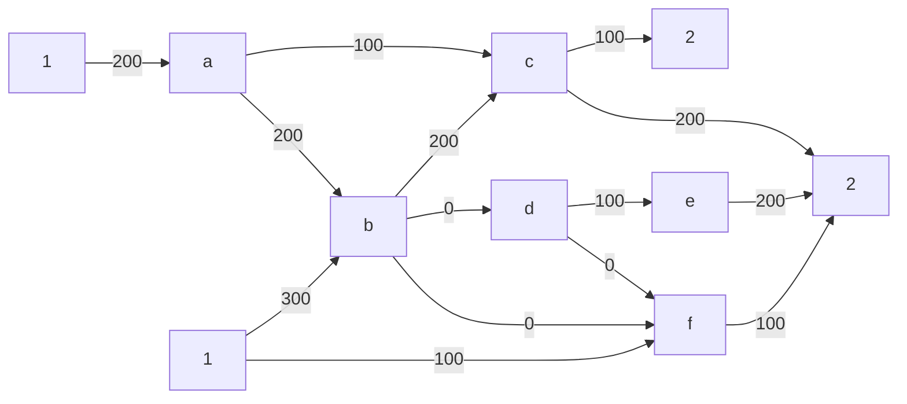
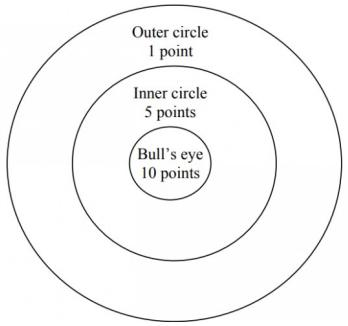
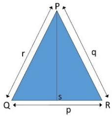
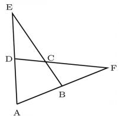
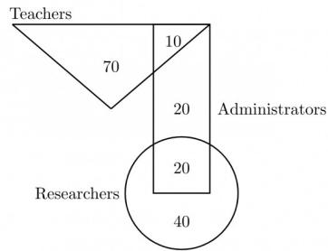

# 9.46.6 Quadratic Equations: GATE2013 EE: GA-8

The set of values of $p$ for which the roots of the equation $3x^{2} + 2x + p(p - 1) = 0$ are of opposite sign is

A. $(-∞,0)$

B. $(0,1)$

C. $(1,\infty)$

D. $(0,\infty)$

gate2013-ee quantitative-aptitude quadratic-equations

Answer key

# 9.47

# Radar Chart (1)

# 9.47.1 Radar Chart: GATE2011 GG: GA-9

The quality of services delivered by a company consists of six factors as shown below in the radar diagram. The dots in the figure indicate the score for each factor on a scale of 0 to 10. The standardized coefficient for each factor is given in the parentheses. The contribution of each factor to the overall service quality is directly proportional to the factor score and its standardized coefficient.

radar

| Dimension | Value |
| --- | --- |
| Outcome | 6 |
| Tangibles | 4 |
| Reliability | 7 |
| Responsiveness | 6 |
| Empathy | 6 |
| Assurance | 5 |

The lowest contribution among all the above factors to the overall quality of services delivered by the company is

A. 10%

B. 20%

C. 24%

D. 40%

gate2011-gg difficult quantitative-aptitude data-interpretation radar-chart

Answer key

# 9.48

# Ratio Proportion (9)

Practice Tests:

Test 1 (15Q)

Test 2 (15Q)

Test 3 (3Q)

# 9.48.1 Ratio Proportion: GATE CSE 2016 | Set 1 | GA | Question: 10

In a process, the number of cycles to failure decreases exponentially with an increase in load. At a load of 80 units, it takes 100 cycles for failure. When the load is halved, it takes 10000 cycles for failure. The load for which the failure will happen in 5000 cycles is \_\_\_\_.

A. 40.00

B. 46.02

C. 60.01

D. 92.02

gatecse-2016-set1 quantitative-aptitude ratio-proportion normal

Answer key

# 9.48.2 Ratio Proportion: GATE CSE 2018 | GA | Question: 8

In a party, 60% of the invited guests are male and 40% are female. If 80% of the invited guests attended the party and if all the invited female guests attended, what would be the ratio of males to females among the attendees in the party?

A. 2:3

B. 1:1

C. 3:2

D. 2:1

gatecse-2018 quantitative-aptitude ratio-proportion two-marks

Answer key

# 9.48.3 Ratio Proportion: GATE CSE 2021 | Set 1 | GA | Question: 1

The ratio of boys to girls in a class is 7 to 3.

Among the options below, an acceptable value for the total number of students in the class is:

A. 21

B. 37

C. 50

D. 73

gatecse-2021-set1 quantitative-aptitude ratio-proportion one-mark

# Answer key

# 9.48.4 Ratio Proportion: GATE CSE 2021 | Set 2 | GA | Question: 8

The number of students in three classes is in the ratio 3 : 13 : 6. If 18 students are added to each class, the ratio changes to 15 : 35 : 21.

The total number of students in all the three classes in the beginning was:

A. 22

B. 66

C. 88

D. 110

gatecse-2021-set2 ratio-proportion quantitative-aptitude two-marks

# Answer key

# 9.48.5 Ratio Proportion: GATE CSE 2024 | Set 1 | GA | Question: 2

If two distinct non-zero real variables $x$ and $y$ are such that $(x + y)$ is proportional to $(x - y)$ then the value of $\frac{x}{y}$

A. depends on $xy$

B. depends only on $x$ and not on $y$

C. depends only on $y$ and not on $x$

D. is a constant

gatecse-2024-set1 quantitative-aptitude ratio-proportion one-mark

# Answer key

# 9.48.6 Ratio Proportion: GATE2011 AG: GA-8

Three friends, $R, S$ and $T$ shared toffee from a bowl. $R$ took $\frac{1}{3}^{\mathrm{rd}}$ of the toffees, but returned four to the bowl. $S$ took $\frac{1}{4}^{\mathrm{th}}$ of what was left but returned three toffees to the bowl. $T$ took half of the remainder but returned two back into the bowl. If the bowl had 17 toffees left, how may toffees were originally there in the bowl?

A. 38

B. 31

C. 48

D. 41

general-aptitude quantitative-aptitude gate2011-ag ratio-proportion

# Answer key

# 9.48.7 Ratio Proportion: GATE2011 GG: GA-4

If m students require a total of m pages of stationery in m days, then 100 students will require 100 pages of stationery in

A. 100 days

B. m/100 days

C. $100 / m$ days

D. m days

gate2011-gg quantitative-aptitude ratio-proportion

# Answer key

# 9.48.8 Ratio Proportion: GATE2013 AE: GA-1

If $3 \leq X \leq 5$ and $8 \leq Y \leq 11$ then which of the following options is TRUE?

A. $\left(\frac{3}{5} \leq \frac{X}{Y} \leq \frac{8}{5}\right)$ C. $\left(\frac{3}{11} \leq \frac{X}{Y} \leq \frac{8}{5}\right)$

B. $\left(\frac{3}{11} \leq \frac{X}{Y} \leq \frac{5}{8}\right)$ D. $\left(\frac{3}{5} \leq \frac{X}{Y} \leq \frac{8}{11}\right)$

gate2013-ae quantitative-aptitude ratio-proportion normal

# Answer key

# 9.48.9 Ratio Proportion: GATE2014 AE: GA-8

The smallest angle of a triangle is equal to two thirds of the smallest angle of a quadrilateral. The ratio between the angles of the quadrilateral is 3:4:5:6. The largest angle of the triangle is twice its smallest angle. What is the sum, in degrees, of the second largest angle of the triangle and the largest angle quadrilateral?

gate2014-ae quantitative-aptitude ratio-proportion numerical-answers

# Answer key

# 9.49

# Sequence Series (4)

Practice Tests: Test 1 (15Q) Test 2 (1Q)

# 9.49.1 Sequence Series: GATE CSE 2012 | Question: 65

Given the sequence of terms, AD CG FK JP, the next term is

A. OV

B. OW

C. PV

D. PW

gatecse-2012 quantitative-aptitude sequence-series easy

# Answer key

# 9.49.2 Sequence Series: GATE CSE 2018 | GA | Question: 5

What is the missing number in the following sequence?

$$
2, 1 2, 6 0, 2 4 0, 7 2 0, 1 4 4 0, \_, 0
$$

A. 2880

B. 1440

C. 720

D. 0

gatecse-2018 quantitative-aptitude sequence-series easy one-mark

# Answer key

# 9.49.3 Sequence Series: GATE CSE 2023 | GA | Question: 3

A series of natural numbers $F_{1}, F_{2}, F_{3}, F_{4}, F_{5}, F_{6}, F_{7}, \ldots$ obeys $F_{n+1} = F_{n} + F_{n-1}$ for all integers $n \geq 2$ .

If $F_{6} = 37$ , and $F_{7} = 60$ , then what is $F_{1}$ ?

A. 4

B. 5

C. 8

D. 9

gatecse-2023 quantitative-aptitude sequence-series one-mark

# Answer key

# 9.49.4 Sequence Series: GATE DS&AI 2024 | GA | Question: 4

The sum of the following infinite series is

$$
2 + \frac {1}{2} + \frac {1}{3} + \frac {1}{4} + \frac {1}{8} + \frac {1}{9} + \frac {1}{1 6} + \frac {1}{2 7} + \dots
$$

A. 11/3

B. 7/2

C. 13/4

D. 9/2

gate-ds-ai-2024 quantitative-aptitude sequence-series one-mark

# Answer key

# 9.50

# Shortest Path (1)

# 9.50.1 Shortest Path: GATE CSE 2020 | GA | Question: 5

There are multiple routes to reach from node 1 to node 2, as shown in the network.

flowchart

The cost of travel on an edge between two nodes is given in rupees. Nodes ‘a’, ‘b’, ‘c’, ‘d’, ‘e’, and ‘f’ are toll booths. The toll price at toll booths marked ‘a’ and ‘e’ is Rs. 200, and is Rs. 100 for the other toll booths. Which is the cheapest route from node 1 to node 2?

A. 1 - a - c - 2

B. $1 - f - b - 2$

C. 1 - b - 2

D. $1 - f - e - 2$

gatecse-2020 quantitative-aptitude graph-theory shortest-path one-mark

# Answer key

# 9.51

# Speed Time Distance (4)

Practice Tests: Test 1 (15Q) Test 2 (11Q)

# 9.51.1 Speed Time Distance: GATE CSE 2013 | Question: 64

A tourist covers half of his journey by train at 60 km/h, half of the remainder by bus at 30 km/h and the rest by cycle at 10 km/h. The average speed of the tourist in km/h during his entire journey is

A. 36

B. 30

C. 24

D. 18

gatecse-2013 quantitative-aptitude easy speed-time-distance

# Answer key

# 9.51.2 Speed Time Distance: GATE CSE 2019 | GA | Question: 3

Two cars at the same time from the same location and go in the same direction. The speed of the first car is 50 km/h and the speed of the second car is 60 km/h. The number of hours it takes for the distance between the two cars to be 20 km is \_\_\_\_.

A. 1

B. 2

C. 3

D. 6

gatecse-2019 general-aptitude quantitative-aptitude speed-time-distance one-mark

# Answer key

# 9.51.3 Speed Time Distance: GATE2013 AE: GA-6

Velocity of an object fired directly in upward direction is given by $V = 80 - 32t$ , where $t$ (time) is in seconds. When will the velocity be between $32 \, m/sec$ and $64 \, m/sec$ ?

A. $\left(1, \frac{3}{2}\right)$ C. $\left(\frac{1}{2}, \frac{3}{2}\right)$

B. $\left(\frac{1}{2},1\right)$ D. $(1,3)$

gate2013-ae quantitative-aptitude speed-time-distance

# Answer key

# 9.51.4 Speed Time Distance: GATE2013 EE: GA-9

A car travels $8\mathrm{km}$ in the first quarter of an hour, $6\mathrm{km}$ in the second quarter and $16\mathrm{km}$ in the third quarter. The average speed of the car in km per hour over the entire journey is

A. 30

B. 36

C. 40

D. 24

gate2013-ee speed-time-distance quantitative-aptitude

# 9.52

# Statistics (3)

Practice Test: Test 1 (11Q)

# 9.52.1 Statistics: GATE CSE 2012 | Question: 64

Which of the following assertions are CORRECT?

- P: Adding 7 to each entry in a list adds 7 to the mean of the list  
• Q: Adding 7 to each entry in a list adds 7 to the standard deviation of the list  
- R: Doubling each entry in a list doubles the mean of the list  
- S: Doubling each entry in a list leaves the standard deviation of the list unchanged

A. P, Q

B. $Q, R$

C. $P, R$

D. $R, S$

gatecse-2012 quantitative-aptitude statistics normal

# Answer key

# 9.52.2 Statistics: GATE CSE 2024 | Set 1 | GA | Question: 3

Consider the following sample of numbers:

9,18,11,14,15,17,10,69,11,13

The median of the sample is

A. 13.5

B. 14

C. 11

D. 18.7

gatecse-2024-set1 quantitative-aptitude statistics one-mark

# Answer key

# 9.52.3 Statistics: GATE2012 AE: GA-5

The arithmetic mean of five different natural numbers is 12. The largest possible value among the numbers is

A. 12

B. 40

C. 50

D. 60

gate2012-ae statistics quantitative-aptitude

# Answer key

# 9.53

# System of Equations (1)

# 9.53.1 System of Equations: GATE2011 GG: GA-6

The number of solutions for the following system of inequalities is

- $X_{1} \geq 0$  
- $X_{2} \geq 0$  
- $X_{1} + X_{2} \leq 10$  
- $2X_{1} + 2X_{2} \geq 22$

A. 0

B. infinite

C. 1

D. 2

gate2011-gg quantitative-aptitude system-of-equations

# Answer key

# 9.54

# Tables (1)

# 9.54.1 Tables: GATE CSE 2025 | Set 2 | GA | Question: 8

Which one of the following options is correct for the given data in the table?

<table><tr><td>Iteration (i)</td><td>0</td><td>1</td><td>2</td><td>3</td></tr><tr><td>Input (I)</td><td>20</td><td>-4</td><td>10</td><td>15</td></tr><tr><td>Output (X)</td><td>20</td><td>16</td><td>26</td><td>41</td></tr><tr><td>Output (Y)</td><td>20</td><td>-80</td><td>-800</td><td>-12000</td></tr></table>

A. $X(i) = X(i - 1) + I(i)$ ; $Y(i) = Y(i - 1)I(i)$ ; $i > 0$  
B. $X(i) = X(i - 1)I(i)$ ; $Y(i) = Y(i - 1) + I(i)$ ; $i > 0$  
C. $X(i) = X(i - 1)I(i)$ ; $Y(i) = Y(i - 1)I(i)$ ; $i > 0$  
D. $X(i) = X(i - 1) + I(i)$ ; $Y(i) = Y(i - 1)I(i - 1)$ ; $i > 0$

gatecse2025-set2 quantitative-aptitude tables two-marks

Answer key

9.55

# Tabular Data (7)

Practice Test: Test 1 (12Q)

# 9.55.1 Tabular Data: GATE CSE 2014 | Set 1 | GA | Question: 9

In a survey, 300 respondents were asked whether they own a vehicle or not. If yes, they were further asked to mention whether they own a car or scooter or both. Their responses are tabulated below. What percent of respondents do not own a scooter?

<table><tr><td></td><td></td><td>Men</td><td>Women</td></tr><tr><td>Own vehicle</td><td>Car</td><td>40</td><td>34</td></tr><tr><td>Own vehicle</td><td>Scooter</td><td>30</td><td>20</td></tr><tr><td>Own vehicle</td><td>Both</td><td>60</td><td>46</td></tr><tr><td>Do not own vehicle</td><td></td><td>20</td><td>50</td></tr></table>

gatecse-2014-set1 quantitative-aptitude normal numerical-answers data-interpretation tabular-data

Answer key

# 9.55.2 Tabular Data: GATE CSE 2014 | Set 3 | GA | Question: 5

The table below has question-wise data on the performance of students in an examination. The marks for each question are also listed. There is no negative or partial marking in the examination.

<table><tr><td>Q No.</td><td>Marks</td><td>Answered Correctly</td><td>Answered Wrongly</td><td>Not Attempted</td></tr><tr><td>1</td><td>2</td><td>21</td><td>17</td><td>6</td></tr><tr><td>2</td><td>3</td><td>15</td><td>27</td><td>2</td></tr><tr><td>3</td><td>2</td><td>23</td><td>18</td><td>3</td></tr></table>

What is the average of the marks obtained by the class in the examination?

A. 1.34

B. 1.74

C. 3.02

D. 3.91

gatecse-2014-set3 quantitative-aptitude normal data-interpretation tabular-data

Answer key

# 9.55.3 Tabular Data: GATE CSE 2015 | Set 1 | GA | Question: 6

The number of students in a class who have answered correctly, wrongly, or not attempted each question in an exam, are listed in the table below. The marks for each question are also listed. There is no negative or partial marking.

<table><tr><td>Q No.</td><td>Marks</td><td>Answered Correctly</td><td>Answered Wrongly</td><td>Not Attempted</td></tr><tr><td>1</td><td>2</td><td>21</td><td>17</td><td>6</td></tr><tr><td>2</td><td>3</td><td>15</td><td>27</td><td>2</td></tr><tr><td>3</td><td>1</td><td>11</td><td>29</td><td>4</td></tr><tr><td>4</td><td>2</td><td>23</td><td>18</td><td>3</td></tr><tr><td>5</td><td>5</td><td>31</td><td>12</td><td>1</td></tr></table>

What is the average of the marks obtained by the class in the examination?

A. 2.290

B. 2.970

C. 6.795

D. 8.795

gatecse-2015-set1 quantitative-aptitude easy data-interpretation tabular-data

Answer key

# 9.55.4 Tabular Data: GATE CSE 2016 | Set 1 | GA | Question: 06

A shaving set company sells 4 different types of razors- Elegance, Smooth, Soft and Executive.

Elegance sells at Rs. 48, Smooth at Rs. 63, Soft at Rs. 78 and Executive at Rs. 173 per piece. The table below shows the numbers of each razor sold in each quarter of a year.

<table><tr><td>Quarter/Product</td><td>Elegance</td><td>Smooth</td><td>Soft</td><td>Executive</td></tr><tr><td>Q1</td><td>27300</td><td>20009</td><td>17602</td><td>9999</td></tr><tr><td>Q2</td><td>25222</td><td>19392</td><td>18445</td><td>8942</td></tr><tr><td>Q3</td><td>28976</td><td>22429</td><td>19544</td><td>10234</td></tr><tr><td>Q4</td><td>21012</td><td>18229</td><td>16595</td><td>10109</td></tr></table>

Which product contributes the greatest fraction to the revenue of the company in that year?

A. Elegance

B. Executive

C. Smooth

D. Soft

gatecse-2016-set1 quantitative-aptitude data-interpretation easy tabular-data

Answer key

# 9.55.5 Tabular Data: GATE2011 MN: GA-64

Four archers P, Q, R, and S try to hit a bull's eye during a tournament consisting of seven rounds. As illustrated in the figure below, a player receives 10 points for hitting the bull's eye, 5 points for hitting within the inner circle and 1 point for hitting within the outer circle.

donut

| Level | Points |
| --- | --- |
| Outer circle | 1 |
| Inner circle | 5 |
| Bull's eye | 10 |

The final scores received by the players during the tournament are listed in the table below.

<table><tr><td>Round</td><td>P</td><td>Q</td><td>R</td><td>S</td></tr><tr><td>1</td><td>1</td><td>5</td><td>1</td><td>10</td></tr><tr><td>2</td><td>5</td><td>10</td><td>10</td><td>1</td></tr><tr><td>3</td><td>1</td><td>1</td><td>1</td><td>5</td></tr><tr><td>4</td><td>10</td><td>10</td><td>1</td><td>1</td></tr><tr><td>5</td><td>1</td><td>5</td><td>5</td><td>10</td></tr><tr><td>6</td><td>10</td><td>5</td><td>1</td><td>1</td></tr><tr><td>7</td><td>5</td><td>10</td><td>1</td><td>1</td></tr></table>

The most accurate and the most consistent players during the tournament are respectively

A. P and S

B. Q and R

C. Q and Q

D. R and Q

gate2011-mn data-interpretation quantitative-aptitude tabular-data

Answer key

# 9.55.6 Tabular Data: GATE2013 AE: GA-7

Following table gives data on tourist from different countries visiting India in the year 2011

<table><tr><td>Country</td><td>Number of tourists</td></tr><tr><td>USA</td><td>2000</td></tr><tr><td>England</td><td>3500</td></tr><tr><td>Germany</td><td>1200</td></tr><tr><td>Italy</td><td>1100</td></tr><tr><td>Japan</td><td>2400</td></tr><tr><td>Australia</td><td>2300</td></tr><tr><td>France</td><td>1000</td></tr></table>

Which two countries contributed to the one third of the total number of tourists who visited India in 2011?

A. USA and Japan

B. USA and Australia

C. England and France

D. Japan and Australia

gate2013-ae quantitative-aptitude data-interpretation normal tabular-data

Answer key

# 9.55.7 Tabular Data: GATE2013 CE: GA-8

Following table provides figures(in rupees) on annual expenditure of a firm for two years -2010 and 2011.

<table><tr><td>Category</td><td>2010</td><td>2011</td></tr><tr><td>Raw material</td><td>5200</td><td>6240</td></tr><tr><td>Power &amp; fuel</td><td>7000</td><td>9450</td></tr><tr><td>Salary &amp; wages</td><td>9000</td><td>12600</td></tr><tr><td>Plant &amp; machinery</td><td>20000</td><td>25000</td></tr><tr><td>Advertising</td><td>15000</td><td>19500</td></tr><tr><td>Research &amp; Development</td><td>22000</td><td>26400</td></tr></table>

In 2011, which of the two categories have registered increase by same percentage?

A. Raw material and Salary & wages.  
C. Power & fuel and Advertising.

B. Salary & wages and Advertising.  
D. Raw material and research & Development.

# 9.56

# Triangles (3)

Practice Test: Test 1 (11Q)

# 9.56.1 Triangles: GATE CSE 2015 | Set 2 | GA | Question: 8

In a triangle $PQR, PS$ is the angle bisector of $\angle QPR$ and $\angle QPS = 60^\circ$ . What is the length of $PS$ ?

text_image

P
r
q
Q
s
p
R

A. $\left(\frac{(q + r)}{qr}\right)$ C. $\sqrt{(q^2 + r^2)}$

B. $\left(\frac{qr}{q + r}\right)$ D. $\left(\frac{(q + r)^2}{qr}\right)$

gatecse-2015-set2 quantitative-aptitude geometry difficult triangles

# Answer key

# 9.56.2 Triangles: GATE CSE 2018 | GA | Question: 9

In the figure below, $\angle DEC + \angle BFC$ is equal to \_\_\_\_

text_image

E
D C F
A B

A. $\angle BCD - \angle BAD$ C. $\angle BAD + \angle BCD$

B. $\angle BAD + \angle BCF$ D. $\angle CBA + \angle ADC$

gatecse-2018 quantitative-aptitude geometry normal triangles two-marks

# Answer key

# 9.56.3 Triangles: GATE CSE 2022 | GA | Question: 9

The corners and mid-points of the sides of a triangle are named using the distinct letters P, Q, R, S, T and U, but not necessarily in the same order. Consider the following statements:

- The line joining P and R is parallel to the line joining Q and S.  
- P is placed on the side opposite to the corner T.  
- S and U cannot be placed on the same side.

Which one of the following statements is correct based on the above information?

A. P cannot be placed at a corner  
C. U cannot be placed at a mid-point

gatecse-2022 quantitative-aptitude geometry triangles two-marks

# Answer key

# 9.57

# Venn Diagram (7)

Practice Tests: Test 1 (15Q) Test 2 (3Q)

# 9.57.1 Venn Diagram: GATE CSE 2010 | Question: 59

25 persons are in a room. 15 of them play hockey, 17 of them play football and 10 of them play both hockey and football. Then the number of persons playing neither hockey nor football is:

A. 2

B. 17

C. 13

D. 3

gatecse-2010 quantitative-aptitude easy set-theory&algebra venn-diagram

Answer key

# 9.57.2 Venn Diagram: GATE CSE 2016 | Set 2 | GA | Question: 06

Among 150 faculty members in an institute, 55 are connected with each other through Facebook and 85 are connected through Whatsapp. 30 faculty members do not have Facebook or Whatsapp accounts. The numbers of faculty members connected only through Facebook accounts is \_\_\_\_.

A. 35

B. 45

C. 65

D. 90

gatecse-2016-set2 quantitative-aptitude venn-diagram easy

Answer key

# 9.57.3 Venn Diagram: GATE CSE 2019 | GA | Question: 7

In the given diagram, teachers are represented in the triangle, researchers in the circle and administrators in the rectangle. Out of the total number of the people, the percentage of administrators shall be in the range of

funnel

| Region | Value |
| --- | --- |
| Teachers | 70 |
| Administrators | 20 |
| Researchers | 40 |

A. 0 to 15

B. 16 to 30

C. 31 to 45

D. 46 to 60

gatecse-2019 general-aptitude quantitative-aptitude venn-diagram two-marks

Answer key

# 9.57.4 Venn Diagram: GATE CSE 2019 | GA | Question: 9

In a college, there are three student clubs, 60 students are only in the Drama club, 80 students are only in the Dance club, 30 students are only in Maths club, 40 students are in both Drama and Dance clubs, 12

students are in both Dance and Maths clubs, 7 students are in both Drama and Maths clubs, and 2 students are in all clubs. If 75% of the students in the college are not in any of these clubs, then the total number of students in the college is \_\_\_\_.

A. 1000

B. 975

C. 900

D. 225

gatecse-2019 general-aptitude quantitative-aptitude venn-diagram two-marks

Answer key

# 9.57.5 Venn Diagram: GATE CSE 2024 | Set 2 | GA | Question: 3

In an engineering college of 10,000 students, 1,500 like neither their core branches nor other branches. The number of students who like their core branches is $1/4^{th}$ of the number of students who like other branches. The number of students who like both their core and other branches is 500.

The number of students who like their core branches is

A. 1,800

B. 3,500

C. 1,600

D. 1,500

# 9.57.6 Venn Diagram: GATE2010 TF: GA-8

A gathering of 50 linguists discovered that 4 knew Kannada, Telugu and Tamil, 7 knew only Telugu and Tamil, 5 knew only Kannada and Tamil, 6 knew only Telugu and Kannada. If the number of linguists who knew Tamil is 24 and those who knew Kannada is also 24, how many linguists knew only Telugu?

A. 9

B. 10

C. 11

D. 8

general-aptitude quantitative-aptitude gate2010-tf venn-diagram

# Answer key

# 9.57.7 Venn Diagram: GATE2011 GG: GA-7

In a class of 300 students in an M.Tech programme, each student is required to take at least one subject from the following three:

• M600: Advanced Engineering Mathematics  
• C600: Computational Methods for Engineers  
• E600: Experimental Techniques for Engineers

The registration data for the M.Tech class shows that 100 students have taken M600, 200 students have taken C600, and 60 students have taken E600. What is the maximum possible number of students in the class who have taken all the above three subjects?

A. 20

B. 30

C. 40

D. 50

gate2011-gg quantitative-aptitude set-theory&algebra venn-diagram

# Answer key

# 9.58

# Volume (1)

# 9.58.1 Volume: GATE CSE 2021 | Set 1 | GA | Question: 6

We have 2 rectangular sheets of paper, M and N, of dimensions 6 cm × 1 cm each. Sheet M is rolled to form an open cylinder by bringing the short edges of the sheet together. Sheet N is cut into equal square patches and assembled to form the largest possible closed cube. Assuming the ends of the cylinder are closed, the ratio of the volume of the cylinder to that of the cube is \_\_\_\_.

A. $\frac{\pi}{2}$

B. $\frac{3}{\pi}$

C. $\frac{9}{\pi}$

D. $3\pi$

gatecse-2021-set1 quantitative-aptitude mensuration volume two-marks

# Answer key

# 9.59

# Work Time (3)

Practice Tests: Test 1 (15Q) Test 2 (8Q)

# 9.59.1 Work Time: GATE CSE 2010 | Question: 64

5 skilled workers can build a wall in 20 days; 8 semi-skilled workers can build a wall in 25 days; 10 unskilled workers can build a wall in 30 days. If a team has 2 skilled, 6 semi-skilled and 5 unskilled workers, how long it will take to build the wall?

A. 20 days

B. 18 days

C. 16 days

D. 15 days

gatecse-2010 quantitative-aptitude normal work-time

# Answer key

# 9.59.2 Work Time: GATE CSE 2011 | Question: 64

A transporter receives the same number of orders each day. Currently, he has some pending orders (backlog) to be shipped. If he uses 7 trucks, then at the end of the $4^{th}$ day he can clear all the orders.

Alternatively, if he uses only 3 trucks, then all the orders are cleared at the end of the $10^{th}$ day. What is the minimum number of trucks required so that there will be no pending order at the end of $5^{th}$ day?

A. 4

B. 5

C. 6

D. 7

gatecse-2011 quantitative-aptitude normal work-time

# Answer key

# 9.59.3 Work Time: GATE CSE 2013 | Question: 65

The current erection cost of a structure is Rs. 13,200. If the labour wages per day increase by 1/5 of the current wages and the working hours decrease by 1/24 of the current period, then the new cost of erection in Rs. is

A. 16,500

B. 15,180

c. 11,000

D. 10,120

gatecse-2013 quantitative-aptitude normal work-time

# Answer key

Answer Keys

<table><tr><td>9.1.1</td><td>A</td><td>9.2.1</td><td>D</td><td>9.2.2</td><td>B</td><td>9.2.3</td><td>D</td><td>9.2.4</td><td>B</td></tr><tr><td>9.2.5</td><td>B</td><td>9.3.1</td><td>B</td><td>9.4.1</td><td>D</td><td>9.4.2</td><td>B</td><td>9.5.1</td><td>A</td></tr><tr><td>9.6.1</td><td>C</td><td>9.6.2</td><td>B</td><td>9.6.3</td><td>C</td><td>9.7.1</td><td>C</td><td>9.8.1</td><td>2006</td></tr><tr><td>9.8.2</td><td>C</td><td>9.8.3</td><td>A</td><td>9.8.4</td><td>A</td><td>9.9.1</td><td>B</td><td>9.10.1</td><td>B</td></tr><tr><td>9.10.2</td><td>C</td><td>9.10.3</td><td>C</td><td>9.10.4</td><td>C</td><td>9.11.1</td><td>D</td><td>9.11.2</td><td>A</td></tr><tr><td>9.11.3</td><td>C</td><td>9.12.1</td><td>A</td><td>9.13.1</td><td>B</td><td>9.13.2</td><td>C</td><td>9.13.3</td><td>D</td></tr><tr><td>9.13.4</td><td>C</td><td>9.13.5</td><td>D</td><td>9.14.1</td><td>B</td><td>9.14.2</td><td>D</td><td>9.14.3</td><td>A</td></tr><tr><td>9.15.1</td><td>C</td><td>9.15.2</td><td>0.4895 : 0.4897</td><td>9.16.1</td><td>C</td><td>9.16.2</td><td>C</td><td>9.17.1</td><td>A</td></tr><tr><td>9.17.2</td><td>A</td><td>9.17.3</td><td>C</td><td>9.17.4</td><td>1300</td><td>9.18.1</td><td>D</td><td>9.18.2</td><td>B</td></tr><tr><td>9.19.1</td><td>A</td><td>9.20.1</td><td>D</td><td>9.20.2</td><td>A</td><td>9.20.3</td><td>B</td><td>9.21.1</td><td>C</td></tr><tr><td>9.22.1</td><td>D</td><td>9.22.2</td><td>C</td><td>9.22.3</td><td>C</td><td>9.23.1</td><td>B</td><td>9.24.1</td><td>8</td></tr><tr><td>9.24.2</td><td>C</td><td>9.24.3</td><td>B</td><td>9.24.4</td><td>C</td><td>9.24.5</td><td>B</td><td>9.24.6</td><td>A</td></tr><tr><td>9.24.7</td><td>C</td><td>9.25.1</td><td>6</td><td>9.25.2</td><td>A</td><td>9.25.3</td><td>D</td><td>9.25.4</td><td>A</td></tr><tr><td>9.25.5</td><td>A</td><td>9.26.1</td><td>A</td><td>9.27.1</td><td>140</td><td>9.27.2</td><td>C</td><td>9.27.3</td><td>C</td></tr><tr><td>9.27.4</td><td>B</td><td>9.27.5</td><td>B</td><td>9.28.1</td><td>B</td><td>9.28.2</td><td>C</td><td>9.28.3</td><td>A</td></tr><tr><td>9.28.4</td><td>C</td><td>9.28.5</td><td>C</td><td>9.28.6</td><td>D</td><td>9.29.1</td><td>C</td><td>9.30.1</td><td>B</td></tr><tr><td>9.30.2</td><td>C</td><td>9.30.3</td><td>C</td><td>9.30.4</td><td>A</td><td>9.31.1</td><td>C</td><td>9.32.1</td><td>D</td></tr><tr><td>9.33.1</td><td>B</td><td>9.34.1</td><td>B</td><td>9.34.2</td><td>C</td><td>9.34.3</td><td>C</td><td>9.34.4</td><td>B</td></tr><tr><td>9.34.5</td><td>D</td><td>9.35.1</td><td>C</td><td>9.35.2</td><td>A</td><td>9.35.3</td><td>C</td><td>9.35.4</td><td>B</td></tr><tr><td>9.36.1</td><td>A</td><td>9.36.2</td><td>X</td><td>9.37.1</td><td>96</td><td>9.37.2</td><td>B</td><td>9.37.3</td><td>D</td></tr><tr><td>9.37.4</td><td>B</td><td>9.37.5</td><td>C</td><td>9.37.6</td><td>D</td><td>9.37.7</td><td>A</td><td>9.37.8</td><td>A</td></tr><tr><td>9.37.9</td><td>D</td><td>9.38.1</td><td>850</td><td>9.38.2</td><td>D</td><td>9.38.3</td><td>C</td><td>9.38.4</td><td>A</td></tr><tr><td>9.38.5</td><td>B</td><td>9.38.6</td><td>D</td><td>9.38.7</td><td>C</td><td>9.38.8</td><td>D</td><td>9.39.1</td><td>A</td></tr><tr><td>9.39.2</td><td>B</td><td>9.39.3</td><td>B</td><td>9.39.4</td><td>B</td><td>9.40.1</td><td>32</td><td>9.40.2</td><td>C</td></tr><tr><td>9.40.3</td><td>D</td><td>9.40.4</td><td>B</td><td>9.40.5</td><td>D</td><td>9.41.1</td><td>B</td><td>9.42.1</td><td>C</td></tr><tr><td>9.43.1</td><td>B</td><td>9.44.1</td><td>D</td><td>9.44.2</td><td>A</td><td>9.44.3</td><td>C</td><td>9.44.4</td><td>D</td></tr></table>