<table><tr><td>9.44.5</td><td>C</td></tr><tr><td>9.44.10</td><td>C</td></tr><tr><td>9.44.15</td><td>C</td></tr><tr><td>9.45.3</td><td>A</td></tr><tr><td>9.46.5</td><td>C</td></tr><tr><td>9.48.3</td><td>C</td></tr><tr><td>9.48.8</td><td>B</td></tr><tr><td>9.49.4</td><td>B</td></tr><tr><td>9.51.4</td><td>C</td></tr><tr><td>9.54.1</td><td>A</td></tr><tr><td>9.55.5</td><td>B</td></tr><tr><td>9.56.3</td><td>B</td></tr><tr><td>9.57.5</td><td>A</td></tr><tr><td>9.59.2</td><td>C</td></tr></table>

<table><tr><td>9.44.6</td><td>C</td></tr><tr><td>9.44.11</td><td>A</td></tr><tr><td>9.44.16</td><td>A</td></tr><tr><td>9.46.1</td><td>D</td></tr><tr><td>9.46.6</td><td>B</td></tr><tr><td>9.48.4</td><td>C</td></tr><tr><td>9.48.9</td><td>180</td></tr><tr><td>9.50.1</td><td>B</td></tr><tr><td>9.52.1</td><td>C</td></tr><tr><td>9.55.1</td><td>48</td></tr><tr><td>9.55.6</td><td>C</td></tr><tr><td>9.57.1</td><td>D</td></tr><tr><td>9.57.6</td><td>C</td></tr><tr><td>9.59.3</td><td>B</td></tr></table>

<table><tr><td>9.44.7</td><td>D</td></tr><tr><td>9.44.12</td><td>A</td></tr><tr><td>9.44.17</td><td>25</td></tr><tr><td>9.46.2</td><td>B</td></tr><tr><td>9.47.1</td><td>A</td></tr><tr><td>9.48.5</td><td>D</td></tr><tr><td>9.49.1</td><td>A</td></tr><tr><td>9.51.1</td><td>C</td></tr><tr><td>9.52.2</td><td>A</td></tr><tr><td>9.55.2</td><td>C</td></tr><tr><td>9.55.7</td><td>D</td></tr><tr><td>9.57.2</td><td>A</td></tr><tr><td>9.57.7</td><td>B</td></tr></table>

<table><tr><td>9.44.8</td><td>A</td></tr><tr><td>9.44.13</td><td>A</td></tr><tr><td>9.45.1</td><td>C</td></tr><tr><td>9.46.3</td><td>B</td></tr><tr><td>9.48.1</td><td>B</td></tr><tr><td>9.48.6</td><td>C</td></tr><tr><td>9.49.2</td><td>B</td></tr><tr><td>9.51.2</td><td>B</td></tr><tr><td>9.52.3</td><td>C</td></tr><tr><td>9.55.3</td><td>C</td></tr><tr><td>9.56.1</td><td>B</td></tr><tr><td>9.57.3</td><td>C</td></tr><tr><td>9.58.1</td><td>C</td></tr></table>

<table><tr><td>9.44.9</td><td>C</td></tr><tr><td>9.44.14</td><td>C</td></tr><tr><td>9.45.2</td><td>C</td></tr><tr><td>9.46.4</td><td>D</td></tr><tr><td>9.48.2</td><td>B</td></tr><tr><td>9.48.7</td><td>D</td></tr><tr><td>9.49.3</td><td>A</td></tr><tr><td>9.51.3</td><td>C</td></tr><tr><td>9.53.1</td><td>A</td></tr><tr><td>9.55.4</td><td>B</td></tr><tr><td>9.56.2</td><td>A</td></tr><tr><td>9.57.4</td><td>C</td></tr><tr><td>9.59.1</td><td>D</td></tr></table>

Transformation of shapes: translation, rotation, scaling, mirroring, assembling, and grouping, Paper folding, cutting, and patterns in 2 and 3 dimensions

Mark Distribution in Previous GATE

<table><tr><td>Year</td><td>2026 - 1</td><td>2026 - 2</td><td>2025 - 1</td><td>2025 - 2</td><td>2024 - 1</td><td>2024 - 2</td><td>2023</td><td>2022</td><td>2021 - 1</td><td>2021 - 2</td><td>Minimum</td></tr><tr><td>1 Mark Count</td><td>1</td><td>1</td><td>0</td><td>1</td><td>0</td><td>0</td><td>1</td><td>1</td><td>2</td><td>1</td><td>0</td></tr><tr><td>2 Marks Count</td><td>1</td><td>0</td><td>1</td><td>0</td><td>2</td><td>1</td><td>1</td><td>1</td><td>0</td><td>1</td><td>0</td></tr><tr><td>Total Marks</td><td>3</td><td>1</td><td>2</td><td>1</td><td>4</td><td>2</td><td>3</td><td>3</td><td>2</td><td>3</td><td>1</td></tr></table>

Welcome to the "General Aptitude: Spatial Aptitude" chapter of your GATE Computer Science exam preparation. This section is designed to equip you with the essential concepts, strategies, and quick references needed to excel in spatial reasoning questions. Spatial aptitude tests your ability to visualize, interpret, and manipulate objects and patterns in two and three dimensions. For GATE CS, mastering this area is crucial not just for the General Aptitude section, but also for developing fundamental visualization skills that are indirectly beneficial in areas like computer graphics, data structures, and algorithms. Typically, you can expect 1-3 questions from Spatial Aptitude in the General Aptitude section, contributing 2-5 marks. Questions often involve identifying patterns, mentally rotating shapes, understanding mirror images, or assembling figures, usually presented as Multiple Choice Questions (MCQs).

# Topic-wise Key Concepts

# 1. 3D Structure

Definition and Core Idea: This topic involves understanding and visualizing three-dimensional objects from their two-dimensional representations (like orthographic or isometric views) or vice-versa. It requires the ability to mentally construct, deconstruct, and manipulate 3D shapes, identifying their hidden faces, edges, and vertices.

# Important Formulas, Theorems, and Results:

\- Euler's Formula for Polyhedra: For any simple (convex) polyhedron, the number of vertices $(V)$ , edges $(E)$ , and faces $(F)$ are related by the formula:

$$
V - E + F = 2
$$

This formula is fundamental for checking the consistency of polyhedral structures.

• Common Polyhedra Properties:

。Cube: $V = 8, E = 12, F = 6$  
- Cuboid: $V = 8, E = 12, F = 6$  
- Triangular Prism: $V = 6, E = 9, F = 5$  
- Square Pyramid: $V = 5, E = 8, F = 5$  
- Tetrahedron: $V = 4, E = 6, F = 4$

# Key Properties and Identities:

- Orthographic Projections: These are 2D views (Front, Top, Side) that show the true shape and size of one face of an object, without perspective distortion.  
- Isometric Views: A 3D representation where all three axes are equally foreshortened, giving a sense of depth and volume. Parallel lines remain parallel.  
- Nets of 3D Shapes: A 2D pattern that can be folded to form a 3D shape. Understanding nets is crucial for visualizing how faces connect.  
- Hidden Lines: In 2D representations of 3D objects, dashed lines often represent edges that are not directly visible from the chosen viewpoint.

# Common Pitfalls or Tricky Points:

- Misinterpreting hidden lines or confusing different orthographic views.  
- Incorrectly counting faces, edges, or vertices, especially when parts are hidden or joined.  
- Difficulty in visualizing the folding/unfolding of complex nets.  
- Confusing isometric projection with perspective projection.

# Standard Problem-Solving Techniques or Shortcuts:

- Mental Rotation and Manipulation: Practice mentally rotating and viewing objects from different angles.  
- Feature Tracking: Focus on a unique corner, edge, or patterned face and track its position across different views or during folding.  
- Elimination Strategy: Quickly eliminate options that clearly violate geometric principles or don't match specific features.  
- Auxiliary Views: If struggling, mentally sketch an additional view to clarify the structure.  
- Nets to 3D: For nets, identify adjacent faces and opposite faces. Opposite faces never share an edge.

# 2. Assembling

Definition and Core Idea: This topic involves combining given 2D or 3D components to form a complete shape or object, or identifying which set of components can form a specified shape. It tests your spatial reasoning to fit parts together precisely without overlap or gaps.

Important Formulas, Theorems, and Results: No specific mathematical formulas are typically used. The core idea relies on geometric principles of congruence, tessellation, and conservation of area/volume.

# Key Properties and Identities:

- Congruence: Pieces must match exactly in shape and size to fit together.  
- Tessellation: The ability of shapes to fit together without gaps or overlaps to cover a surface (for 2D assembling).  
- Conservation of Area/Volume: The total area (for 2D) or volume (for 3D) of the assembled figure must equal the sum of the areas/volumes of its constituent pieces.  
- Edge/Face Matching: The edges or faces that meet must be identical in length and shape.  
- Symmetry: Recognizing symmetry in the target shape or individual pieces can aid assembly.

# Common Pitfalls or Tricky Points:

• Overlooking small details or subtle differences in piece shapes.  
- Assuming pieces can be resized, distorted, or flipped (unless explicitly allowed).  
- Not considering all possible orientations (rotations and reflections) for each piece.  
- Difficulty in visualizing how irregular shapes fit into complex outlines.

# Standard Problem-Solving Techniques or Shortcuts:

- Start with Distinctive Pieces: Begin by placing pieces with unique shapes, sharp corners, or specific patterns that have limited fitting options.  
- Work from the Edges/Corners: For outline-based problems, try to fill the outer boundaries first.  
- Identify Complementary Shapes: Look for pieces whose contours fit together like puzzle pieces.  
- Mental Rotation and Translation: Actively rotate and slide pieces mentally to test fits.  
- Elimination: If a piece clearly doesn't fit in any orientation, eliminate the option containing it.

# 3. Assembling Pieces

Definition and Core Idea: This topic is a specific type of assembling, often focusing on arranging a set of smaller, usually irregular, 2D pieces to form a larger, specified 2D figure. It's akin to solving a jigsaw puzzle or tangram, requiring visualization of how shapes fit together, including rotation and reflection.

Important Formulas, Theorems, and Results: No specific formulas. The principles are geometric matching and conservation of area.

# Key Properties and Identities:

- Area Conservation: The sum of the areas of the individual pieces must equal the area of the final assembled figure.  
- Edge and Vertex Matching: Edges of adjacent pieces must align perfectly, and vertices must meet precisely.  
- No Overlap or Gaps: The assembled figure must be solid, with no parts of pieces overlapping and no empty spaces within the boundary.  
- Orientation Flexibility: Pieces can usually be rotated and/or reflected unless specified otherwise.

# Common Pitfalls or Tricky Points:

- Incorrectly assuming a piece can be flipped (reflected) when only rotation is allowed, or vice-versa.  
- Misjudging the size or shape of internal gaps that need to be filled.  
- Difficulty in visualizing how multiple irregular pieces combine to form a regular outline.  
• Overlooking that pieces might need to be rotated by angles other than 90 degrees.

# Standard Problem-Solving Techniques or Shortcuts:

- Focus on Unique Features: Identify pieces with distinct curves, sharp angles, or long straight edges.  
- Largest Piece First: Often, starting with the largest or most complex piece helps define the initial structure.  
- Work from the Outside In: Try to form the outer boundary of the target figure first.  
- Consider Negative Space: Sometimes, it's easier to visualize the shape of the 'hole' that needs to be filled by the remaining pieces.  
- Trial and Error (Mental): Mentally try fitting pieces, eliminating options as you go.

# 4. Counting Figure

Definition and Core Idea: This involves systematically counting the number of specific geometric shapes (e.g., triangles, squares, rectangles, cubes) within a complex, often overlapping, figure. The core idea is to develop a structured approach to avoid double-counting or missing any figures.

# Important Formulas, Theorems, and Results:

• Number of Squares in an $n \times n$ Grid:

$$
\sum_ {k = 1} ^ {n} k ^ {2} = \frac {n (n + 1) (2 n + 1)}{6}
$$

For example, in a $3 \times 3$ grid, it's $3^2 + 2^2 + 1^2 = 9 + 4 + 1 = 14$ squares.

\- Number of Rectangles in an $n \times m$ Grid:

$$
\left(\frac {n (n + 1)}{2}\right) \times \left(\frac {m (m + 1)}{2}\right)
$$

This counts all possible rectangles, including squares.

\- Number of Triangles in a Simple Base with $n$ Segments: If a base line is divided into $n$ segments and a common vertex is connected to all endpoints, the number of triangles formed is:

$$
\frac {n (n + 1)}{2}
$$

This applies to triangles sharing a common vertex and lying on the same base line. More complex configurations require specific counting methods.

\- Number of Cubes in a Stack: For a stack of unit cubes, count cubes layer by layer, or by identifying visible and hidden cubes based on the structure.

# Key Properties and Identities:

- Hierarchical Counting: Often, figures can be counted by their size (e.g., 1-unit squares, 2x2 squares, etc.) or by the number of smaller units they encompass.  
- Systematic Listing: Labeling vertices or sections can help in systematically listing and counting figures without repetition.  
- Symmetry: If a figure is symmetrical, counting one part and multiplying can be a shortcut, but be careful with figures on the axis of symmetry.

# Common Pitfalls or Tricky Points:

- Double-counting figures or missing smaller, embedded figures.  
- Not having a systematic approach, leading to confusion and errors.  
- Difficulty in visualizing overlapping shapes, especially triangles or rectangles.  
- For 3D figures, forgetting to count hidden cubes or structures.

# Standard Problem-Solving Techniques or Shortcuts:

- Size-Based Counting: Count all figures of the smallest size, then combinations of two, three, and so on, up to the largest possible figure.  
- Vertex/Line-Based Counting: For triangles, identify a common vertex and count the number of base segments. For rectangles, count horizontal and vertical lines.  
- Decomposition: Break down complex figures into simpler, countable components.

- Labeling: Assign numbers or letters to distinct regions or vertices to help track counted figures.  
- Pattern Recognition: For grids, apply the formulas directly.

# 5. Grouping

Definition and Core Idea: This topic involves identifying a common characteristic or underlying rule among a set of figures and grouping them accordingly, or identifying the 'odd one out' that does not share the common property. It primarily tests pattern recognition and classification based on visual attributes.

Important Formulas, Theorems, and Results: No specific formulas. Relies purely on observational skills and logical deduction.

# Key Properties and Identities:

- Number of Elements/Sides: Counting internal components, sides of a polygon, or lines.  
- Symmetry: Presence or absence of rotational, reflectional, or point symmetry.  
- Orientation: The direction or alignment of figures or their internal components.  
- Shading/Filling Patterns: Whether parts are filled, hollow, or have specific textures.  
- Relative Positions: The spatial relationship between different elements within a figure (e.g., inside/outside, left/right).  
- Transformations: Whether figures are related by rotation, reflection, or translation.  
- Connectivity: Whether elements are connected or separate.

# Common Pitfalls or Tricky Points:

- Focusing on superficial differences rather than fundamental commonalities.  
- Missing subtle patterns or rules that apply to most figures.  
- Not considering all possible attributes (e.g., only looking at shape, not shading or orientation).  
- Assuming a simple rule when a more complex one is at play.

# Standard Problem-Solving Techniques or Shortcuts:

- Attribute Listing: For each figure, list all observable attributes (e.g., number of sides, type of lines, shading, orientation of internal arrow).  
- Compare and Contrast: Systematically compare each figure with the others to find commonalities or unique features.  
- Hypothesis Testing: Formulate a hypothesis about a potential grouping rule and test it against all figures.  
- Look for Deviations: When finding the odd one out, identify the property that one figure lacks or possesses uniquely.  
- Consider Transformations: Check if figures can be grouped based on being rotations or reflections of each other.

# 6. Image Rotation

Definition and Core Idea: This topic involves mentally rotating a 2D or 3D object to match a given orientation or to predict its appearance after a specified rotation. It tests your ability to visualize how shapes and their internal components change position relative to each other during rotation.

Important Formulas, Theorems, and Results: No specific formulas, but understanding angular rotation (e.g., $90^{\circ}$ , $180^{\circ}$ , $270^{\circ}$ clockwise/anticlockwise) is key.

# Key Properties and Identities:

- Relative Positions: The spatial relationship between different parts of the object remains constant during rotation. Only the object's overall orientation changes.  
- Clockwise vs. Anticlockwise: Distinguish between the direction of rotation.  
- Degrees of Rotation: Standard rotations are often multiples of 90 degrees. A 180-degree rotation results in an inverted image (upside down). A 360-degree rotation returns the object to its original orientation.  
- Fixed Point/Axis: Rotation occurs around a central point (for 2D) or an axis (for 3D).

# Common Pitfalls or Tricky Points:

- Incorrectly rotating parts of the image independently instead of the whole figure.  
- Confusing clockwise with anticlockwise rotation.  
- Misjudging the exact angle of rotation, especially for non-90-degree rotations.  
- Difficulty in tracking multiple features simultaneously during rotation.

# Standard Problem-Solving Techniques or Shortcuts:

- Focus on a Distinctive Feature: Pick a unique part of the figure (e.g., an arrow, a specific corner, a shaded region) and track its movement during rotation.  
- Mental Overlay: Imagine overlaying the rotated figure onto the original to check alignment.  
- Use Reference Points: Mentally fix a point on the figure and observe its path during rotation.  
- Elimination: Quickly rule out options that are clearly not rotations (e.g., reflections, altered shapes).  
- Practice with Physical Objects: If struggling, use a physical object (like a matchbox or a drawn shape on paper) and rotate it to build intuition.

# 7. Mirror Image

Definition and Core Idea: This topic involves determining the appearance of an object or figure when reflected across a mirror line (which can be vertical, horizontal, or diagonal). The core idea is to understand the concept of lateral inversion.

Important Formulas, Theorems, and Results: No specific formulas. The principle is geometric reflection.

# Key Properties and Identities:

- Lateral Inversion (Vertical Mirror): For a vertical mirror, left becomes right, and right becomes left. The top and bottom parts remain in their respective positions.  
- Vertical Inversion (Horizontal Mirror): For a horizontal mirror, top becomes bottom, and bottom becomes top. The left and right parts remain in their respective positions.  
- Distance Preservation: Every point in the original figure is the same perpendicular distance from the mirror line as its corresponding point in the mirror image.  
- Symmetry: If a figure has reflectional symmetry along the mirror line, its mirror image will be identical to the original.  
- Text/Numbers: Letters and numbers appear reversed in a mirror image (e.g., 'b' becomes 'd', 'p' becomes 'q', '6' becomes '9'). Some letters (A, H, I, M, O, T, U, V, W, X, Y) are symmetrical and appear unchanged in a vertical mirror.

# Common Pitfalls or Tricky Points:

- Confusing mirror image with rotation (especially 180-degree rotation, which looks similar to a horizontal mirror image followed by a vertical mirror image).  
- Incorrectly reflecting across diagonal mirror lines, which requires more complex visualization.  
- Misinterpreting internal patterns or text within the figure.  
- Forgetting that the 'depth' or 'front-back' orientation is also inverted in a 3D mirror image.

# Standard Problem-Solving Techniques or Shortcuts:

\- Imagine Folding: Mentally fold the paper along the mirror line. The image should appear on the other side.

\- Point-by-Point Reflection: For complex figures, reflect key points or vertices one by one.

\- Feature Tracking: Pick a distinctive feature (e.g., an arrow, a shaded corner) and visualize its reflected position.

\- Elimination: Rule out options that show rotation or distortion instead of reflection.

\- Practice with Letters/Numbers: Familiarize yourself with the mirror images of common letters and digits.

# 8. Paper Folding

Definition and Core Idea: This topic involves visualizing a sequence of folds made on a piece of paper and then predicting the pattern of holes or cuts when the paper is unfolded, or vice-versa. The core idea is to mentally reverse the folding process, understanding how cuts/holes multiply and reflect across each fold line.

Important Formulas, Theorems, and Results: No specific formulas. Relies on principles of symmetry and reflection.

# Key Properties and Identities:

- Symmetry: Each fold line acts as a mirror line. When the paper is unfolded, any cut or hole will be reflected across that fold line.  
- Number of Layers: A cut made through multiple layers of folded paper will result in multiple holes upon unfolding, corresponding to the number of layers cut.  
- Order of Unfolding: The paper must be unfolded in the reverse order of folding. The last fold made is the first one to be unfolded.  
- Position of Cuts: The position of a cut relative to the edges and previous fold lines is crucial.

# Common Pitfalls or Tricky Points:

- Incorrectly reversing the order of folds during unfolding.  
- Missing reflections across fold lines, especially when multiple folds are involved.  
- Misjudging the number of layers a cut passes through.  
- Difficulty in visualizing the exact shape and position of holes after multiple reflections.  
- Confusing the orientation of the paper after each fold.

# Standard Problem-Solving Techniques or Shortcuts:

- Work Backward: Start from the final folded and cut state and mentally unfold the paper step-by-step, applying reflection at each fold line.  
- Draw Each Stage: If the problem is complex, quickly sketch the paper at each stage of unfolding, marking the reflections of the cuts.  
- Identify Fold Lines as Mirror Lines: Each fold line becomes an axis of symmetry for the cuts/holes when unfolded.  
- Focus on a Single Cut/Hole: Track how one specific cut or hole multiplies and reflects across the folds.  
- Eliminate Options: Use the first few unfolding steps to eliminate options that don't match the expected pattern.

# 9. Patterns In Three Dimensions

Definition and Core Idea: This topic involves identifying sequences or transformations of 3D objects, predicting the next object in a series, or identifying relationships between 3D patterns. It extends 2D pattern recognition skills to three dimensions, often involving rotation, translation, and changes in internal features of 3D shapes.

Important Formulas, Theorems, and Results: No specific formulas. Relies on understanding 3D geometry and transformations.

# Key Properties and Identities:

# • 3D Transformations:

- Rotation: Around X, Y, or Z axes (e.g., a cube rotating on its edge or face).  
- Translation: Movement along an axis.  
- Scaling: Change in size (less common in GATE spatial aptitude).

- Internal Features: Patterns, markings, or smaller objects within the 3D structure can also follow a sequence of changes.  
- Structural Changes: Addition or removal of smaller cubes or components from a larger 3D structure.  
- Perspective Changes: How the 2D representation of a 3D object changes with different viewpoints.

# Common Pitfalls or Tricky Points:

- Difficulty in visualizing complex 3D changes from static 2D representations.  
- Missing subtle transformations or changes in internal elements.  
- Confusing rotations around different axes.  
• Overlooking hidden changes in the back or underside of the 3D object.

# Standard Problem-Solving Techniques or Shortcuts:

- Focus on One Aspect at a Time: Analyze the pattern of change for one specific feature (e.g., the top face, a specific corner, an internal dot) before combining observations.  
- Mentally Manipulate: Actively imagine the 3D objects moving or transforming.  
- Look for Consistent Rules: Identify a clear, repeatable rule or sequence of operations that applies to all given figures in the series.  
- Use a Reference Point/Axis: Mentally fix a point or an axis on the object to track its movement or rotation.  
- Elimination: Rule out options that clearly do not follow the established pattern.

# 10. Patterns In Two Dimensions

Definition and Core Idea: This topic involves identifying the underlying rule or sequence in a series of 2D figures and predicting the next figure, or finding the odd one out. It requires recognizing transformations (rotation, reflection, translation), changes in number, size, shading, or arrangement of elements within the figures.

Important Formulas, Theorems, and Results: No specific formulas. Relies on logical deduction and visual pattern recognition.

# Key Properties and Identities:

# - Transformations:

\- Rotation: Clockwise or anticlockwise, by specific degrees (e.g., $45^{\circ}$ , $90^{\circ}$ , $180^{\circ}$ ).

- Reflection: Across a horizontal, vertical, or diagonal axis.  
- Translation: Movement of the entire figure or its components in a specific direction.

• Changes in Attributes:

- Number: Increase or decrease in the count of elements.  
- Size/Shape: Enlargement, reduction, or alteration of shapes.  
- Shading/Filling: Alternating or progressive changes in shading.  
- Arrangement: Changes in the relative positions of components.  
- Connectivity: Elements joining or separating.

- Alternating Patterns: A pattern that alternates between two or more states.  
- Progressive Patterns: A pattern that changes incrementally with each step.

# Common Pitfalls or Tricky Points:

• Overlooking subtle changes in size, orientation, or shading.  
- Assuming a simple pattern when a more complex, multi-layered rule is present.  
- Not considering all possible transformations (e.g., only looking for rotation, ignoring reflection).  
- Getting confused by multiple elements changing simultaneously.

# Standard Problem-Solving Techniques or Shortcuts:

- Systematic Analysis: Break down the figure into its constituent elements. Analyze how each element (e.g., outer shape, inner shape, arrow, dot, shading) changes from one figure to the next.  
- Track One Element at a Time: If multiple elements are changing, focus on one element's transformation throughout the series before moving to the next.  
- Look for Cycles: Identify if a pattern repeats after a certain number of figures.  
- Identify the Rule: Formulate a clear rule (e.g., "the inner square rotates 90 degrees clockwise, and the outer circle alternates shading").  
- Test the Rule: Apply your hypothesized rule to the subsequent figures in the series to confirm its validity.  
- Elimination: Use the identified pattern to quickly eliminate options that do not conform.

# Quick Formula Reference

This section consolidates the key formulas and mathematical results important for Spatial Aptitude problems.

\- Euler's Formula for Polyhedra: For any simple polyhedron, the relationship between vertices $(V)$ , edges $(E)$ , and faces $(F)$ is given by:

$$
V - E + F = 2
$$

\- Number of Squares in an $n \times n$ Grid: The total number of squares (of all sizes) in an $n \times n$ grid is:

$$
\sum_ {k = 1} ^ {n} k ^ {2} = \frac {n (n + 1) (2 n + 1)}{6}
$$

\- Number of Rectangles in an $n \times m$ Grid: The total number of rectangles (including squares) in an $n \times m$ grid is:

$$
\left(\frac {n (n + 1)}{2}\right) \times \left(\frac {m (m + 1)}{2}\right)
$$

\- Number of Triangles in a Simple Base with $n$ Segments: If a base line is divided into $n$ segments and a common vertex is connected to all endpoints, the number of triangles formed is:

$$
\frac {n (n + 1)}{2}
$$

# Important Tips for GATE

Mastering Spatial Aptitude for GATE requires not just understanding concepts but also developing effective exam strategies. Here are some practical tips:

1. Visualize Actively, Don't Just Observe: Spatial aptitude is about mental manipulation. Don't just look at the figures; actively imagine them moving, rotating, folding, or reflecting. Close your eyes briefly if it helps to form a clearer mental image.

2. Adopt a Systematic Approach: Avoid haphazard guessing. For each problem type (e.g., counting, paper folding, pattern series), develop and follow a structured method. This prevents errors like double-counting or missing steps.  
3. Focus on Key Features and Reference Points: When dealing with rotations, reflections, or complex patterns, identify a unique or distinctive element (e.g., a specific corner, an arrow, a shaded region). Track its movement or transformation throughout the sequence or across options.  
4. Leverage the Elimination Strategy: In multiple-choice questions, often several options can be quickly ruled out because they clearly violate a fundamental rule (e.g., a reflection instead of a rotation, an extra piece in an assembly). This narrows down your choices and increases your chances.  
5. Practice Under Time Constraints: Spatial aptitude questions can be time-consuming due to the mental effort required. Practice solving problems within strict time limits to improve your speed and efficiency. The more you practice, the faster your visualization skills will become.  
6. Clearly Differentiate Mirror Image from Rotation: These are common sources of confusion. Remember that a mirror image involves lateral inversion (left-right flip for a vertical mirror), while rotation changes orientation without flipping. A 180-degree rotation can sometimes look similar to a mirror image, so pay close attention.  
7. Don't Hesitate to Sketch (Mentally or Physically): For complex problems like paper folding or 3D structures, a quick mental or physical sketch of intermediate steps can significantly clarify the problem and prevent errors. This is especially useful for tracking reflections in paper folding.  
8. Start with Simpler Problems to Build Confidence: If you find a particular type of spatial problem challenging, begin with simpler variations to build your foundational understanding and confidence before tackling more complex ones. Gradually increase the difficulty.

10.1

3d Structure (1)

# 10.1.1 3d Structure: GATE CSE 2026 | Set 1 | GA | Question: 7

In Panel I of the figure below, the front view and top view of a structure are shown. Which one of the 3D structures shown in Panel II possesses the views shown in Panel I?

Panel I  
  
Front
View

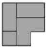  
Top View

text_image

Panel II
Top View
Top View
Front
View (i)
Front
View (ii)
Top View
Top View
Front
View (iii)
Top View
Front
View (iv)

A. (i)

B. (ii)

C. (iii)

D. (iv)

gatecse-2026-set1 spatial-aptitude 3d-structure two-marks

Answer key

10.2

Assembling (1)

# 10.2.1 Assembling: GATE DA 2026 | GA | Question: 3

The four pieces of a puzzle are shown in the figure below.

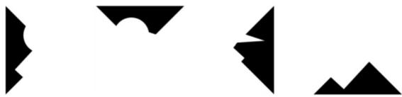

natural_image

Abstract black geometric shapes on white background (no text or symbols)

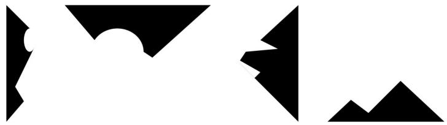

natural_image

Abstract black geometric shapes on white background (no text or symbols)

Which one of the figures labelled as P, Q, R, and S can be constructed by using each of the four pieces only once without overlaps?

natural_image

Abstract white geometric shape on black background (no text or symbols)

P

natural_image

Abstract white silhouette of a person on black background (no text or symbols)

Q

natural_image

Silhouette of a bird perched on a bird's head against a black background (no text or symbols)

R

natural_image

Abstract white geometric shape on black background (no text or symbols)

S

natural_image

Abstract white geometric shape on black background (no text or symbols)

P

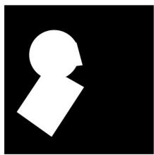

natural_image

Abstract white shape resembling a keyhole on black background (no text or symbols)

Q

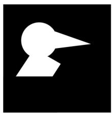

natural_image

Abstract white geometric shape on black background (no text or symbols)

R

natural_image

Abstract white geometric shape on black background (no text or symbols)

S

A. P

B. Q

C. R

D. S

gateda-2026 spatial-aptitude assembling one-mark

Answer key

10.3

Assembling Pieces (1)

10.3.1 Assembling Pieces: GATE CSE 2021 | Set 2 | GA | Question: 7

natural_image

Abstract geometric line drawing with interconnected step-like shapes (no text or symbols)

A jigsaw puzzle has 2 pieces. One of the pieces is shown above. Which one of the given options for the missing piece when assembled will form a rectangle? The piece can be moved, rotated or flipped to assemble with the above piece.

A.  
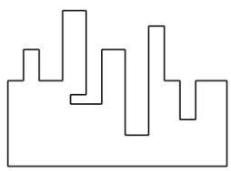

natural_image

Abstract geometric line drawing with irregular shapes and no text or symbols

B.  
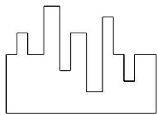

natural_image

Abstract geometric line drawing with irregular shapes and no text or symbols

C.  

natural_image

Abstract geometric line drawing with irregular shapes and no text or symbols

D.  

natural_image

Abstract geometric line drawing with irregular shapes and no text or symbols

gatecse-2021-set2 spatial-aptitude assembling-pieces two-marks

# Answer key

# 10.4

# Image Rotation (3)

Practice Test: Test 1 (7Q)

# 10.4.1 Image Rotation: GATE CSE 2022 | GA | Question: 5

A palindrome is a word that reads the same forwards and backwards. In a game of words, a player has the following two plates painted with letters.

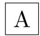

From the additional plates given in the options, which one of the combinations of additional plates would allow the player to construct a five-letter palindrome. The player should use all the five plates exactly once. The plates can be rotated in their plane.

A. D D J  
B.  
R A R  
C.  
Z E D  
D.  
I T Y

gatecse-2022 spatial-aptitude image-rotation one-mark

# Answer key

# 10.4.2 Image Rotation: GATE CSE 2023 | GA | Question: 10

Which one of the options best describes the transformation of the 2-dimensional figure $\mathbf{P}$ to $\mathbf{Q}$ , and then to $\mathbf{R}$ , as shown?

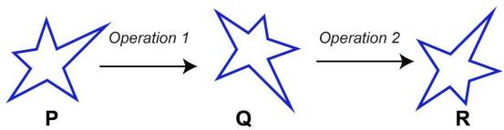

flowchart

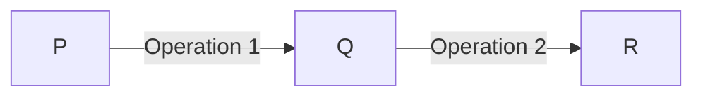

A. Operation 1: A clockwise rotation by $90^{\circ}$ about an axis perpendicular to the plane of the figure  
Operation 2: A reflection along a horizontal line  
B. Operation 1: A counter clockwise rotation by $90^{\circ}$ about an axis perpendicular to the plane of the figure  
Operation 2: A reflection along a horizontal line  
C. Operation 1: A clockwise rotation by 90° about an axis perpendicular to the plane of the figure  
Operation 2: A reflection along a vertical line  
D. Operation 1: A counter clockwise rotation by $180^{\circ}$ about an axis perpendicular to the plane of the figure  
Operation 2: A reflection along a vertical line

gatecse-2023

spatial-aptitude

image-rotation

two-marks

Answer key

# 10.4.3 Image Rotation: GATE DS&AI 2024 | GA | Question: 9

Three different views of a dice are shown in the figure below.

The piece of paper that can be folded to make this dice is

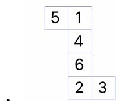

B.  
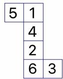

C.  

D.  

gate-ds-ai-2024

spatial-aptitude

image-rotation

two-marks

Answer key

# 10.5

# Mirror Image (1)

Practice Test:

Test 1 (10Q)

# 10.5.1 Mirror Image: GATE CSE 2024 | Set 1 | GA | Question: 10

The least number of squares to be added in the figure to make A B a line of symmetry is

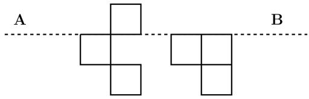

natural_image

Pure geometric diagram with two connected squares and a horizontal dashed line labeled A and B (no text or symbols within the shapes)

A. 6

B. 4

C. 5

D. 7

gatecse-2024-set1

spatial-aptitude

mirror-image

two-marks

Answer key

# 10.6

# Paper Folding (5)

Practice Tests:

Test 1 (15Q)

Test 2 (5Q)