

flowchart

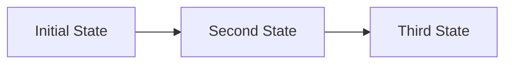

A circular sheet of paper is folded along the lines in the directions shown. The paper, after being punched in the final folded state as shown and unfolded in the reverse order of folding, will look like \_\_\_\_.

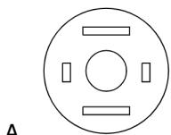

B.  
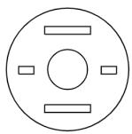

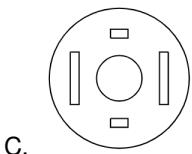

D.  

gatecse-2021-set1 spatial-aptitude paper-folding one-mark

Answer key

# 10.6.2 Paper Folding: GATE CSE 2021 | Set 2 | GA | Question: 2

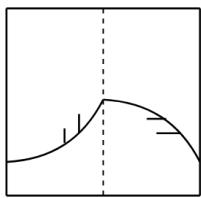

line

| X | Y |
| --- | --- |
| ~1 | ~0.2 |
| ~2 | ~0.3 |
| ~3 | ~0.4 |
| ~4 | ~0.5 |
| ~5 | ~0.6 |
| ~6 | ~0.7 |
| ~7 | ~0.8 |
| ~8 | ~0.9 |
| ~9 | ~1.0 |
| ~10 | ~0.9 |
| ~11 | ~0.8 |
| ~12 | ~0.7 |
| ~13 | ~0.6 |
| ~14 | ~0.5 |
| ~15 | ~0.4 |
| ~16 | ~0.3 |
| ~17 | ~0.2 |

A transparent square sheet shown above is folded along the dotted line. The folded sheet will look like \_\_\_\_.

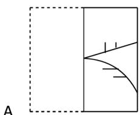

natural_image

Pure geometric diagram with dashed rectangle and curved lines, no text or symbols

B.  
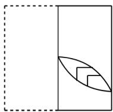

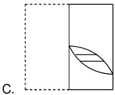

natural_image

Geometric diagram showing a rectangle divided into two parts with a curved line and shaded regions, labeled C. (no text or symbols within the diagram itself)

D.  
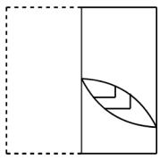

gatecse-2021-set2 spatial-aptitude paper-folding one-mark

Answer key

# 10.6.3 Paper Folding: GATE CSE 2024 | Set 1 | GA | Question: 9

A rectangular paper of $20 \, cm \times 8 \, cm$ is folded 3 times. Each fold is made along the line of symmetry, which is perpendicular to its long edge. The perimeter of the final folded sheet (in cm) is

A. 18

B. 24

C. 20

D. 21

# 10.6.4 Paper Folding: GATE CSE 2025 | Set 1 | GA | Question: 9

A square paper, shown in figure (I), is folded along the dotted lines as shown in the figures (II) and (III). Then a few cuts are made as shown in figure (IV). Which one of the following patterns will be obtained when the paper is unfolded?

Note: The figures shown are representative.

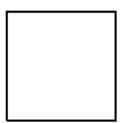  
(I)

  
(II)

  
(III)

  
(IV)

A.  
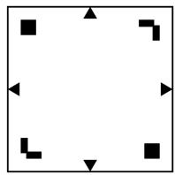

natural_image

Pure geometric diagram with black squares and directional arrows inside a square (no text or symbols)

B.  

C.  

natural_image

Pure geometric diagram with black squares and arrows inside a square (no text or symbols)

D.  
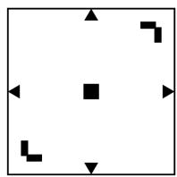

gatecse2025-set1 spatial-aptitude paper-folding two-marks

# Answer key

# 10.6.5 Paper Folding: GATE CSE 2025 | Set 2 | GA | Question: 4

The paper as shown the figure is folded to make a cube where each square corresponds to a particular face of the cube. Which one of the following options correctly represents the cube?

Note: The figures showin are representative.

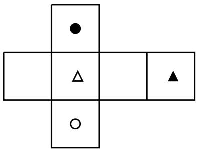

natural_image

Abstract geometric pattern with four connected squares and circles, no text or symbols present

A.  

B.  

C.  

D.  

gatecse2025-set2 spatial-aptitude paper-folding easy one-mark

Answer key

# 10.7

# Patterns In Three Dimensions (3)

Practice Test: Test 1 (10Q)

# 10.7.1 Patterns In Three Dimensions: GATE CSE 2023 | GA | Question: 5

Looking at the surface of a smooth 3-dimensional object from the outside, which one of the following options is TRUE?

A. The surface of the object must be concave everywhere.  
B. The surface of the object must be convex everywhere.  
C. The surface of the object may be concave in some places and convex in other places.  
D. The object can have edges, but no corners.

gatecse-2023 spatial-aptitude patterns-in-three-dimensions one-mark

Answer key

# 10.7.2 Patterns In Three Dimensions: GATE CSE 2024 | Set 2 | GA | Question: 9

A cube is to be cut into 8 pieces of equal size and shape. Here, each cut should be straight and it should not stop till it reaches the other end of the cube.

The minimum number of such cuts required is

A. 3

B. 4

C. 7

D. 8

# Answer key

# 10.7.3 Patterns In Three Dimensions: GATE DS&AI 2024 | GA | Question: 10

Visualize two identical right circular cones such that one is inverted over the other and they share a common circular base. If a cutting plane passes through the vertices of the assembled cones, what shape does the outer boundary of the resulting cross-section make?

A. A rhombus

B. A triangle

C. An ellipse

D. A hexagon

gate-ds-ai-2024 spatial-aptitude patterns-in-three-dimensions two-marks

# Answer key

# 10.8

# Patterns In Two Dimensions (4)

# Practice Test: Test 1 (10Q)

# 10.8.1 Patterns In Two Dimensions: GATE CSE 2021 | Set 1 | GA | Question: 2

A polygon is convex if, for every pair of points, $\mathbf{P}$ and $\mathbf{Q}$ belonging to the polygon, the line segment PQ lies completely inside or on the polygon.

Which one of the following is NOT a convex polygon?

A.  

B.  

C.  

D.  

gatecse-2021-set1 spatial-aptitude patterns-in-two-dimensions one-mark

# Answer key

# 10.8.2 Patterns In Two Dimensions: GATE CSE 2022 | GA | Question: 10

A plot of land must be divided between four families. They want their individual plots to be similar in shape, not necessarily equal in area. The land has equally spaced poles, marked as dots in the below figure. Two ropes, R1 and R2, are already present and cannot be moved.

What is the least number of additional straight ropes needed to create the desired plots? A single rope can pass through three poles that are aligned in a straight line.

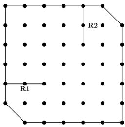

text_image

R1
R2

A. 2

B. 4

C. 5

D. 3

gatecse-2022 spatial-aptitude patterns-in-two-dimensions two-marks

# Answer key

# 10.8.3 Patterns In Two Dimensions: GATE CSE 2026 | Set 1 | GA | Question: 2

The figure shows two 4-tile patterns.

Either one or both of the patterns can be used any number of times and in any orientation to construct a new pattern. Which one of the options below cannot be constructed by using only these two 4-tile patterns assuming there are no overlaps among them?

A.  

B.  

C.  
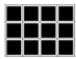

D.  
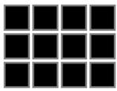

E.  
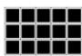

F.  

G.  
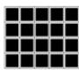

H.  

gatecse-2026-set1 spatial-aptitude patterns-in-two-dimensions one-mark

Answer key

# 10.8.4 Patterns In Two Dimensions: GATE CSE 2026 | Set 2 | GA | Question: 2

A black square PQRS has been cut into two parts. One part of it is shown in Panel I. Which one of the shapes in Panel II is the other part?

Panel II  
(i)

(ii)

(iii)

(iv)

A. (i)

B. (ii)

C. (iii)

D. (iv)

gatecse-2026-set2

spatial-aptitude

one-mark

patterns-in-two-dimensions

Answer key

Answer Keys

<table><tr><td>10.1.1</td><td>D</td></tr><tr><td>10.4.3</td><td>A</td></tr><tr><td>10.6.4</td><td>A</td></tr><tr><td>10.8.1</td><td>A</td></tr></table>

<table><tr><td>10.2.1</td><td>A</td></tr><tr><td>10.5.1</td><td>A</td></tr><tr><td>10.6.5</td><td>A</td></tr><tr><td>10.8.2</td><td>D</td></tr></table>

<table><tr><td>10.3.1</td><td>A</td></tr><tr><td>10.6.1</td><td>A</td></tr><tr><td>10.7.1</td><td>C</td></tr><tr><td>10.8.3</td><td>C</td></tr></table>

<table><tr><td>10.4.1</td><td>B</td></tr><tr><td>10.6.2</td><td>B</td></tr><tr><td>10.7.2</td><td>A</td></tr><tr><td>10.8.4</td><td>C</td></tr></table>

<table><tr><td>10.4.2</td><td>A</td></tr><tr><td>10.6.3</td><td>A</td></tr><tr><td>10.7.3</td><td>A</td></tr></table>

Syllabus: English grammar, Sentence completion. Verbal analogies, Word groups. Instructions, Critical reasoning and Verbal deduction

Mark Distribution in Previous GATE

<table><tr><td>Year</td><td>2026 - 1</td><td>2026 - 2</td><td>2025 - 1</td><td>2025 - 2</td><td>2024 - 1</td><td>2024 - 2</td><td>2023</td><td>2022</td><td>2021 - 1</td><td>2021 - 2</td><td>Minimum</td></tr><tr><td>1 Mark Count</td><td>1</td><td>1</td><td>2</td><td>2</td><td>1</td><td>1</td><td>2</td><td>1</td><td>2</td><td>2</td><td>1</td></tr><tr><td>2 Marks Count</td><td>0</td><td>0</td><td>1</td><td>0</td><td>1</td><td>1</td><td>1</td><td>1</td><td>1</td><td>1</td><td>0</td></tr><tr><td>Total Marks</td><td>1</td><td>1</td><td>4</td><td>2</td><td>3</td><td>3</td><td>4</td><td>3</td><td>4</td><td>4</td><td>1</td></tr></table>

Welcome to the "General Aptitude: Verbal Aptitude" chapter of your GATE Computer Science exam preparation. This section is designed to equip you with the essential linguistic and reasoning skills necessary to excel in the verbal aptitude segment of the GATE exam. Verbal Aptitude assesses your comprehension of English language, grammar, vocabulary, and logical reasoning abilities, which are crucial not just for the exam but also for effective communication in your professional career. Typically, verbal aptitude questions constitute a significant portion (around 5-8 marks out of 15 for General Aptitude) and can range from direct vocabulary and grammar questions to more complex reading comprehension and logical deduction problems. Mastering these topics can significantly boost your overall GATE score.

# Topic-wise Key Concepts

# Antonyms

Definition and core idea: Antonyms are words that have opposite meanings. Understanding antonyms enhances vocabulary and comprehension by highlighting contrasts in meaning.

# • Key properties and identities:

- Antonyms can be absolute (e.g., hot/cold) or relative (e.g., happy/sad).  
- Often formed by adding prefixes (e.g., un-, dis-, in-, im-, non-) to a word.  
- Context is crucial; a word can have different antonyms depending on its usage.

# - Common pitfalls:

- Choosing a word that is merely different, not opposite.  
- Ignoring prefixes/suffixes that might indicate an antonym.  
- Misinterpreting the nuance of the given word.

# - Standard problem-solving techniques:

1. Understand the exact meaning of the given word.  
2. Look for prefixes that reverse meaning (e.g., capable -> incapable).  
3. Consider the context if the word has multiple meanings.  
4. Eliminate options that are synonyms or unrelated.  
5. If unsure, try to use the options in a sentence to see which one creates an opposite meaning.

# Articles

Definition and core idea: Articles are words (a, an, the) that define whether a noun is specific or unspecific. They are determiners that precede nouns.

# - Important formulas, theorems, and results:

1. Indefinite Article 'a': Used before singular, countable nouns that begin with a consonant sound. E.g., a book, a university (starts with 'y' sound).  
2. Indefinite Article 'an': Used before singular, countable nouns that begin with a vowel sound. E.g., an apple, an hour (starts with 'o' sound).  
3. Definite Article 'the': Used before specific or unique nouns, or nouns that have been previously mentioned. E.g., the sun, the book I read yesterday.  
4. Zero Article: No article is used before plural countable nouns, uncountable nouns, proper nouns, or abstract nouns when speaking generally. E.g., water is essential, students learn.

# • Key properties and identities:

- 'A' and 'an' are used for general or non-specific items.  
- 'The' is used for specific or previously identified items.  
- Sound, not spelling, determines 'a' vs. 'an'.

# - Common pitfalls:

\- Confusing 'a' and 'an' based on spelling rather than sound.

- Overusing 'the' with general nouns or proper nouns.  
- Omitting articles where they are required for singular countable nouns.

# - Standard problem-solving techniques:

1. Identify if the noun is singular/plural, countable/uncountable.  
2. Determine if the noun is specific or general in the context.  
3. Pay attention to the initial sound of the word following the article.  
4. Check for common phrases or idioms that require specific article usage.

# Comparative Forms

Definition and core idea: Comparative forms of adjectives and adverbs are used to compare two things, while superlative forms are used to compare three or more things.

# - Important formulas, theorems, and results:

1. One-syllable adjectives/adverbs: Add -er for comparative, -est for superlative. E.g., tall → taller → tallest.  
2. Two-syllable adjectives ending in -y: Change -y to -i and add -er/-est. E.g., happy → happier → happiest.  
3. Two or more syllable adjectives/adverbs: Use more for comparative, most for superlative. E.g., beautiful → more beautiful → most beautiful.  
4. Irregular forms: Some words have irregular comparative/superlative forms. E.g., good → better → best; bad → worse → worst; much/many → more → most.  
5. Comparison structure: Comparative forms are often followed by than. E.g., $X$ is taller than $Y$ .

# • Key properties and identities:

- Do not use double comparatives/superlatives (e.g., "more happier" is incorrect).  
- Ensure logical comparison (comparing like with like).

# - Common pitfalls:

- Using "more" or "most" with -er or -est endings.  
- Incorrectly forming irregular comparatives/superlatives.  
- Making illogical comparisons (e.g., "My car is faster than John").

# - Standard problem-solving techniques:

1. Count the syllables of the adjective/adverb.  
2. Check for irregular forms.  
3. Ensure the comparison is grammatically and logically sound.

# English Grammar

Definition and core idea: English grammar refers to the set of structural rules governing the composition of clauses, phrases, and words in the English language. It ensures clarity and correctness in communication.

# - Important formulas, theorems, and results:

1. Basic Sentence Structure: Subject + Verb + Object (SVO) is the most common structure. E.g., She reads a book.  
2. Parts of Speech: Nouns, Pronouns, Verbs, Adjectives, Adverbs, Prepositions, Conjunctions, Interjections. Each has specific roles.  
3. Subject-Verb Agreement: The verb must agree in number with its subject. E.g., He runs (singular); They run (plural).  
4. Tense Consistency: Maintain a consistent tense throughout a sentence or paragraph unless there's a specific reason to change.  
5. Parallelism: Similar items in a series or comparison should be in the same grammatical form. E.g., Helikes swimming, hiking, and cycling.

# • Key properties and identities:

- Grammar provides the framework for meaningful sentences.  
- Correct grammar prevents ambiguity and misinterpretation.

# - Common pitfalls:

- Errors in subject-verb agreement, pronoun agreement, and tense usage.  
- Lack of parallelism.  
- Misplaced modifiers.  
- Incorrect punctuation.

# - Standard problem-solving techniques:

1. Break down the sentence into its core components (subject, verb, object).  
2. Identify the part of speech for each word.  
3. Check for agreement (subject-verb, pronoun-antecedent).

4. Look for consistency in tense and structure.  
5. Read the sentence aloud to catch awkward phrasing or obvious errors.

# Grammatical Error

Definition and core idea: Grammatical errors are mistakes in the structure or usage of language that violate standard English grammar rules. Identifying and correcting them is key to effective communication.

# • Key properties and identities:

Common error types include subject-verb agreement, pronoun agreement, tense consistency, parallelism, misplaced modifiers, comma splices, run-on sentences, fragment sentences, and incorrect word choice.

# - Common pitfalls:

- Overlooking subtle errors, especially in complex sentences.  
- Focusing only on obvious errors and missing nuanced ones.  
- Not knowing the specific rule being tested.

# - Standard problem-solving techniques:

1. Read the sentence carefully, looking for any awkward phrasing.  
2. Check for subject-verb agreement (singular subject, singular verb; plural subject, plural verb).  
3. Verify pronoun-antecedent agreement (pronoun matches the noun it refers to in number and gender).  
4. Ensure tense consistency throughout the sentence.  
5. Look for parallel structure in lists or comparisons.  
6. Identify misplaced or dangling modifiers.  
7. Check for correct use of articles, prepositions, and conjunctions.  
8. Consider punctuation errors.

# Incorrect Sentence Part

Definition and core idea: This question type presents a sentence divided into several parts, one of which contains a grammatical error. The task is to identify the erroneous part.

# • Key properties and identities:

- Errors can span any grammatical rule: subject-verb agreement, tense, pronouns, articles, prepositions, parallelism, vocabulary, etc.  
- Often, the error is subtle and requires careful attention to detail.

# - Common pitfalls:

- Rushing through the sentence and missing the error.  
- Fixating on one type of error and ignoring others.  
- Assuming a part is correct because it "sounds" okay.

# - Standard problem-solving techniques:

1. Read the entire sentence first to understand its meaning and flow.  
2. Examine each part individually, checking for common grammatical errors:

- Subject-Verb Agreement: Does the verb match the subject in number?  
- Tense: Is the tense consistent and appropriate for the context?  
- Pronouns: Do pronouns agree with their antecedents in number, gender, and case?  
- Articles/Prepositions: Are they used correctly?  
- Parallelism: Are items in a list or comparison structured similarly?  
- Word Choice/Vocabulary: Is the correct word used (e.g., affect vs. effect)?  
- Modifiers: Are adjectives and adverbs placed correctly?

3. If no error is found, consider the "No Error" option if available.

# Most Appropriate Word

Definition and core idea: This involves choosing the word that best fits the meaning and context of a given sentence or passage from a set of options.

# • Key properties and identities:

- Requires strong vocabulary and understanding of nuances in word meanings.  
- Context is paramount; a word might be grammatically correct but semantically inappropriate.

# - Common pitfalls:

- Choosing a word that is a near-synonym but doesn't fit the exact context.  
- Ignoring the tone or register of the sentence.  
- Misinterpreting the overall meaning of the sentence.

# - Standard problem-solving techniques:

1. Read the sentence carefully to grasp its full meaning and tone.  
2. Consider the part of speech required for the blank (noun, verb, adjective, adverb).  
3. Substitute each option into the sentence.  
4. Evaluate which option makes the most sense semantically and grammatically.  
5. Look for collocations (words that naturally go together) or idiomatic expressions.  
6. Eliminate options that are clearly incorrect in meaning or grammar.

# Narrative Sequencing

Definition and core idea: This task involves arranging a set of jumbled sentences or paragraphs into a coherent and logical narrative sequence.

# • Key properties and identities:

- A coherent narrative follows a logical progression, often chronological, cause-and-effect, or problem-solution.  
- Transition words and pronouns are crucial clues.

# - Common pitfalls:

- Ignoring transition words or pronoun references.  
- Focusing only on the first sentence and not the overall flow.  
- Assuming a chronological order when a different logical order is intended.

# - Standard problem-solving techniques:

1. Identify the opening sentence: Look for sentences that introduce a topic, character, or setting, often without pronouns or conjunctions referring to previous sentences.  
2. Identify transition words/phrases: Words like however, therefore, meanwhile, subsequently, in addition, finally, etc., indicate relationships between sentences.  
3. Look for pronoun references: A pronoun (he, she, it, they, this, that) must refer back to a noun introduced in a previous sentence.  
4. Establish cause-and-effect or chronological order: Determine if events follow a time sequence or if one event leads to another.  
5. Identify the concluding sentence: Look for sentences that summarize or provide a final thought.  
6. Form pairs: Try to identify two sentences that logically follow each other.  
7. Read the assembled sequence: Once you have an order, read it through to ensure it flows logically and makes sense.

# Noun Verb Adjective

Definition and core idea: This topic focuses on understanding the definitions, functions, and interrelationships of nouns (naming words), verbs (action/state words), and adjectives (describing words).

# - Important formulas, theorems, and results:

1. Noun: Names a person, place, thing, or idea. Can be subject or object. E.g., student, city, book, freedom.  
2. Verb: Expresses an action, occurrence, or state of being. E.g., run, become, is.  
3. Adjective: Modifies or describes a noun or pronoun. Answers questions like "which one?", "what kind?", "how many?". E.g., happy, blue, three.  
- Nouns: -tion, -sion, -ment, -ness, -ity, -ance, -ence, -er, -or (e.g., information, development, happiness).  
- Verbs: -ate, -ify, -ize, -en (e.g., activate, simplify, modernize).  
- Adjectives: -ful, -less, -able, -ible, -ous, -ic, -al, -y (e.g., beautiful, hopeless, capable).

# 4. Common Suffixes:

# • Key properties and identities:

○ A word's function (noun, verb, adjective) can change based on context (e.g., "run" as a verb vs. "a run" as a noun).  
- Understanding these parts of speech is fundamental to sentence construction and error identification.

# - Common pitfalls:

- Confusing words that have similar forms but different parts of speech (e.g., "advice" (noun) vs. "advise" (verb)).  
- Incorrectly identifying the function of a word in a sentence.

# - Standard problem-solving techniques:

1. Identify the word's role in the sentence (e.g., is it naming something, performing an action, or describing something?).  
2. Look for common suffixes that indicate a specific part of speech.  
3. Test the word by replacing it with a clear example of a noun, verb, or adjective to see if the sentence structure

remains valid.

# Passage Reading

Definition and core idea: This involves reading a given passage and answering comprehension questions based on its content, including main idea, specific details, inference, and author's tone.

# • Key properties and identities:

- Questions can be direct (explicitly stated in the text) or inferential (requiring logical deduction from the text).  
- Understanding the main idea and supporting details is crucial.

# - Common pitfalls:

- Reading too slowly or too quickly without comprehension.  
- Making assumptions not supported by the text.  
- Getting bogged down by unfamiliar vocabulary.  
- Misinterpreting the author's intent or tone.

# - Standard problem-solving techniques:

1. Skim the passage first: Read quickly to get a general idea of the topic, main argument, and structure. Pay attention to the first and last sentences of paragraphs.  
2. Read the questions: Understand what information you need to find. This helps you focus your reading.  
3. Scan for keywords: For specific detail questions, scan the passage for keywords from the question.  
4. Read carefully for answers: When you locate relevant sections, read them thoroughly to understand the context and find the exact answer.  
5. Inferential questions: Look for clues, implications, and logical connections within the text. Avoid bringing in outside knowledge.  
6. Main idea questions: Often found in the introduction or conclusion, or can be derived from summarizing the key points.  
7. Vocabulary in context: Use surrounding words and sentences to deduce the meaning of unfamiliar words.

# Phrasal Verb

Definition and core idea: A phrasal verb is a verb combined with a preposition or an adverb (or both) to create a new meaning that is often different from the original verb's meaning.

# - Important formulas, theorems, and results:

1. Verb + Preposition (e.g., look after = care for)  
2. Verb + Adverb (e.g., break down = stop functioning)  
3. Verb + Adverb + Preposition (e.g., look up to = admire)

# • Key properties and identities:

- Meanings are often idiomatic and cannot be deduced from the individual words.  
- Can be separable (object can go between verb and particle) or inseparable.

# - Common pitfalls:

- Assuming the literal meaning of the words.  
- Confusing similar-looking phrasal verbs.  
- Incorrectly using separable/inseparable phrasal verbs.

# - Standard problem-solving techniques:

1. Memorize common phrasal verbs and their meanings.  
2. Pay close attention to the context of the sentence to infer meaning.  
3. If unsure, try to replace the phrasal verb with a single-word synonym to see if it fits.

# Phrase Meaning

Definition and core idea: This involves understanding the meaning of idiomatic expressions, proverbs, or common phrases that often have a figurative meaning different from the literal interpretation of their individual words.

# • Key properties and identities:

- Idioms are non-literal and culturally specific.  
- Context is vital for interpreting the correct nuance of a phrase.

# - Common pitfalls:

- Interpreting phrases literally.  
- Confusing similar-sounding idioms.  
- Not recognizing the figurative nature of the expression.

# - Standard problem-solving techniques:

1. Read the sentence containing the phrase carefully to understand the overall context.  
2. If the phrase is unfamiliar, try to infer its meaning from the surrounding words and the situation described.  
3. Consider the options provided and see which one logically fits the context.  
4. Eliminate options that represent a literal interpretation or are completely irrelevant.  
5. Familiarity with common idioms and proverbs is the best preparation.

# Prepositions

Definition and core idea: Prepositions are words that show the relationship between a noun or pronoun and other words in a sentence, indicating location, time, direction, or manner.

# - Important formulas, theorems, and results:

# 1. Prepositions of Place:

- in: for enclosed spaces, cities, countries (e.g., in the room, in India).  
- on: for surfaces, streets, specific days (e.g., on the table, on Monday).  
- at: for specific points, addresses, events (e.g., at the corner, at 5 PM).

# 2. Prepositions of Time:

- in: for months, years, seasons, long periods (e.g., in July, in 2023).  
- on: for specific days, dates (e.g., on Friday, on August 15th).  
- at: for specific times (e.g., at noon, at midnight).

3. Prepositions of Direction: to, into, onto, from, through, across. E.g., go to school, jump into the water.

4. Fixed Prepositional Phrases: Many verbs, adjectives, and nouns are followed by specific prepositions (e.g., afraid of, depend on, good at).

# • Key properties and identities:

- Prepositions always introduce a prepositional phrase, which includes a noun or pronoun (the object of the preposition).  
- Their usage is often idiomatic and requires memorization.

# - Common pitfalls:

- Confusing prepositions with similar meanings (e.g., "between" vs. "among").  
- Incorrectly using fixed prepositional phrases.  
- Omitting necessary prepositions or adding unnecessary ones.

# - Standard problem-solving techniques:

1. Identify the relationship the preposition is trying to express (place, time, direction, etc.).  
2. Check if the verb, adjective, or noun preceding the blank requires a specific preposition.  
3. Consider the context and the object of the preposition.  
4. Memorize common fixed prepositional phrases.

# Pronouns

Definition and core idea: Pronouns are words that replace nouns to avoid repetition. They must agree with the nouns they refer to (antecedents) in number, gender, and case.

# - Important formulas, theorems, and results:

# 1. Types of Pronouns:

- Personal: I, you, he, she, it, we, they (subjective); me, you, him, her, it, us, them (objective).  
- Possessive: mine, yours, his, hers, its, ours, theirs.  
■ Reflexive/Intensive:  
myself, yourself, himself, herself, itself, ourselves, yourselves, themselves.  
■ Relative: who, whom, whose, which, that.  
- Demonstrative: this, that, these, those.  
- Indefinite: everyone, somebody, nothing, all, many, few.

2. Pronoun-Antecedent Agreement: A pronoun must agree with its antecedent in number (singular/plural) and gender (masculine/feminine/neuter). E.g., Thestudent submitted his assignment. Thestudents submitted their assignments.

# 3. Pronoun Case:

- Subjective Case: Used when the pronoun is the subject of a verb (e.g., He went).  
- Objective Case: Used when the pronoun is the object of a verb or preposition (e.g., Shesaw him, Giveitto me).

# • Key properties and identities:

- Pronouns clarify sentences by preventing redundancy.  
- Correct pronoun usage is essential for grammatical accuracy.